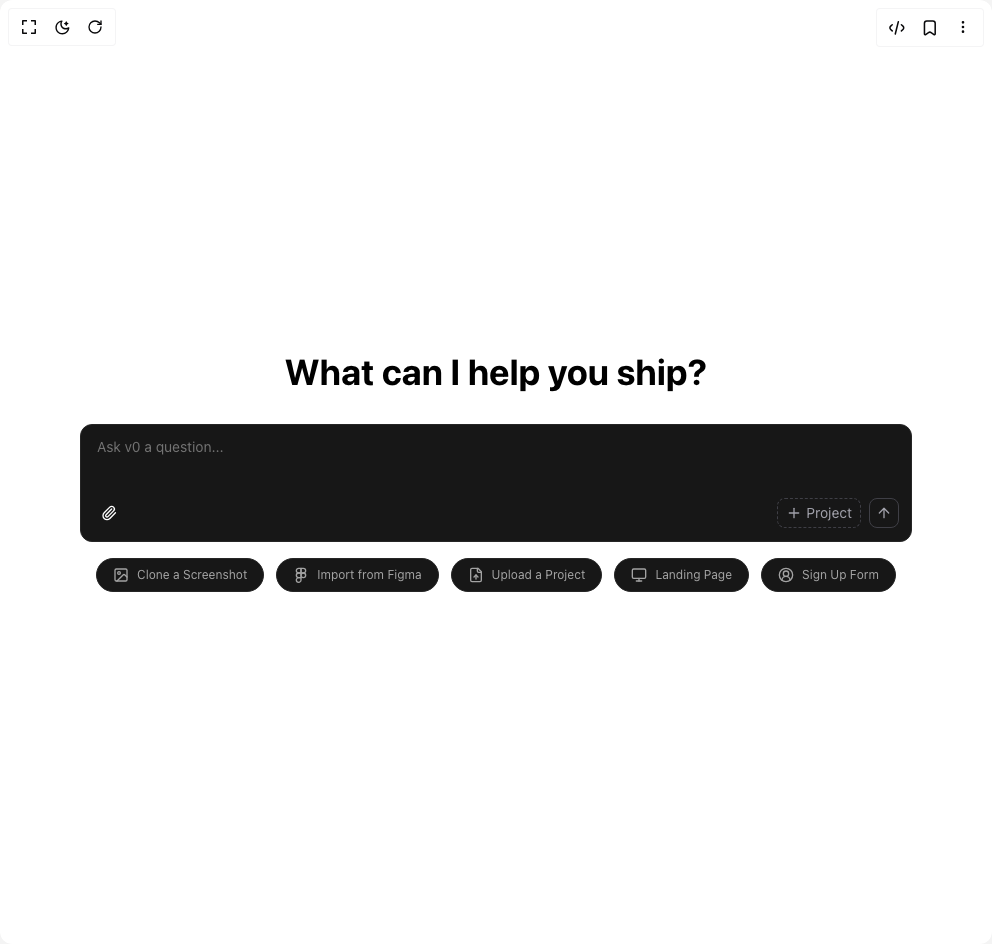

# Build V0 Ai Chat in BuilderStudio

> Build this component in our Agentic IDE: [BuilderStudio](https://builderstudio.dev).
>
> Join the BuilderStudio community on [Discord](https://discord.gg/QdWeSGCqfe) and [Reddit](https://reddit.com/r/builderstudio).



## Component

- Author group: `kokonutd`
- Component: `v0-ai-chat`
- Variant: `default`
- Rendered HTML snapshot: [`rendered.html`](rendered.html)

## BuilderStudio prompt

You are implementing a React component based on a component reference.

## Component identity

- Author: kokonutd
- Component slug: v0-ai-chat
- Demo slug: default
- Title: v0-ai-chat
- Description: 

## Goal

Recreate this component in a React + TypeScript + Tailwind CSS project. Preserve the visual layout, spacing, colors, border radius, shadows, interaction behavior, animation behavior, responsive behavior, and dark mode behavior shown in the rendered demo.

## Implementation requirements

- Use React and TypeScript.
- Use Tailwind CSS classes whenever possible.
- Keep the component self-contained unless the source files require helper components.
- If the source uses CSS variables, custom CSS, animations, or keyframes, include them.
- If the source uses external packages, list and use the required packages.
- Preserve accessibility attributes, button semantics, links, keyboard behavior, and ARIA attributes when visible in the source.
- Do not replace the component with a simplified placeholder.
- Return complete production-ready code.

## Dependencies

No reference metadata available.

## Rendered DOM snapshot

This is the rendered demo HTML extracted from the live preview. Use it to verify structure, class names, visible content, and layout.

```html
<div id="root"><div class="relative flex items-center justify-center h-screen w-full m-auto p-16 bg-background text-foreground"><div class="absolute lab-bg inset-0 size-full"><div class="absolute inset-0 bg-[radial-gradient(#00000021_1px,transparent_1px)] dark:bg-[radial-gradient(#ffffff22_1px,transparent_1px)]"></div></div><div class="flex w-full justify-center relative"><div class="flex flex-col items-center w-full max-w-4xl mx-auto p-4 space-y-8"><h1 class="text-4xl font-bold text-black dark:text-white">What can I help you ship?</h1><div class="w-full"><div class="relative bg-neutral-900 rounded-xl border border-neutral-800"><div class="overflow-y-auto"><textarea class="flex rounded-md border border-input ring-offset-background focus-visible:outline-none focus-visible:ring-ring disabled:cursor-not-allowed disabled:opacity-50 w-full px-4 py-3 resize-none bg-transparent border-none text-white text-sm focus:outline-none focus-visible:ring-0 focus-visible:ring-offset-0 placeholder:text-neutral-500 placeholder:text-sm min-h-[60px]" placeholder="Ask v0 a question..." style="overflow: hidden; height: 60px;"></textarea></div><div class="flex items-center justify-between p-3"><div class="flex items-center gap-2"><button type="button" class="group p-2 hover:bg-neutral-800 rounded-lg transition-colors flex items-center gap-1"><svg xmlns="http://www.w3.org/2000/svg" width="24" height="24" viewBox="0 0 24 24" fill="none" stroke="currentColor" stroke-width="2" stroke-linecap="round" stroke-linejoin="round" class="lucide lucide-paperclip w-4 h-4 text-white" aria-hidden="true"><path d="m16 6-8.414 8.586a2 2 0 0 0 2.829 2.829l8.414-8.586a4 4 0 1 0-5.657-5.657l-8.379 8.551a6 6 0 1 0 8.485 8.485l8.379-8.551"></path></svg><span class="text-xs text-zinc-400 hidden group-hover:inline transition-opacity">Attach</span></button></div><div class="flex items-center gap-2"><button type="button" class="px-2 py-1 rounded-lg text-sm text-zinc-400 transition-colors border border-dashed border-zinc-700 hover:border-zinc-600 hover:bg-zinc-800 flex items-center justify-between gap-1"><svg xmlns="http://www.w3.org/2000/svg" width="24" height="24" viewBox="0 0 24 24" fill="none" stroke="currentColor" stroke-width="2" stroke-linecap="round" stroke-linejoin="round" class="lucide lucide-plus w-4 h-4" aria-hidden="true"><path d="M5 12h14"></path><path d="M12 5v14"></path></svg>Project</button><button type="button" class="px-1.5 py-1.5 rounded-lg text-sm transition-colors border border-zinc-700 hover:border-zinc-600 hover:bg-zinc-800 flex items-center justify-between gap-1 text-zinc-400"><svg xmlns="http://www.w3.org/2000/svg" width="24" height="24" viewBox="0 0 24 24" fill="none" stroke="currentColor" stroke-width="2" stroke-linecap="round" stroke-linejoin="round" class="lucide lucide-arrow-up w-4 h-4 text-zinc-400" aria-hidden="true"><path d="m5 12 7-7 7 7"></path><path d="M12 19V5"></path></svg><span class="sr-only">Send</span></button></div></div></div><div class="flex items-center justify-center gap-3 mt-4"><button type="button" class="flex items-center gap-2 px-4 py-2 bg-neutral-900 hover:bg-neutral-800 rounded-full border border-neutral-800 text-neutral-400 hover:text-white transition-colors"><svg xmlns="http://www.w3.org/2000/svg" width="24" height="24" viewBox="0 0 24 24" fill="none" stroke="currentColor" stroke-width="2" stroke-linecap="round" stroke-linejoin="round" class="lucide lucide-image w-4 h-4" aria-hidden="true"><rect width="18" height="18" x="3" y="3" rx="2" ry="2"></rect><circle cx="9" cy="9" r="2"></circle><path d="m21 15-3.086-3.086a2 2 0 0 0-2.828 0L6 21"></path></svg><span class="text-xs">Clone a Screenshot</span></button><button type="button" class="flex items-center gap-2 px-4 py-2 bg-neutral-900 hover:bg-neutral-800 rounded-full border border-neutral-800 text-neutral-400 hover:text-white transition-colors"><svg xmlns="http://www.w3.org/2000/svg" width="24" height="24" viewBox="0 0 24 24" fill="none" stroke="currentColor" stroke-width="2" stroke-linecap="round" stroke-linejoin="round" class="lucide lucide-figma w-4 h-4" aria-hidden="true"><path d="M5 5.5A3.5 3.5 0 0 1 8.5 2H12v7H8.5A3.5 3.5 0 0 1 5 5.5z"></path><path d="M12 2h3.5a3.5 3.5 0 1 1 0 7H12V2z"></path><path d="M12 12.5a3.5 3.5 0 1 1 7 0 3.5 3.5 0 1 1-7 0z"></path><path d="M5 19.5A3.5 3.5 0 0 1 8.5 16H12v3.5a3.5 3.5 0 1 1-7 0z"></path><path d="M5 12.5A3.5 3.5 0 0 1 8.5 9H12v7H8.5A3.5 3.5 0 0 1 5 12.5z"></path></svg><span class="text-xs">Import from Figma</span></button><button type="button" class="flex items-center gap-2 px-4 py-2 bg-neutral-900 hover:bg-neutral-800 rounded-full border border-neutral-800 text-neutral-400 hover:text-white transition-colors"><svg xmlns="http://www.w3.org/2000/svg" width="24" height="24" viewBox="0 0 24 24" fill="none" stroke="currentColor" stroke-width="2" stroke-linecap="round" stroke-linejoin="round" class="lucide lucide-file-up w-4 h-4" aria-hidden="true"><path d="M15 2H6a2 2 0 0 0-2 2v16a2 2 0 0 0 2 2h12a2 2 0 0 0 2-2V7Z"></path><path d="M14 2v4a2 2 0 0 0 2 2h4"></path><path d="M12 12v6"></path><path d="m15 15-3-3-3 3"></path></svg><span class="text-xs">Upload a Project</span></button><button type="button" class="flex items-center gap-2 px-4 py-2 bg-neutral-900 hover:bg-neutral-800 rounded-full border border-neutral-800 text-neutral-400 hover:text-white transition-colors"><svg xmlns="http://www.w3.org/2000/svg" width="24" height="24" viewBox="0 0 24 24" fill="none" stroke="currentColor" stroke-width="2" stroke-linecap="round" stroke-linejoin="round" class="lucide lucide-monitor w-4 h-4" aria-hidden="true"><rect width="20" height="14" x="2" y="3" rx="2"></rect><line x1="8" x2="16" y1="21" y2="21"></line><line x1="12" x2="12" y1="17" y2="21"></line></svg><span class="text-xs">Landing Page</span></button><button type="button" class="flex items-center gap-2 px-4 py-2 bg-neutral-900 hover:bg-neutral-800 rounded-full border border-neutral-800 text-neutral-400 hover:text-white transition-colors"><svg xmlns="http://www.w3.org/2000/svg" width="24" height="24" viewBox="0 0 24 24" fill="none" stroke="currentColor" stroke-width="2" stroke-linecap="round" stroke-linejoin="round" class="lucide lucide-circle-user-round w-4 h-4" aria-hidden="true"><path d="M18 20a6 6 0 0 0-12 0"></path><circle cx="12" cy="10" r="4"></circle><circle cx="12" cy="12" r="10"></circle></svg><span class="text-xs">Sign Up Form</span></button></div></div></div></div></div></div>
```

## Reference source files

No reference source files were available.
