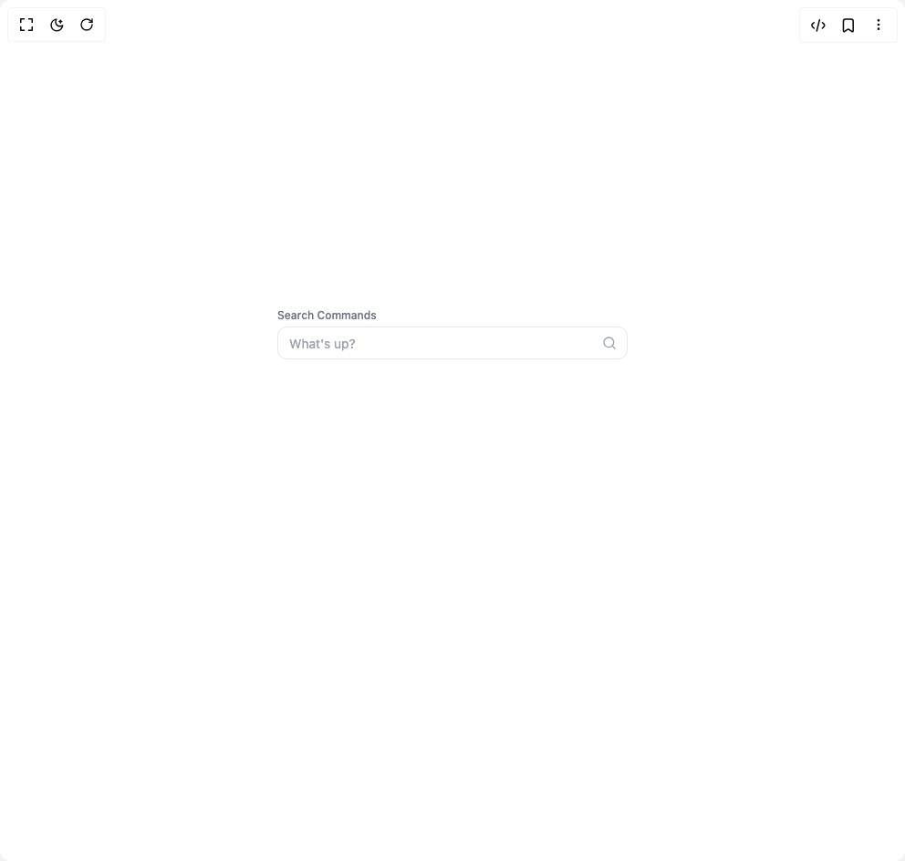
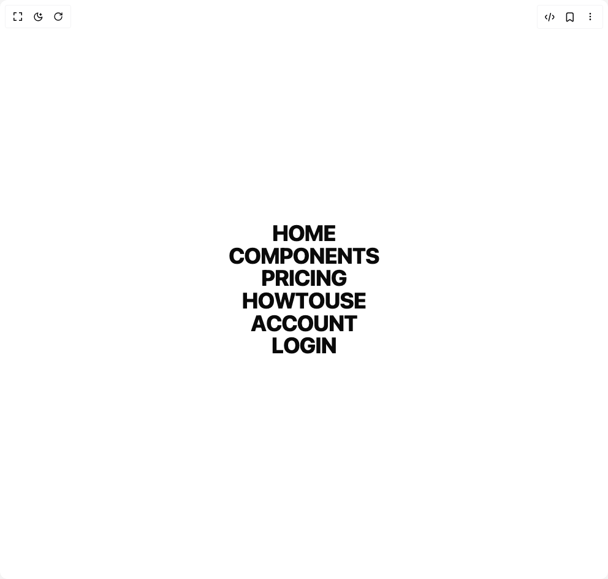
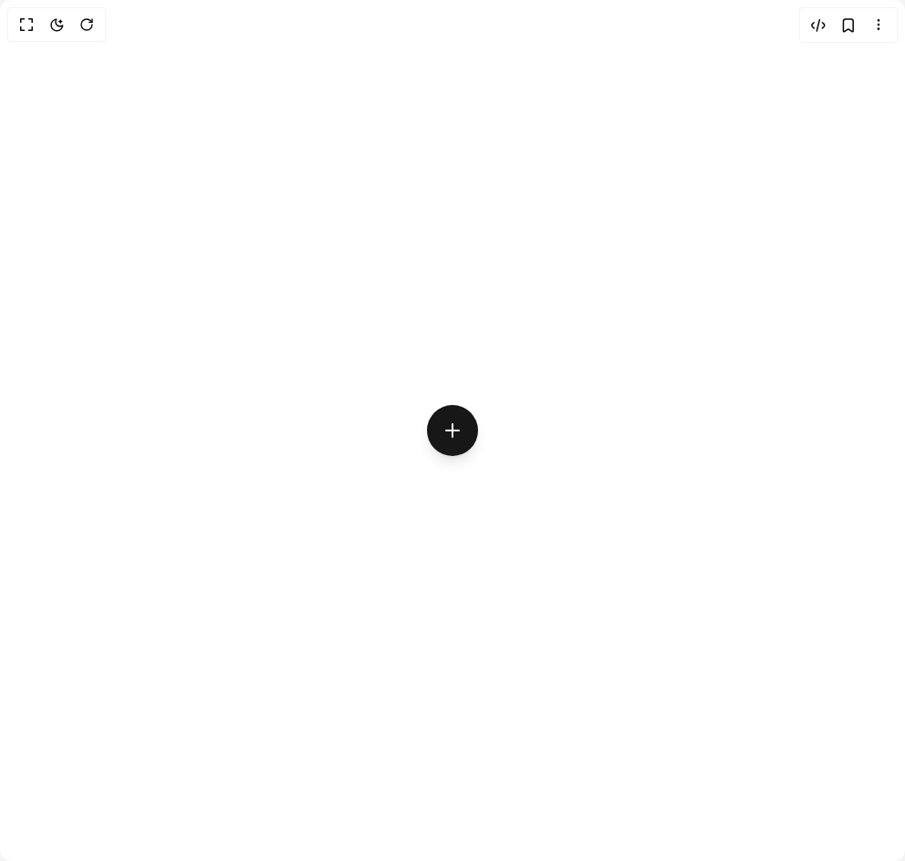
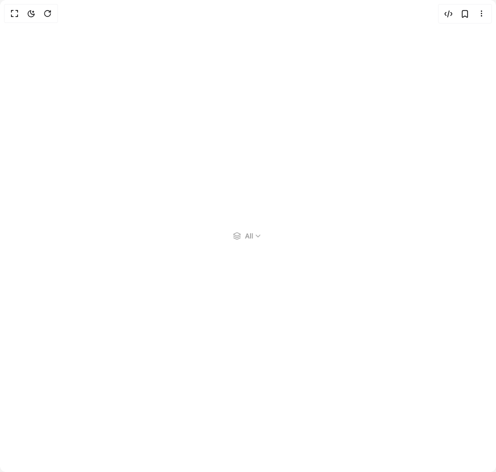
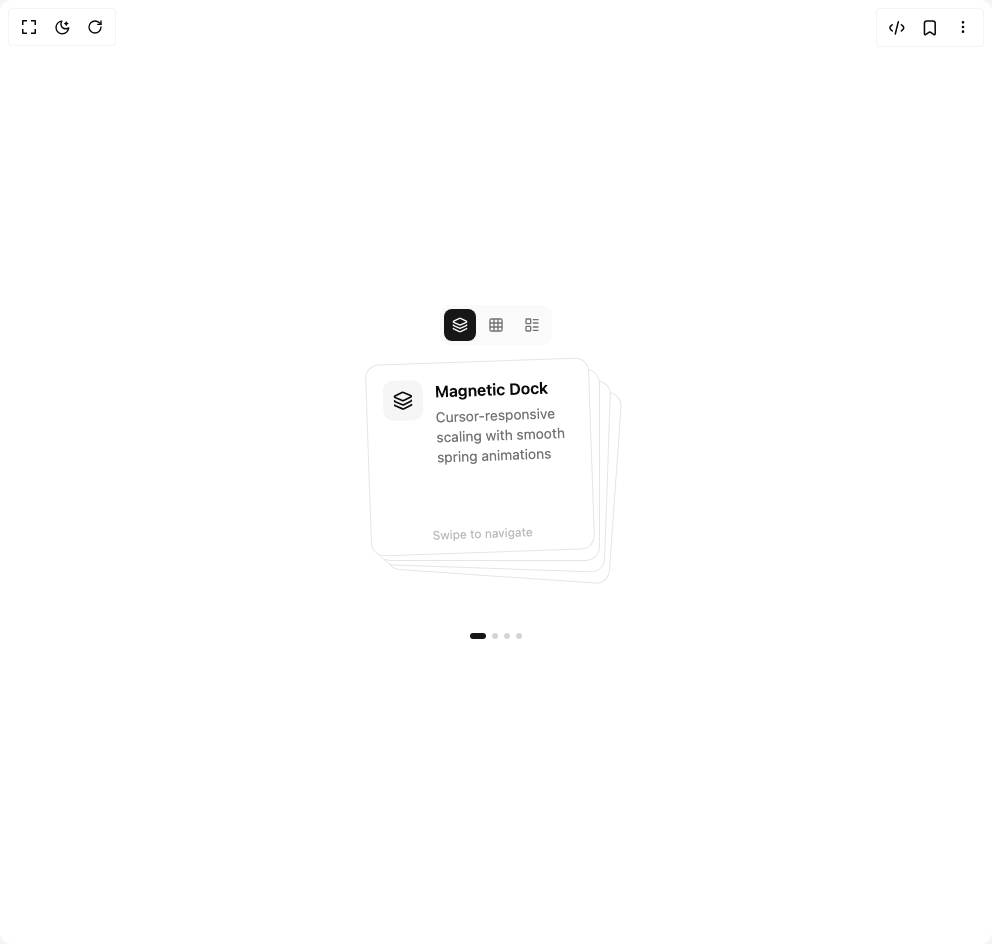
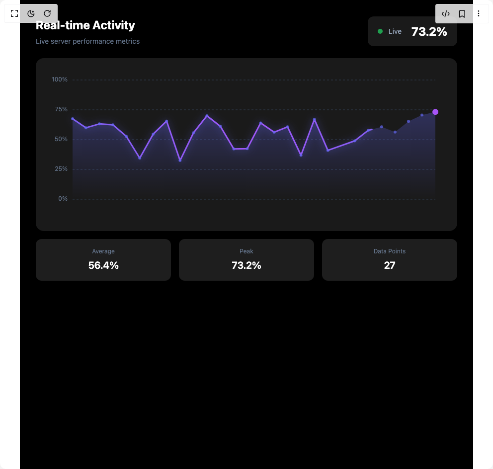
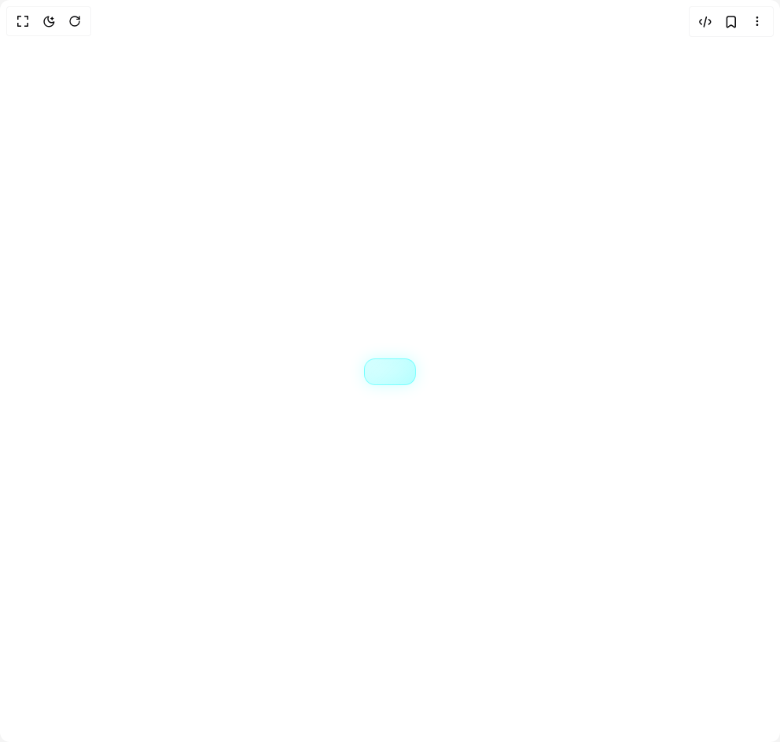
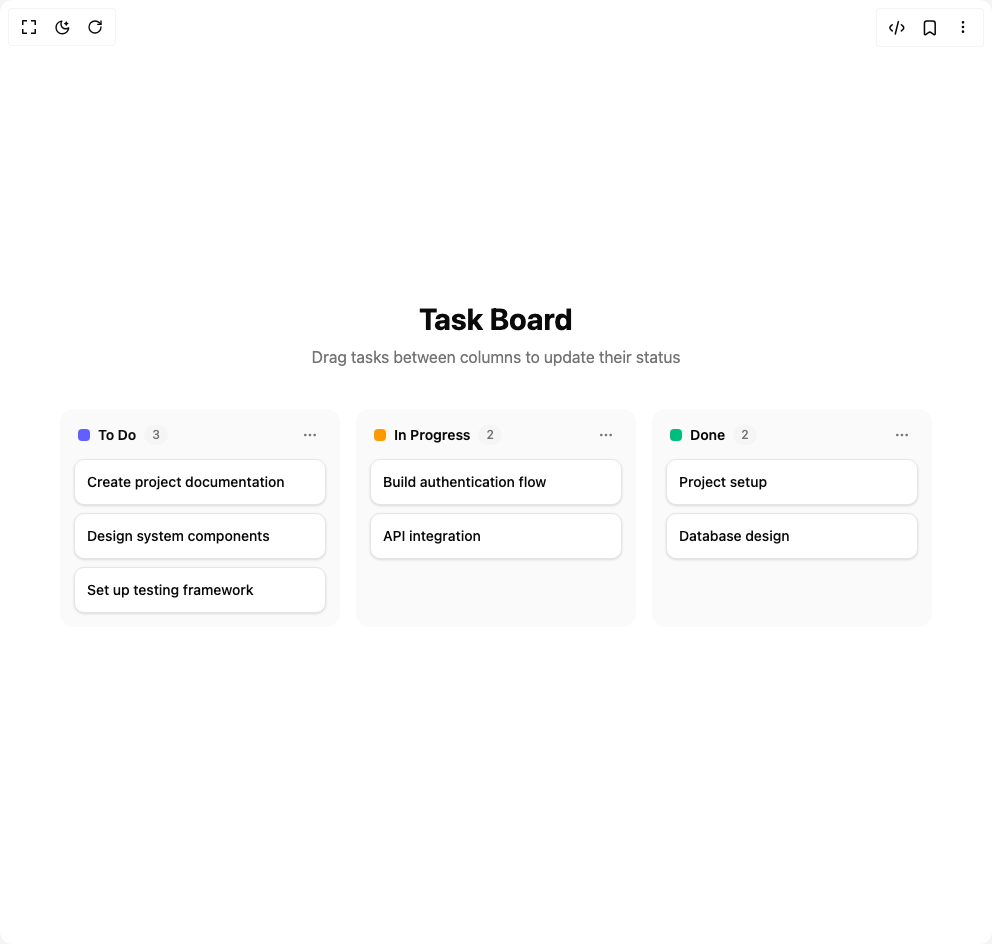

# Kousthubha Sky Components

8 components are available in this author group.

> Build any component in [BuilderStudio](https://builderstudio.dev), then share improvements with the community on [Discord](https://discord.gg/QdWeSGCqfe) or [Reddit](https://reddit.com/r/builderstudio).

| Preview | Component | Variant |
| --- | --- | --- |
|  | [Action Searchbar](_action-searchbar/default/README.md) | `default` |
|  | [Animated Menu](_animated-menu/default/README.md) | `default` |
|  | [Circular Command Menu](_circular-command-menu/default/README.md) | `default` |
|  | [Fluid Dropdown](_fluid-dropdown/default/README.md) | `default` |
|  | [Morphing Card Stack](_morphing-card-stack/default/README.md) | `default` |
|  | [Real Time Analytics](_real-time-analytics/default/README.md) | `default` |
|  | [Shatter Button](_shatter-button/default/README.md) | `default` |
|  | [Trello Kanban Board](_trello-kanban-board/default/README.md) | `default` |
