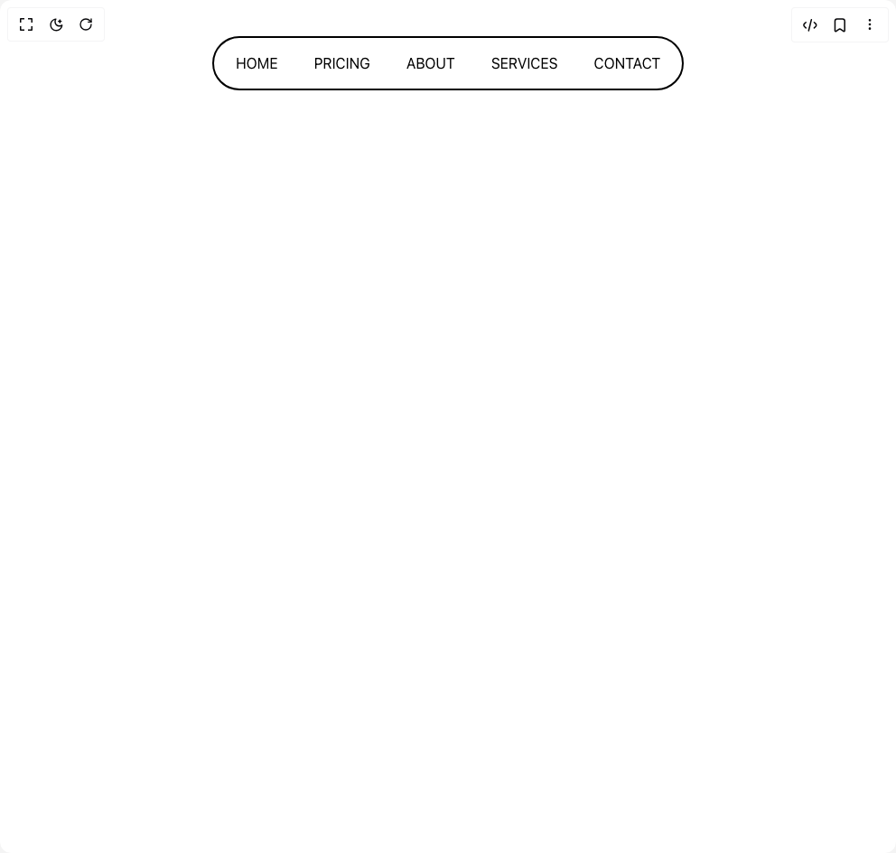

# Build Nav Header in BuilderStudio

> Build this component in our Agentic IDE: [BuilderStudio](https://builderstudio.dev).
>
> Join the BuilderStudio community on [Discord](https://discord.gg/QdWeSGCqfe) and [Reddit](https://reddit.com/r/builderstudio).



## Component

- Author group: `krittyz`
- Component: `nav-header`
- Variant: `nav-header`
- Rendered HTML snapshot: [`rendered.html`](rendered.html)

## BuilderStudio prompt

You are implementing a React component based on a component reference.

## Component identity

- Author: krittyz
- Component slug: nav-header
- Demo slug: nav-header
- Title: nav-header
- Description: 

## Goal

Recreate this component in a React + TypeScript + Tailwind CSS project. Preserve the visual layout, spacing, colors, border radius, shadows, interaction behavior, animation behavior, responsive behavior, and dark mode behavior shown in the rendered demo.

## Implementation requirements

- Use React and TypeScript.
- Use Tailwind CSS classes whenever possible.
- Keep the component self-contained unless the source files require helper components.
- If the source uses CSS variables, custom CSS, animations, or keyframes, include them.
- If the source uses external packages, list and use the required packages.
- Preserve accessibility attributes, button semantics, links, keyboard behavior, and ARIA attributes when visible in the source.
- Do not replace the component with a simplified placeholder.
- Return complete production-ready code.

## Dependencies

No reference metadata available.

## Rendered DOM snapshot

This is the rendered demo HTML extracted from the live preview. Use it to verify structure, class names, visible content, and layout.

```html
<div id="root"><div class="bg-background text-foreground"><div class="w-full"><header class="justify-center items-center h-screen p-10"><ul class="relative mx-auto flex w-fit rounded-full border-2 border-black bg-white p-1"><li class="relative z-10 block cursor-pointer px-3 py-1.5 text-xs uppercase text-white mix-blend-difference md:px-5 md:py-3 md:text-base">Home</li><li class="relative z-10 block cursor-pointer px-3 py-1.5 text-xs uppercase text-white mix-blend-difference md:px-5 md:py-3 md:text-base">Pricing</li><li class="relative z-10 block cursor-pointer px-3 py-1.5 text-xs uppercase text-white mix-blend-difference md:px-5 md:py-3 md:text-base">About</li><li class="relative z-10 block cursor-pointer px-3 py-1.5 text-xs uppercase text-white mix-blend-difference md:px-5 md:py-3 md:text-base">Services</li><li class="relative z-10 block cursor-pointer px-3 py-1.5 text-xs uppercase text-white mix-blend-difference md:px-5 md:py-3 md:text-base">Contact</li><li class="absolute z-0 h-7 rounded-full bg-black md:h-12" style="left: 0px; width: 0px; opacity: 0;"></li></ul></header></div></div></div>
```

## Reference source files

No reference source files were available.
