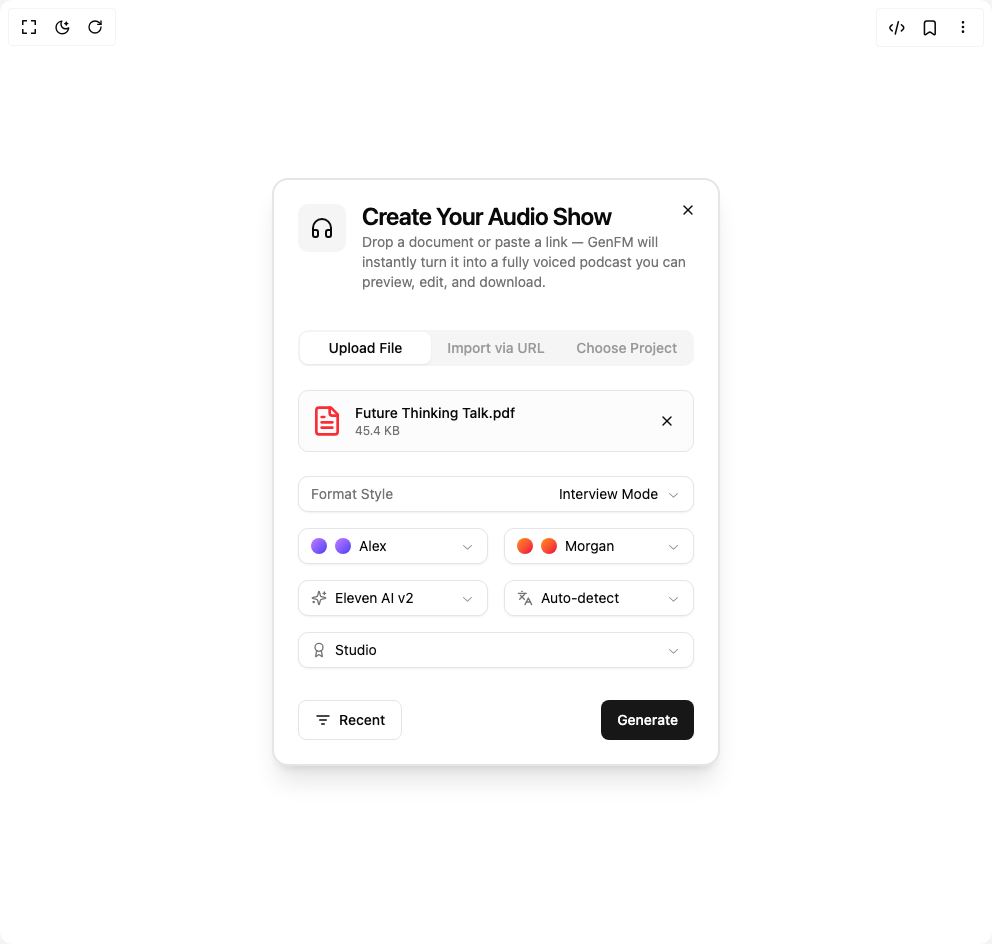

# Build Audio Show Creator in BuilderStudio

> Build this component in our Agentic IDE: [BuilderStudio](https://builderstudio.dev).
>
> Join the BuilderStudio community on [Discord](https://discord.gg/QdWeSGCqfe) and [Reddit](https://reddit.com/r/builderstudio).



## Component

- Author group: `lavikatiyar`
- Component: `audio-show-creator`
- Variant: `default`
- Rendered HTML snapshot: [`rendered.html`](rendered.html)

## BuilderStudio prompt

You are implementing a React component based on a component reference.

## Component identity

- Author: lavikatiyar
- Component slug: audio-show-creator
- Demo slug: default
- Title: audio-show-creator
- Description: 

## Goal

Recreate this component in a React + TypeScript + Tailwind CSS project. Preserve the visual layout, spacing, colors, border radius, shadows, interaction behavior, animation behavior, responsive behavior, and dark mode behavior shown in the rendered demo.

## Implementation requirements

- Use React and TypeScript.
- Use Tailwind CSS classes whenever possible.
- Keep the component self-contained unless the source files require helper components.
- If the source uses CSS variables, custom CSS, animations, or keyframes, include them.
- If the source uses external packages, list and use the required packages.
- Preserve accessibility attributes, button semantics, links, keyboard behavior, and ARIA attributes when visible in the source.
- Do not replace the component with a simplified placeholder.
- Return complete production-ready code.

## Dependencies

No reference metadata available.

## Rendered DOM snapshot

This is the rendered demo HTML extracted from the live preview. Use it to verify structure, class names, visible content, and layout.

```html
<div id="root"><div class="w-screen min-h-screen flex justify-center items-center"><div class="w-screen min-h-screen flex justify-center items-center"><div class="flex min-h-[600px] w-full items-center justify-center bg-background p-4 md:p-10"><div style="opacity: 1; transform: none;"><div class="bg-card text-card-foreground w-full max-w-md overflow-hidden rounded-2xl border-2 shadow-xl"><div class="flex flex-col space-y-1.5 p-6 relative"><div class="flex items-start gap-4"><div class="flex h-12 w-12 items-center justify-center rounded-lg bg-muted"><svg xmlns="http://www.w3.org/2000/svg" width="24" height="24" viewBox="0 0 24 24" fill="none" stroke="currentColor" stroke-width="2" stroke-linecap="round" stroke-linejoin="round" class="lucide lucide-headphones h-6 w-6" aria-hidden="true"><path d="M3 14h3a2 2 0 0 1 2 2v3a2 2 0 0 1-2 2H5a2 2 0 0 1-2-2v-7a9 9 0 0 1 18 0v7a2 2 0 0 1-2 2h-1a2 2 0 0 1-2-2v-3a2 2 0 0 1 2-2h3"></path></svg></div><div class="flex-1"><h3 class="text-2xl font-semibold leading-none tracking-tight">Create Your Audio Show</h3><p class="text-sm text-muted-foreground mt-1">Drop a document or paste a link — GenFM will instantly turn it into a fully voiced podcast you can preview, edit, and download.</p></div></div><button class="inline-flex items-center justify-center whitespace-nowrap text-sm font-medium ring-offset-background transition-colors focus-visible:outline-none focus-visible:ring-2 focus-visible:ring-ring focus-visible:ring-offset-2 disabled:pointer-events-none disabled:opacity-50 hover:bg-accent hover:text-accent-foreground absolute right-4 top-4 h-7 w-7 rounded-full" aria-label="Close"><svg xmlns="http://www.w3.org/2000/svg" width="24" height="24" viewBox="0 0 24 24" fill="none" stroke="currentColor" stroke-width="2" stroke-linecap="round" stroke-linejoin="round" class="lucide lucide-x h-4 w-4" aria-hidden="true"><path d="M18 6 6 18"></path><path d="m6 6 12 12"></path></svg></button></div><div class="p-6 space-y-6 pt-2"><div dir="ltr" data-orientation="horizontal"><div role="tablist" aria-orientation="horizontal" class="items-center justify-center rounded-lg bg-muted p-0.5 text-muted-foreground/70 grid w-full grid-cols-3" tabindex="0" data-orientation="horizontal" style="outline: none;"><button type="button" role="tab" aria-selected="true" aria-controls="radix-«r0»-content-upload" data-state="active" id="radix-«r0»-trigger-upload" class="inline-flex items-center justify-center whitespace-nowrap rounded-md px-3 py-1.5 text-sm font-medium outline-offset-2 transition-all hover:text-muted-foreground focus-visible:outline-2 focus-visible:outline-ring/70 disabled:pointer-events-none disabled:opacity-50 data-[state=active]:bg-background data-[state=active]:text-foreground data-[state=active]:shadow-sm data-[state=active]:shadow-black/5" tabindex="-1" data-orientation="horizontal" data-radix-collection-item="">Upload File</button><button type="button" role="tab" aria-selected="false" aria-controls="radix-«r0»-content-url" data-state="inactive" id="radix-«r0»-trigger-url" class="inline-flex items-center justify-center whitespace-nowrap rounded-md px-3 py-1.5 text-sm font-medium outline-offset-2 transition-all hover:text-muted-foreground focus-visible:outline-2 focus-visible:outline-ring/70 disabled:pointer-events-none disabled:opacity-50 data-[state=active]:bg-background data-[state=active]:text-foreground data-[state=active]:shadow-sm data-[state=active]:shadow-black/5" tabindex="-1" data-orientation="horizontal" data-radix-collection-item="">Import via URL</button><button type="button" role="tab" aria-selected="false" aria-controls="radix-«r0»-content-project" data-state="inactive" id="radix-«r0»-trigger-project" class="inline-flex items-center justify-center whitespace-nowrap rounded-md px-3 py-1.5 text-sm font-medium outline-offset-2 transition-all hover:text-muted-foreground focus-visible:outline-2 focus-visible:outline-ring/70 disabled:pointer-events-none disabled:opacity-50 data-[state=active]:bg-background data-[state=active]:text-foreground data-[state=active]:shadow-sm data-[state=active]:shadow-black/5" tabindex="-1" data-orientation="horizontal" data-radix-collection-item="">Choose Project</button></div></div><div class="flex items-center gap-3 rounded-lg border bg-muted/30 p-3"><svg xmlns="http://www.w3.org/2000/svg" width="24" height="24" viewBox="0 0 24 24" fill="none" stroke="currentColor" stroke-width="2" stroke-linecap="round" stroke-linejoin="round" class="lucide lucide-file-text h-8 w-8 text-red-500" aria-hidden="true"><path d="M15 2H6a2 2 0 0 0-2 2v16a2 2 0 0 0 2 2h12a2 2 0 0 0 2-2V7Z"></path><path d="M14 2v4a2 2 0 0 0 2 2h4"></path><path d="M10 9H8"></path><path d="M16 13H8"></path><path d="M16 17H8"></path></svg><div class="flex-1"><p class="font-medium text-sm">Future Thinking Talk.pdf</p><p class="text-muted-foreground text-xs">45.4 KB</p></div><button class="inline-flex items-center justify-center whitespace-nowrap text-sm font-medium ring-offset-background transition-colors focus-visible:outline-none focus-visible:ring-2 focus-visible:ring-ring focus-visible:ring-offset-2 disabled:pointer-events-none disabled:opacity-50 hover:bg-accent hover:text-accent-foreground h-7 w-7 rounded-full" aria-label="Remove file"><svg xmlns="http://www.w3.org/2000/svg" width="24" height="24" viewBox="0 0 24 24" fill="none" stroke="currentColor" stroke-width="2" stroke-linecap="round" stroke-linejoin="round" class="lucide lucide-x h-4 w-4" aria-hidden="true"><path d="M18 6 6 18"></path><path d="m6 6 12 12"></path></svg></button></div><div class="space-y-4"><div class="grid grid-cols-1 gap-4"><button type="button" role="combobox" aria-controls="radix-«r4»" aria-expanded="false" aria-autocomplete="none" dir="ltr" data-state="closed" class="flex h-9 w-full items-center justify-between gap-2 rounded-lg border border-input bg-background px-3 py-2 text-start text-sm text-foreground shadow-sm shadow-black/5 focus:border-ring focus:outline-none focus:ring-[3px] focus:ring-ring/20 disabled:cursor-not-allowed disabled:opacity-50 data-[placeholder]:text-muted-foreground/70 [&amp;&gt;span]:min-w-0" aria-label="Format Style"><div class="flex w-full items-center justify-between"><span class="text-muted-foreground">Format Style</span><span style="pointer-events: none;">Interview Mode</span></div><svg width="15" height="15" viewBox="0 0 15 15" fill="none" xmlns="http://www.w3.org/2000/svg" size="16" stroke-width="2" class="shrink-0 text-muted-foreground/80" aria-hidden="true"><path d="M3.13523 6.15803C3.3241 5.95657 3.64052 5.94637 3.84197 6.13523L7.5 9.56464L11.158 6.13523C11.3595 5.94637 11.6759 5.95657 11.8648 6.15803C12.0536 6.35949 12.0434 6.67591 11.842 6.86477L7.84197 10.6148C7.64964 10.7951 7.35036 10.7951 7.15803 10.6148L3.15803 6.86477C2.95657 6.67591 2.94637 6.35949 3.13523 6.15803Z" fill="currentColor" fill-rule="evenodd" clip-rule="evenodd"></path></svg></button></div><div class="grid grid-cols-2 gap-4"><button type="button" role="combobox" aria-controls="radix-«r5»" aria-expanded="false" aria-autocomplete="none" dir="ltr" data-state="closed" class="flex h-9 w-full items-center justify-between gap-2 rounded-lg border border-input bg-background px-3 py-2 text-start text-sm text-foreground shadow-sm shadow-black/5 focus:border-ring focus:outline-none focus:ring-[3px] focus:ring-ring/20 disabled:cursor-not-allowed disabled:opacity-50 data-[placeholder]:text-muted-foreground/70 [&amp;&gt;span]:min-w-0" aria-label="Host Voice"><div class="flex items-center gap-2"><div class="h-4 w-4 rounded-full bg-gradient-to-br from-purple-400 to-indigo-600"></div><span style="pointer-events: none;"><div class="flex items-center gap-2"><div class="h-4 w-4 rounded-full bg-gradient-to-br from-purple-400 to-indigo-600"></div><span>Alex</span></div></span></div><svg width="15" height="15" viewBox="0 0 15 15" fill="none" xmlns="http://www.w3.org/2000/svg" size="16" stroke-width="2" class="shrink-0 text-muted-foreground/80" aria-hidden="true"><path d="M3.13523 6.15803C3.3241 5.95657 3.64052 5.94637 3.84197 6.13523L7.5 9.56464L11.158 6.13523C11.3595 5.94637 11.6759 5.95657 11.8648 6.15803C12.0536 6.35949 12.0434 6.67591 11.842 6.86477L7.84197 10.6148C7.64964 10.7951 7.35036 10.7951 7.15803 10.6148L3.15803 6.86477C2.95657 6.67591 2.94637 6.35949 3.13523 6.15803Z" fill="currentColor" fill-rule="evenodd" clip-rule="evenodd"></path></svg></button><button type="button" role="combobox" aria-controls="radix-«r6»" aria-expanded="false" aria-autocomplete="none" dir="ltr" data-state="closed" class="flex h-9 w-full items-center justify-between gap-2 rounded-lg border border-input bg-background px-3 py-2 text-start text-sm text-foreground shadow-sm shadow-black/5 focus:border-ring focus:outline-none focus:ring-[3px] focus:ring-ring/20 disabled:cursor-not-allowed disabled:opacity-50 data-[placeholder]:text-muted-foreground/70 [&amp;&gt;span]:min-w-0" aria-label="Guest Voice"><div class="flex items-center gap-2"><div class="h-4 w-4 rounded-full bg-gradient-to-br from-orange-400 to-rose-600"></div><span style="pointer-events: none;"><div class="flex items-center gap-2"><div class="h-4 w-4 rounded-full bg-gradient-to-br from-orange-400 to-rose-600"></div><span>Morgan</span></div></span></div><svg width="15" height="15" viewBox="0 0 15 15" fill="none" xmlns="http://www.w3.org/2000/svg" size="16" stroke-width="2" class="shrink-0 text-muted-foreground/80" aria-hidden="true"><path d="M3.13523 6.15803C3.3241 5.95657 3.64052 5.94637 3.84197 6.13523L7.5 9.56464L11.158 6.13523C11.3595 5.94637 11.6759 5.95657 11.8648 6.15803C12.0536 6.35949 12.0434 6.67591 11.842 6.86477L7.84197 10.6148C7.64964 10.7951 7.35036 10.7951 7.15803 10.6148L3.15803 6.86477C2.95657 6.67591 2.94637 6.35949 3.13523 6.15803Z" fill="currentColor" fill-rule="evenodd" clip-rule="evenodd"></path></svg></button></div><div class="grid grid-cols-2 gap-4"><button type="button" role="combobox" aria-controls="radix-«r7»" aria-expanded="false" aria-autocomplete="none" dir="ltr" data-state="closed" class="flex h-9 w-full items-center justify-between gap-2 rounded-lg border border-input bg-background px-3 py-2 text-start text-sm text-foreground shadow-sm shadow-black/5 focus:border-ring focus:outline-none focus:ring-[3px] focus:ring-ring/20 disabled:cursor-not-allowed disabled:opacity-50 data-[placeholder]:text-muted-foreground/70 [&amp;&gt;span]:min-w-0" aria-label="Voice Engine"><span style="pointer-events: none;"><div class="flex items-center gap-2"><svg xmlns="http://www.w3.org/2000/svg" width="24" height="24" viewBox="0 0 24 24" fill="none" stroke="currentColor" stroke-width="2" stroke-linecap="round" stroke-linejoin="round" class="lucide lucide-sparkles h-4 w-4 text-muted-foreground" aria-hidden="true"><path d="M9.937 15.5A2 2 0 0 0 8.5 14.063l-6.135-1.582a.5.5 0 0 1 0-.962L8.5 9.936A2 2 0 0 0 9.937 8.5l1.582-6.135a.5.5 0 0 1 .963 0L14.063 8.5A2 2 0 0 0 15.5 9.937l6.135 1.581a.5.5 0 0 1 0 .964L15.5 14.063a2 2 0 0 0-1.437 1.437l-1.582 6.135a.5.5 0 0 1-.963 0z"></path><path d="M20 3v4"></path><path d="M22 5h-4"></path><path d="M4 17v2"></path><path d="M5 18H3"></path></svg><span>Eleven AI v2</span></div></span><svg width="15" height="15" viewBox="0 0 15 15" fill="none" xmlns="http://www.w3.org/2000/svg" size="16" stroke-width="2" class="shrink-0 text-muted-foreground/80" aria-hidden="true"><path d="M3.13523 6.15803C3.3241 5.95657 3.64052 5.94637 3.84197 6.13523L7.5 9.56464L11.158 6.13523C11.3595 5.94637 11.6759 5.95657 11.8648 6.15803C12.0536 6.35949 12.0434 6.67591 11.842 6.86477L7.84197 10.6148C7.64964 10.7951 7.35036 10.7951 7.15803 10.6148L3.15803 6.86477C2.95657 6.67591 2.94637 6.35949 3.13523 6.15803Z" fill="currentColor" fill-rule="evenodd" clip-rule="evenodd"></path></svg></button><button type="button" role="combobox" aria-controls="radix-«r8»" aria-expanded="false" aria-autocomplete="none" dir="ltr" data-state="closed" class="flex h-9 w-full items-center justify-between gap-2 rounded-lg border border-input bg-background px-3 py-2 text-start text-sm text-foreground shadow-sm shadow-black/5 focus:border-ring focus:outline-none focus:ring-[3px] focus:ring-ring/20 disabled:cursor-not-allowed disabled:opacity-50 data-[placeholder]:text-muted-foreground/70 [&amp;&gt;span]:min-w-0" aria-label="Language"><span style="pointer-events: none;"><div class="flex items-center gap-2"><svg xmlns="http://www.w3.org/2000/svg" width="24" height="24" viewBox="0 0 24 24" fill="none" stroke="currentColor" stroke-width="2" stroke-linecap="round" stroke-linejoin="round" class="lucide lucide-languages h-4 w-4 text-muted-foreground" aria-hidden="true"><path d="m5 8 6 6"></path><path d="m4 14 6-6 2-3"></path><path d="M2 5h12"></path><path d="M7 2h1"></path><path d="m22 22-5-10-5 10"></path><path d="M14 18h6"></path></svg><span>Auto-detect</span></div></span><svg width="15" height="15" viewBox="0 0 15 15" fill="none" xmlns="http://www.w3.org/2000/svg" size="16" stroke-width="2" class="shrink-0 text-muted-foreground/80" aria-hidden="true"><path d="M3.13523 6.15803C3.3241 5.95657 3.64052 5.94637 3.84197 6.13523L7.5 9.56464L11.158 6.13523C11.3595 5.94637 11.6759 5.95657 11.8648 6.15803C12.0536 6.35949 12.0434 6.67591 11.842 6.86477L7.84197 10.6148C7.64964 10.7951 7.35036 10.7951 7.15803 10.6148L3.15803 6.86477C2.95657 6.67591 2.94637 6.35949 3.13523 6.15803Z" fill="currentColor" fill-rule="evenodd" clip-rule="evenodd"></path></svg></button></div><button type="button" role="combobox" aria-controls="radix-«r9»" aria-expanded="false" aria-autocomplete="none" dir="ltr" data-state="closed" class="flex h-9 w-full items-center justify-between gap-2 rounded-lg border border-input bg-background px-3 py-2 text-start text-sm text-foreground shadow-sm shadow-black/5 focus:border-ring focus:outline-none focus:ring-[3px] focus:ring-ring/20 disabled:cursor-not-allowed disabled:opacity-50 data-[placeholder]:text-muted-foreground/70 [&amp;&gt;span]:min-w-0" aria-label="Audio Quality"><span style="pointer-events: none;"><div class="flex items-center gap-2"><svg xmlns="http://www.w3.org/2000/svg" width="24" height="24" viewBox="0 0 24 24" fill="none" stroke="currentColor" stroke-width="2" stroke-linecap="round" stroke-linejoin="round" class="lucide lucide-award h-4 w-4 text-muted-foreground" aria-hidden="true"><path d="m15.477 12.89 1.515 8.526a.5.5 0 0 1-.81.47l-3.58-2.687a1 1 0 0 0-1.197 0l-3.586 2.686a.5.5 0 0 1-.81-.469l1.514-8.526"></path><circle cx="12" cy="8" r="6"></circle></svg><span>Studio</span></div></span><svg width="15" height="15" viewBox="0 0 15 15" fill="none" xmlns="http://www.w3.org/2000/svg" size="16" stroke-width="2" class="shrink-0 text-muted-foreground/80" aria-hidden="true"><path d="M3.13523 6.15803C3.3241 5.95657 3.64052 5.94637 3.84197 6.13523L7.5 9.56464L11.158 6.13523C11.3595 5.94637 11.6759 5.95657 11.8648 6.15803C12.0536 6.35949 12.0434 6.67591 11.842 6.86477L7.84197 10.6148C7.64964 10.7951 7.35036 10.7951 7.15803 10.6148L3.15803 6.86477C2.95657 6.67591 2.94637 6.35949 3.13523 6.15803Z" fill="currentColor" fill-rule="evenodd" clip-rule="evenodd"></path></svg></button></div><div class="flex items-center justify-between pt-2"><button class="inline-flex items-center justify-center whitespace-nowrap rounded-md text-sm font-medium ring-offset-background transition-colors focus-visible:outline-none focus-visible:ring-2 focus-visible:ring-ring focus-visible:ring-offset-2 disabled:pointer-events-none disabled:opacity-50 border border-input bg-background hover:bg-accent hover:text-accent-foreground h-10 px-4 py-2"><svg xmlns="http://www.w3.org/2000/svg" width="24" height="24" viewBox="0 0 24 24" fill="none" stroke="currentColor" stroke-width="2" stroke-linecap="round" stroke-linejoin="round" class="lucide lucide-list-filter mr-2 h-4 w-4" aria-hidden="true"><path d="M3 6h18"></path><path d="M7 12h10"></path><path d="M10 18h4"></path></svg>Recent</button><button class="inline-flex items-center justify-center whitespace-nowrap rounded-md text-sm font-medium ring-offset-background transition-colors focus-visible:outline-none focus-visible:ring-2 focus-visible:ring-ring focus-visible:ring-offset-2 disabled:pointer-events-none disabled:opacity-50 bg-primary text-primary-foreground hover:bg-primary/90 h-10 px-4 py-2">Generate</button></div></div></div></div></div></div></div></div>
```

## Reference source files

No reference source files were available.
