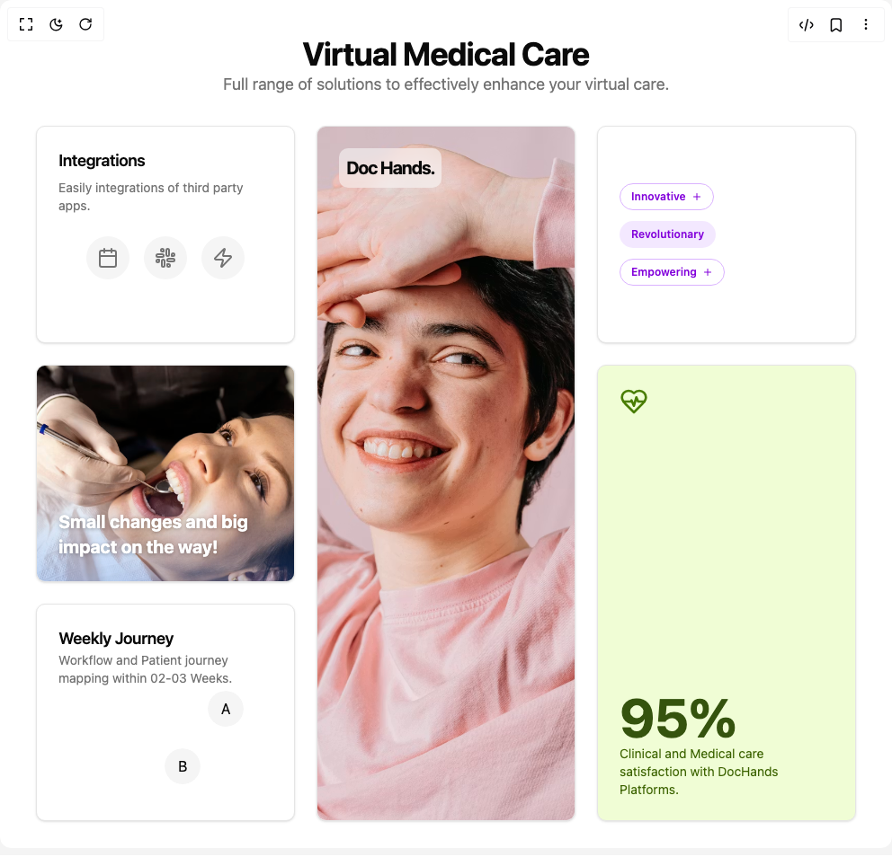

# Build Bento Grid in BuilderStudio

> Build this component in our Agentic IDE: [BuilderStudio](https://builderstudio.dev).
>
> Join the BuilderStudio community on [Discord](https://discord.gg/QdWeSGCqfe) and [Reddit](https://reddit.com/r/builderstudio).



## Component

- Author group: `lavikatiyar`
- Component: `bento-grid`
- Variant: `default`
- Rendered HTML snapshot: [`rendered.html`](rendered.html)

## BuilderStudio prompt

You are implementing a React component based on a component reference.

## Component identity

- Author: lavikatiyar
- Component slug: bento-grid
- Demo slug: default
- Title: bento-grid
- Description: 

## Goal

Recreate this component in a React + TypeScript + Tailwind CSS project. Preserve the visual layout, spacing, colors, border radius, shadows, interaction behavior, animation behavior, responsive behavior, and dark mode behavior shown in the rendered demo.

## Implementation requirements

- Use React and TypeScript.
- Use Tailwind CSS classes whenever possible.
- Keep the component self-contained unless the source files require helper components.
- If the source uses CSS variables, custom CSS, animations, or keyframes, include them.
- If the source uses external packages, list and use the required packages.
- Preserve accessibility attributes, button semantics, links, keyboard behavior, and ARIA attributes when visible in the source.
- Do not replace the component with a simplified placeholder.
- Return complete production-ready code.

## Dependencies

No reference metadata available.

## Rendered DOM snapshot

This is the rendered demo HTML extracted from the live preview. Use it to verify structure, class names, visible content, and layout.

```html
<div id="root"><div class="w-screen min-h-screen flex justify-center items-center"><div class="w-screen min-h-screen flex justify-center items-center"><div class="w-full p-4 md:p-10"><div class="mb-8"><h1 class="text-center text-4xl font-bold tracking-tight">Virtual Medical Care</h1><p class="text-center text-lg text-muted-foreground">Full range of solutions to effectively enhance your virtual care.</p></div><section class="grid w-full grid-cols-1 gap-6 md:grid-cols-3 md:grid-rows-3 auto-rows-[minmax(200px,auto)]" style="opacity: 1;"><div class="md:col-span-1 md:row-span-1" style="opacity: 1; transform: none;"><div class="rounded-lg border bg-card text-card-foreground shadow-sm h-full"><div class="flex flex-col space-y-1.5 p-6"><h3 class="font-semibold tracking-tight text-lg">Integrations</h3><p class="text-sm text-muted-foreground">Easily integrations of third party apps.</p></div><div class="p-6 pt-0 flex items-center justify-center gap-4"><div class="flex h-12 w-12 items-center justify-center rounded-full bg-muted"><svg xmlns="http://www.w3.org/2000/svg" width="24" height="24" viewBox="0 0 24 24" fill="none" stroke="currentColor" stroke-width="2" stroke-linecap="round" stroke-linejoin="round" class="lucide lucide-calendar h-6 w-6 text-muted-foreground" aria-hidden="true"><path d="M8 2v4"></path><path d="M16 2v4"></path><rect width="18" height="18" x="3" y="4" rx="2"></rect><path d="M3 10h18"></path></svg></div><div class="flex h-12 w-12 items-center justify-center rounded-full bg-muted"><svg xmlns="http://www.w3.org/2000/svg" width="24" height="24" viewBox="0 0 24 24" fill="none" stroke="currentColor" stroke-width="2" stroke-linecap="round" stroke-linejoin="round" class="lucide lucide-slack h-6 w-6 text-muted-foreground" aria-hidden="true"><rect width="3" height="8" x="13" y="2" rx="1.5"></rect><path d="M19 8.5V10h1.5A1.5 1.5 0 1 0 19 8.5"></path><rect width="3" height="8" x="8" y="14" rx="1.5"></rect><path d="M5 15.5V14H3.5A1.5 1.5 0 1 0 5 15.5"></path><rect width="8" height="3" x="14" y="13" rx="1.5"></rect><path d="M15.5 19H14v1.5a1.5 1.5 0 1 0 1.5-1.5"></path><rect width="8" height="3" x="2" y="8" rx="1.5"></rect><path d="M8.5 5H10V3.5A1.5 1.5 0 1 0 8.5 5"></path></svg></div><div class="flex h-12 w-12 items-center justify-center rounded-full bg-muted"><svg xmlns="http://www.w3.org/2000/svg" width="24" height="24" viewBox="0 0 24 24" fill="none" stroke="currentColor" stroke-width="2" stroke-linecap="round" stroke-linejoin="round" class="lucide lucide-zap h-6 w-6 text-muted-foreground" aria-hidden="true"><path d="M4 14a1 1 0 0 1-.78-1.63l9.9-10.2a.5.5 0 0 1 .86.46l-1.92 6.02A1 1 0 0 0 13 10h7a1 1 0 0 1 .78 1.63l-9.9 10.2a.5.5 0 0 1-.86-.46l1.92-6.02A1 1 0 0 0 11 14z"></path></svg></div></div></div></div><div class="md:col-span-1 md:row-span-3" style="opacity: 1; transform: none;"><div class="rounded-lg border bg-card text-card-foreground shadow-sm relative h-full w-full overflow-hidden"><div class="absolute top-6 left-6 z-10 rounded-lg bg-background/50 p-2 backdrop-blur-sm"><p class="text-xl font-bold tracking-tighter">Doc Hands.</p></div></div></div><div class="md:col-span-1 md:row-span-1" style="opacity: 1; transform: none;"><div class="rounded-lg border bg-card text-card-foreground shadow-sm h-full"><div class="flex h-full flex-col justify-center gap-3 p-6"><div class="inline-flex rounded-full border text-xs font-semibold transition-colors focus:outline-none focus:ring-2 focus:ring-ring focus:ring-offset-2 w-fit items-center gap-1.5 border-purple-300 py-1.5 px-3 text-purple-700 dark:border-purple-700 dark:text-purple-300">Innovative <svg xmlns="http://www.w3.org/2000/svg" width="24" height="24" viewBox="0 0 24 24" fill="none" stroke="currentColor" stroke-width="2" stroke-linecap="round" stroke-linejoin="round" class="lucide lucide-plus h-3 w-3" aria-hidden="true"><path d="M5 12h14"></path><path d="M12 5v14"></path></svg></div><div class="inline-flex rounded-full border text-xs font-semibold transition-colors focus:outline-none focus:ring-2 focus:ring-ring focus:ring-offset-2 border-transparent w-fit items-center gap-1.5 bg-purple-100 py-1.5 px-3 text-purple-700 hover:bg-purple-200 dark:bg-purple-900/50 dark:text-purple-300 dark:hover:bg-purple-900/80">Revolutionary</div><div class="inline-flex rounded-full border text-xs font-semibold transition-colors focus:outline-none focus:ring-2 focus:ring-ring focus:ring-offset-2 w-fit items-center gap-1.5 border-purple-300 py-1.5 px-3 text-purple-700 dark:border-purple-700 dark:text-purple-300">Empowering <svg xmlns="http://www.w3.org/2000/svg" width="24" height="24" viewBox="0 0 24 24" fill="none" stroke="currentColor" stroke-width="2" stroke-linecap="round" stroke-linejoin="round" class="lucide lucide-plus h-3 w-3" aria-hidden="true"><path d="M5 12h14"></path><path d="M12 5v14"></path></svg></div></div></div></div><div class="md:col-span-1 md:row-span-1" style="opacity: 1; transform: none;"><div class="rounded-lg border bg-card text-card-foreground shadow-sm relative h-full w-full overflow-hidden"><div class="absolute inset-0 bg-gradient-to-t from-blue-500/30 via-transparent to-transparent dark:from-blue-900/40"></div><p class="absolute bottom-6 left-6 z-10 max-w-[80%] text-xl font-bold text-white [text-shadow:_0_1px_4px_rgb(0_0_0_/_30%)]">Small changes and big impact on the way!</p></div></div><div class="md:col-span-1 md:row-span-2" style="opacity: 1; transform: none;"><div class="rounded-lg border text-card-foreground shadow-sm flex h-full flex-col justify-between bg-lime-100/80 p-6 dark:bg-lime-950/80"><svg xmlns="http://www.w3.org/2000/svg" width="24" height="24" viewBox="0 0 24 24" fill="none" stroke="currentColor" stroke-width="2" stroke-linecap="round" stroke-linejoin="round" class="lucide lucide-heart-pulse h-8 w-8 text-lime-700 dark:text-lime-300" aria-hidden="true"><path d="M19 14c1.49-1.46 3-3.21 3-5.5A5.5 5.5 0 0 0 16.5 3c-1.76 0-3 .5-4.5 2-1.5-1.5-2.74-2-4.5-2A5.5 5.5 0 0 0 2 8.5c0 2.3 1.5 4.05 3 5.5l7 7Z"></path><path d="M3.22 12H9.5l.5-1 2 4.5 2-7 1.5 3.5h5.27"></path></svg><div><p class="text-6xl font-bold text-lime-900 dark:text-lime-100">95%</p><p class="text-sm text-lime-800 dark:text-lime-200">Clinical and Medical care satisfaction with DocHands Platforms.</p></div></div></div><div class="md:col-span-1 md:row-span-1" style="opacity: 1; transform: none;"><div class="rounded-lg border bg-card text-card-foreground shadow-sm relative h-full w-full overflow-hidden p-6"><h3 class="font-semibold tracking-tight text-lg">Weekly Journey</h3><p class="text-sm text-muted-foreground">Workflow and Patient journey mapping within 02-03 Weeks.</p><div class="absolute -right-4 -bottom-4 h-48 w-48"><div class="absolute top-8 left-20"><span class="relative flex h-10 w-10 shrink-0 overflow-hidden rounded-full"><span class="flex h-full w-full items-center justify-center rounded-full bg-muted">A</span></span></div><div class="absolute top-24 left-8"><span class="relative flex h-10 w-10 shrink-0 overflow-hidden rounded-full"><span class="flex h-full w-full items-center justify-center rounded-full bg-muted">B</span></span></div></div></div></div></section></div></div></div></div>
```

## Reference source files

No reference source files were available.
