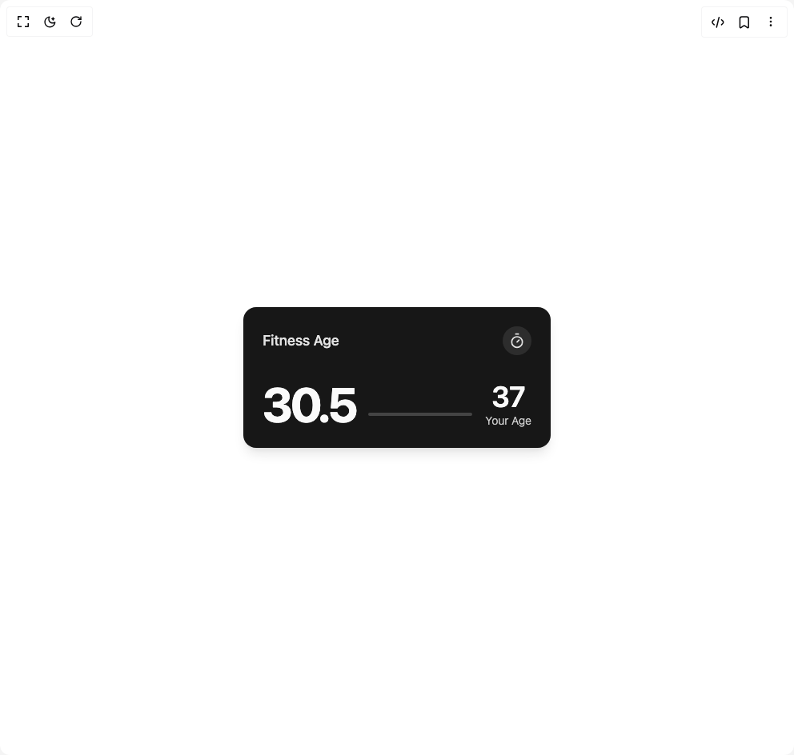

# Build Card 4 in BuilderStudio

> Build this component in our Agentic IDE: [BuilderStudio](https://builderstudio.dev).
>
> Join the BuilderStudio community on [Discord](https://discord.gg/QdWeSGCqfe) and [Reddit](https://reddit.com/r/builderstudio).



## Component

- Author group: `lavikatiyar`
- Component: `card-4`
- Variant: `default`
- Rendered HTML snapshot: [`rendered.html`](rendered.html)

## BuilderStudio prompt

You are implementing a React component based on a component reference.

## Component identity

- Author: lavikatiyar
- Component slug: card-4
- Demo slug: default
- Title: card-4
- Description: 

## Goal

Recreate this component in a React + TypeScript + Tailwind CSS project. Preserve the visual layout, spacing, colors, border radius, shadows, interaction behavior, animation behavior, responsive behavior, and dark mode behavior shown in the rendered demo.

## Implementation requirements

- Use React and TypeScript.
- Use Tailwind CSS classes whenever possible.
- Keep the component self-contained unless the source files require helper components.
- If the source uses CSS variables, custom CSS, animations, or keyframes, include them.
- If the source uses external packages, list and use the required packages.
- Preserve accessibility attributes, button semantics, links, keyboard behavior, and ARIA attributes when visible in the source.
- Do not replace the component with a simplified placeholder.
- Return complete production-ready code.

## Dependencies

No reference metadata available.

## Rendered DOM snapshot

This is the rendered demo HTML extracted from the live preview. Use it to verify structure, class names, visible content, and layout.

```html
<div id="root"><div class="w-screen min-h-screen flex justify-center items-center"><div class="w-screen min-h-screen flex justify-center items-center"><div class="flex min-h-[400px] w-full items-center justify-center bg-background p-4"><div class="relative flex w-full max-w-sm flex-col overflow-hidden rounded-2xl p-6 bg-primary text-primary-foreground shadow-lg transition-all hover:shadow-2xl before:absolute before:inset-0 before:-z-10 before:bg-[radial-gradient(circle_at_50%_50%,hsl(var(--primary-foreground)/0.05)_2%,transparent_2%)] before:bg-[length:20px_20px]"><div class="flex items-center justify-between"><h2 class="text-lg font-medium text-primary-foreground/90">Fitness Age</h2><div class="rounded-full bg-primary-foreground/10 p-2"><svg xmlns="http://www.w3.org/2000/svg" width="24" height="24" viewBox="0 0 24 24" fill="none" stroke="currentColor" stroke-width="2" stroke-linecap="round" stroke-linejoin="round" class="lucide lucide-timer h-5 w-5 text-primary-foreground/90" aria-hidden="true"><line x1="10" x2="14" y1="2" y2="2"></line><line x1="12" x2="15" y1="14" y2="11"></line><circle cx="12" cy="14" r="8"></circle></svg></div></div><div class="z-10 flex flex-1 items-end justify-between gap-4 pt-8"><div class="flex items-baseline" aria-live="polite"><h1 class="text-6xl font-bold tracking-tighter">30.5</h1></div><div class="mb-4 h-1 w-full flex-1 rounded-full bg-primary-foreground/20"></div><div class="flex flex-col items-center text-right"><span class="text-4xl font-semibold tracking-tight">37</span><span class="text-sm font-light text-primary-foreground/80">Your Age</span></div></div></div></div></div></div></div>
```

## Reference source files

No reference source files were available.
