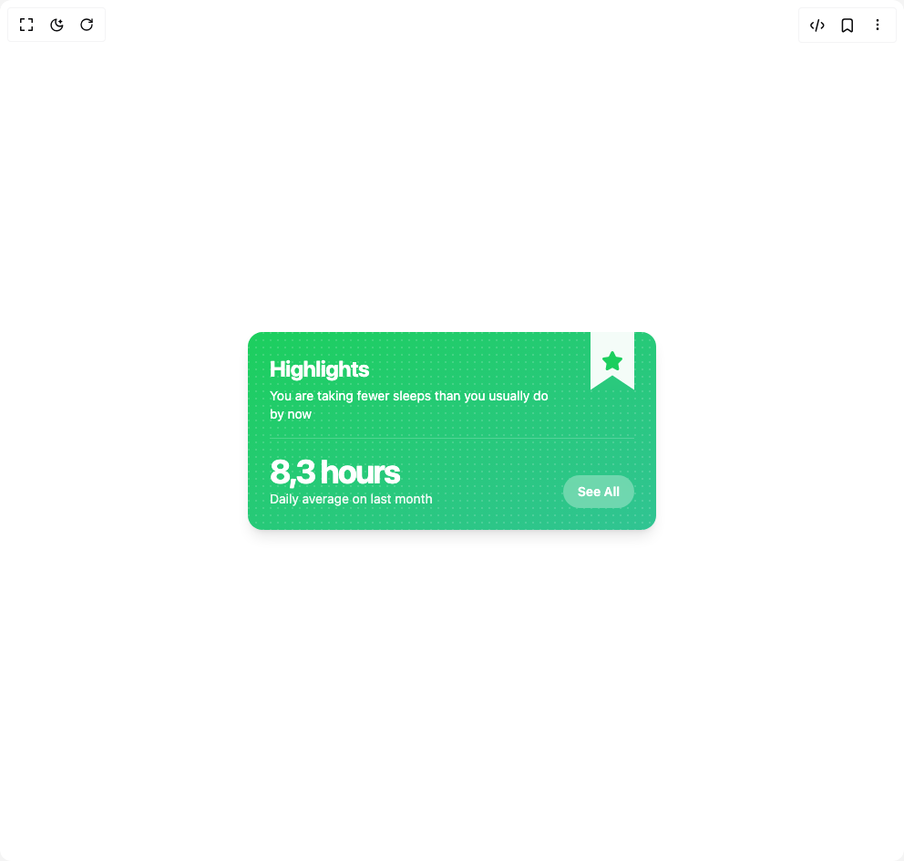

# Build Card 5 in BuilderStudio

> Build this component in our Agentic IDE: [BuilderStudio](https://builderstudio.dev).
>
> Join the BuilderStudio community on [Discord](https://discord.gg/QdWeSGCqfe) and [Reddit](https://reddit.com/r/builderstudio).



## Component

- Author group: `lavikatiyar`
- Component: `card-5`
- Variant: `default`
- Rendered HTML snapshot: [`rendered.html`](rendered.html)

## BuilderStudio prompt

You are implementing a React component based on a component reference.

## Component identity

- Author: lavikatiyar
- Component slug: card-5
- Demo slug: default
- Title: card-5
- Description: 

## Goal

Recreate this component in a React + TypeScript + Tailwind CSS project. Preserve the visual layout, spacing, colors, border radius, shadows, interaction behavior, animation behavior, responsive behavior, and dark mode behavior shown in the rendered demo.

## Implementation requirements

- Use React and TypeScript.
- Use Tailwind CSS classes whenever possible.
- Keep the component self-contained unless the source files require helper components.
- If the source uses CSS variables, custom CSS, animations, or keyframes, include them.
- If the source uses external packages, list and use the required packages.
- Preserve accessibility attributes, button semantics, links, keyboard behavior, and ARIA attributes when visible in the source.
- Do not replace the component with a simplified placeholder.
- Return complete production-ready code.

## Dependencies

No reference metadata available.

## Rendered DOM snapshot

This is the rendered demo HTML extracted from the live preview. Use it to verify structure, class names, visible content, and layout.

```html
<div id="root"><div class="w-screen min-h-screen flex justify-center items-center"><div class="w-screen min-h-screen flex justify-center items-center"><div class="flex h-full w-full items-center justify-center bg-background p-4"><div class="relative w-full max-w-md overflow-hidden rounded-2xl p-6 shadow-lg" style="--card-from-color: hsl(142 76% 46%); --card-to-color: hsl(160 60% 48%); --card-foreground-color: hsl(0 0% 100%); color: var(--card-foreground-color); background-image: radial-gradient(circle at 1px 1px, hsla(0,0%,100%,0.15) 1px, transparent 0),
            linear-gradient(to bottom right, var(--card-from-color), var(--card-to-color)); background-size: 0.5rem 0.5rem, 100% 100%; opacity: 1; transform: none;"><div class="absolute top-0 right-6 h-16 w-12 bg-white/95 backdrop-blur-sm [clip-path:polygon(0%_0%,_100%_0%,_100%_100%,_50%_75%,_0%_100%)] dark:bg-zinc-800/80"><div class="absolute inset-0 flex items-center justify-center" style="color: var(--card-from-color);"><svg xmlns="http://www.w3.org/2000/svg" width="24" height="24" viewBox="0 0 24 24" fill="currentColor" stroke="currentColor" stroke-width="2" stroke-linecap="round" stroke-linejoin="round" class="lucide lucide-star h-6 w-6" aria-hidden="true"><path d="M11.525 2.295a.53.53 0 0 1 .95 0l2.31 4.679a2.123 2.123 0 0 0 1.595 1.16l5.166.756a.53.53 0 0 1 .294.904l-3.736 3.638a2.123 2.123 0 0 0-.611 1.878l.882 5.14a.53.53 0 0 1-.771.56l-4.618-2.428a2.122 2.122 0 0 0-1.973 0L6.396 21.01a.53.53 0 0 1-.77-.56l.881-5.139a2.122 2.122 0 0 0-.611-1.879L2.16 9.795a.53.53 0 0 1 .294-.906l5.165-.755a2.122 2.122 0 0 0 1.597-1.16z"></path></svg></div></div><div class="flex h-full flex-col justify-between"><div><h3 class="text-2xl font-bold tracking-tight" style="opacity: 1; transform: none;">Highlights</h3><p class="mt-1 text-sm opacity-90 max-w-[80%]" style="opacity: 1; transform: none;">You are taking fewer sleeps than you usually do by now</p></div><div class="my-4 h-px w-full bg-white/20" style="opacity: 1; transform: none;"></div><div class="flex items-end justify-between"><div style="opacity: 1; transform: none;"><p class="text-4xl font-bold tracking-tighter">8,3 hours</p><p class="text-sm opacity-90">Daily average on last month</p></div><button class="rounded-full bg-white/30 px-4 py-2 text-sm font-semibold backdrop-blur-sm transition-colors hover:bg-white/40 focus-visible:outline-none focus-visible:ring-2 focus-visible:ring-white/50" aria-label="See All" style="opacity: 1; transform: none;">See All</button></div></div></div></div></div></div></div>
```

## Reference source files

No reference source files were available.
