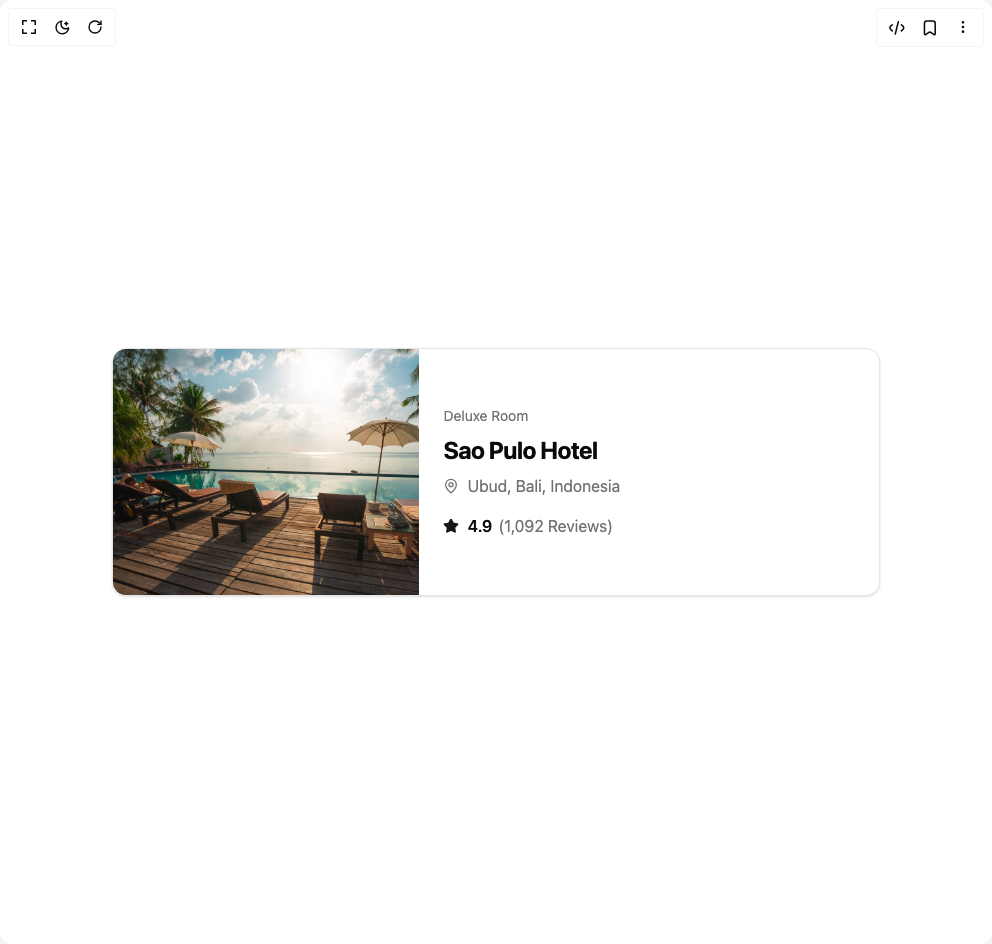

# Build Card in BuilderStudio

> Build this component in our Agentic IDE: [BuilderStudio](https://builderstudio.dev).
>
> Join the BuilderStudio community on [Discord](https://discord.gg/QdWeSGCqfe) and [Reddit](https://reddit.com/r/builderstudio).



## Component

- Author group: `lavikatiyar`
- Component: `card`
- Variant: `default`
- Rendered HTML snapshot: [`rendered.html`](rendered.html)

## BuilderStudio prompt

You are implementing a React component based on a component reference.

## Component identity

- Author: lavikatiyar
- Component slug: card
- Demo slug: default
- Title: card
- Description: 

## Goal

Recreate this component in a React + TypeScript + Tailwind CSS project. Preserve the visual layout, spacing, colors, border radius, shadows, interaction behavior, animation behavior, responsive behavior, and dark mode behavior shown in the rendered demo.

## Implementation requirements

- Use React and TypeScript.
- Use Tailwind CSS classes whenever possible.
- Keep the component self-contained unless the source files require helper components.
- If the source uses CSS variables, custom CSS, animations, or keyframes, include them.
- If the source uses external packages, list and use the required packages.
- Preserve accessibility attributes, button semantics, links, keyboard behavior, and ARIA attributes when visible in the source.
- Do not replace the component with a simplified placeholder.
- Return complete production-ready code.

## Dependencies

No reference metadata available.

## Rendered DOM snapshot

This is the rendered demo HTML extracted from the live preview. Use it to verify structure, class names, visible content, and layout.

```html
<div id="root"><div class="w-screen min-h-screen flex justify-center items-center"><div class="w-screen min-h-screen flex justify-center items-center"><div class="flex w-full items-center justify-center bg-background p-8"><div class="w-full max-w-3xl"><a href="#" class="group flex flex-col md:flex-row overflow-hidden rounded-xl border bg-card text-card-foreground shadow-sm transition-all duration-300 ease-in-out hover:shadow-lg"><div class="md:w-2/5 w-full h-56 md:h-auto overflow-hidden"></div><div class="flex flex-col justify-center p-6 md:w-3/5 space-y-2"><span class="text-sm text-muted-foreground">Deluxe Room</span><h3 class="text-2xl font-bold tracking-tight">Sao Pulo Hotel</h3><div class="flex items-center text-muted-foreground"><svg xmlns="http://www.w3.org/2000/svg" width="24" height="24" viewBox="0 0 24 24" fill="none" stroke="currentColor" stroke-width="2" stroke-linecap="round" stroke-linejoin="round" class="lucide lucide-map-pin mr-2 h-4 w-4 flex-shrink-0" aria-hidden="true"><path d="M20 10c0 4.993-5.539 10.193-7.399 11.799a1 1 0 0 1-1.202 0C9.539 20.193 4 14.993 4 10a8 8 0 0 1 16 0"></path><circle cx="12" cy="10" r="3"></circle></svg><span>Ubud, Bali, Indonesia</span></div><div class="flex items-center pt-2 text-muted-foreground"><svg xmlns="http://www.w3.org/2000/svg" width="24" height="24" viewBox="0 0 24 24" fill="none" stroke="currentColor" stroke-width="2" stroke-linecap="round" stroke-linejoin="round" class="lucide lucide-star mr-2 h-4 w-4 fill-primary text-primary" aria-hidden="true"><path d="M11.525 2.295a.53.53 0 0 1 .95 0l2.31 4.679a2.123 2.123 0 0 0 1.595 1.16l5.166.756a.53.53 0 0 1 .294.904l-3.736 3.638a2.123 2.123 0 0 0-.611 1.878l.882 5.14a.53.53 0 0 1-.771.56l-4.618-2.428a2.122 2.122 0 0 0-1.973 0L6.396 21.01a.53.53 0 0 1-.77-.56l.881-5.139a2.122 2.122 0 0 0-.611-1.879L2.16 9.795a.53.53 0 0 1 .294-.906l5.165-.755a2.122 2.122 0 0 0 1.597-1.16z"></path></svg><span class="font-semibold text-foreground">4.9</span><span class="ml-1.5">(1,092 Reviews)</span></div></div></a></div></div></div></div></div>
```

## Reference source files

No reference source files were available.
