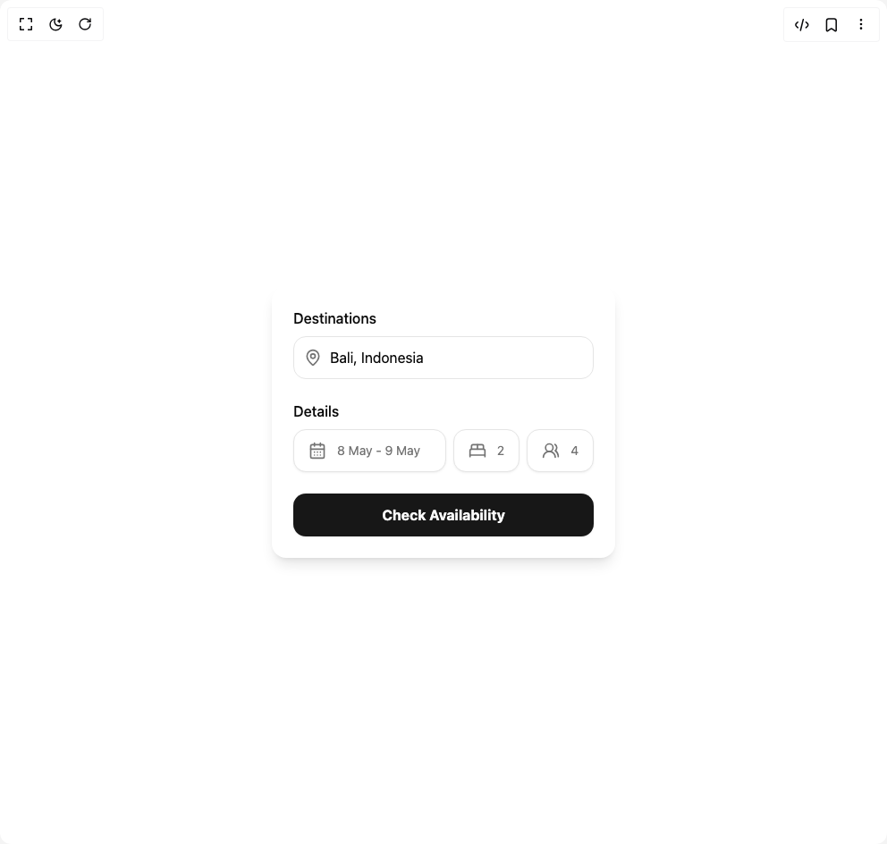

# Build Form in BuilderStudio

> Build this component in our Agentic IDE: [BuilderStudio](https://builderstudio.dev).
>
> Join the BuilderStudio community on [Discord](https://discord.gg/QdWeSGCqfe) and [Reddit](https://reddit.com/r/builderstudio).



## Component

- Author group: `lavikatiyar`
- Component: `form`
- Variant: `default`
- Rendered HTML snapshot: [`rendered.html`](rendered.html)

## BuilderStudio prompt

You are implementing a React component based on a component reference.

## Component identity

- Author: lavikatiyar
- Component slug: form
- Demo slug: default
- Title: form
- Description: 

## Goal

Recreate this component in a React + TypeScript + Tailwind CSS project. Preserve the visual layout, spacing, colors, border radius, shadows, interaction behavior, animation behavior, responsive behavior, and dark mode behavior shown in the rendered demo.

## Implementation requirements

- Use React and TypeScript.
- Use Tailwind CSS classes whenever possible.
- Keep the component self-contained unless the source files require helper components.
- If the source uses CSS variables, custom CSS, animations, or keyframes, include them.
- If the source uses external packages, list and use the required packages.
- Preserve accessibility attributes, button semantics, links, keyboard behavior, and ARIA attributes when visible in the source.
- Do not replace the component with a simplified placeholder.
- Return complete production-ready code.

## Dependencies

No reference metadata available.

## Rendered DOM snapshot

This is the rendered demo HTML extracted from the live preview. Use it to verify structure, class names, visible content, and layout.

```html
<div id="root"><div class="w-screen min-h-screen flex justify-center items-center"><div class="w-screen min-h-screen flex justify-center items-center"><div class="flex h-screen w-full items-center justify-center bg-background p-4"><div class="w-full max-w-sm space-y-6 rounded-2xl bg-card p-6 shadow-lg" style="opacity: 1; transform: none;"><form class="space-y-6"><div class="space-y-2" style="opacity: 1; transform: none;"><h3 class="font-medium text-card-foreground">Destinations</h3><div class="relative"><svg xmlns="http://www.w3.org/2000/svg" width="24" height="24" viewBox="0 0 24 24" fill="none" stroke="currentColor" stroke-width="2" stroke-linecap="round" stroke-linejoin="round" class="lucide lucide-map-pin absolute left-3 top-1/2 h-5 w-5 -translate-y-1/2 text-muted-foreground" aria-hidden="true"><path d="M20 10c0 4.993-5.539 10.193-7.399 11.799a1 1 0 0 1-1.202 0C9.539 20.193 4 14.993 4 10a8 8 0 0 1 16 0"></path><circle cx="12" cy="10" r="3"></circle></svg><input placeholder="Bali, Indonesia" class="h-12 w-full rounded-xl border border-input bg-transparent pl-10 pr-4 text-foreground ring-offset-background placeholder:text-muted-foreground focus-visible:outline-none focus-visible:ring-2 focus-visible:ring-ring focus-visible:ring-offset-2" type="text" value="Bali, Indonesia"></div></div><div class="space-y-2" style="opacity: 1; transform: none;"><h3 class="font-medium text-card-foreground">Details</h3><div class="flex flex-col gap-2 sm:flex-row"><button class="whitespace-nowrap text-sm transition-colors outline-offset-2 focus-visible:outline-2 focus-visible:outline-ring/70 disabled:pointer-events-none disabled:opacity-50 [&amp;_svg]:pointer-events-none [&amp;_svg]:shrink-0 border border-input shadow-sm shadow-black/5 hover:bg-accent hover:text-accent-foreground py-2 flex h-12 flex-1 items-center justify-start gap-3 rounded-xl bg-background px-4 text-left font-normal text-muted-foreground"><svg xmlns="http://www.w3.org/2000/svg" width="24" height="24" viewBox="0 0 24 24" fill="none" stroke="currentColor" stroke-width="2" stroke-linecap="round" stroke-linejoin="round" class="lucide lucide-calendar-days h-5 w-5" aria-hidden="true"><path d="M8 2v4"></path><path d="M16 2v4"></path><rect width="18" height="18" x="3" y="4" rx="2"></rect><path d="M3 10h18"></path><path d="M8 14h.01"></path><path d="M12 14h.01"></path><path d="M16 14h.01"></path><path d="M8 18h.01"></path><path d="M12 18h.01"></path><path d="M16 18h.01"></path></svg><span>8 May - 9 May</span></button><div class="flex flex-1 gap-2"><button class="whitespace-nowrap text-sm transition-colors outline-offset-2 focus-visible:outline-2 focus-visible:outline-ring/70 disabled:pointer-events-none disabled:opacity-50 [&amp;_svg]:pointer-events-none [&amp;_svg]:shrink-0 border border-input shadow-sm shadow-black/5 hover:bg-accent hover:text-accent-foreground py-2 flex h-12 flex-1 items-center justify-start gap-3 rounded-xl bg-background px-4 text-left font-normal text-muted-foreground w-1/2"><svg xmlns="http://www.w3.org/2000/svg" width="24" height="24" viewBox="0 0 24 24" fill="none" stroke="currentColor" stroke-width="2" stroke-linecap="round" stroke-linejoin="round" class="lucide lucide-bed-double h-5 w-5" aria-hidden="true"><path d="M2 20v-8a2 2 0 0 1 2-2h16a2 2 0 0 1 2 2v8"></path><path d="M4 10V6a2 2 0 0 1 2-2h12a2 2 0 0 1 2 2v4"></path><path d="M12 4v6"></path><path d="M2 18h20"></path></svg><span>2</span></button><button class="whitespace-nowrap text-sm transition-colors outline-offset-2 focus-visible:outline-2 focus-visible:outline-ring/70 disabled:pointer-events-none disabled:opacity-50 [&amp;_svg]:pointer-events-none [&amp;_svg]:shrink-0 border border-input shadow-sm shadow-black/5 hover:bg-accent hover:text-accent-foreground py-2 flex h-12 flex-1 items-center justify-start gap-3 rounded-xl bg-background px-4 text-left font-normal text-muted-foreground w-1/2"><svg xmlns="http://www.w3.org/2000/svg" width="24" height="24" viewBox="0 0 24 24" fill="none" stroke="currentColor" stroke-width="2" stroke-linecap="round" stroke-linejoin="round" class="lucide lucide-users-round h-5 w-5" aria-hidden="true"><path d="M18 21a8 8 0 0 0-16 0"></path><circle cx="10" cy="8" r="5"></circle><path d="M22 20c0-3.37-2-6.5-4-8a5 5 0 0 0-.45-8.3"></path></svg><span>4</span></button></div></div></div><div style="opacity: 1; transform: none;"><button class="inline-flex items-center justify-center whitespace-nowrap transition-colors outline-offset-2 focus-visible:outline-2 focus-visible:outline-ring/70 disabled:pointer-events-none disabled:opacity-50 [&amp;_svg]:pointer-events-none [&amp;_svg]:shrink-0 bg-primary text-primary-foreground shadow-sm shadow-black/5 hover:bg-primary/90 px-4 py-2 h-12 w-full rounded-xl text-base font-bold" type="submit" tabindex="0">Check Availability</button></div></form></div></div></div></div></div>
```

## Reference source files

No reference source files were available.
