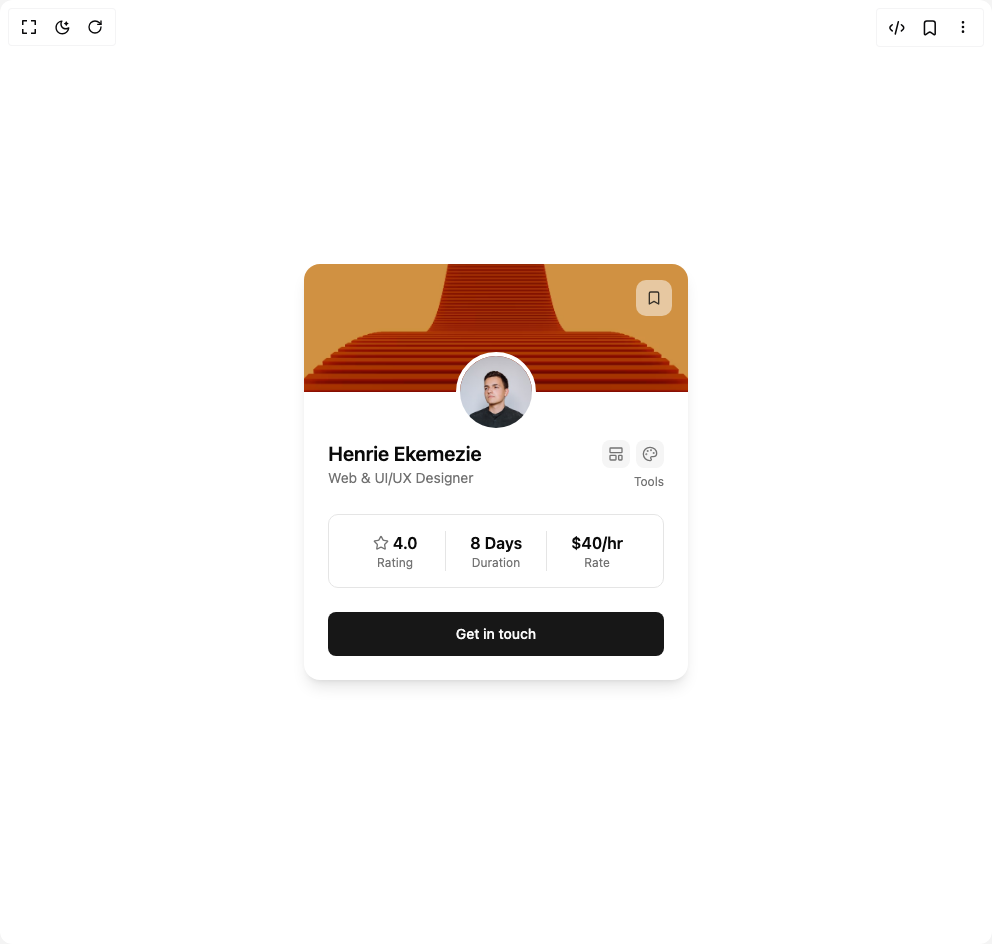

# Build Freelancer Profile Card in BuilderStudio

> Build this component in our Agentic IDE: [BuilderStudio](https://builderstudio.dev).
>
> Join the BuilderStudio community on [Discord](https://discord.gg/QdWeSGCqfe) and [Reddit](https://reddit.com/r/builderstudio).



## Component

- Author group: `lavikatiyar`
- Component: `freelancer-profile-card`
- Variant: `default`
- Rendered HTML snapshot: [`rendered.html`](rendered.html)

## BuilderStudio prompt

You are implementing a React component based on a component reference.

## Component identity

- Author: lavikatiyar
- Component slug: freelancer-profile-card
- Demo slug: default
- Title: freelancer-profile-card
- Description: 

## Goal

Recreate this component in a React + TypeScript + Tailwind CSS project. Preserve the visual layout, spacing, colors, border radius, shadows, interaction behavior, animation behavior, responsive behavior, and dark mode behavior shown in the rendered demo.

## Implementation requirements

- Use React and TypeScript.
- Use Tailwind CSS classes whenever possible.
- Keep the component self-contained unless the source files require helper components.
- If the source uses CSS variables, custom CSS, animations, or keyframes, include them.
- If the source uses external packages, list and use the required packages.
- Preserve accessibility attributes, button semantics, links, keyboard behavior, and ARIA attributes when visible in the source.
- Do not replace the component with a simplified placeholder.
- Return complete production-ready code.

## Dependencies

No reference metadata available.

## Rendered DOM snapshot

This is the rendered demo HTML extracted from the live preview. Use it to verify structure, class names, visible content, and layout.

```html
<div id="root"><div class="w-screen min-h-screen flex justify-center items-center"><div class="w-screen min-h-screen flex justify-center items-center"><div class="flex h-full w-full items-center justify-center bg-background p-10"><div class="relative w-full max-w-sm overflow-hidden rounded-2xl bg-card shadow-lg" style="opacity: 1; transform: none;"><div class="h-32 w-full"></div><button class="inline-flex items-center justify-center whitespace-nowrap text-sm font-medium ring-offset-background transition-colors focus-visible:outline-none focus-visible:ring-2 focus-visible:ring-ring focus-visible:ring-offset-2 disabled:pointer-events-none disabled:opacity-50 absolute right-4 top-4 h-9 w-9 rounded-lg bg-background/50 backdrop-blur-sm text-card-foreground/80 hover:bg-background/70" aria-label="Bookmark profile"><svg xmlns="http://www.w3.org/2000/svg" width="24" height="24" viewBox="0 0 24 24" fill="none" stroke="currentColor" stroke-width="2" stroke-linecap="round" stroke-linejoin="round" class="lucide lucide-bookmark h-4 w-4" aria-hidden="true"><path d="m19 21-7-4-7 4V5a2 2 0 0 1 2-2h10a2 2 0 0 1 2 2v16z"></path></svg></button><div class="absolute left-1/2 top-32 -translate-x-1/2 -translate-y-1/2"><span class="relative flex shrink-0 overflow-hidden rounded-full h-20 w-20 border-4 border-card"></span></div><div class="px-6 pb-6 pt-12"><div class="mb-4 flex items-start justify-between" style="opacity: 1; transform: none;"><div><h2 class="text-xl font-semibold text-card-foreground">Henrie Ekemezie</h2><p class="text-sm text-muted-foreground">Web &amp; UI/UX Designer</p></div><div class="flex flex-col items-end gap-1.5"><div class="flex gap-1.5"><div class="flex h-7 w-7 items-center justify-center rounded-md bg-muted text-muted-foreground"><svg xmlns="http://www.w3.org/2000/svg" width="24" height="24" viewBox="0 0 24 24" fill="none" stroke="currentColor" stroke-width="2" stroke-linecap="round" stroke-linejoin="round" class="lucide lucide-layout-template h-4 w-4" aria-hidden="true"><rect width="18" height="7" x="3" y="3" rx="1"></rect><rect width="9" height="7" x="3" y="14" rx="1"></rect><rect width="5" height="7" x="16" y="14" rx="1"></rect></svg></div><div class="flex h-7 w-7 items-center justify-center rounded-md bg-muted text-muted-foreground"><svg xmlns="http://www.w3.org/2000/svg" width="24" height="24" viewBox="0 0 24 24" fill="none" stroke="currentColor" stroke-width="2" stroke-linecap="round" stroke-linejoin="round" class="lucide lucide-palette h-4 w-4" aria-hidden="true"><path d="M12 22a1 1 0 0 1 0-20 10 9 0 0 1 10 9 5 5 0 0 1-5 5h-2.25a1.75 1.75 0 0 0-1.4 2.8l.3.4a1.75 1.75 0 0 1-1.4 2.8z"></path><circle cx="13.5" cy="6.5" r=".5" fill="currentColor"></circle><circle cx="17.5" cy="10.5" r=".5" fill="currentColor"></circle><circle cx="6.5" cy="12.5" r=".5" fill="currentColor"></circle><circle cx="8.5" cy="7.5" r=".5" fill="currentColor"></circle></svg></div></div><span class="text-xs text-muted-foreground">Tools</span></div></div><div class="my-6 flex items-center justify-around rounded-lg border border-border bg-background/30 p-4" style="opacity: 1; transform: none;"><div class="flex flex-1 flex-col items-center justify-center px-2 text-center"><div class="flex items-center gap-1"><svg xmlns="http://www.w3.org/2000/svg" width="24" height="24" viewBox="0 0 24 24" fill="none" stroke="currentColor" stroke-width="2" stroke-linecap="round" stroke-linejoin="round" class="lucide lucide-star h-4 w-4 text-muted-foreground" aria-hidden="true"><path d="M11.525 2.295a.53.53 0 0 1 .95 0l2.31 4.679a2.123 2.123 0 0 0 1.595 1.16l5.166.756a.53.53 0 0 1 .294.904l-3.736 3.638a2.123 2.123 0 0 0-.611 1.878l.882 5.14a.53.53 0 0 1-.771.56l-4.618-2.428a2.122 2.122 0 0 0-1.973 0L6.396 21.01a.53.53 0 0 1-.77-.56l.881-5.139a2.122 2.122 0 0 0-.611-1.879L2.16 9.795a.53.53 0 0 1 .294-.906l5.165-.755a2.122 2.122 0 0 0 1.597-1.16z"></path></svg><span class="text-base font-semibold text-card-foreground">4.0</span></div><span class="text-xs capitalize text-muted-foreground">rating</span></div><div class="h-10 w-px bg-border"></div><div class="flex flex-1 flex-col items-center justify-center px-2 text-center"><div class="flex items-center gap-1"><span class="text-base font-semibold text-card-foreground">8 Days</span></div><span class="text-xs capitalize text-muted-foreground">duration</span></div><div class="h-10 w-px bg-border"></div><div class="flex flex-1 flex-col items-center justify-center px-2 text-center"><div class="flex items-center gap-1"><span class="text-base font-semibold text-card-foreground">$40/hr</span></div><span class="text-xs capitalize text-muted-foreground">rate</span></div></div><div style="opacity: 1; transform: none;"><button class="inline-flex items-center justify-center whitespace-nowrap text-sm font-medium ring-offset-background transition-colors focus-visible:outline-none focus-visible:ring-2 focus-visible:ring-ring focus-visible:ring-offset-2 disabled:pointer-events-none disabled:opacity-50 bg-primary text-primary-foreground hover:bg-primary/90 h-11 rounded-md px-8 w-full">Get in touch</button></div></div></div></div></div></div></div>
```

## Reference source files

No reference source files were available.
