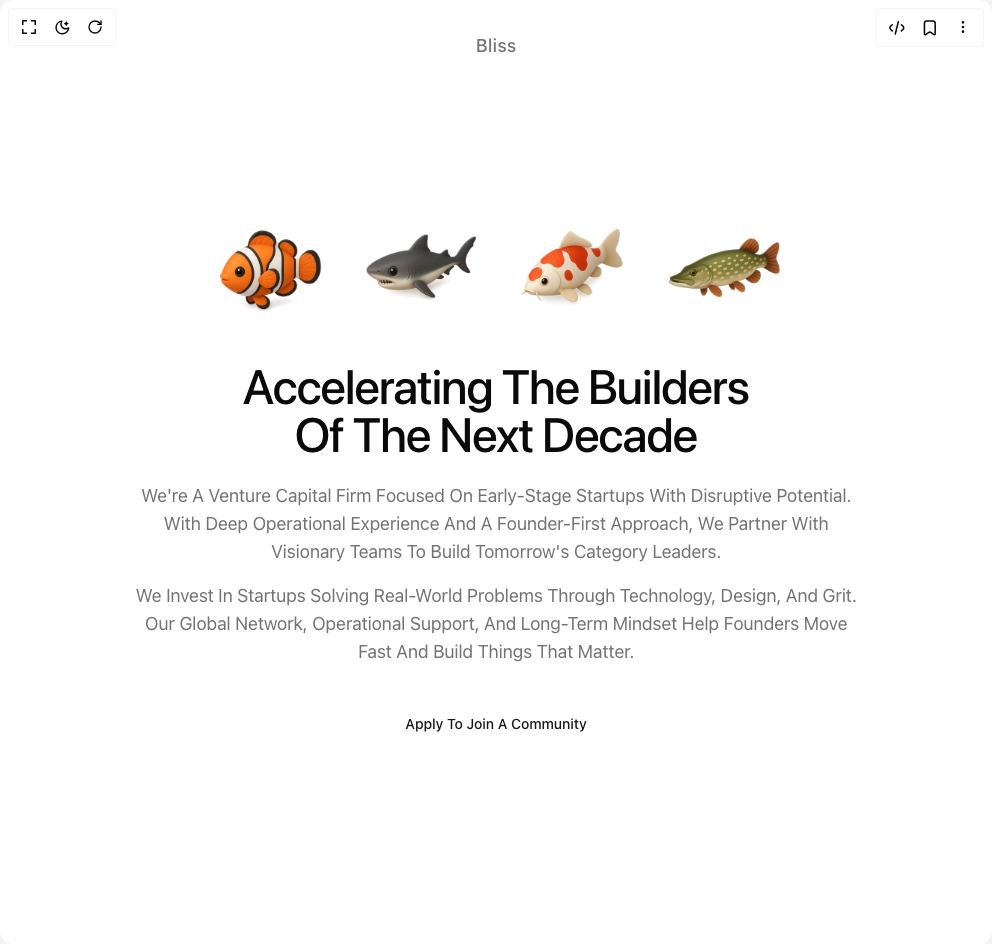

# Build Growth Hero Section in BuilderStudio

> Build this component in our Agentic IDE: [BuilderStudio](https://builderstudio.dev).
>
> Join the BuilderStudio community on [Discord](https://discord.gg/QdWeSGCqfe) and [Reddit](https://reddit.com/r/builderstudio).



## Component

- Author group: `lavikatiyar`
- Component: `growth-hero-section`
- Variant: `default`
- Rendered HTML snapshot: [`rendered.html`](rendered.html)

## BuilderStudio prompt

You are implementing a React component based on a component reference.

## Component identity

- Author: lavikatiyar
- Component slug: growth-hero-section
- Demo slug: default
- Title: growth-hero-section
- Description: 

## Goal

Recreate this component in a React + TypeScript + Tailwind CSS project. Preserve the visual layout, spacing, colors, border radius, shadows, interaction behavior, animation behavior, responsive behavior, and dark mode behavior shown in the rendered demo.

## Implementation requirements

- Use React and TypeScript.
- Use Tailwind CSS classes whenever possible.
- Keep the component self-contained unless the source files require helper components.
- If the source uses CSS variables, custom CSS, animations, or keyframes, include them.
- If the source uses external packages, list and use the required packages.
- Preserve accessibility attributes, button semantics, links, keyboard behavior, and ARIA attributes when visible in the source.
- Do not replace the component with a simplified placeholder.
- Return complete production-ready code.

## Dependencies

No reference metadata available.

## Rendered DOM snapshot

This is the rendered demo HTML extracted from the live preview. Use it to verify structure, class names, visible content, and layout.

```html
<div id="root"><div class="w-screen min-h-screen flex justify-center items-center"><div class="w-screen min-h-screen flex justify-center items-center"><div class="w-full bg-background"><section class="w-full bg-background text-foreground antialiased"><div class="container mx-auto flex min-h-screen flex-col items-center justify-center px-4 text-center"><div class="absolute top-8 text-lg font-medium tracking-wide text-muted-foreground" style="opacity: 1; transform: none;">Bliss</div><div class="mb-8 flex items-end justify-center space-x-4 sm:space-x-6 md:space-x-8" aria-label="Illustration of a plant growing in four stages" style="opacity: 1;"><div style="opacity: 1; transform: none;"></div><div style="opacity: 1; transform: none;"></div><div style="opacity: 1; transform: none;"></div><div style="opacity: 1; transform: none;"></div></div><h1 class="mb-6 max-w-3xl text-3xl font-medium tracking-tight text-foreground md:text-5xl" style="opacity: 1; transform: none;">Accelerating The Builders<br>Of The Next Decade</h1><div class="max-w-3xl space-y-4 text-base text-muted-foreground md:text-lg" style="opacity: 1; transform: none;"><p>We're A Venture Capital Firm Focused On Early-Stage Startups With Disruptive Potential. With Deep Operational Experience And A Founder-First Approach, We Partner With Visionary Teams To Build Tomorrow's Category Leaders.</p><p>We Invest In Startups Solving Real-World Problems Through Technology, Design, And Grit. Our Global Network, Operational Support, And Long-Term Mindset Help Founders Move Fast And Build Things That Matter.</p></div><a href="#" class="mt-12 text-sm font-medium text-primary underline-offset-4 transition-colors hover:text-primary/80 hover:underline" aria-label="Apply To Join A Community" style="opacity: 1; transform: none;">Apply To Join A Community</a></div></section></div></div></div></div>
```

## Reference source files

No reference source files were available.
