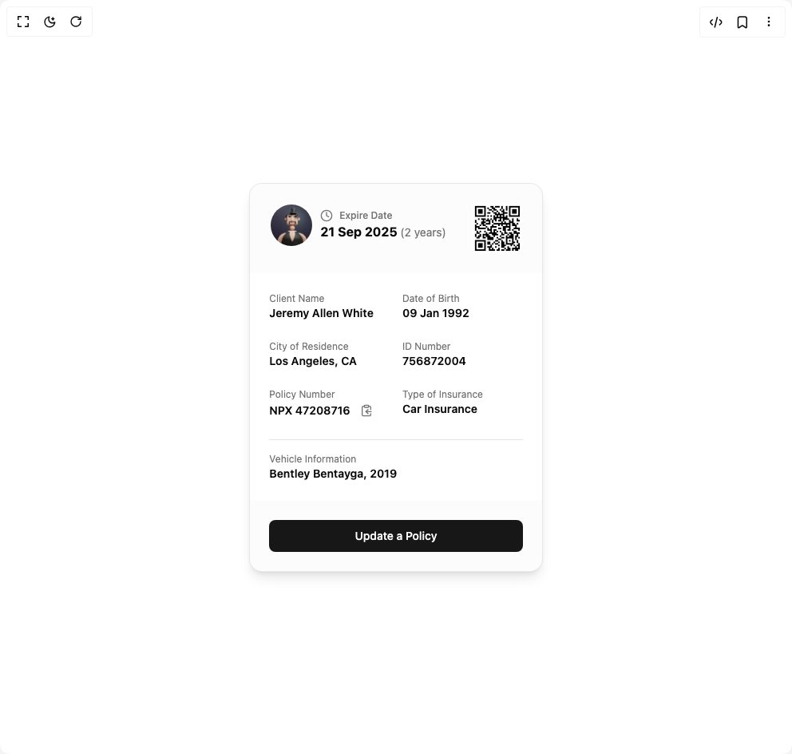

# Build Insurance Card in BuilderStudio

> Build this component in our Agentic IDE: [BuilderStudio](https://builderstudio.dev).
>
> Join the BuilderStudio community on [Discord](https://discord.gg/QdWeSGCqfe) and [Reddit](https://reddit.com/r/builderstudio).



## Component

- Author group: `lavikatiyar`
- Component: `insurance-card`
- Variant: `default`
- Rendered HTML snapshot: [`rendered.html`](rendered.html)

## BuilderStudio prompt

You are implementing a React component based on a component reference.

## Component identity

- Author: lavikatiyar
- Component slug: insurance-card
- Demo slug: default
- Title: insurance-card
- Description: 

## Goal

Recreate this component in a React + TypeScript + Tailwind CSS project. Preserve the visual layout, spacing, colors, border radius, shadows, interaction behavior, animation behavior, responsive behavior, and dark mode behavior shown in the rendered demo.

## Implementation requirements

- Use React and TypeScript.
- Use Tailwind CSS classes whenever possible.
- Keep the component self-contained unless the source files require helper components.
- If the source uses CSS variables, custom CSS, animations, or keyframes, include them.
- If the source uses external packages, list and use the required packages.
- Preserve accessibility attributes, button semantics, links, keyboard behavior, and ARIA attributes when visible in the source.
- Do not replace the component with a simplified placeholder.
- Return complete production-ready code.

## Dependencies

No reference metadata available.

## Rendered DOM snapshot

This is the rendered demo HTML extracted from the live preview. Use it to verify structure, class names, visible content, and layout.

```html
<div id="root"><div class="w-screen min-h-screen flex justify-center items-center"><div class="w-screen min-h-screen flex justify-center items-center"><div class="flex h-screen w-full items-center justify-center bg-background p-4"><div style="opacity: 1; transform: none;"><div class="border bg-card text-card-foreground w-full max-w-md rounded-2xl shadow-lg overflow-hidden border-primary/10"><div class="flex flex-col space-y-1.5 p-6 bg-muted/30"><div class="flex justify-between items-start gap-8"><div class="flex items-center gap-2"><span class="relative flex shrink-0 overflow-hidden rounded-full h-14 w-14 border-2 border-background"></span><div class="flex flex-col"><div class="flex items-center gap-2 text-muted-foreground"><svg xmlns="http://www.w3.org/2000/svg" width="24" height="24" viewBox="0 0 24 24" fill="none" stroke="currentColor" stroke-width="2" stroke-linecap="round" stroke-linejoin="round" class="lucide lucide-clock h-4 w-4" aria-hidden="true"><circle cx="12" cy="12" r="10"></circle><polyline points="12 6 12 12 16 14"></polyline></svg><span class="text-xs font-medium">Expire Date</span></div><p class="font-bold text-md text-foreground">21 Sep 2025 <span class="text-sm font-normal text-muted-foreground">(2 years)</span></p></div></div></div></div><div class="p-6 space-y-6"><div class="grid grid-cols-2 gap-x-4 gap-y-6"><div class="flex flex-col"><span class="text-xs text-muted-foreground">Client Name</span><div class="flex items-center gap-2"><span class="font-semibold text-sm text-card-foreground">Jeremy Allen White</span></div></div><div class="flex flex-col"><span class="text-xs text-muted-foreground">Date of Birth</span><div class="flex items-center gap-2"><span class="font-semibold text-sm text-card-foreground">09 Jan 1992</span></div></div><div class="flex flex-col"><span class="text-xs text-muted-foreground">City of Residence</span><div class="flex items-center gap-2"><span class="font-semibold text-sm text-card-foreground">Los Angeles, CA</span></div></div><div class="flex flex-col"><span class="text-xs text-muted-foreground">ID Number</span><div class="flex items-center gap-2"><span class="font-semibold text-sm text-card-foreground">756872004</span></div></div><div class="flex flex-col"><span class="text-xs text-muted-foreground">Policy Number</span><div class="flex items-center gap-2"><span class="font-semibold text-sm text-card-foreground">NPX 47208716</span><button class="inline-flex items-center justify-center whitespace-nowrap rounded-md text-sm font-medium ring-offset-background transition-colors focus-visible:outline-none focus-visible:ring-2 focus-visible:ring-ring focus-visible:ring-offset-2 disabled:pointer-events-none disabled:opacity-50 hover:bg-accent hover:text-accent-foreground h-6 w-6"><svg xmlns="http://www.w3.org/2000/svg" width="24" height="24" viewBox="0 0 24 24" fill="none" stroke="currentColor" stroke-width="2" stroke-linecap="round" stroke-linejoin="round" class="lucide lucide-clipboard-copy h-4 w-4 text-muted-foreground" aria-hidden="true"><rect width="8" height="4" x="8" y="2" rx="1" ry="1"></rect><path d="M8 4H6a2 2 0 0 0-2 2v14a2 2 0 0 0 2 2h12a2 2 0 0 0 2-2v-2"></path><path d="M16 4h2a2 2 0 0 1 2 2v4"></path><path d="M21 14H11"></path><path d="m15 10-4 4 4 4"></path></svg></button></div></div><div class="flex flex-col"><span class="text-xs text-muted-foreground">Type of Insurance</span><div class="flex items-center gap-2"><span class="font-semibold text-sm text-card-foreground">Car Insurance</span></div></div></div><div class="border-t border-border pt-4"><div class="flex flex-col"><span class="text-xs text-muted-foreground">Vehicle Information</span><div class="flex items-center gap-2"><span class="font-semibold text-sm text-card-foreground">Bentley Bentayga, 2019</span></div></div></div></div><div class="flex items-center p-6 bg-muted/30"><button class="inline-flex items-center justify-center whitespace-nowrap rounded-md text-sm font-medium ring-offset-background transition-colors focus-visible:outline-none focus-visible:ring-2 focus-visible:ring-ring focus-visible:ring-offset-2 disabled:pointer-events-none disabled:opacity-50 bg-primary text-primary-foreground hover:bg-primary/90 h-10 px-4 py-2 w-full">Update a Policy</button></div></div></div></div></div></div></div>
```

## Reference source files

No reference source files were available.
