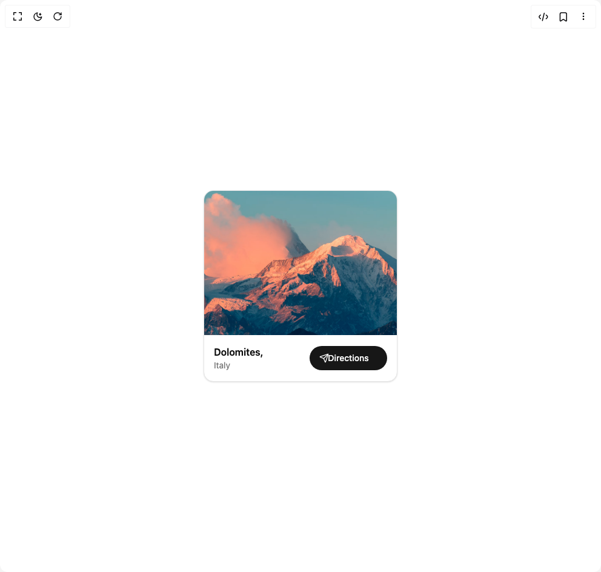

# Build Location Card in BuilderStudio

> Build this component in our Agentic IDE: [BuilderStudio](https://builderstudio.dev).
>
> Join the BuilderStudio community on [Discord](https://discord.gg/QdWeSGCqfe) and [Reddit](https://reddit.com/r/builderstudio).



## Component

- Author group: `lavikatiyar`
- Component: `location-card`
- Variant: `default`
- Rendered HTML snapshot: [`rendered.html`](rendered.html)

## BuilderStudio prompt

You are implementing a React component based on a component reference.

## Component identity

- Author: lavikatiyar
- Component slug: location-card
- Demo slug: default
- Title: location-card
- Description: 

## Goal

Recreate this component in a React + TypeScript + Tailwind CSS project. Preserve the visual layout, spacing, colors, border radius, shadows, interaction behavior, animation behavior, responsive behavior, and dark mode behavior shown in the rendered demo.

## Implementation requirements

- Use React and TypeScript.
- Use Tailwind CSS classes whenever possible.
- Keep the component self-contained unless the source files require helper components.
- If the source uses CSS variables, custom CSS, animations, or keyframes, include them.
- If the source uses external packages, list and use the required packages.
- Preserve accessibility attributes, button semantics, links, keyboard behavior, and ARIA attributes when visible in the source.
- Do not replace the component with a simplified placeholder.
- Return complete production-ready code.

## Dependencies

No reference metadata available.

## Rendered DOM snapshot

This is the rendered demo HTML extracted from the live preview. Use it to verify structure, class names, visible content, and layout.

```html
<div id="root"><div class="w-screen min-h-screen flex justify-center items-center"><div class="w-screen min-h-screen flex justify-center items-center"><div class="flex min-h-[400px] w-full items-center justify-center bg-background p-4"><div class="w-full max-w-xs overflow-hidden rounded-2xl border bg-card text-card-foreground shadow-sm" role="group" aria-labelledby="location-title" style="transform: none;"><div class="aspect-[4/3] overflow-hidden"></div><div class="flex items-center justify-between p-4"><div><h3 id="location-title" class="font-semibold text-card-foreground">Dolomites,</h3><p class="text-sm text-muted-foreground">Italy</p></div><a href="https://www.google.com/maps/place/Dolomites" target="_blank" rel="noopener noreferrer" class="relative flex h-10 w-32 items-center justify-center overflow-hidden rounded-full bg-primary text-sm font-medium text-primary-foreground" aria-label="Get directions to Dolomites" tabindex="0"><span class="absolute">Directions</span><span class="absolute left-4"><svg xmlns="http://www.w3.org/2000/svg" width="16" height="16" viewBox="0 0 24 24" fill="none" stroke="currentColor" stroke-width="2" stroke-linecap="round" stroke-linejoin="round" class="lucide lucide-send" aria-hidden="true"><path d="M14.536 21.686a.5.5 0 0 0 .937-.024l6.5-19a.496.496 0 0 0-.635-.635l-19 6.5a.5.5 0 0 0-.024.937l7.93 3.18a2 2 0 0 1 1.112 1.11z"></path><path d="m21.854 2.147-10.94 10.939"></path></svg></span></a></div></div></div></div></div></div>
```

## Reference source files

No reference source files were available.
