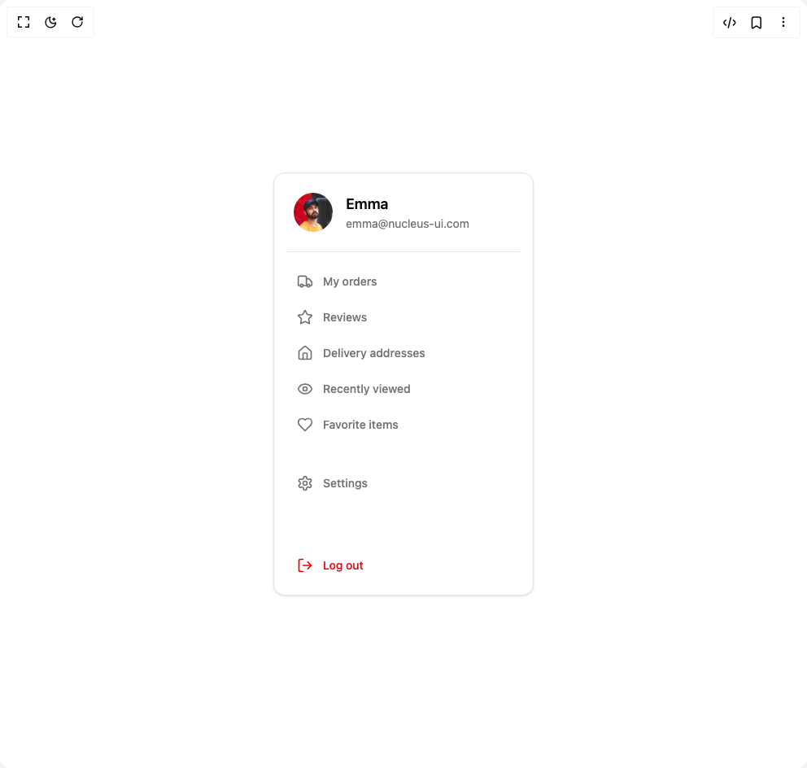

# Build Menu in BuilderStudio

> Build this component in our Agentic IDE: [BuilderStudio](https://builderstudio.dev).
>
> Join the BuilderStudio community on [Discord](https://discord.gg/QdWeSGCqfe) and [Reddit](https://reddit.com/r/builderstudio).



## Component

- Author group: `lavikatiyar`
- Component: `menu`
- Variant: `default`
- Rendered HTML snapshot: [`rendered.html`](rendered.html)

## BuilderStudio prompt

You are implementing a React component based on a component reference.

## Component identity

- Author: lavikatiyar
- Component slug: menu
- Demo slug: default
- Title: menu
- Description: 

## Goal

Recreate this component in a React + TypeScript + Tailwind CSS project. Preserve the visual layout, spacing, colors, border radius, shadows, interaction behavior, animation behavior, responsive behavior, and dark mode behavior shown in the rendered demo.

## Implementation requirements

- Use React and TypeScript.
- Use Tailwind CSS classes whenever possible.
- Keep the component self-contained unless the source files require helper components.
- If the source uses CSS variables, custom CSS, animations, or keyframes, include them.
- If the source uses external packages, list and use the required packages.
- Preserve accessibility attributes, button semantics, links, keyboard behavior, and ARIA attributes when visible in the source.
- Do not replace the component with a simplified placeholder.
- Return complete production-ready code.

## Dependencies

No reference metadata available.

## Rendered DOM snapshot

This is the rendered demo HTML extracted from the live preview. Use it to verify structure, class names, visible content, and layout.

```html
<div id="root"><div class="w-screen min-h-screen flex justify-center items-center"><div class="w-screen min-h-screen flex justify-center items-center"><div class="flex h-[600px] w-full items-center justify-center bg-background p-10"><aside class="flex h-full w-full max-w-xs flex-col rounded-xl border bg-card p-4 text-card-foreground shadow-sm" aria-label="User Profile Menu" style="opacity: 1;"><div class="flex items-center space-x-4 p-2" style="opacity: 1; transform: none;"><div class="flex flex-col truncate"><span class="font-semibold text-lg">Emma</span><span class="text-sm text-muted-foreground truncate">emma@nucleus-ui.com</span></div></div><div class="my-4 border-t border-border" style="opacity: 1; transform: none;"></div><nav class="flex-1 space-y-1" role="navigation"><a href="#orders" class="group flex items-center rounded-md px-3 py-2.5 text-sm font-medium text-muted-foreground transition-colors hover:bg-accent hover:text-accent-foreground" style="opacity: 1; transform: none;"><span class="mr-3 h-5 w-5"><svg xmlns="http://www.w3.org/2000/svg" width="24" height="24" viewBox="0 0 24 24" fill="none" stroke="currentColor" stroke-width="2" stroke-linecap="round" stroke-linejoin="round" class="lucide lucide-truck h-full w-full" aria-hidden="true"><path d="M14 18V6a2 2 0 0 0-2-2H4a2 2 0 0 0-2 2v11a1 1 0 0 0 1 1h2"></path><path d="M15 18H9"></path><path d="M19 18h2a1 1 0 0 0 1-1v-3.65a1 1 0 0 0-.22-.624l-3.48-4.35A1 1 0 0 0 17.52 8H14"></path><circle cx="17" cy="18" r="2"></circle><circle cx="7" cy="18" r="2"></circle></svg></span><span>My orders</span><svg xmlns="http://www.w3.org/2000/svg" width="24" height="24" viewBox="0 0 24 24" fill="none" stroke="currentColor" stroke-width="2" stroke-linecap="round" stroke-linejoin="round" class="lucide lucide-chevron-right ml-auto h-4 w-4 opacity-0 transition-opacity group-hover:opacity-100" aria-hidden="true"><path d="m9 18 6-6-6-6"></path></svg></a><a href="#reviews" class="group flex items-center rounded-md px-3 py-2.5 text-sm font-medium text-muted-foreground transition-colors hover:bg-accent hover:text-accent-foreground" style="opacity: 1; transform: none;"><span class="mr-3 h-5 w-5"><svg xmlns="http://www.w3.org/2000/svg" width="24" height="24" viewBox="0 0 24 24" fill="none" stroke="currentColor" stroke-width="2" stroke-linecap="round" stroke-linejoin="round" class="lucide lucide-star h-full w-full" aria-hidden="true"><path d="M11.525 2.295a.53.53 0 0 1 .95 0l2.31 4.679a2.123 2.123 0 0 0 1.595 1.16l5.166.756a.53.53 0 0 1 .294.904l-3.736 3.638a2.123 2.123 0 0 0-.611 1.878l.882 5.14a.53.53 0 0 1-.771.56l-4.618-2.428a2.122 2.122 0 0 0-1.973 0L6.396 21.01a.53.53 0 0 1-.77-.56l.881-5.139a2.122 2.122 0 0 0-.611-1.879L2.16 9.795a.53.53 0 0 1 .294-.906l5.165-.755a2.122 2.122 0 0 0 1.597-1.16z"></path></svg></span><span>Reviews</span><svg xmlns="http://www.w3.org/2000/svg" width="24" height="24" viewBox="0 0 24 24" fill="none" stroke="currentColor" stroke-width="2" stroke-linecap="round" stroke-linejoin="round" class="lucide lucide-chevron-right ml-auto h-4 w-4 opacity-0 transition-opacity group-hover:opacity-100" aria-hidden="true"><path d="m9 18 6-6-6-6"></path></svg></a><a href="#addresses" class="group flex items-center rounded-md px-3 py-2.5 text-sm font-medium text-muted-foreground transition-colors hover:bg-accent hover:text-accent-foreground" style="opacity: 1; transform: none;"><span class="mr-3 h-5 w-5"><svg xmlns="http://www.w3.org/2000/svg" width="24" height="24" viewBox="0 0 24 24" fill="none" stroke="currentColor" stroke-width="2" stroke-linecap="round" stroke-linejoin="round" class="lucide lucide-house h-full w-full" aria-hidden="true"><path d="M15 21v-8a1 1 0 0 0-1-1h-4a1 1 0 0 0-1 1v8"></path><path d="M3 10a2 2 0 0 1 .709-1.528l7-5.999a2 2 0 0 1 2.582 0l7 5.999A2 2 0 0 1 21 10v9a2 2 0 0 1-2 2H5a2 2 0 0 1-2-2z"></path></svg></span><span>Delivery addresses</span><svg xmlns="http://www.w3.org/2000/svg" width="24" height="24" viewBox="0 0 24 24" fill="none" stroke="currentColor" stroke-width="2" stroke-linecap="round" stroke-linejoin="round" class="lucide lucide-chevron-right ml-auto h-4 w-4 opacity-0 transition-opacity group-hover:opacity-100" aria-hidden="true"><path d="m9 18 6-6-6-6"></path></svg></a><a href="#viewed" class="group flex items-center rounded-md px-3 py-2.5 text-sm font-medium text-muted-foreground transition-colors hover:bg-accent hover:text-accent-foreground" style="opacity: 1; transform: none;"><span class="mr-3 h-5 w-5"><svg xmlns="http://www.w3.org/2000/svg" width="24" height="24" viewBox="0 0 24 24" fill="none" stroke="currentColor" stroke-width="2" stroke-linecap="round" stroke-linejoin="round" class="lucide lucide-eye h-full w-full" aria-hidden="true"><path d="M2.062 12.348a1 1 0 0 1 0-.696 10.75 10.75 0 0 1 19.876 0 1 1 0 0 1 0 .696 10.75 10.75 0 0 1-19.876 0"></path><circle cx="12" cy="12" r="3"></circle></svg></span><span>Recently viewed</span><svg xmlns="http://www.w3.org/2000/svg" width="24" height="24" viewBox="0 0 24 24" fill="none" stroke="currentColor" stroke-width="2" stroke-linecap="round" stroke-linejoin="round" class="lucide lucide-chevron-right ml-auto h-4 w-4 opacity-0 transition-opacity group-hover:opacity-100" aria-hidden="true"><path d="m9 18 6-6-6-6"></path></svg></a><a href="#favorites" class="group flex items-center rounded-md px-3 py-2.5 text-sm font-medium text-muted-foreground transition-colors hover:bg-accent hover:text-accent-foreground" style="opacity: 1; transform: none;"><span class="mr-3 h-5 w-5"><svg xmlns="http://www.w3.org/2000/svg" width="24" height="24" viewBox="0 0 24 24" fill="none" stroke="currentColor" stroke-width="2" stroke-linecap="round" stroke-linejoin="round" class="lucide lucide-heart h-full w-full" aria-hidden="true"><path d="M19 14c1.49-1.46 3-3.21 3-5.5A5.5 5.5 0 0 0 16.5 3c-1.76 0-3 .5-4.5 2-1.5-1.5-2.74-2-4.5-2A5.5 5.5 0 0 0 2 8.5c0 2.3 1.5 4.05 3 5.5l7 7Z"></path></svg></span><span>Favorite items</span><svg xmlns="http://www.w3.org/2000/svg" width="24" height="24" viewBox="0 0 24 24" fill="none" stroke="currentColor" stroke-width="2" stroke-linecap="round" stroke-linejoin="round" class="lucide lucide-chevron-right ml-auto h-4 w-4 opacity-0 transition-opacity group-hover:opacity-100" aria-hidden="true"><path d="m9 18 6-6-6-6"></path></svg></a><div class="h-6" style="opacity: 1; transform: none;"></div><a href="#settings" class="group flex items-center rounded-md px-3 py-2.5 text-sm font-medium text-muted-foreground transition-colors hover:bg-accent hover:text-accent-foreground" style="opacity: 1; transform: none;"><span class="mr-3 h-5 w-5"><svg xmlns="http://www.w3.org/2000/svg" width="24" height="24" viewBox="0 0 24 24" fill="none" stroke="currentColor" stroke-width="2" stroke-linecap="round" stroke-linejoin="round" class="lucide lucide-settings h-full w-full" aria-hidden="true"><path d="M12.22 2h-.44a2 2 0 0 0-2 2v.18a2 2 0 0 1-1 1.73l-.43.25a2 2 0 0 1-2 0l-.15-.08a2 2 0 0 0-2.73.73l-.22.38a2 2 0 0 0 .73 2.73l.15.1a2 2 0 0 1 1 1.72v.51a2 2 0 0 1-1 1.74l-.15.09a2 2 0 0 0-.73 2.73l.22.38a2 2 0 0 0 2.73.73l.15-.08a2 2 0 0 1 2 0l.43.25a2 2 0 0 1 1 1.73V20a2 2 0 0 0 2 2h.44a2 2 0 0 0 2-2v-.18a2 2 0 0 1 1-1.73l.43-.25a2 2 0 0 1 2 0l.15.08a2 2 0 0 0 2.73-.73l.22-.39a2 2 0 0 0-.73-2.73l-.15-.08a2 2 0 0 1-1-1.74v-.5a2 2 0 0 1 1-1.74l.15-.09a2 2 0 0 0 .73-2.73l-.22-.38a2 2 0 0 0-2.73-.73l-.15.08a2 2 0 0 1-2 0l-.43-.25a2 2 0 0 1-1-1.73V4a2 2 0 0 0-2-2z"></path><circle cx="12" cy="12" r="3"></circle></svg></span><span>Settings</span><svg xmlns="http://www.w3.org/2000/svg" width="24" height="24" viewBox="0 0 24 24" fill="none" stroke="currentColor" stroke-width="2" stroke-linecap="round" stroke-linejoin="round" class="lucide lucide-chevron-right ml-auto h-4 w-4 opacity-0 transition-opacity group-hover:opacity-100" aria-hidden="true"><path d="m9 18 6-6-6-6"></path></svg></a></nav><div class="mt-4" style="opacity: 1; transform: none;"><button class="group flex w-full items-center rounded-md px-3 py-2.5 text-sm font-medium text-destructive transition-colors hover:bg-destructive/10"><span class="mr-3 h-5 w-5"><svg xmlns="http://www.w3.org/2000/svg" width="24" height="24" viewBox="0 0 24 24" fill="none" stroke="currentColor" stroke-width="2" stroke-linecap="round" stroke-linejoin="round" class="lucide lucide-log-out h-full w-full" aria-hidden="true"><path d="M9 21H5a2 2 0 0 1-2-2V5a2 2 0 0 1 2-2h4"></path><polyline points="16 17 21 12 16 7"></polyline><line x1="21" x2="9" y1="12" y2="12"></line></svg></span><span>Log out</span></button></div></aside></div></div></div></div>
```

## Reference source files

No reference source files were available.
