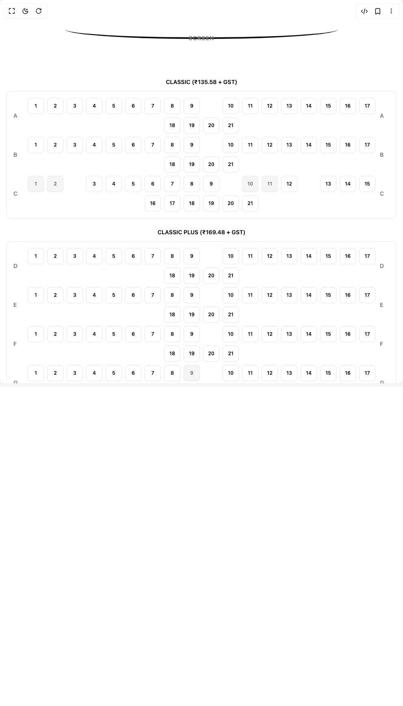

# Build Seat Selection in BuilderStudio

> Build this component in our Agentic IDE: [BuilderStudio](https://builderstudio.dev).
>
> Join the BuilderStudio community on [Discord](https://discord.gg/QdWeSGCqfe) and [Reddit](https://reddit.com/r/builderstudio).



## Component

- Author group: `lavikatiyar`
- Component: `seat-selection`
- Variant: `default`
- Rendered HTML snapshot: [`rendered.html`](rendered.html)

## BuilderStudio prompt

You are implementing a React component based on a component reference.

## Component identity

- Author: lavikatiyar
- Component slug: seat-selection
- Demo slug: default
- Title: seat-selection
- Description: 

## Goal

Recreate this component in a React + TypeScript + Tailwind CSS project. Preserve the visual layout, spacing, colors, border radius, shadows, interaction behavior, animation behavior, responsive behavior, and dark mode behavior shown in the rendered demo.

## Implementation requirements

- Use React and TypeScript.
- Use Tailwind CSS classes whenever possible.
- Keep the component self-contained unless the source files require helper components.
- If the source uses CSS variables, custom CSS, animations, or keyframes, include them.
- If the source uses external packages, list and use the required packages.
- Preserve accessibility attributes, button semantics, links, keyboard behavior, and ARIA attributes when visible in the source.
- Do not replace the component with a simplified placeholder.
- Return complete production-ready code.

## Dependencies

No reference metadata available.

## Rendered DOM snapshot

This is the rendered demo HTML extracted from the live preview. Use it to verify structure, class names, visible content, and layout.

```html
<div id="root"><div class="w-screen min-h-screen flex justify-center items-center"><div class="w-screen min-h-screen flex justify-center items-center"><div class="w-full max-w-5xl mx-auto flex flex-col items-center py-8"><div class="w-full flex flex-col items-center gap-12 p-4 bg-background"><div class="relative w-full flex justify-center items-center mb-12"><div class="h-12 w-full max-w-2xl border-b-4 border-foreground" style="border-bottom-left-radius: 50%; border-bottom-right-radius: 50%; box-shadow: 0px 15px 30px -5px hsl(var(--foreground) / 0.5); opacity: 1; transform: none;"></div><span class="absolute -bottom-2 text-sm font-medium tracking-widest text-muted-foreground" style="opacity: 1;">SCREEN</span></div><div class="w-full flex flex-col gap-6"><div class="flex flex-col items-center gap-3"><h3 class="text-sm font-semibold text-foreground">CLASSIC (₹135.58 + GST)</h3><div class="w-full bg-card p-2 sm:p-4 rounded-lg border flex flex-col gap-2"><div class="flex items-center justify-center gap-2" style="opacity: 1; transform: none;"><div class="w-6 text-sm font-medium text-muted-foreground select-none">A</div><div class="flex-1 flex justify-center items-center gap-1.5 sm:gap-2 flex-wrap"><button aria-label="Seat A1, available" aria-pressed="false" class="w-8 h-8 md:w-10 md:h-10 rounded-md border flex items-center justify-center text-xs font-semibold transition-all duration-300 ease-in-out focus:outline-none focus-visible:ring-2 focus-visible:ring-offset-2 focus-visible:ring-ring focus-visible:ring-offset-background bg-card text-card-foreground hover:bg-accent hover:border-primary cursor-pointer" tabindex="0" style="opacity: 1; transform: none;">1</button><button aria-label="Seat A2, available" aria-pressed="false" class="w-8 h-8 md:w-10 md:h-10 rounded-md border flex items-center justify-center text-xs font-semibold transition-all duration-300 ease-in-out focus:outline-none focus-visible:ring-2 focus-visible:ring-offset-2 focus-visible:ring-ring focus-visible:ring-offset-background bg-card text-card-foreground hover:bg-accent hover:border-primary cursor-pointer" tabindex="0" style="opacity: 1; transform: none;">2</button><button aria-label="Seat A3, available" aria-pressed="false" class="w-8 h-8 md:w-10 md:h-10 rounded-md border flex items-center justify-center text-xs font-semibold transition-all duration-300 ease-in-out focus:outline-none focus-visible:ring-2 focus-visible:ring-offset-2 focus-visible:ring-ring focus-visible:ring-offset-background bg-card text-card-foreground hover:bg-accent hover:border-primary cursor-pointer" tabindex="0" style="opacity: 1; transform: none;">3</button><button aria-label="Seat A4, available" aria-pressed="false" class="w-8 h-8 md:w-10 md:h-10 rounded-md border flex items-center justify-center text-xs font-semibold transition-all duration-300 ease-in-out focus:outline-none focus-visible:ring-2 focus-visible:ring-offset-2 focus-visible:ring-ring focus-visible:ring-offset-background bg-card text-card-foreground hover:bg-accent hover:border-primary cursor-pointer" tabindex="0" style="opacity: 1; transform: none;">4</button><button aria-label="Seat A5, available" aria-pressed="false" class="w-8 h-8 md:w-10 md:h-10 rounded-md border flex items-center justify-center text-xs font-semibold transition-all duration-300 ease-in-out focus:outline-none focus-visible:ring-2 focus-visible:ring-offset-2 focus-visible:ring-ring focus-visible:ring-offset-background bg-card text-card-foreground hover:bg-accent hover:border-primary cursor-pointer" tabindex="0" style="opacity: 1; transform: none;">5</button><button aria-label="Seat A6, available" aria-pressed="false" class="w-8 h-8 md:w-10 md:h-10 rounded-md border flex items-center justify-center text-xs font-semibold transition-all duration-300 ease-in-out focus:outline-none focus-visible:ring-2 focus-visible:ring-offset-2 focus-visible:ring-ring focus-visible:ring-offset-background bg-card text-card-foreground hover:bg-accent hover:border-primary cursor-pointer" tabindex="0" style="opacity: 1; transform: none;">6</button><button aria-label="Seat A7, available" aria-pressed="false" class="w-8 h-8 md:w-10 md:h-10 rounded-md border flex items-center justify-center text-xs font-semibold transition-all duration-300 ease-in-out focus:outline-none focus-visible:ring-2 focus-visible:ring-offset-2 focus-visible:ring-ring focus-visible:ring-offset-background bg-card text-card-foreground hover:bg-accent hover:border-primary cursor-pointer" tabindex="0" style="opacity: 1; transform: none;">7</button><button aria-label="Seat A8, available" aria-pressed="false" class="w-8 h-8 md:w-10 md:h-10 rounded-md border flex items-center justify-center text-xs font-semibold transition-all duration-300 ease-in-out focus:outline-none focus-visible:ring-2 focus-visible:ring-offset-2 focus-visible:ring-ring focus-visible:ring-offset-background bg-card text-card-foreground hover:bg-accent hover:border-primary cursor-pointer" tabindex="0" style="opacity: 1; transform: none;">8</button><button aria-label="Seat A9, available" aria-pressed="false" class="w-8 h-8 md:w-10 md:h-10 rounded-md border flex items-center justify-center text-xs font-semibold transition-all duration-300 ease-in-out focus:outline-none focus-visible:ring-2 focus-visible:ring-offset-2 focus-visible:ring-ring focus-visible:ring-offset-background bg-card text-card-foreground hover:bg-accent hover:border-primary cursor-pointer" tabindex="0" style="opacity: 1; transform: none;">9</button><div class="w-8 h-8 md:w-10 md:h-10" aria-hidden="true"></div><button aria-label="Seat A10, available" aria-pressed="false" class="w-8 h-8 md:w-10 md:h-10 rounded-md border flex items-center justify-center text-xs font-semibold transition-all duration-300 ease-in-out focus:outline-none focus-visible:ring-2 focus-visible:ring-offset-2 focus-visible:ring-ring focus-visible:ring-offset-background bg-card text-card-foreground hover:bg-accent hover:border-primary cursor-pointer" tabindex="0" style="opacity: 1; transform: none;">10</button><button aria-label="Seat A11, available" aria-pressed="false" class="w-8 h-8 md:w-10 md:h-10 rounded-md border flex items-center justify-center text-xs font-semibold transition-all duration-300 ease-in-out focus:outline-none focus-visible:ring-2 focus-visible:ring-offset-2 focus-visible:ring-ring focus-visible:ring-offset-background bg-card text-card-foreground hover:bg-accent hover:border-primary cursor-pointer" tabindex="0" style="opacity: 1; transform: none;">11</button><button aria-label="Seat A12, available" aria-pressed="false" class="w-8 h-8 md:w-10 md:h-10 rounded-md border flex items-center justify-center text-xs font-semibold transition-all duration-300 ease-in-out focus:outline-none focus-visible:ring-2 focus-visible:ring-offset-2 focus-visible:ring-ring focus-visible:ring-offset-background bg-card text-card-foreground hover:bg-accent hover:border-primary cursor-pointer" tabindex="0" style="opacity: 1; transform: none;">12</button><button aria-label="Seat A13, available" aria-pressed="false" class="w-8 h-8 md:w-10 md:h-10 rounded-md border flex items-center justify-center text-xs font-semibold transition-all duration-300 ease-in-out focus:outline-none focus-visible:ring-2 focus-visible:ring-offset-2 focus-visible:ring-ring focus-visible:ring-offset-background bg-card text-card-foreground hover:bg-accent hover:border-primary cursor-pointer" tabindex="0" style="opacity: 1; transform: none;">13</button><button aria-label="Seat A14, available" aria-pressed="false" class="w-8 h-8 md:w-10 md:h-10 rounded-md border flex items-center justify-center text-xs font-semibold transition-all duration-300 ease-in-out focus:outline-none focus-visible:ring-2 focus-visible:ring-offset-2 focus-visible:ring-ring focus-visible:ring-offset-background bg-card text-card-foreground hover:bg-accent hover:border-primary cursor-pointer" tabindex="0" style="opacity: 1; transform: none;">14</button><button aria-label="Seat A15, available" aria-pressed="false" class="w-8 h-8 md:w-10 md:h-10 rounded-md border flex items-center justify-center text-xs font-semibold transition-all duration-300 ease-in-out focus:outline-none focus-visible:ring-2 focus-visible:ring-offset-2 focus-visible:ring-ring focus-visible:ring-offset-background bg-card text-card-foreground hover:bg-accent hover:border-primary cursor-pointer" tabindex="0" style="opacity: 1; transform: none;">15</button><button aria-label="Seat A16, available" aria-pressed="false" class="w-8 h-8 md:w-10 md:h-10 rounded-md border flex items-center justify-center text-xs font-semibold transition-all duration-300 ease-in-out focus:outline-none focus-visible:ring-2 focus-visible:ring-offset-2 focus-visible:ring-ring focus-visible:ring-offset-background bg-card text-card-foreground hover:bg-accent hover:border-primary cursor-pointer" tabindex="0" style="opacity: 1; transform: none;">16</button><button aria-label="Seat A17, available" aria-pressed="false" class="w-8 h-8 md:w-10 md:h-10 rounded-md border flex items-center justify-center text-xs font-semibold transition-all duration-300 ease-in-out focus:outline-none focus-visible:ring-2 focus-visible:ring-offset-2 focus-visible:ring-ring focus-visible:ring-offset-background bg-card text-card-foreground hover:bg-accent hover:border-primary cursor-pointer" tabindex="0" style="opacity: 1; transform: none;">17</button><button aria-label="Seat A18, available" aria-pressed="false" class="w-8 h-8 md:w-10 md:h-10 rounded-md border flex items-center justify-center text-xs font-semibold transition-all duration-300 ease-in-out focus:outline-none focus-visible:ring-2 focus-visible:ring-offset-2 focus-visible:ring-ring focus-visible:ring-offset-background bg-card text-card-foreground hover:bg-accent hover:border-primary cursor-pointer" tabindex="0" style="opacity: 1; transform: none;">18</button><button aria-label="Seat A19, available" aria-pressed="false" class="w-8 h-8 md:w-10 md:h-10 rounded-md border flex items-center justify-center text-xs font-semibold transition-all duration-300 ease-in-out focus:outline-none focus-visible:ring-2 focus-visible:ring-offset-2 focus-visible:ring-ring focus-visible:ring-offset-background bg-card text-card-foreground hover:bg-accent hover:border-primary cursor-pointer" tabindex="0" style="opacity: 1; transform: none;">19</button><button aria-label="Seat A20, available" aria-pressed="false" class="w-8 h-8 md:w-10 md:h-10 rounded-md border flex items-center justify-center text-xs font-semibold transition-all duration-300 ease-in-out focus:outline-none focus-visible:ring-2 focus-visible:ring-offset-2 focus-visible:ring-ring focus-visible:ring-offset-background bg-card text-card-foreground hover:bg-accent hover:border-primary cursor-pointer" tabindex="0" style="opacity: 1; transform: none;">20</button><button aria-label="Seat A21, available" aria-pressed="false" class="w-8 h-8 md:w-10 md:h-10 rounded-md border flex items-center justify-center text-xs font-semibold transition-all duration-300 ease-in-out focus:outline-none focus-visible:ring-2 focus-visible:ring-offset-2 focus-visible:ring-ring focus-visible:ring-offset-background bg-card text-card-foreground hover:bg-accent hover:border-primary cursor-pointer" tabindex="0" style="opacity: 1; transform: none;">21</button></div><div class="w-6 text-sm font-medium text-muted-foreground select-none">A</div></div><div class="flex items-center justify-center gap-2" style="opacity: 1; transform: none;"><div class="w-6 text-sm font-medium text-muted-foreground select-none">B</div><div class="flex-1 flex justify-center items-center gap-1.5 sm:gap-2 flex-wrap"><button aria-label="Seat B1, available" aria-pressed="false" class="w-8 h-8 md:w-10 md:h-10 rounded-md border flex items-center justify-center text-xs font-semibold transition-all duration-300 ease-in-out focus:outline-none focus-visible:ring-2 focus-visible:ring-offset-2 focus-visible:ring-ring focus-visible:ring-offset-background bg-card text-card-foreground hover:bg-accent hover:border-primary cursor-pointer" tabindex="0" style="opacity: 1; transform: none;">1</button><button aria-label="Seat B2, available" aria-pressed="false" class="w-8 h-8 md:w-10 md:h-10 rounded-md border flex items-center justify-center text-xs font-semibold transition-all duration-300 ease-in-out focus:outline-none focus-visible:ring-2 focus-visible:ring-offset-2 focus-visible:ring-ring focus-visible:ring-offset-background bg-card text-card-foreground hover:bg-accent hover:border-primary cursor-pointer" tabindex="0" style="opacity: 1; transform: none;">2</button><button aria-label="Seat B3, available" aria-pressed="false" class="w-8 h-8 md:w-10 md:h-10 rounded-md border flex items-center justify-center text-xs font-semibold transition-all duration-300 ease-in-out focus:outline-none focus-visible:ring-2 focus-visible:ring-offset-2 focus-visible:ring-ring focus-visible:ring-offset-background bg-card text-card-foreground hover:bg-accent hover:border-primary cursor-pointer" tabindex="0" style="opacity: 1; transform: none;">3</button><button aria-label="Seat B4, available" aria-pressed="false" class="w-8 h-8 md:w-10 md:h-10 rounded-md border flex items-center justify-center text-xs font-semibold transition-all duration-300 ease-in-out focus:outline-none focus-visible:ring-2 focus-visible:ring-offset-2 focus-visible:ring-ring focus-visible:ring-offset-background bg-card text-card-foreground hover:bg-accent hover:border-primary cursor-pointer" tabindex="0" style="opacity: 1; transform: none;">4</button><button aria-label="Seat B5, available" aria-pressed="false" class="w-8 h-8 md:w-10 md:h-10 rounded-md border flex items-center justify-center text-xs font-semibold transition-all duration-300 ease-in-out focus:outline-none focus-visible:ring-2 focus-visible:ring-offset-2 focus-visible:ring-ring focus-visible:ring-offset-background bg-card text-card-foreground hover:bg-accent hover:border-primary cursor-pointer" tabindex="0" style="opacity: 1; transform: none;">5</button><button aria-label="Seat B6, available" aria-pressed="false" class="w-8 h-8 md:w-10 md:h-10 rounded-md border flex items-center justify-center text-xs font-semibold transition-all duration-300 ease-in-out focus:outline-none focus-visible:ring-2 focus-visible:ring-offset-2 focus-visible:ring-ring focus-visible:ring-offset-background bg-card text-card-foreground hover:bg-accent hover:border-primary cursor-pointer" tabindex="0" style="opacity: 1; transform: none;">6</button><button aria-label="Seat B7, available" aria-pressed="false" class="w-8 h-8 md:w-10 md:h-10 rounded-md border flex items-center justify-center text-xs font-semibold transition-all duration-300 ease-in-out focus:outline-none focus-visible:ring-2 focus-visible:ring-offset-2 focus-visible:ring-ring focus-visible:ring-offset-background bg-card text-card-foreground hover:bg-accent hover:border-primary cursor-pointer" tabindex="0" style="opacity: 1; transform: none;">7</button><button aria-label="Seat B8, available" aria-pressed="false" class="w-8 h-8 md:w-10 md:h-10 rounded-md border flex items-center justify-center text-xs font-semibold transition-all duration-300 ease-in-out focus:outline-none focus-visible:ring-2 focus-visible:ring-offset-2 focus-visible:ring-ring focus-visible:ring-offset-background bg-card text-card-foreground hover:bg-accent hover:border-primary cursor-pointer" tabindex="0" style="opacity: 1; transform: none;">8</button><button aria-label="Seat B9, available" aria-pressed="false" class="w-8 h-8 md:w-10 md:h-10 rounded-md border flex items-center justify-center text-xs font-semibold transition-all duration-300 ease-in-out focus:outline-none focus-visible:ring-2 focus-visible:ring-offset-2 focus-visible:ring-ring focus-visible:ring-offset-background bg-card text-card-foreground hover:bg-accent hover:border-primary cursor-pointer" tabindex="0" style="opacity: 1; transform: none;">9</button><div class="w-8 h-8 md:w-10 md:h-10" aria-hidden="true"></div><button aria-label="Seat B10, available" aria-pressed="false" class="w-8 h-8 md:w-10 md:h-10 rounded-md border flex items-center justify-center text-xs font-semibold transition-all duration-300 ease-in-out focus:outline-none focus-visible:ring-2 focus-visible:ring-offset-2 focus-visible:ring-ring focus-visible:ring-offset-background bg-card text-card-foreground hover:bg-accent hover:border-primary cursor-pointer" tabindex="0" style="opacity: 1; transform: none;">10</button><button aria-label="Seat B11, available" aria-pressed="false" class="w-8 h-8 md:w-10 md:h-10 rounded-md border flex items-center justify-center text-xs font-semibold transition-all duration-300 ease-in-out focus:outline-none focus-visible:ring-2 focus-visible:ring-offset-2 focus-visible:ring-ring focus-visible:ring-offset-background bg-card text-card-foreground hover:bg-accent hover:border-primary cursor-pointer" tabindex="0" style="opacity: 1; transform: none;">11</button><button aria-label="Seat B12, available" aria-pressed="false" class="w-8 h-8 md:w-10 md:h-10 rounded-md border flex items-center justify-center text-xs font-semibold transition-all duration-300 ease-in-out focus:outline-none focus-visible:ring-2 focus-visible:ring-offset-2 focus-visible:ring-ring focus-visible:ring-offset-background bg-card text-card-foreground hover:bg-accent hover:border-primary cursor-pointer" tabindex="0" style="opacity: 1; transform: none;">12</button><button aria-label="Seat B13, available" aria-pressed="false" class="w-8 h-8 md:w-10 md:h-10 rounded-md border flex items-center justify-center text-xs font-semibold transition-all duration-300 ease-in-out focus:outline-none focus-visible:ring-2 focus-visible:ring-offset-2 focus-visible:ring-ring focus-visible:ring-offset-background bg-card text-card-foreground hover:bg-accent hover:border-primary cursor-pointer" tabindex="0" style="opacity: 1; transform: none;">13</button><button aria-label="Seat B14, available" aria-pressed="false" class="w-8 h-8 md:w-10 md:h-10 rounded-md border flex items-center justify-center text-xs font-semibold transition-all duration-300 ease-in-out focus:outline-none focus-visible:ring-2 focus-visible:ring-offset-2 focus-visible:ring-ring focus-visible:ring-offset-background bg-card text-card-foreground hover:bg-accent hover:border-primary cursor-pointer" tabindex="0" style="opacity: 1; transform: none;">14</button><button aria-label="Seat B15, available" aria-pressed="false" class="w-8 h-8 md:w-10 md:h-10 rounded-md border flex items-center justify-center text-xs font-semibold transition-all duration-300 ease-in-out focus:outline-none focus-visible:ring-2 focus-visible:ring-offset-2 focus-visible:ring-ring focus-visible:ring-offset-background bg-card text-card-foreground hover:bg-accent hover:border-primary cursor-pointer" tabindex="0" style="opacity: 1; transform: none;">15</button><button aria-label="Seat B16, available" aria-pressed="false" class="w-8 h-8 md:w-10 md:h-10 rounded-md border flex items-center justify-center text-xs font-semibold transition-all duration-300 ease-in-out focus:outline-none focus-visible:ring-2 focus-visible:ring-offset-2 focus-visible:ring-ring focus-visible:ring-offset-background bg-card text-card-foreground hover:bg-accent hover:border-primary cursor-pointer" tabindex="0" style="opacity: 1; transform: none;">16</button><button aria-label="Seat B17, available" aria-pressed="false" class="w-8 h-8 md:w-10 md:h-10 rounded-md border flex items-center justify-center text-xs font-semibold transition-all duration-300 ease-in-out focus:outline-none focus-visible:ring-2 focus-visible:ring-offset-2 focus-visible:ring-ring focus-visible:ring-offset-background bg-card text-card-foreground hover:bg-accent hover:border-primary cursor-pointer" tabindex="0" style="opacity: 1; transform: none;">17</button><button aria-label="Seat B18, available" aria-pressed="false" class="w-8 h-8 md:w-10 md:h-10 rounded-md border flex items-center justify-center text-xs font-semibold transition-all duration-300 ease-in-out focus:outline-none focus-visible:ring-2 focus-visible:ring-offset-2 focus-visible:ring-ring focus-visible:ring-offset-background bg-card text-card-foreground hover:bg-accent hover:border-primary cursor-pointer" tabindex="0" style="opacity: 1; transform: none;">18</button><button aria-label="Seat B19, available" aria-pressed="false" class="w-8 h-8 md:w-10 md:h-10 rounded-md border flex items-center justify-center text-xs font-semibold transition-all duration-300 ease-in-out focus:outline-none focus-visible:ring-2 focus-visible:ring-offset-2 focus-visible:ring-ring focus-visible:ring-offset-background bg-card text-card-foreground hover:bg-accent hover:border-primary cursor-pointer" tabindex="0" style="opacity: 1; transform: none;">19</button><button aria-label="Seat B20, available" aria-pressed="false" class="w-8 h-8 md:w-10 md:h-10 rounded-md border flex items-center justify-center text-xs font-semibold transition-all duration-300 ease-in-out focus:outline-none focus-visible:ring-2 focus-visible:ring-offset-2 focus-visible:ring-ring focus-visible:ring-offset-background bg-card text-card-foreground hover:bg-accent hover:border-primary cursor-pointer" tabindex="0" style="opacity: 1; transform: none;">20</button><button aria-label="Seat B21, available" aria-pressed="false" class="w-8 h-8 md:w-10 md:h-10 rounded-md border flex items-center justify-center text-xs font-semibold transition-all duration-300 ease-in-out focus:outline-none focus-visible:ring-2 focus-visible:ring-offset-2 focus-visible:ring-ring focus-visible:ring-offset-background bg-card text-card-foreground hover:bg-accent hover:border-primary cursor-pointer" tabindex="0" style="opacity: 1; transform: none;">21</button></div><div class="w-6 text-sm font-medium text-muted-foreground select-none">B</div></div><div class="flex items-center justify-center gap-2" style="opacity: 1; transform: none;"><div class="w-6 text-sm font-medium text-muted-foreground select-none">C</div><div class="flex-1 flex justify-center items-center gap-1.5 sm:gap-2 flex-wrap"><button disabled="" aria-label="Seat C1, occupied" aria-pressed="false" class="w-8 h-8 md:w-10 md:h-10 rounded-md border flex items-center justify-center text-xs font-semibold transition-all duration-300 ease-in-out focus:outline-none focus-visible:ring-2 focus-visible:ring-offset-2 focus-visible:ring-ring focus-visible:ring-offset-background bg-muted text-muted-foreground border-border cursor-not-allowed opacity-50" tabindex="0" style="opacity: 1; transform: none;">1</button><button disabled="" aria-label="Seat C2, occupied" aria-pressed="false" class="w-8 h-8 md:w-10 md:h-10 rounded-md border flex items-center justify-center text-xs font-semibold transition-all duration-300 ease-in-out focus:outline-none focus-visible:ring-2 focus-visible:ring-offset-2 focus-visible:ring-ring focus-visible:ring-offset-background bg-muted text-muted-foreground border-border cursor-not-allowed opacity-50" tabindex="0" style="opacity: 1; transform: none;">2</button><div class="w-8 h-8 md:w-10 md:h-10" aria-hidden="true"></div><button aria-label="Seat C3, available" aria-pressed="false" class="w-8 h-8 md:w-10 md:h-10 rounded-md border flex items-center justify-center text-xs font-semibold transition-all duration-300 ease-in-out focus:outline-none focus-visible:ring-2 focus-visible:ring-offset-2 focus-visible:ring-ring focus-visible:ring-offset-background bg-card text-card-foreground hover:bg-accent hover:border-primary cursor-pointer" tabindex="0" style="opacity: 1; transform: none;">3</button><button aria-label="Seat C4, available" aria-pressed="false" class="w-8 h-8 md:w-10 md:h-10 rounded-md border flex items-center justify-center text-xs font-semibold transition-all duration-300 ease-in-out focus:outline-none focus-visible:ring-2 focus-visible:ring-offset-2 focus-visible:ring-ring focus-visible:ring-offset-background bg-card text-card-foreground hover:bg-accent hover:border-primary cursor-pointer" tabindex="0" style="opacity: 1; transform: none;">4</button><button aria-label="Seat C5, available" aria-pressed="false" class="w-8 h-8 md:w-10 md:h-10 rounded-md border flex items-center justify-center text-xs font-semibold transition-all duration-300 ease-in-out focus:outline-none focus-visible:ring-2 focus-visible:ring-offset-2 focus-visible:ring-ring focus-visible:ring-offset-background bg-card text-card-foreground hover:bg-accent hover:border-primary cursor-pointer" tabindex="0" style="opacity: 1; transform: none;">5</button><button aria-label="Seat C6, available" aria-pressed="false" class="w-8 h-8 md:w-10 md:h-10 rounded-md border flex items-center justify-center text-xs font-semibold transition-all duration-300 ease-in-out focus:outline-none focus-visible:ring-2 focus-visible:ring-offset-2 focus-visible:ring-ring focus-visible:ring-offset-background bg-card text-card-foreground hover:bg-accent hover:border-primary cursor-pointer" tabindex="0" style="opacity: 1; transform: none;">6</button><button aria-label="Seat C7, available" aria-pressed="false" class="w-8 h-8 md:w-10 md:h-10 rounded-md border flex items-center justify-center text-xs font-semibold transition-all duration-300 ease-in-out focus:outline-none focus-visible:ring-2 focus-visible:ring-offset-2 focus-visible:ring-ring focus-visible:ring-offset-background bg-card text-card-foreground hover:bg-accent hover:border-primary cursor-pointer" tabindex="0" style="opacity: 1; transform: none;">7</button><button aria-label="Seat C8, available" aria-pressed="false" class="w-8 h-8 md:w-10 md:h-10 rounded-md border flex items-center justify-center text-xs font-semibold transition-all duration-300 ease-in-out focus:outline-none focus-visible:ring-2 focus-visible:ring-offset-2 focus-visible:ring-ring focus-visible:ring-offset-background bg-card text-card-foreground hover:bg-accent hover:border-primary cursor-pointer" tabindex="0" style="opacity: 1; transform: none;">8</button><button aria-label="Seat C9, available" aria-pressed="false" class="w-8 h-8 md:w-10 md:h-10 rounded-md border flex items-center justify-center text-xs font-semibold transition-all duration-300 ease-in-out focus:outline-none focus-visible:ring-2 focus-visible:ring-offset-2 focus-visible:ring-ring focus-visible:ring-offset-background bg-card text-card-foreground hover:bg-accent hover:border-primary cursor-pointer" tabindex="0" style="opacity: 1; transform: none;">9</button><div class="w-8 h-8 md:w-10 md:h-10" aria-hidden="true"></div><button disabled="" aria-label="Seat C10, occupied" aria-pressed="false" class="w-8 h-8 md:w-10 md:h-10 rounded-md border flex items-center justify-center text-xs font-semibold transition-all duration-300 ease-in-out focus:outline-none focus-visible:ring-2 focus-visible:ring-offset-2 focus-visible:ring-ring focus-visible:ring-offset-background bg-muted text-muted-foreground border-border cursor-not-allowed opacity-50" tabindex="0" style="opacity: 1; transform: none;">10</button><button disabled="" aria-label="Seat C11, occupied" aria-pressed="false" class="w-8 h-8 md:w-10 md:h-10 rounded-md border flex items-center justify-center text-xs font-semibold transition-all duration-300 ease-in-out focus:outline-none focus-visible:ring-2 focus-visible:ring-offset-2 focus-visible:ring-ring focus-visible:ring-offset-background bg-muted text-muted-foreground border-border cursor-not-allowed opacity-50" tabindex="0" style="opacity: 1; transform: none;">11</button><button aria-label="Seat C12, available" aria-pressed="false" class="w-8 h-8 md:w-10 md:h-10 rounded-md border flex items-center justify-center text-xs font-semibold transition-all duration-300 ease-in-out focus:outline-none focus-visible:ring-2 focus-visible:ring-offset-2 focus-visible:ring-ring focus-visible:ring-offset-background bg-card text-card-foreground hover:bg-accent hover:border-primary cursor-pointer" tabindex="0" style="opacity: 1; transform: none;">12</button><div class="w-8 h-8 md:w-10 md:h-10" aria-hidden="true"></div><button aria-label="Seat C13, available" aria-pressed="false" class="w-8 h-8 md:w-10 md:h-10 rounded-md border flex items-center justify-center text-xs font-semibold transition-all duration-300 ease-in-out focus:outline-none focus-visible:ring-2 focus-visible:ring-offset-2 focus-visible:ring-ring focus-visible:ring-offset-background bg-card text-card-foreground hover:bg-accent hover:border-primary cursor-pointer" tabindex="0" style="opacity: 1; transform: none;">13</button><button aria-label="Seat C14, available" aria-pressed="false" class="w-8 h-8 md:w-10 md:h-10 rounded-md border flex items-center justify-center text-xs font-semibold transition-all duration-300 ease-in-out focus:outline-none focus-visible:ring-2 focus-visible:ring-offset-2 focus-visible:ring-ring focus-visible:ring-offset-background bg-card text-card-foreground hover:bg-accent hover:border-primary cursor-pointer" tabindex="0" style="opacity: 1; transform: none;">14</button><button aria-label="Seat C15, available" aria-pressed="false" class="w-8 h-8 md:w-10 md:h-10 rounded-md border flex items-center justify-center text-xs font-semibold transition-all duration-300 ease-in-out focus:outline-none focus-visible:ring-2 focus-visible:ring-offset-2 focus-visible:ring-ring focus-visible:ring-offset-background bg-card text-card-foreground hover:bg-accent hover:border-primary cursor-pointer" tabindex="0" style="opacity: 1; transform: none;">15</button><button aria-label="Seat C16, available" aria-pressed="false" class="w-8 h-8 md:w-10 md:h-10 rounded-md border flex items-center justify-center text-xs font-semibold transition-all duration-300 ease-in-out focus:outline-none focus-visible:ring-2 focus-visible:ring-offset-2 focus-visible:ring-ring focus-visible:ring-offset-background bg-card text-card-foreground hover:bg-accent hover:border-primary cursor-pointer" tabindex="0" style="opacity: 1; transform: none;">16</button><button aria-label="Seat C17, available" aria-pressed="false" class="w-8 h-8 md:w-10 md:h-10 rounded-md border flex items-center justify-center text-xs font-semibold transition-all duration-300 ease-in-out focus:outline-none focus-visible:ring-2 focus-visible:ring-offset-2 focus-visible:ring-ring focus-visible:ring-offset-background bg-card text-card-foreground hover:bg-accent hover:border-primary cursor-pointer" tabindex="0" style="opacity: 1; transform: none;">17</button><button aria-label="Seat C18, available" aria-pressed="false" class="w-8 h-8 md:w-10 md:h-10 rounded-md border flex items-center justify-center text-xs font-semibold transition-all duration-300 ease-in-out focus:outline-none focus-visible:ring-2 focus-visible:ring-offset-2 focus-visible:ring-ring focus-visible:ring-offset-background bg-card text-card-foreground hover:bg-accent hover:border-primary cursor-pointer" tabindex="0" style="opacity: 1; transform: none;">18</button><button aria-label="Seat C19, available" aria-pressed="false" class="w-8 h-8 md:w-10 md:h-10 rounded-md border flex items-center justify-center text-xs font-semibold transition-all duration-300 ease-in-out focus:outline-none focus-visible:ring-2 focus-visible:ring-offset-2 focus-visible:ring-ring focus-visible:ring-offset-background bg-card text-card-foreground hover:bg-accent hover:border-primary cursor-pointer" tabindex="0" style="opacity: 1; transform: none;">19</button><button aria-label="Seat C20, available" aria-pressed="false" class="w-8 h-8 md:w-10 md:h-10 rounded-md border flex items-center justify-center text-xs font-semibold transition-all duration-300 ease-in-out focus:outline-none focus-visible:ring-2 focus-visible:ring-offset-2 focus-visible:ring-ring focus-visible:ring-offset-background bg-card text-card-foreground hover:bg-accent hover:border-primary cursor-pointer" tabindex="0" style="opacity: 1; transform: none;">20</button><button aria-label="Seat C21, available" aria-pressed="false" class="w-8 h-8 md:w-10 md:h-10 rounded-md border flex items-center justify-center text-xs font-semibold transition-all duration-300 ease-in-out focus:outline-none focus-visible:ring-2 focus-visible:ring-offset-2 focus-visible:ring-ring focus-visible:ring-offset-background bg-card text-card-foreground hover:bg-accent hover:border-primary cursor-pointer" tabindex="0" style="opacity: 1; transform: none;">21</button></div><div class="w-6 text-sm font-medium text-muted-foreground select-none">C</div></div></div></div><div class="flex flex-col items-center gap-3"><h3 class="text-sm font-semibold text-foreground">CLASSIC PLUS (₹169.48 + GST)</h3><div class="w-full bg-card p-2 sm:p-4 rounded-lg border flex flex-col gap-2"><div class="flex items-center justify-center gap-2" style="opacity: 1; transform: none;"><div class="w-6 text-sm font-medium text-muted-foreground select-none">D</div><div class="flex-1 flex justify-center items-center gap-1.5 sm:gap-2 flex-wrap"><button aria-label="Seat D1, available" aria-pressed="false" class="w-8 h-8 md:w-10 md:h-10 rounded-md border flex items-center justify-center text-xs font-semibold transition-all duration-300 ease-in-out focus:outline-none focus-visible:ring-2 focus-visible:ring-offset-2 focus-visible:ring-ring focus-visible:ring-offset-background bg-card text-card-foreground hover:bg-accent hover:border-primary cursor-pointer" tabindex="0" style="opacity: 1; transform: none;">1</button><button aria-label="Seat D2, available" aria-pressed="false" class="w-8 h-8 md:w-10 md:h-10 rounded-md border flex items-center justify-center text-xs font-semibold transition-all duration-300 ease-in-out focus:outline-none focus-visible:ring-2 focus-visible:ring-offset-2 focus-visible:ring-ring focus-visible:ring-offset-background bg-card text-card-foreground hover:bg-accent hover:border-primary cursor-pointer" tabindex="0" style="opacity: 1; transform: none;">2</button><button aria-label="Seat D3, available" aria-pressed="false" class="w-8 h-8 md:w-10 md:h-10 rounded-md border flex items-center justify-center text-xs font-semibold transition-all duration-300 ease-in-out focus:outline-none focus-visible:ring-2 focus-visible:ring-offset-2 focus-visible:ring-ring focus-visible:ring-offset-background bg-card text-card-foreground hover:bg-accent hover:border-primary cursor-pointer" tabindex="0" style="opacity: 1; transform: none;">3</button><button aria-label="Seat D4, available" aria-pressed="false" class="w-8 h-8 md:w-10 md:h-10 rounded-md border flex items-center justify-center text-xs font-semibold transition-all duration-300 ease-in-out focus:outline-none focus-visible:ring-2 focus-visible:ring-offset-2 focus-visible:ring-ring focus-visible:ring-offset-background bg-card text-card-foreground hover:bg-accent hover:border-primary cursor-pointer" tabindex="0" style="opacity: 1; transform: none;">4</button><button aria-label="Seat D5, available" aria-pressed="false" class="w-8 h-8 md:w-10 md:h-10 rounded-md border flex items-center justify-center text-xs font-semibold transition-all duration-300 ease-in-out focus:outline-none focus-visible:ring-2 focus-visible:ring-offset-2 focus-visible:ring-ring focus-visible:ring-offset-background bg-card text-card-foreground hover:bg-accent hover:border-primary cursor-pointer" tabindex="0" style="opacity: 1; transform: none;">5</button><button aria-label="Seat D6, available" aria-pressed="false" class="w-8 h-8 md:w-10 md:h-10 rounded-md border flex items-center justify-center text-xs font-semibold transition-all duration-300 ease-in-out focus:outline-none focus-visible:ring-2 focus-visible:ring-offset-2 focus-visible:ring-ring focus-visible:ring-offset-background bg-card text-card-foreground hover:bg-accent hover:border-primary cursor-pointer" tabindex="0" style="opacity: 1; transform: none;">6</button><button aria-label="Seat D7, available" aria-pressed="false" class="w-8 h-8 md:w-10 md:h-10 rounded-md border flex items-center justify-center text-xs font-semibold transition-all duration-300 ease-in-out focus:outline-none focus-visible:ring-2 focus-visible:ring-offset-2 focus-visible:ring-ring focus-visible:ring-offset-background bg-card text-card-foreground hover:bg-accent hover:border-primary cursor-pointer" tabindex="0" style="opacity: 1; transform: none;">7</button><button aria-label="Seat D8, available" aria-pressed="false" class="w-8 h-8 md:w-10 md:h-10 rounded-md border flex items-center justify-center text-xs font-semibold transition-all duration-300 ease-in-out focus:outline-none focus-visible:ring-2 focus-visible:ring-offset-2 focus-visible:ring-ring focus-visible:ring-offset-background bg-card text-card-foreground hover:bg-accent hover:border-primary cursor-pointer" tabindex="0" style="opacity: 1; transform: none;">8</button><button aria-label="Seat D9, available" aria-pressed="false" class="w-8 h-8 md:w-10 md:h-10 rounded-md border flex items-center justify-center text-xs font-semibold transition-all duration-300 ease-in-out focus:outline-none focus-visible:ring-2 focus-visible:ring-offset-2 focus-visible:ring-ring focus-visible:ring-offset-background bg-card text-card-foreground hover:bg-accent hover:border-primary cursor-pointer" tabindex="0" style="opacity: 1; transform: none;">9</button><div class="w-8 h-8 md:w-10 md:h-10" aria-hidden="true"></div><button aria-label="Seat D10, available" aria-pressed="false" class="w-8 h-8 md:w-10 md:h-10 rounded-md border flex items-center justify-center text-xs font-semibold transition-all duration-300 ease-in-out focus:outline-none focus-visible:ring-2 focus-visible:ring-offset-2 focus-visible:ring-ring focus-visible:ring-offset-background bg-card text-card-foreground hover:bg-accent hover:border-primary cursor-pointer" tabindex="0" style="opacity: 1; transform: none;">10</button><button aria-label="Seat D11, available" aria-pressed="false" class="w-8 h-8 md:w-10 md:h-10 rounded-md border flex items-center justify-center text-xs font-semibold transition-all duration-300 ease-in-out focus:outline-none focus-visible:ring-2 focus-visible:ring-offset-2 focus-visible:ring-ring focus-visible:ring-offset-background bg-card text-card-foreground hover:bg-accent hover:border-primary cursor-pointer" tabindex="0" style="opacity: 1; transform: none;">11</button><button aria-label="Seat D12, available" aria-pressed="false" class="w-8 h-8 md:w-10 md:h-10 rounded-md border flex items-center justify-center text-xs font-semibold transition-all duration-300 ease-in-out focus:outline-none focus-visible:ring-2 focus-visible:ring-offset-2 focus-visible:ring-ring focus-visible:ring-offset-background bg-card text-card-foreground hover:bg-accent hover:border-primary cursor-pointer" tabindex="0" style="opacity: 1; transform: none;">12</button><button aria-label="Seat D13, available" aria-pressed="false" class="w-8 h-8 md:w-10 md:h-10 rounded-md border flex items-center justify-center text-xs font-semibold transition-all duration-300 ease-in-out focus:outline-none focus-visible:ring-2 focus-visible:ring-offset-2 focus-visible:ring-ring focus-visible:ring-offset-background bg-card text-card-foreground hover:bg-accent hover:border-primary cursor-pointer" tabindex="0" style="opacity: 1; transform: none;">13</button><button aria-label="Seat D14, available" aria-pressed="false" class="w-8 h-8 md:w-10 md:h-10 rounded-md border flex items-center justify-center text-xs font-semibold transition-all duration-300 ease-in-out focus:outline-none focus-visible:ring-2 focus-visible:ring-offset-2 focus-visible:ring-ring focus-visible:ring-offset-background bg-card text-card-foreground hover:bg-accent hover:border-primary cursor-pointer" tabindex="0" style="opacity: 1; transform: none;">14</button><button aria-label="Seat D15, available" aria-pressed="false" class="w-8 h-8 md:w-10 md:h-10 rounded-md border flex items-center justify-center text-xs font-semibold transition-all duration-300 ease-in-out focus:outline-none focus-visible:ring-2 focus-visible:ring-offset-2 focus-visible:ring-ring focus-visible:ring-offset-background bg-card text-card-foreground hover:bg-accent hover:border-primary cursor-pointer" tabindex="0" style="opacity: 1; transform: none;">15</button><button aria-label="Seat D16, available" aria-pressed="false" class="w-8 h-8 md:w-10 md:h-10 rounded-md border flex items-center justify-center text-xs font-semibold transition-all duration-300 ease-in-out focus:outline-none focus-visible:ring-2 focus-visible:ring-offset-2 focus-visible:ring-ring focus-visible:ring-offset-background bg-card text-card-foreground hover:bg-accent hover:border-primary cursor-pointer" tabindex="0" style="opacity: 1; transform: none;">16</button><button aria-label="Seat D17, available" aria-pressed="false" class="w-8 h-8 md:w-10 md:h-10 rounded-md border flex items-center justify-center text-xs font-semibold transition-all duration-300 ease-in-out focus:outline-none focus-visible:ring-2 focus-visible:ring-offset-2 focus-visible:ring-ring focus-visible:ring-offset-background bg-card text-card-foreground hover:bg-accent hover:border-primary cursor-pointer" tabindex="0" style="opacity: 1; transform: none;">17</button><button aria-label="Seat D18, available" aria-pressed="false" class="w-8 h-8 md:w-10 md:h-10 rounded-md border flex items-center justify-center text-xs font-semibold transition-all duration-300 ease-in-out focus:outline-none focus-visible:ring-2 focus-visible:ring-offset-2 focus-visible:ring-ring focus-visible:ring-offset-background bg-card text-card-foreground hover:bg-accent hover:border-primary cursor-pointer" tabindex="0" style="opacity: 1; transform: none;">18</button><button aria-label="Seat D19, available" aria-pressed="false" class="w-8 h-8 md:w-10 md:h-10 rounded-md border flex items-center justify-center text-xs font-semibold transition-all duration-300 ease-in-out focus:outline-none focus-visible:ring-2 focus-visible:ring-offset-2 focus-visible:ring-ring focus-visible:ring-offset-background bg-card text-card-foreground hover:bg-accent hover:border-primary cursor-pointer" tabindex="0" style="opacity: 1; transform: none;">19</button><button aria-label="Seat D20, available" aria-pressed="false" class="w-8 h-8 md:w-10 md:h-10 rounded-md border flex items-center justify-center text-xs font-semibold transition-all duration-300 ease-in-out focus:outline-none focus-visible:ring-2 focus-visible:ring-offset-2 focus-visible:ring-ring focus-visible:ring-offset-background bg-card text-card-foreground hover:bg-accent hover:border-primary cursor-pointer" tabindex="0" style="opacity: 1; transform: none;">20</button><button aria-label="Seat D21, available" aria-pressed="false" class="w-8 h-8 md:w-10 md:h-10 rounded-md border flex items-center justify-center text-xs font-semibold transition-all duration-300 ease-in-out focus:outline-none focus-visible:ring-2 focus-visible:ring-offset-2 focus-visible:ring-ring focus-visible:ring-offset-background bg-card text-card-foreground hover:bg-accent hover:border-primary cursor-pointer" tabindex="0" style="opacity: 1; transform: none;">21</button></div><div class="w-6 text-sm font-medium text-muted-foreground select-none">D</div></div><div class="flex items-center justify-center gap-2" style="opacity: 1; transform: none;"><div class="w-6 text-sm font-medium text-muted-foreground select-none">E</div><div class="flex-1 flex justify-center items-center gap-1.5 sm:gap-2 flex-wrap"><button aria-label="Seat E1, available" aria-pressed="false" class="w-8 h-8 md:w-10 md:h-10 rounded-md border flex items-center justify-center text-xs font-semibold transition-all duration-300 ease-in-out focus:outline-none focus-visible:ring-2 focus-visible:ring-offset-2 focus-visible:ring-ring focus-visible:ring-offset-background bg-card text-card-foreground hover:bg-accent hover:border-primary cursor-pointer" tabindex="0" style="opacity: 1; transform: none;">1</button><button aria-label="Seat E2, available" aria-pressed="false" class="w-8 h-8 md:w-10 md:h-10 rounded-md border flex items-center justify-center text-xs font-semibold transition-all duration-300 ease-in-out focus:outline-none focus-visible:ring-2 focus-visible:ring-offset-2 focus-visible:ring-ring focus-visible:ring-offset-background bg-card text-card-foreground hover:bg-accent hover:border-primary cursor-pointer" tabindex="0" style="opacity: 1; transform: none;">2</button><button aria-label="Seat E3, available" aria-pressed="false" class="w-8 h-8 md:w-10 md:h-10 rounded-md border flex items-center justify-center text-xs font-semibold transition-all duration-300 ease-in-out focus:outline-none focus-visible:ring-2 focus-visible:ring-offset-2 focus-visible:ring-ring focus-visible:ring-offset-background bg-card text-card-foreground hover:bg-accent hover:border-primary cursor-pointer" tabindex="0" style="opacity: 1; transform: none;">3</button><button aria-label="Seat E4, available" aria-pressed="false" class="w-8 h-8 md:w-10 md:h-10 rounded-md border flex items-center justify-center text-xs font-semibold transition-all duration-300 ease-in-out focus:outline-none focus-visible:ring-2 focus-visible:ring-offset-2 focus-visible:ring-ring focus-visible:ring-offset-background bg-card text-card-foreground hover:bg-accent hover:border-primary cursor-pointer" tabindex="0" style="opacity: 1; transform: none;">4</button><button aria-label="Seat E5, available" aria-pressed="false" class="w-8 h-8 md:w-10 md:h-10 rounded-md border flex items-center justify-center text-xs font-semibold transition-all duration-300 ease-in-out focus:outline-none focus-visible:ring-2 focus-visible:ring-offset-2 focus-visible:ring-ring focus-visible:ring-offset-background bg-card text-card-foreground hover:bg-accent hover:border-primary cursor-pointer" tabindex="0" style="opacity: 1; transform: none;">5</button><button aria-label="Seat E6, available" aria-pressed="false" class="w-8 h-8 md:w-10 md:h-10 rounded-md border flex items-center justify-center text-xs font-semibold transition-all duration-300 ease-in-out focus:outline-none focus-visible:ring-2 focus-visible:ring-offset-2 focus-visible:ring-ring focus-visible:ring-offset-background bg-card text-card-foreground hover:bg-accent hover:border-primary cursor-pointer" tabindex="0" style="opacity: 1; transform: none;">6</button><button aria-label="Seat E7, available" aria-pressed="false" class="w-8 h-8 md:w-10 md:h-10 rounded-md border flex items-center justify-center text-xs font-semibold transition-all duration-300 ease-in-out focus:outline-none focus-visible:ring-2 focus-visible:ring-offset-2 focus-visible:ring-ring focus-visible:ring-offset-background bg-card text-card-foreground hover:bg-accent hover:border-primary cursor-pointer" tabindex="0" style="opacity: 1; transform: none;">7</button><button aria-label="Seat E8, available" aria-pressed="false" class="w-8 h-8 md:w-10 md:h-10 rounded-md border flex items-center justify-center text-xs font-semibold transition-all duration-300 ease-in-out focus:outline-none focus-visible:ring-2 focus-visible:ring-offset-2 focus-visible:ring-ring focus-visible:ring-offset-background bg-card text-card-foreground hover:bg-accent hover:border-primary cursor-pointer" tabindex="0" style="opacity: 1; transform: none;">8</button><button aria-label="Seat E9, available" aria-pressed="false" class="w-8 h-8 md:w-10 md:h-10 rounded-md border flex items-center justify-center text-xs font-semibold transition-all duration-300 ease-in-out focus:outline-none focus-visible:ring-2 focus-visible:ring-offset-2 focus-visible:ring-ring focus-visible:ring-offset-background bg-card text-card-foreground hover:bg-accent hover:border-primary cursor-pointer" tabindex="0" style="opacity: 1; transform: none;">9</button><div class="w-8 h-8 md:w-10 md:h-10" aria-hidden="true"></div><button aria-label="Seat E10, available" aria-pressed="false" class="w-8 h-8 md:w-10 md:h-10 rounded-md border flex items-center justify-center text-xs font-semibold transition-all duration-300 ease-in-out focus:outline-none focus-visible:ring-2 focus-visible:ring-offset-2 focus-visible:ring-ring focus-visible:ring-offset-background bg-card text-card-foreground hover:bg-accent hover:border-primary cursor-pointer" tabindex="0" style="opacity: 1; transform: none;">10</button><button aria-label="Seat E11, available" aria-pressed="false" class="w-8 h-8 md:w-10 md:h-10 rounded-md border flex items-center justify-center text-xs font-semibold transition-all duration-300 ease-in-out focus:outline-none focus-visible:ring-2 focus-visible:ring-offset-2 focus-visible:ring-ring focus-visible:ring-offset-background bg-card text-card-foreground hover:bg-accent hover:border-primary cursor-pointer" tabindex="0" style="opacity: 1; transform: none;">11</button><button aria-label="Seat E12, available" aria-pressed="false" class="w-8 h-8 md:w-10 md:h-10 rounded-md border flex items-center justify-center text-xs font-semibold transition-all duration-300 ease-in-out focus:outline-none focus-visible:ring-2 focus-visible:ring-offset-2 focus-visible:ring-ring focus-visible:ring-offset-background bg-card text-card-foreground hover:bg-accent hover:border-primary cursor-pointer" tabindex="0" style="opacity: 1; transform: none;">12</button><button aria-label="Seat E13, available" aria-pressed="false" class="w-8 h-8 md:w-10 md:h-10 rounded-md border flex items-center justify-center text-xs font-semibold transition-all duration-300 ease-in-out focus:outline-none focus-visible:ring-2 focus-visible:ring-offset-2 focus-visible:ring-ring focus-visible:ring-offset-background bg-card text-card-foreground hover:bg-accent hover:border-primary cursor-pointer" tabindex="0" style="opacity: 1; transform: none;">13</button><button aria-label="Seat E14, available" aria-pressed="false" class="w-8 h-8 md:w-10 md:h-10 rounded-md border flex items-center justify-center text-xs font-semibold transition-all duration-300 ease-in-out focus:outline-none focus-visible:ring-2 focus-visible:ring-offset-2 focus-visible:ring-ring focus-visible:ring-offset-background bg-card text-card-foreground hover:bg-accent hover:border-primary cursor-pointer" tabindex="0" style="opacity: 1; transform: none;">14</button><button aria-label="Seat E15, available" aria-pressed="false" class="w-8 h-8 md:w-10 md:h-10 rounded-md border flex items-center justify-center text-xs font-semibold transition-all duration-300 ease-in-out focus:outline-none focus-visible:ring-2 focus-visible:ring-offset-2 focus-visible:ring-ring focus-visible:ring-offset-background bg-card text-card-foreground hover:bg-accent hover:border-primary cursor-pointer" tabindex="0" style="opacity: 1; transform: none;">15</button><button aria-label="Seat E16, available" aria-pressed="false" class="w-8 h-8 md:w-10 md:h-10 rounded-md border flex items-center justify-center text-xs font-semibold transition-all duration-300 ease-in-out focus:outline-none focus-visible:ring-2 focus-visible:ring-offset-2 focus-visible:ring-ring focus-visible:ring-offset-background bg-card text-card-foreground hover:bg-accent hover:border-primary cursor-pointer" tabindex="0" style="opacity: 1; transform: none;">16</button><button aria-label="Seat E17, available" aria-pressed="false" class="w-8 h-8 md:w-10 md:h-10 rounded-md border flex items-center justify-center text-xs font-semibold transition-all duration-300 ease-in-out focus:outline-none focus-visible:ring-2 focus-visible:ring-offset-2 focus-visible:ring-ring focus-visible:ring-offset-background bg-card text-card-foreground hover:bg-accent hover:border-primary cursor-pointer" tabindex="0" style="opacity: 1; transform: none;">17</button><button aria-label="Seat E18, available" aria-pressed="false" class="w-8 h-8 md:w-10 md:h-10 rounded-md border flex items-center justify-center text-xs font-semibold transition-all duration-300 ease-in-out focus:outline-none focus-visible:ring-2 focus-visible:ring-offset-2 focus-visible:ring-ring focus-visible:ring-offset-background bg-card text-card-foreground hover:bg-accent hover:border-primary cursor-pointer" tabindex="0" style="opacity: 1; transform: none;">18</button><button aria-label="Seat E19, available" aria-pressed="false" class="w-8 h-8 md:w-10 md:h-10 rounded-md border flex items-center justify-center text-xs font-semibold transition-all duration-300 ease-in-out focus:outline-none focus-visible:ring-2 focus-visible:ring-offset-2 focus-visible:ring-ring focus-visible:ring-offset-background bg-card text-card-foreground hover:bg-accent hover:border-primary cursor-pointer" tabindex="0" style="opacity: 1; transform: none;">19</button><button aria-label="Seat E20, available" aria-pressed="false" class="w-8 h-8 md:w-10 md:h-10 rounded-md border flex items-center justify-center text-xs font-semibold transition-all duration-300 ease-in-out focus:outline-none focus-visible:ring-2 focus-visible:ring-offset-2 focus-visible:ring-ring focus-visible:ring-offset-background bg-card text-card-foreground hover:bg-accent hover:border-primary cursor-pointer" tabindex="0" style="opacity: 1; transform: none;">20</button><button aria-label="Seat E21, available" aria-pressed="false" class="w-8 h-8 md:w-10 md:h-10 rounded-md border flex items-center justify-center text-xs font-semibold transition-all duration-300 ease-in-out focus:outline-none focus-visible:ring-2 focus-visible:ring-offset-2 focus-visible:ring-ring focus-visible:ring-offset-background bg-card text-card-foreground hover:bg-accent hover:border-primary cursor-pointer" tabindex="0" style="opacity: 1; transform: none;">21</button></div><div class="w-6 text-sm font-medium text-muted-foreground select-none">E</div></div><div class="flex items-center justify-center gap-2" style="opacity: 1; transform: none;"><div class="w-6 text-sm font-medium text-muted-foreground select-none">F</div><div class="flex-1 flex justify-center items-center gap-1.5 sm:gap-2 flex-wrap"><button aria-label="Seat F1, available" aria-pressed="false" class="w-8 h-8 md:w-10 md:h-10 rounded-md border flex items-center justify-center text-xs font-semibold transition-all duration-300 ease-in-out focus:outline-none focus-visible:ring-2 focus-visible:ring-offset-2 focus-visible:ring-ring focus-visible:ring-offset-background bg-card text-card-foreground hover:bg-accent hover:border-primary cursor-pointer" tabindex="0" style="opacity: 1; transform: none;">1</button><button aria-label="Seat F2, available" aria-pressed="false" class="w-8 h-8 md:w-10 md:h-10 rounded-md border flex items-center justify-center text-xs font-semibold transition-all duration-300 ease-in-out focus:outline-none focus-visible:ring-2 focus-visible:ring-offset-2 focus-visible:ring-ring focus-visible:ring-offset-background bg-card text-card-foreground hover:bg-accent hover:border-primary cursor-pointer" tabindex="0" style="opacity: 1; transform: none;">2</button><button aria-label="Seat F3, available" aria-pressed="false" class="w-8 h-8 md:w-10 md:h-10 rounded-md border flex items-center justify-center text-xs font-semibold transition-all duration-300 ease-in-out focus:outline-none focus-visible:ring-2 focus-visible:ring-offset-2 focus-visible:ring-ring focus-visible:ring-offset-background bg-card text-card-foreground hover:bg-accent hover:border-primary cursor-pointer" tabindex="0" style="opacity: 1; transform: none;">3</button><button aria-label="Seat F4, available" aria-pressed="false" class="w-8 h-8 md:w-10 md:h-10 rounded-md border flex items-center justify-center text-xs font-semibold transition-all duration-300 ease-in-out focus:outline-none focus-visible:ring-2 focus-visible:ring-offset-2 focus-visible:ring-ring focus-visible:ring-offset-background bg-card text-card-foreground hover:bg-accent hover:border-primary cursor-pointer" tabindex="0" style="opacity: 1; transform: none;">4</button><button aria-label="Seat F5, available" aria-pressed="false" class="w-8 h-8 md:w-10 md:h-10 rounded-md border flex items-center justify-center text-xs font-semibold transition-all duration-300 ease-in-out focus:outline-none focus-visible:ring-2 focus-visible:ring-offset-2 focus-visible:ring-ring focus-visible:ring-offset-background bg-card text-card-foreground hover:bg-accent hover:border-primary cursor-pointer" tabindex="0" style="opacity: 1; transform: none;">5</button><button aria-label="Seat F6, available" aria-pressed="false" class="w-8 h-8 md:w-10 md:h-10 rounded-md border flex items-center justify-center text-xs font-semibold transition-all duration-300 ease-in-out focus:outline-none focus-visible:ring-2 focus-visible:ring-offset-2 focus-visible:ring-ring focus-visible:ring-offset-background bg-card text-card-foreground hover:bg-accent hover:border-primary cursor-pointer" tabindex="0" style="opacity: 1; transform: none;">6</button><button aria-label="Seat F7, available" aria-pressed="false" class="w-8 h-8 md:w-10 md:h-10 rounded-md border flex items-center justify-center text-xs font-semibold transition-all duration-300 ease-in-out focus:outline-none focus-visible:ring-2 focus-visible:ring-offset-2 focus-visible:ring-ring focus-visible:ring-offset-background bg-card text-card-foreground hover:bg-accent hover:border-primary cursor-pointer" tabindex="0" style="opacity: 1; transform: none;">7</button><button aria-label="Seat F8, available" aria-pressed="false" class="w-8 h-8 md:w-10 md:h-10 rounded-md border flex items-center justify-center text-xs font-semibold transition-all duration-300 ease-in-out focus:outline-none focus-visible:ring-2 focus-visible:ring-offset-2 focus-visible:ring-ring focus-visible:ring-offset-background bg-card text-card-foreground hover:bg-accent hover:border-primary cursor-pointer" tabindex="0" style="opacity: 1; transform: none;">8</button><button aria-label="Seat F9, available" aria-pressed="false" class="w-8 h-8 md:w-10 md:h-10 rounded-md border flex items-center justify-center text-xs font-semibold transition-all duration-300 ease-in-out focus:outline-none focus-visible:ring-2 focus-visible:ring-offset-2 focus-visible:ring-ring focus-visible:ring-offset-background bg-card text-card-foreground hover:bg-accent hover:border-primary cursor-pointer" tabindex="0" style="opacity: 1; transform: none;">9</button><div class="w-8 h-8 md:w-10 md:h-10" aria-hidden="true"></div><button aria-label="Seat F10, available" aria-pressed="false" class="w-8 h-8 md:w-10 md:h-10 rounded-md border flex items-center justify-center text-xs font-semibold transition-all duration-300 ease-in-out focus:outline-none focus-visible:ring-2 focus-visible:ring-offset-2 focus-visible:ring-ring focus-visible:ring-offset-background bg-card text-card-foreground hover:bg-accent hover:border-primary cursor-pointer" tabindex="0" style="opacity: 1; transform: none;">10</button><button aria-label="Seat F11, available" aria-pressed="false" class="w-8 h-8 md:w-10 md:h-10 rounded-md border flex items-center justify-center text-xs font-semibold transition-all duration-300 ease-in-out focus:outline-none focus-visible:ring-2 focus-visible:ring-offset-2 focus-visible:ring-ring focus-visible:ring-offset-background bg-card text-card-foreground hover:bg-accent hover:border-primary cursor-pointer" tabindex="0" style="opacity: 1; transform: none;">11</button><button aria-label="Seat F12, available" aria-pressed="false" class="w-8 h-8 md:w-10 md:h-10 rounded-md border flex items-center justify-center text-xs font-semibold transition-all duration-300 ease-in-out focus:outline-none focus-visible:ring-2 focus-visible:ring-offset-2 focus-visible:ring-ring focus-visible:ring-offset-background bg-card text-card-foreground hover:bg-accent hover:border-primary cursor-pointer" tabindex="0" style="opacity: 1; transform: none;">12</button><button aria-label="Seat F13, available" aria-pressed="false" class="w-8 h-8 md:w-10 md:h-10 rounded-md border flex items-center justify-center text-xs font-semibold transition-all duration-300 ease-in-out focus:outline-none focus-visible:ring-2 focus-visible:ring-offset-2 focus-visible:ring-ring focus-visible:ring-offset-background bg-card text-card-foreground hover:bg-accent hover:border-primary cursor-pointer" tabindex="0" style="opacity: 1; transform: none;">13</button><button aria-label="Seat F14, available" aria-pressed="false" class="w-8 

[TRUNCATED: original length 111165 characters]
```

## Reference source files

No reference source files were available.
