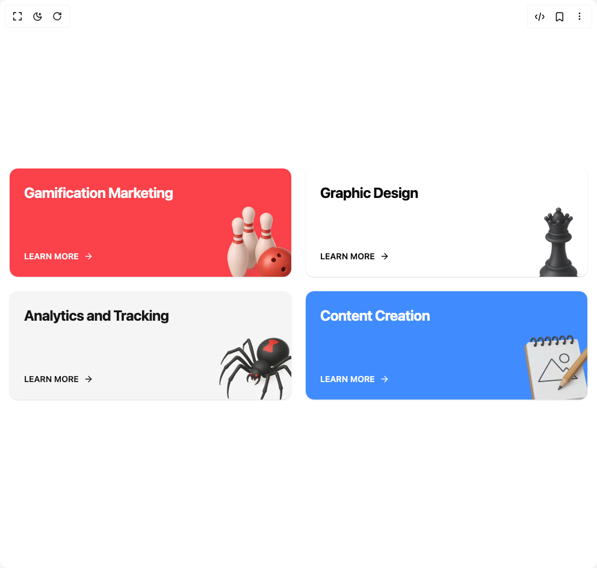

# Build Service Card in BuilderStudio

> Build this component in our Agentic IDE: [BuilderStudio](https://builderstudio.dev).
>
> Join the BuilderStudio community on [Discord](https://discord.gg/QdWeSGCqfe) and [Reddit](https://reddit.com/r/builderstudio).



## Component

- Author group: `lavikatiyar`
- Component: `service-card`
- Variant: `default`
- Rendered HTML snapshot: [`rendered.html`](rendered.html)

## BuilderStudio prompt

You are implementing a React component based on a component reference.

## Component identity

- Author: lavikatiyar
- Component slug: service-card
- Demo slug: default
- Title: service-card
- Description: 

## Goal

Recreate this component in a React + TypeScript + Tailwind CSS project. Preserve the visual layout, spacing, colors, border radius, shadows, interaction behavior, animation behavior, responsive behavior, and dark mode behavior shown in the rendered demo.

## Implementation requirements

- Use React and TypeScript.
- Use Tailwind CSS classes whenever possible.
- Keep the component self-contained unless the source files require helper components.
- If the source uses CSS variables, custom CSS, animations, or keyframes, include them.
- If the source uses external packages, list and use the required packages.
- Preserve accessibility attributes, button semantics, links, keyboard behavior, and ARIA attributes when visible in the source.
- Do not replace the component with a simplified placeholder.
- Return complete production-ready code.

## Dependencies

No reference metadata available.

## Rendered DOM snapshot

This is the rendered demo HTML extracted from the live preview. Use it to verify structure, class names, visible content, and layout.

```html
<div id="root"><div class="w-screen min-h-screen flex justify-center items-center"><div class="w-screen min-h-screen flex justify-center items-center"><div class="w-full max-w-5xl mx-auto p-4"><div class="grid grid-cols-1 sm:grid-cols-2 gap-6"><div class="relative flex flex-col justify-between w-full p-6 overflow-hidden rounded-xl shadow-sm transition-shadow duration-300 ease-in-out group hover:shadow-lg bg-red-500/90 text-primary-foreground min-h-[180px]"><div class="relative z-10 flex flex-col h-full"><h3 class="text-2xl font-bold tracking-tight">Gamification Marketing</h3><a href="/services/gamification" aria-label="Learn more about Gamification Marketing" class="mt-auto flex items-center text-sm font-semibold group-hover:underline">LEARN MORE<div><svg xmlns="http://www.w3.org/2000/svg" width="24" height="24" viewBox="0 0 24 24" fill="none" stroke="currentColor" stroke-width="2" stroke-linecap="round" stroke-linejoin="round" class="lucide lucide-arrow-right ml-2 h-4 w-4" aria-hidden="true"><path d="M5 12h14"></path><path d="m12 5 7 7-7 7"></path></svg></div></a></div></div><div class="relative flex flex-col justify-between w-full p-6 overflow-hidden rounded-xl shadow-sm transition-shadow duration-300 ease-in-out group hover:shadow-lg bg-card text-card-foreground min-h-[180px]"><div class="relative z-10 flex flex-col h-full"><h3 class="text-2xl font-bold tracking-tight">Graphic Design</h3><a href="/services/design" aria-label="Learn more about Graphic Design" class="mt-auto flex items-center text-sm font-semibold group-hover:underline">LEARN MORE<div><svg xmlns="http://www.w3.org/2000/svg" width="24" height="24" viewBox="0 0 24 24" fill="none" stroke="currentColor" stroke-width="2" stroke-linecap="round" stroke-linejoin="round" class="lucide lucide-arrow-right ml-2 h-4 w-4" aria-hidden="true"><path d="M5 12h14"></path><path d="m12 5 7 7-7 7"></path></svg></div></a></div></div><div class="relative flex flex-col justify-between w-full p-6 overflow-hidden rounded-xl shadow-sm transition-shadow duration-300 ease-in-out group hover:shadow-lg bg-secondary text-secondary-foreground min-h-[180px]"><div class="relative z-10 flex flex-col h-full"><h3 class="text-2xl font-bold tracking-tight">Analytics and Tracking</h3><a href="/services/analytics" aria-label="Learn more about Analytics and Tracking" class="mt-auto flex items-center text-sm font-semibold group-hover:underline">LEARN MORE<div><svg xmlns="http://www.w3.org/2000/svg" width="24" height="24" viewBox="0 0 24 24" fill="none" stroke="currentColor" stroke-width="2" stroke-linecap="round" stroke-linejoin="round" class="lucide lucide-arrow-right ml-2 h-4 w-4" aria-hidden="true"><path d="M5 12h14"></path><path d="m12 5 7 7-7 7"></path></svg></div></a></div></div><div class="relative flex flex-col justify-between w-full p-6 overflow-hidden rounded-xl shadow-sm transition-shadow duration-300 ease-in-out group hover:shadow-lg bg-blue-500/90 text-primary-foreground min-h-[180px]"><div class="relative z-10 flex flex-col h-full"><h3 class="text-2xl font-bold tracking-tight">Content Creation</h3><a href="/services/content" aria-label="Learn more about Content Creation" class="mt-auto flex items-center text-sm font-semibold group-hover:underline">LEARN MORE<div><svg xmlns="http://www.w3.org/2000/svg" width="24" height="24" viewBox="0 0 24 24" fill="none" stroke="currentColor" stroke-width="2" stroke-linecap="round" stroke-linejoin="round" class="lucide lucide-arrow-right ml-2 h-4 w-4" aria-hidden="true"><path d="M5 12h14"></path><path d="m12 5 7 7-7 7"></path></svg></div></a></div></div></div></div></div></div></div>
```

## Reference source files

No reference source files were available.
