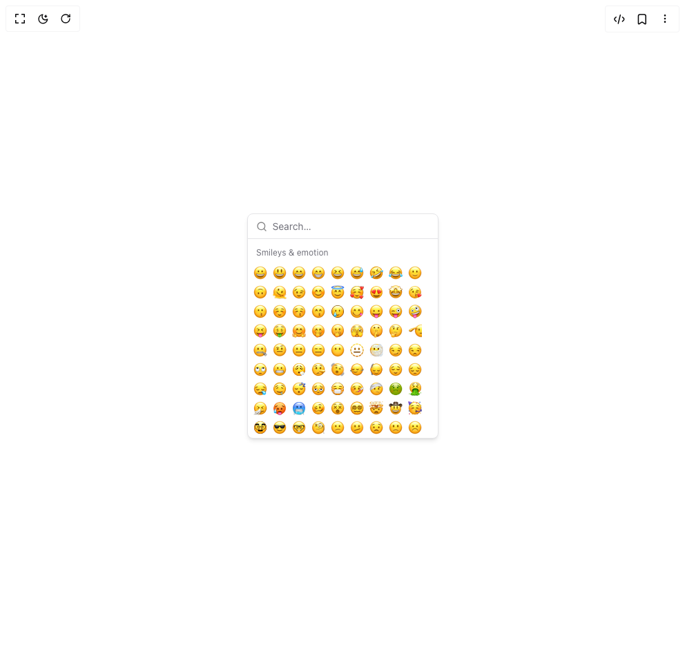

# Build Emoji Picker in BuilderStudio

> Build this component in our Agentic IDE: [BuilderStudio](https://builderstudio.dev).
>
> Join the BuilderStudio community on [Discord](https://discord.gg/QdWeSGCqfe) and [Reddit](https://reddit.com/r/builderstudio).



## Component

- Author group: `liveblocks`
- Component: `emoji-picker`
- Variant: `default`
- Rendered HTML snapshot: [`rendered.html`](rendered.html)

## BuilderStudio prompt

You are implementing a React component based on a component reference.

## Component identity

- Author: liveblocks
- Component slug: emoji-picker
- Demo slug: default
- Title: emoji-picker
- Description: 

## Goal

Recreate this component in a React + TypeScript + Tailwind CSS project. Preserve the visual layout, spacing, colors, border radius, shadows, interaction behavior, animation behavior, responsive behavior, and dark mode behavior shown in the rendered demo.

## Implementation requirements

- Use React and TypeScript.
- Use Tailwind CSS classes whenever possible.
- Keep the component self-contained unless the source files require helper components.
- If the source uses CSS variables, custom CSS, animations, or keyframes, include them.
- If the source uses external packages, list and use the required packages.
- Preserve accessibility attributes, button semantics, links, keyboard behavior, and ARIA attributes when visible in the source.
- Do not replace the component with a simplified placeholder.
- Return complete production-ready code.

## Dependencies

No reference metadata available.

## Rendered DOM snapshot

This is the rendered demo HTML extracted from the live preview. Use it to verify structure, class names, visible content, and layout.

```html
<div id="root"><div class="relative flex items-center justify-center h-screen w-full m-auto p-16 bg-background text-foreground"><div class="absolute lab-bg inset-0 size-full"><div class="absolute inset-0 bg-[radial-gradient(#00000021_1px,transparent_1px)] dark:bg-[radial-gradient(#ffffff22_1px,transparent_1px)]"></div></div><div class="flex w-full justify-center relative"><main class="flex h-full min-h-screen w-full items-center justify-center p-4"><div frimousse-root="" class="bg-popover text-popover-foreground isolate flex w-fit flex-col overflow-hidden h-[326px] rounded-lg border shadow-md" data-slot="emoji-picker" style="--frimousse-emoji-font: 'Apple Color Emoji', 'Noto Color Emoji', 'Twemoji Mozilla', 'Android Emoji', 'Segoe UI Emoji', 'Segoe UI Symbol', EmojiSymbols, sans-serif; --frimousse-viewport-width: 275px; --frimousse-viewport-height: 288px; --frimousse-row-height: 28px; --frimousse-category-header-height: 34px;"><div class="flex h-9 items-center gap-2 border-b px-3" data-slot="emoji-picker-search-wrapper"><svg xmlns="http://www.w3.org/2000/svg" width="24" height="24" viewBox="0 0 24 24" fill="none" stroke="currentColor" stroke-width="2" stroke-linecap="round" stroke-linejoin="round" class="lucide lucide-search size-4 shrink-0 opacity-50" aria-hidden="true"><path d="m21 21-4.34-4.34"></path><circle cx="11" cy="11" r="8"></circle></svg><input autocapitalize="off" autocomplete="off" autocorrect="off" enterkeyhint="done" frimousse-search="" placeholder="Search…" spellcheck="false" class="outline-hidden placeholder:text-muted-foreground flex h-10 w-full rounded-md bg-transparent py-3 text-sm disabled:cursor-not-allowed disabled:opacity-50" data-slot="emoji-picker-search" type="search"></div><div frimousse-viewport="" class="outline-hidden relative flex-1" data-slot="emoji-picker-viewport" style="position: relative; box-sizing: border-box; contain: layout paint; overflow-y: auto; overscroll-behavior: contain; scrollbar-gutter: stable; will-change: scroll-position; contain-intrinsic-size: var(--frimousse-viewport-width, auto) calc(216 * var(--frimousse-row-height) + 9 * var(--frimousse-category-header-height));"><div aria-colcount="9" aria-rowcount="216" frimousse-list="" role="grid" class="select-none pb-1" data-slot="emoji-picker-list" style="--frimousse-list-columns: 9;"><div frimousse-list-sizer="" style="position: relative; box-sizing: border-box; height: calc(216 * var(--frimousse-row-height) + 9 * var(--frimousse-category-header-height)); padding-top: calc(0 * var(--frimousse-row-height) + 0 * var(--frimousse-category-header-height));"><div aria-hidden="true" style="height: 0px; visibility: hidden;"><div frimousse-row-sizer=""><div frimousse-row="" class="scroll-my-1 px-1" data-slot="emoji-picker-row" style="display: flex;"><button role="gridcell" aria-colindex="0" aria-label="" frimousse-emoji="" tabindex="-1" class="data-[active]:bg-accent flex size-7 items-center justify-center rounded-sm text-base" data-slot="emoji-picker-emoji" style="font-family: var(--frimousse-emoji-font);">🙂</button><button role="gridcell" aria-colindex="1" aria-label="" frimousse-emoji="" tabindex="-1" class="data-[active]:bg-accent flex size-7 items-center justify-center rounded-sm text-base" data-slot="emoji-picker-emoji" style="font-family: var(--frimousse-emoji-font);">🙂</button><button role="gridcell" aria-colindex="2" aria-label="" frimousse-emoji="" tabindex="-1" class="data-[active]:bg-accent flex size-7 items-center justify-center rounded-sm text-base" data-slot="emoji-picker-emoji" style="font-family: var(--frimousse-emoji-font);">🙂</button><button role="gridcell" aria-colindex="3" aria-label="" frimousse-emoji="" tabindex="-1" class="data-[active]:bg-accent flex size-7 items-center justify-center rounded-sm text-base" data-slot="emoji-picker-emoji" style="font-family: var(--frimousse-emoji-font);">🙂</button><button role="gridcell" aria-colindex="4" aria-label="" frimousse-emoji="" tabindex="-1" class="data-[active]:bg-accent flex size-7 items-center justify-center rounded-sm text-base" data-slot="emoji-picker-emoji" style="font-family: var(--frimousse-emoji-font);">🙂</button><button role="gridcell" aria-colindex="5" aria-label="" frimousse-emoji="" tabindex="-1" class="data-[active]:bg-accent flex size-7 items-center justify-center rounded-sm text-base" data-slot="emoji-picker-emoji" style="font-family: var(--frimousse-emoji-font);">🙂</button><button role="gridcell" aria-colindex="6" aria-label="" frimousse-emoji="" tabindex="-1" class="data-[active]:bg-accent flex size-7 items-center justify-center rounded-sm text-base" data-slot="emoji-picker-emoji" style="font-family: var(--frimousse-emoji-font);">🙂</button><button role="gridcell" aria-colindex="7" aria-label="" frimousse-emoji="" tabindex="-1" class="data-[active]:bg-accent flex size-7 items-center justify-center rounded-sm text-base" data-slot="emoji-picker-emoji" style="font-family: var(--frimousse-emoji-font);">🙂</button><button role="gridcell" aria-colindex="8" aria-label="" frimousse-emoji="" tabindex="-1" class="data-[active]:bg-accent flex size-7 items-center justify-center rounded-sm text-base" data-slot="emoji-picker-emoji" style="font-family: var(--frimousse-emoji-font);">🙂</button></div></div><div frimousse-category="" style="contain: content; width: 100%; pointer-events: none; position: absolute;"><div frimousse-category-header-sizer=""><div frimousse-category-header="" class="bg-popover text-muted-foreground px-3 pb-2 pt-3.5 text-xs leading-none" data-slot="emoji-picker-category-header" style="pointer-events: auto; position: sticky; top: 0px;">Category</div></div></div></div><div style="height: var(--frimousse-category-header-height);"></div><div role="row" aria-rowindex="0" frimousse-row="" class="scroll-my-1 px-1" data-slot="emoji-picker-row" style="contain: content; height: var(--frimousse-row-height); display: flex;"><button role="gridcell" aria-colindex="0" aria-label="Grinning face" frimousse-emoji="" tabindex="-1" class="data-[active]:bg-accent flex size-7 items-center justify-center rounded-sm text-base" data-slot="emoji-picker-emoji" style="font-family: var(--frimousse-emoji-font);">😀</button><button role="gridcell" aria-colindex="1" aria-label="Grinning face with big eyes" frimousse-emoji="" tabindex="-1" class="data-[active]:bg-accent flex size-7 items-center justify-center rounded-sm text-base" data-slot="emoji-picker-emoji" style="font-family: var(--frimousse-emoji-font);">😃</button><button role="gridcell" aria-colindex="2" aria-label="Grinning face with smiling eyes" frimousse-emoji="" tabindex="-1" class="data-[active]:bg-accent flex size-7 items-center justify-center rounded-sm text-base" data-slot="emoji-picker-emoji" style="font-family: var(--frimousse-emoji-font);">😄</button><button role="gridcell" aria-colindex="3" aria-label="Beaming face with smiling eyes" frimousse-emoji="" tabindex="-1" class="data-[active]:bg-accent flex size-7 items-center justify-center rounded-sm text-base" data-slot="emoji-picker-emoji" style="font-family: var(--frimousse-emoji-font);">😁</button><button role="gridcell" aria-colindex="4" aria-label="Grinning squinting face" frimousse-emoji="" tabindex="-1" class="data-[active]:bg-accent flex size-7 items-center justify-center rounded-sm text-base" data-slot="emoji-picker-emoji" style="font-family: var(--frimousse-emoji-font);">😆</button><button role="gridcell" aria-colindex="5" aria-label="Grinning face with sweat" frimousse-emoji="" tabindex="-1" class="data-[active]:bg-accent flex size-7 items-center justify-center rounded-sm text-base" data-slot="emoji-picker-emoji" style="font-family: var(--frimousse-emoji-font);">😅</button><button role="gridcell" aria-colindex="6" aria-label="Rolling on the floor laughing" frimousse-emoji="" tabindex="-1" class="data-[active]:bg-accent flex size-7 items-center justify-center rounded-sm text-base" data-slot="emoji-picker-emoji" style="font-family: var(--frimousse-emoji-font);">🤣</button><button role="gridcell" aria-colindex="7" aria-label="Face with tears of joy" frimousse-emoji="" tabindex="-1" class="data-[active]:bg-accent flex size-7 items-center justify-center rounded-sm text-base" data-slot="emoji-picker-emoji" style="font-family: var(--frimousse-emoji-font);">😂</button><button role="gridcell" aria-colindex="8" aria-label="Slightly smiling face" frimousse-emoji="" tabindex="-1" class="data-[active]:bg-accent flex size-7 items-center justify-center rounded-sm text-base" data-slot="emoji-picker-emoji" style="font-family: var(--frimousse-emoji-font);">🙂</button></div><div role="row" aria-rowindex="1" frimousse-row="" class="scroll-my-1 px-1" data-slot="emoji-picker-row" style="contain: content; height: var(--frimousse-row-height); display: flex;"><button role="gridcell" aria-colindex="0" aria-label="Upside-down face" frimousse-emoji="" tabindex="-1" class="data-[active]:bg-accent flex size-7 items-center justify-center rounded-sm text-base" data-slot="emoji-picker-emoji" style="font-family: var(--frimousse-emoji-font);">🙃</button><button role="gridcell" aria-colindex="1" aria-label="Melting face" frimousse-emoji="" tabindex="-1" class="data-[active]:bg-accent flex size-7 items-center justify-center rounded-sm text-base" data-slot="emoji-picker-emoji" style="font-family: var(--frimousse-emoji-font);">🫠</button><button role="gridcell" aria-colindex="2" aria-label="Winking face" frimousse-emoji="" tabindex="-1" class="data-[active]:bg-accent flex size-7 items-center justify-center rounded-sm text-base" data-slot="emoji-picker-emoji" style="font-family: var(--frimousse-emoji-font);">😉</button><button role="gridcell" aria-colindex="3" aria-label="Smiling face with smiling eyes" frimousse-emoji="" tabindex="-1" class="data-[active]:bg-accent flex size-7 items-center justify-center rounded-sm text-base" data-slot="emoji-picker-emoji" style="font-family: var(--frimousse-emoji-font);">😊</button><button role="gridcell" aria-colindex="4" aria-label="Smiling face with halo" frimousse-emoji="" tabindex="-1" class="data-[active]:bg-accent flex size-7 items-center justify-center rounded-sm text-base" data-slot="emoji-picker-emoji" style="font-family: var(--frimousse-emoji-font);">😇</button><button role="gridcell" aria-colindex="5" aria-label="Smiling face with hearts" frimousse-emoji="" tabindex="-1" class="data-[active]:bg-accent flex size-7 items-center justify-center rounded-sm text-base" data-slot="emoji-picker-emoji" style="font-family: var(--frimousse-emoji-font);">🥰</button><button role="gridcell" aria-colindex="6" aria-label="Smiling face with heart-eyes" frimousse-emoji="" tabindex="-1" class="data-[active]:bg-accent flex size-7 items-center justify-center rounded-sm text-base" data-slot="emoji-picker-emoji" style="font-family: var(--frimousse-emoji-font);">😍</button><button role="gridcell" aria-colindex="7" aria-label="Star-struck" frimousse-emoji="" tabindex="-1" class="data-[active]:bg-accent flex size-7 items-center justify-center rounded-sm text-base" data-slot="emoji-picker-emoji" style="font-family: var(--frimousse-emoji-font);">🤩</button><button role="gridcell" aria-colindex="8" aria-label="Face blowing a kiss" frimousse-emoji="" tabindex="-1" class="data-[active]:bg-accent flex size-7 items-center justify-center rounded-sm text-base" data-slot="emoji-picker-emoji" style="font-family: var(--frimousse-emoji-font);">😘</button></div><div role="row" aria-rowindex="2" frimousse-row="" class="scroll-my-1 px-1" data-slot="emoji-picker-row" style="contain: content; height: var(--frimousse-row-height); display: flex;"><button role="gridcell" aria-colindex="0" aria-label="Kissing face" frimousse-emoji="" tabindex="-1" class="data-[active]:bg-accent flex size-7 items-center justify-center rounded-sm text-base" data-slot="emoji-picker-emoji" style="font-family: var(--frimousse-emoji-font);">😗</button><button role="gridcell" aria-colindex="1" aria-label="Smiling face" frimousse-emoji="" tabindex="-1" class="data-[active]:bg-accent flex size-7 items-center justify-center rounded-sm text-base" data-slot="emoji-picker-emoji" style="font-family: var(--frimousse-emoji-font);">☺️</button><button role="gridcell" aria-colindex="2" aria-label="Kissing face with closed eyes" frimousse-emoji="" tabindex="-1" class="data-[active]:bg-accent flex size-7 items-center justify-center rounded-sm text-base" data-slot="emoji-picker-emoji" style="font-family: var(--frimousse-emoji-font);">😚</button><button role="gridcell" aria-colindex="3" aria-label="Kissing face with smiling eyes" frimousse-emoji="" tabindex="-1" class="data-[active]:bg-accent flex size-7 items-center justify-center rounded-sm text-base" data-slot="emoji-picker-emoji" style="font-family: var(--frimousse-emoji-font);">😙</button><button role="gridcell" aria-colindex="4" aria-label="Smiling face with tear" frimousse-emoji="" tabindex="-1" class="data-[active]:bg-accent flex size-7 items-center justify-center rounded-sm text-base" data-slot="emoji-picker-emoji" style="font-family: var(--frimousse-emoji-font);">🥲</button><button role="gridcell" aria-colindex="5" aria-label="Face savoring food" frimousse-emoji="" tabindex="-1" class="data-[active]:bg-accent flex size-7 items-center justify-center rounded-sm text-base" data-slot="emoji-picker-emoji" style="font-family: var(--frimousse-emoji-font);">😋</button><button role="gridcell" aria-colindex="6" aria-label="Face with tongue" frimousse-emoji="" tabindex="-1" class="data-[active]:bg-accent flex size-7 items-center justify-center rounded-sm text-base" data-slot="emoji-picker-emoji" style="font-family: var(--frimousse-emoji-font);">😛</button><button role="gridcell" aria-colindex="7" aria-label="Winking face with tongue" frimousse-emoji="" tabindex="-1" class="data-[active]:bg-accent flex size-7 items-center justify-center rounded-sm text-base" data-slot="emoji-picker-emoji" style="font-family: var(--frimousse-emoji-font);">😜</button><button role="gridcell" aria-colindex="8" aria-label="Zany face" frimousse-emoji="" tabindex="-1" class="data-[active]:bg-accent flex size-7 items-center justify-center rounded-sm text-base" data-slot="emoji-picker-emoji" style="font-family: var(--frimousse-emoji-font);">🤪</button></div><div role="row" aria-rowindex="3" frimousse-row="" class="scroll-my-1 px-1" data-slot="emoji-picker-row" style="contain: content; height: var(--frimousse-row-height); display: flex;"><button role="gridcell" aria-colindex="0" aria-label="Squinting face with tongue" frimousse-emoji="" tabindex="-1" class="data-[active]:bg-accent flex size-7 items-center justify-center rounded-sm text-base" data-slot="emoji-picker-emoji" style="font-family: var(--frimousse-emoji-font);">😝</button><button role="gridcell" aria-colindex="1" aria-label="Money-mouth face" frimousse-emoji="" tabindex="-1" class="data-[active]:bg-accent flex size-7 items-center justify-center rounded-sm text-base" data-slot="emoji-picker-emoji" style="font-family: var(--frimousse-emoji-font);">🤑</button><button role="gridcell" aria-colindex="2" aria-label="Smiling face with open hands" frimousse-emoji="" tabindex="-1" class="data-[active]:bg-accent flex size-7 items-center justify-center rounded-sm text-base" data-slot="emoji-picker-emoji" style="font-family: var(--frimousse-emoji-font);">🤗</button><button role="gridcell" aria-colindex="3" aria-label="Face with hand over mouth" frimousse-emoji="" tabindex="-1" class="data-[active]:bg-accent flex size-7 items-center justify-center rounded-sm text-base" data-slot="emoji-picker-emoji" style="font-family: var(--frimousse-emoji-font);">🤭</button><button role="gridcell" aria-colindex="4" aria-label="Face with open eyes and hand over mouth" frimousse-emoji="" tabindex="-1" class="data-[active]:bg-accent flex size-7 items-center justify-center rounded-sm text-base" data-slot="emoji-picker-emoji" style="font-family: var(--frimousse-emoji-font);">🫢</button><button role="gridcell" aria-colindex="5" aria-label="Face with peeking eye" frimousse-emoji="" tabindex="-1" class="data-[active]:bg-accent flex size-7 items-center justify-center rounded-sm text-base" data-slot="emoji-picker-emoji" style="font-family: var(--frimousse-emoji-font);">🫣</button><button role="gridcell" aria-colindex="6" aria-label="Shushing face" frimousse-emoji="" tabindex="-1" class="data-[active]:bg-accent flex size-7 items-center justify-center rounded-sm text-base" data-slot="emoji-picker-emoji" style="font-family: var(--frimousse-emoji-font);">🤫</button><button role="gridcell" aria-colindex="7" aria-label="Thinking face" frimousse-emoji="" tabindex="-1" class="data-[active]:bg-accent flex size-7 items-center justify-center rounded-sm text-base" data-slot="emoji-picker-emoji" style="font-family: var(--frimousse-emoji-font);">🤔</button><button role="gridcell" aria-colindex="8" aria-label="Saluting face" frimousse-emoji="" tabindex="-1" class="data-[active]:bg-accent flex size-7 items-center justify-center rounded-sm text-base" data-slot="emoji-picker-emoji" style="font-family: var(--frimousse-emoji-font);">🫡</button></div><div role="row" aria-rowindex="4" frimousse-row="" class="scroll-my-1 px-1" data-slot="emoji-picker-row" style="contain: content; height: var(--frimousse-row-height); display: flex;"><button role="gridcell" aria-colindex="0" aria-label="Zipper-mouth face" frimousse-emoji="" tabindex="-1" class="data-[active]:bg-accent flex size-7 items-center justify-center rounded-sm text-base" data-slot="emoji-picker-emoji" style="font-family: var(--frimousse-emoji-font);">🤐</button><button role="gridcell" aria-colindex="1" aria-label="Face with raised eyebrow" frimousse-emoji="" tabindex="-1" class="data-[active]:bg-accent flex size-7 items-center justify-center rounded-sm text-base" data-slot="emoji-picker-emoji" style="font-family: var(--frimousse-emoji-font);">🤨</button><button role="gridcell" aria-colindex="2" aria-label="Neutral face" frimousse-emoji="" tabindex="-1" class="data-[active]:bg-accent flex size-7 items-center justify-center rounded-sm text-base" data-slot="emoji-picker-emoji" style="font-family: var(--frimousse-emoji-font);">😐️</button><button role="gridcell" aria-colindex="3" aria-label="Expressionless face" frimousse-emoji="" tabindex="-1" class="data-[active]:bg-accent flex size-7 items-center justify-center rounded-sm text-base" data-slot="emoji-picker-emoji" style="font-family: var(--frimousse-emoji-font);">😑</button><button role="gridcell" aria-colindex="4" aria-label="Face without mouth" frimousse-emoji="" tabindex="-1" class="data-[active]:bg-accent flex size-7 items-center justify-center rounded-sm text-base" data-slot="emoji-picker-emoji" style="font-family: var(--frimousse-emoji-font);">😶</button><button role="gridcell" aria-colindex="5" aria-label="Dotted line face" frimousse-emoji="" tabindex="-1" class="data-[active]:bg-accent flex size-7 items-center justify-center rounded-sm text-base" data-slot="emoji-picker-emoji" style="font-family: var(--frimousse-emoji-font);">🫥</button><button role="gridcell" aria-colindex="6" aria-label="Face in clouds" frimousse-emoji="" tabindex="-1" class="data-[active]:bg-accent flex size-7 items-center justify-center rounded-sm text-base" data-slot="emoji-picker-emoji" style="font-family: var(--frimousse-emoji-font);">😶‍🌫️</button><button role="gridcell" aria-colindex="7" aria-label="Smirking face" frimousse-emoji="" tabindex="-1" class="data-[active]:bg-accent flex size-7 items-center justify-center rounded-sm text-base" data-slot="emoji-picker-emoji" style="font-family: var(--frimousse-emoji-font);">😏</button><button role="gridcell" aria-colindex="8" aria-label="Unamused face" frimousse-emoji="" tabindex="-1" class="data-[active]:bg-accent flex size-7 items-center justify-center rounded-sm text-base" data-slot="emoji-picker-emoji" style="font-family: var(--frimousse-emoji-font);">😒</button></div><div role="row" aria-rowindex="5" frimousse-row="" class="scroll-my-1 px-1" data-slot="emoji-picker-row" style="contain: content; height: var(--frimousse-row-height); display: flex;"><button role="gridcell" aria-colindex="0" aria-label="Face with rolling eyes" frimousse-emoji="" tabindex="-1" class="data-[active]:bg-accent flex size-7 items-center justify-center rounded-sm text-base" data-slot="emoji-picker-emoji" style="font-family: var(--frimousse-emoji-font);">🙄</button><button role="gridcell" aria-colindex="1" aria-label="Grimacing face" frimousse-emoji="" tabindex="-1" class="data-[active]:bg-accent flex size-7 items-center justify-center rounded-sm text-base" data-slot="emoji-picker-emoji" style="font-family: var(--frimousse-emoji-font);">😬</button><button role="gridcell" aria-colindex="2" aria-label="Face exhaling" frimousse-emoji="" tabindex="-1" class="data-[active]:bg-accent flex size-7 items-center justify-center rounded-sm text-base" data-slot="emoji-picker-emoji" style="font-family: var(--frimousse-emoji-font);">😮‍💨</button><button role="gridcell" aria-colindex="3" aria-label="Lying face" frimousse-emoji="" tabindex="-1" class="data-[active]:bg-accent flex size-7 items-center justify-center rounded-sm text-base" data-slot="emoji-picker-emoji" style="font-family: var(--frimousse-emoji-font);">🤥</button><button role="gridcell" aria-colindex="4" aria-label="Shaking face" frimousse-emoji="" tabindex="-1" class="data-[active]:bg-accent flex size-7 items-center justify-center rounded-sm text-base" data-slot="emoji-picker-emoji" style="font-family: var(--frimousse-emoji-font);">🫨</button><button role="gridcell" aria-colindex="5" aria-label="Head shaking horizontally" frimousse-emoji="" tabindex="-1" class="data-[active]:bg-accent flex size-7 items-center justify-center rounded-sm text-base" data-slot="emoji-picker-emoji" style="font-family: var(--frimousse-emoji-font);">🙂‍↔️</button><button role="gridcell" aria-colindex="6" aria-label="Head shaking vertically" frimousse-emoji="" tabindex="-1" class="data-[active]:bg-accent flex size-7 items-center justify-center rounded-sm text-base" data-slot="emoji-picker-emoji" style="font-family: var(--frimousse-emoji-font);">🙂‍↕️</button><button role="gridcell" aria-colindex="7" aria-label="Relieved face" frimousse-emoji="" tabindex="-1" class="data-[active]:bg-accent flex size-7 items-center justify-center rounded-sm text-base" data-slot="emoji-picker-emoji" style="font-family: var(--frimousse-emoji-font);">😌</button><button role="gridcell" aria-colindex="8" aria-label="Pensive face" frimousse-emoji="" tabindex="-1" class="data-[active]:bg-accent flex size-7 items-center justify-center rounded-sm text-base" data-slot="emoji-picker-emoji" style="font-family: var(--frimousse-emoji-font);">😔</button></div><div role="row" aria-rowindex="6" frimousse-row="" class="scroll-my-1 px-1" data-slot="emoji-picker-row" style="contain: content; height: var(--frimousse-row-height); display: flex;"><button role="gridcell" aria-colindex="0" aria-label="Sleepy face" frimousse-emoji="" tabindex="-1" class="data-[active]:bg-accent flex size-7 items-center justify-center rounded-sm text-base" data-slot="emoji-picker-emoji" style="font-family: var(--frimousse-emoji-font);">😪</button><button role="gridcell" aria-colindex="1" aria-label="Drooling face" frimousse-emoji="" tabindex="-1" class="data-[active]:bg-accent flex size-7 items-center justify-center rounded-sm text-base" data-slot="emoji-picker-emoji" style="font-family: var(--frimousse-emoji-font);">🤤</button><button role="gridcell" aria-colindex="2" aria-label="Sleeping face" frimousse-emoji="" tabindex="-1" class="data-[active]:bg-accent flex size-7 items-center justify-center rounded-sm text-base" data-slot="emoji-picker-emoji" style="font-family: var(--frimousse-emoji-font);">😴</button><button role="gridcell" aria-colindex="3" aria-label="Face with bags under eyes" frimousse-emoji="" tabindex="-1" class="data-[active]:bg-accent flex size-7 items-center justify-center rounded-sm text-base" data-slot="emoji-picker-emoji" style="font-family: var(--frimousse-emoji-font);">🫩</button><button role="gridcell" aria-colindex="4" aria-label="Face with medical mask" frimousse-emoji="" tabindex="-1" class="data-[active]:bg-accent flex size-7 items-center justify-center rounded-sm text-base" data-slot="emoji-picker-emoji" style="font-family: var(--frimousse-emoji-font);">😷</button><button role="gridcell" aria-colindex="5" aria-label="Face with thermometer" frimousse-emoji="" tabindex="-1" class="data-[active]:bg-accent flex size-7 items-center justify-center rounded-sm text-base" data-slot="emoji-picker-emoji" style="font-family: var(--frimousse-emoji-font);">🤒</button><button role="gridcell" aria-colindex="6" aria-label="Face with head-bandage" frimousse-emoji="" tabindex="-1" class="data-[active]:bg-accent flex size-7 items-center justify-center rounded-sm text-base" data-slot="emoji-picker-emoji" style="font-family: var(--frimousse-emoji-font);">🤕</button><button role="gridcell" aria-colindex="7" aria-label="Nauseated face" frimousse-emoji="" tabindex="-1" class="data-[active]:bg-accent flex size-7 items-center justify-center rounded-sm text-base" data-slot="emoji-picker-emoji" style="font-family: var(--frimousse-emoji-font);">🤢</button><button role="gridcell" aria-colindex="8" aria-label="Face vomiting" frimousse-emoji="" tabindex="-1" class="data-[active]:bg-accent flex size-7 items-center justify-center rounded-sm text-base" data-slot="emoji-picker-emoji" style="font-family: var(--frimousse-emoji-font);">🤮</button></div><div role="row" aria-rowindex="7" frimousse-row="" class="scroll-my-1 px-1" data-slot="emoji-picker-row" style="contain: content; height: var(--frimousse-row-height); display: flex;"><button role="gridcell" aria-colindex="0" aria-label="Sneezing face" frimousse-emoji="" tabindex="-1" class="data-[active]:bg-accent flex size-7 items-center justify-center rounded-sm text-base" data-slot="emoji-picker-emoji" style="font-family: var(--frimousse-emoji-font);">🤧</button><button role="gridcell" aria-colindex="1" aria-label="Hot face" frimousse-emoji="" tabindex="-1" class="data-[active]:bg-accent flex size-7 items-center justify-center rounded-sm text-base" data-slot="emoji-picker-emoji" style="font-family: var(--frimousse-emoji-font);">🥵</button><button role="gridcell" aria-colindex="2" aria-label="Cold face" frimousse-emoji="" tabindex="-1" class="data-[active]:bg-accent flex size-7 items-center justify-center rounded-sm text-base" data-slot="emoji-picker-emoji" style="font-family: var(--frimousse-emoji-font);">🥶</button><button role="gridcell" aria-colindex="3" aria-label="Woozy face" frimousse-emoji="" tabindex="-1" class="data-[active]:bg-accent flex size-7 items-center justify-center rounded-sm text-base" data-slot="emoji-picker-emoji" style="font-family: var(--frimousse-emoji-font);">🥴</button><button role="gridcell" aria-colindex="4" aria-label="Face with crossed-out eyes" frimousse-emoji="" tabindex="-1" class="data-[active]:bg-accent flex size-7 items-center justify-center rounded-sm text-base" data-slot="emoji-picker-emoji" style="font-family: var(--frimousse-emoji-font);">😵</button><button role="gridcell" aria-colindex="5" aria-label="Face with spiral eyes" frimousse-emoji="" tabindex="-1" class="data-[active]:bg-accent flex size-7 items-center justify-center rounded-sm text-base" data-slot="emoji-picker-emoji" style="font-family: var(--frimousse-emoji-font);">😵‍💫</button><button role="gridcell" aria-colindex="6" aria-label="Exploding head" frimousse-emoji="" tabindex="-1" class="data-[active]:bg-accent flex size-7 items-center justify-center rounded-sm text-base" data-slot="emoji-picker-emoji" style="font-family: var(--frimousse-emoji-font);">🤯</button><button role="gridcell" aria-colindex="7" aria-label="Cowboy hat face" frimousse-emoji="" tabindex="-1" class="data-[active]:bg-accent flex size-7 items-center justify-center rounded-sm text-base" data-slot="emoji-picker-emoji" style="font-family: var(--frimousse-emoji-font);">🤠</button><button role="gridcell" aria-colindex="8" aria-label="Partying face" frimousse-emoji="" tabindex="-1" class="data-[active]:bg-accent flex size-7 items-center justify-center rounded-sm text-base" data-slot="emoji-picker-emoji" style="font-family: var(--frimousse-emoji-font);">🥳</button></div><div role="row" aria-rowindex="8" frimousse-row="" class="scroll-my-1 px-1" data-slot="emoji-picker-row" style="contain: content; height: var(--frimousse-row-height); display: flex;"><button role="gridcell" aria-colindex="0" aria-label="Disguised face" frimousse-emoji="" tabindex="-1" class="data-[active]:bg-accent flex size-7 items-center justify-center rounded-sm text-base" data-slot="emoji-picker-emoji" style="font-family: var(--frimousse-emoji-font);">🥸</button><button role="gridcell" aria-colindex="1" aria-label="Smiling face with sunglasses" frimousse-emoji="" tabindex="-1" class="data-[active]:bg-accent flex size-7 items-center justify-center rounded-sm text-base" data-slot="emoji-picker-emoji" style="font-family: var(--frimousse-emoji-font);">😎</button><button role="gridcell" aria-colindex="2" aria-label="Nerd face" frimousse-emoji="" tabindex="-1" class="data-[active]:bg-accent flex size-7 items-center justify-center rounded-sm text-base" data-slot="emoji-picker-emoji" style="font-family: var(--frimousse-emoji-font);">🤓</button><button role="gridcell" aria-colindex="3" aria-label="Face with monocle" frimousse-emoji="" tabindex="-1" class="data-[active]:bg-accent flex size-7 items-center justify-center rounded-sm text-base" data-slot="emoji-picker-emoji" style="font-family: var(--frimousse-emoji-font);">🧐</button><button role="gridcell" aria-colindex="4" aria-label="Confused face" frimousse-emoji="" tabindex="-1" class="data-[active]:bg-accent flex size-7 items-center justify-center rounded-sm text-base" data-slot="emoji-picker-emoji" style="font-family: var(--frimousse-emoji-font);">😕</button><button role="gridcell" aria-colindex="5" aria-label="Face with diagonal mouth" frimousse-emoji="" tabindex="-1" class="data-[active]:bg-accent flex size-7 items-center justify-center rounded-sm text-base" data-slot="emoji-picker-emoji" style="font-family: var(--frimousse-emoji-font);">🫤</button><button role="gridcell" aria-colindex="6" aria-label="Worried face" frimousse-emoji="" tabindex="-1" class="data-[active]:bg-accent flex size-7 items-center justify-center rounded-sm text-base" data-slot="emoji-picker-emoji" style="font-family: var(--frimousse-emoji-font);">😟</button><button role="gridcell" aria-colindex="7" aria-label="Slightly frowning face" frimousse-emoji="" tabindex="-1" class="data-[active]:bg-accent flex size-7 items-center justify-center rounded-sm text-base" data-slot="emoji-picker-emoji" style="font-family: var(--frimousse-emoji-font);">🙁</button><button role="gridcell" aria-colindex="8" aria-label="Frowning face" frimousse-emoji="" tabindex="-1" class="data-[active]:bg-accent flex size-7 items-center justify-center rounded-sm text-base" data-slot="emoji-picker-emoji" style="font-family: var(--frimousse-emoji-font);">☹️</button></div><div role="row" aria-rowindex="9" frimousse-row="" class="scroll-my-1 px-1" data-slot="emoji-picker-row" style="contain: content; height: var(--frimousse-row-height); display: flex;"><button role="gridcell" aria-colindex="0" aria-label="Face with open mouth" frimousse-emoji="" tabindex="-1" class="data-[active]:bg-accent flex size-7 items-center justify-center rounded-sm text-base" data-slot="emoji-picker-emoji" style="font-family: var(--frimousse-emoji-font);">😮</button><button role="gridcell" aria-colindex="1" aria-label="Hushed face" frimousse-emoji="" tabindex="-1" class="data-[active]:bg-accent flex size-7 items-center justify-center rounded-sm text-base" data-slot="emoji-picker-emoji" style="font-family: var(--frimousse-emoji-font);">😯</button><button role="gridcell" aria-colindex="2" aria-label="Astonished face" frimousse-emoji="" tabindex="-1" class="data-[active]:bg-accent flex size-7 items-center justify-center rounded-sm text-base" data-slot="emoji-picker-emoji" style="font-family: var(--frimousse-emoji-font);">😲</button><button role="gridcell" aria-colindex="3" aria-label="Flushed face" frimousse-emoji="" tabindex="-1" class="data-[active]:bg-accent flex size-7 items-center justify-center rounded-sm text-base" data-slot="emoji-picker-emoji" style="font-family: var(--frimousse-emoji-font);">😳</button><button role="gridcell" aria-colindex="4" aria-label="Distorted face" frimousse-emoji="" tabindex="-1" class="data-[active]:bg-accent flex size-7 items-center justify-center rounded-sm text-base" data-slot="emoji-picker-emoji" style="font-family: var(--frimousse-emoji-font);">🫪</button><button role="gridcell" aria-colindex="5" aria-label="Pleading face" frimousse-emoji="" tabindex="-1" class="data-[active]:bg-accent flex size-7 items-center justify-center rounded-sm text-base" data-slot="emoji-picker-emoji" style="font-family: var(--frimousse-emoji-font);">🥺</button><button role="gridcell" aria-colindex="6" aria-label="Face holding back tears" frimousse-emoji="" tabindex="-1" class="data-[active]:bg-accent flex size-7 items-center justify-center rounded-sm text-base" data-slot="emoji-picker-emoji" style="font-family: var(--frimousse-emoji-font);">🥹</button><button role="gridcell" aria-colindex="7" aria-label="Frowning face with open mouth" frimousse-emoji="" tabindex="-1" class="data-[active]:bg-accent flex size-7 items-center justify-center rounded-sm text-base" data-slot="emoji-picker-emoji" style="font-family: var(--frimousse-emoji-font);">😦</button><button role="gridcell" aria-colindex="8" aria-label="Anguished face" frimousse-emoji="" tabindex="-1" class="data-[active]:bg-accent flex size-7 items-center justify-center rounded-sm text-base" data-slot="emoji-picker-emoji" style="font-family: var(--frimousse-emoji-font);">😧</button></div><div role="row" aria-rowindex="10" frimousse-row="" class="scroll-my-1 px-1" data-slot="emoji-picker-row" style="contain: content; height: var(--frimousse-row-height); display: flex;"><button role="gridcell" aria-colindex="0" aria-label="Fearful face" frimousse-emoji="" tabindex="-1" class="data-[active]:bg-accent flex size-7 items-center justify-center rounded-sm text-base" data-slot="emoji-picker-emoji" style="font-family: var(--frimousse-emoji-font);">😨</button><button role="gridcell" aria-colindex="1" aria-label="Anxious face with sweat" frimousse-emoji="" tabindex="-1" class="data-[active]:bg-accent flex size-7 items-center justify-center rounded-sm text-base" data-slot="emoji-picker-emoji" style="font-family: var(--frimousse-emoji-font);">😰</button><button role="gridcell" aria-colindex="2" aria-label="Sad but relieved face" frimousse-emoji="" tabindex="-1" class="data-[active]:bg-accent flex size-7 items-center justify-center rounded-sm text-base" data-slot="emoji-picker-emoji" style="font-family: var(--frimousse-emoji-font);">😥</button><button role="gridcell" aria-colindex="3" aria-label="Crying face" frimousse-emoji="" tabindex="-1" class="data-[active]:bg-accent flex size-7 items-center justify-center rounded-sm text-base" data-slot="emoji-picker-emoji" style="font-family: var(--frimousse-emoji-font);">😢</button><button role="gridcell" aria-colindex="4" aria-label="Loudly crying face" frimousse-emoji="" tabindex="-1" class="data-[active]:bg-accent flex size-7 items-center justify-center rounded-sm text-base" data-slot="emoji-picker-emoji" style="font-family: var(--frimousse-emoji-font);">😭</button><button role="gridcell" aria-colindex="5" aria-label="Face screaming in fear" frimousse-emoji="" tabindex="-1" class="data-[active]:bg-accent flex size-7 items-center justify-center rounded-sm text-base" data-slot="emoji-picker-emoji" style="font-family: var(--frimousse-emoji-font);">😱</button><button role="gridcell" aria-colindex="6" aria-label="Confounded face" frimousse-emoji="" tabindex="-1" class="data-[active]:bg-accent flex size-7 items-center justify-center rounded-sm text-base" data-slot="emoji-picker-emoji" style="font-family: var(--frimousse-emoji-font);">😖</button><button role="gridcell" aria-colindex="7" aria-label="Persevering face" frimousse-emoji="" tabindex="-1" class="data-[active]:bg-accent flex size-7 items-center justify-center rounded-sm text-base" data-slot="emoji-picker-emoji" style="font-family: var(--frimousse-emoji-font);">😣</button><button role="gridcell" aria-colindex="8" aria-label="Disappointed face" frimousse-emoji="" tabindex="-1" class="data-[active]:bg-accent flex size-7 items-center justify-center rounded-sm text-base" data-slot="emoji-picker-emoji" style="font-family: var(--frimousse-emoji-font);">😞</button></div><div role="row" aria-rowindex="11" frimousse-row="" class="scroll-my-1 px-1" data-slot="emoji-picker-row" style="contain: content; height: var(--frimousse-row-height); display: flex;"><button role="gridcell" aria-colindex="0" aria-label="Downcast face with sweat" frimousse-emoji="" tabindex="-1" class="data-[active]:bg-accent flex size-7 items-center justify-center rounded-sm text-base" data-slot="emoji-picker-emoji" style="font-family: var(--frimousse-emoji-font);">😓</button><button role="gridcell" aria-colindex="1" aria-label="Weary face" frimousse-emoji="" tabindex="-1" class="data-[active]:bg-accent flex size-7 items-center justify-center rounded-sm text-base" data-slot="emoji-picker-emoji" style="font-family: var(--frimousse-emoji-font);">😩</button><button role="gridcell" aria-colindex="2" aria-label="Tired face" frimousse-emoji="" tabindex="-1" class="data-[active]:bg-accent flex size-7 items-center justify-center rounded-sm text-base" data-slot="emoji-picker-emoji" style="font-family: var(--frimousse-emoji-font);">😫</button><button role="gridcell" aria-colindex="3" aria-label="Yawning face" frimousse-emoji="" tabindex="-1" class="data-[active]:bg-accent flex size-7 items-center justify-center rounded-sm text-base" data-slot="emoji-picker-emoji" style="font-family: var(--frimousse-emoji-font);">🥱</button><button role="gridcell" aria-colindex="4" aria-label="Face with steam from nose" frimousse-emoji="" tabindex="-1" class="data-[active]:bg-accent flex size-7 items-center justify-center rounded-sm text-base" data-slot="emoji-picker-emoji" style="font-family: var(--frimousse-emoji-font);">😤</button><button role="gridcell" aria-colindex="5" aria-label="Enraged face" frimousse-emoji="" tabindex="-1" class="data-[active]:bg-accent flex size-7 items-center justify-center rounded-sm text-base" data-slot="emoji-picker-emoji" style="font-family: var(--frimousse-emoji-font);">😡</button><button role="gridcell" aria-colindex="6" aria-label="Angry face" frimousse-emoji="" tabindex="-1" class="data-[active]:bg-accent flex size-7 items-center justify-center rounded-sm text-base" data-slot="emoji-picker-emoji" style="font-family: var(--frimousse-emoji-font);">😠</button><button role="gridcell" aria-colindex="7" aria-label="Face with symbols on mouth" frimousse-emoji="" tabindex="-1" class="data-[active]:bg-accent flex size-7 items-center justify-center rounded-sm text-base" data-slot="emoji-picker-emoji" style="font-family: var(--frimousse-emoji-font);">🤬</button><button role="gridcell" aria-colindex="8" aria-label="Smiling face with horns" frimousse-emoji="" tabindex="-1" class="data-[active]:bg-accent flex size-7 items-center justify-center rounded-sm text-base" data-slot="emoji-picker-emoji" style="font-family: var(--frimousse-emoji-font);">😈</button></div><div frimousse-category="" style="contain: content; top: calc(0 * var(--frimousse-category-header-height) + 0 * var(--frimousse-row-height)); height: calc(var(--frimousse-category-header-height) + 19 * var(--frimousse-row-height)); width: 100%; pointer-events: none; position: absolute;"><div frimousse-category-header="" class="bg-popover text-muted-foreground px-3 pb-2 pt-3.5 text-xs leading-none" data-slot="emoji-picker-category-header" style="contain: layout paint; height: var(--frimousse-category-header-height); pointer-events: auto; position: sticky; top: 0px;">Smileys &amp; emotion</div></div><div frimousse-category="" style="contain: content; top: calc(1 * var(--frimousse-category-header-height) + 19 * var(--frimousse-row-height)); height: calc(var(--frimousse-category-header-height) + 44 * var(--frimousse-row-height)); width: 100%; pointer-events: none; position: absolute;"><div frimousse-category-header="" class="bg-popover text-muted-foreground px-3 pb-2 pt-3.5 text-xs leading-none" data-slot="emoji-picker-category-header" style="contain: layout paint; height: var(--frimousse-category-header-height); pointer-events: auto; position: sticky; top: 0px;">People &amp; body</div></div><div frimousse-category="" style="contain: content; top: calc(2 * var(--frimousse-category-header-height) + 63 * var(--frimousse-row-height)); height: calc(var(--frimousse-category-header-height) + 18 * var(--frimousse-row-height)); width: 100%; pointer-events: none; position: absolute;"><div frimousse-category-header="" class="bg-popover text-muted-foreground px-3 pb-2 pt-3.5 text-xs leading-none" data-slot="emoji-picker-category-header" style="contain: layout paint; height: var(--frimousse-category-header-height); pointer-events: auto; position: sticky; top: 0px;">Animals &amp; nature</div></div><div frimousse-category="" style="contain: content; top: calc(3 * var(--frimousse-category-header-height) + 81 * var(--frimousse-row-height)); height: calc(var(--frimousse-category-header-height) + 15 * var(--frimousse-row-height)); width: 100%; pointer-events: none; position: absolute;"><div frimousse-category-header="" class="bg-popover text-muted-foreground px-3 pb-2 pt-3.5 text-xs leading-none" data-slot="emoji-picker-category-header" style="contain: layout paint; height: var(--frimousse-category-header-height); pointer-events: auto; position: sticky; top: 0px;">Food &amp; drink</div></div><div frimousse-category="" style="contain: content; top: calc(4 * var(--frimousse-category-header-height) + 96 * var(--frimousse-row-height)); height: calc(var(--frimousse-category-header-height) + 25 * var(--frimousse-row-height)); width: 100%; pointer-events: none; position: absolute;"><div frimousse-category-header="" class="bg-popover text-muted-foreground px-3 pb-2 pt-3.5 text-xs leading-none" data-slot="emoji-picker-category-header" style="contain: layout paint; height: var(--frimousse-category-header-height); pointer-events: auto; position: sticky; top: 0px;">Travel &amp; places</div></div><div frimousse-category="" style="contain: content; top: calc(5 * var(--frimousse-category-header-height) + 121 * var(--frimousse-row-height)); height: calc(var(--frimousse-category-header-height) + 10 * var(--frimousse-row-height)); width: 100%; pointer-events: none; position: absolute;"><div frimousse-category-header="" class="bg-popover text-muted-foreground px-3 pb-2 pt-3.5 text-xs leading-none" data-slot="emoji-picker-category-header" style="contain: layout paint; height: var(--frimousse-category-header-height); pointer-events: auto; position: sticky; top: 0px;">Activities</div></div><div frimousse-category="" style="contain: content; top: calc(6 * var(--frimousse-category-header-height) + 131 * var(--frimousse-row-height)); height: calc(var(--frimousse-category-header-height) + 30 * var(--frimousse-row-height)); width: 100%; pointer-events: none; position: absolute;"><div frimousse-category-header="" class="bg-popover text-muted-foreground px-3 pb-2 pt-3.5 text-xs leading-none" data-slot="emoji-picker-category-header" style="contain: layout paint; height: var(--frimousse-category-header-height); pointer-events: auto; position: sticky; top: 0px;">Objects</div></div><div frimousse-category="" style="contain: content; top: calc(7 * var(--frimousse-category-header-height) + 161 * var(--frimousse-row-height)); height: calc(var(--frimousse-category-header-height) + 25 * var(--frimousse-row-height)); width: 100%; pointer-events: none; position: absolute;"><div frimousse-category-header="" class="bg-popover text-muted-foreground px-3 pb-2 pt-3.5 text-xs leading-none" data-slot="emoji-picker-category-header" style="contain: layout paint; height: var(--frimousse-category-header-height); pointer-events: auto; position: sticky; top: 0px;">Symbols</div></div><div frimousse-category="" style="contain: content; top: calc(8 * var(--frimousse-category-header-height) + 186 * var(--frimousse-row-height)); height: calc(var(--frimousse-category-header-height) + 30 * var(--frimousse-row-height)); width: 100%; pointer-events: none; position: absolute;"><div frimousse-category-header="" class="bg-popover text-muted-foreground px-3 pb-2 pt-3.5 text-xs leading-none" data-slot="emoji-picker-category-header" style="contain: layout paint; height: var(--frimousse-category-header-height); pointer-events: auto; position: sticky; top: 0px;">Flags</div></div></div></div></div></div></main></div></div></div>
```

## Reference source files

No reference source files were available.
