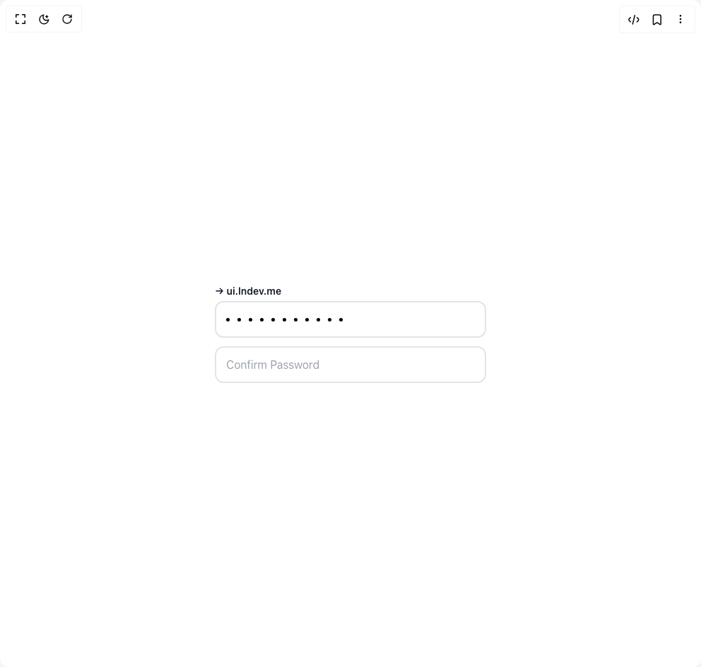

# Build Assisted Password Confirmation in BuilderStudio

> Build this component in our Agentic IDE: [BuilderStudio](https://builderstudio.dev).
>
> Join the BuilderStudio community on [Discord](https://discord.gg/QdWeSGCqfe) and [Reddit](https://reddit.com/r/builderstudio).



## Component

- Author group: `ln-dev7`
- Component: `assisted-password-confirmation`
- Variant: `default`
- Rendered HTML snapshot: [`rendered.html`](rendered.html)

## BuilderStudio prompt

You are implementing a React component based on a component reference.

## Component identity

- Author: ln-dev7
- Component slug: assisted-password-confirmation
- Demo slug: default
- Title: assisted-password-confirmation
- Description: 

## Goal

Recreate this component in a React + TypeScript + Tailwind CSS project. Preserve the visual layout, spacing, colors, border radius, shadows, interaction behavior, animation behavior, responsive behavior, and dark mode behavior shown in the rendered demo.

## Implementation requirements

- Use React and TypeScript.
- Use Tailwind CSS classes whenever possible.
- Keep the component self-contained unless the source files require helper components.
- If the source uses CSS variables, custom CSS, animations, or keyframes, include them.
- If the source uses external packages, list and use the required packages.
- Preserve accessibility attributes, button semantics, links, keyboard behavior, and ARIA attributes when visible in the source.
- Do not replace the component with a simplified placeholder.
- Return complete production-ready code.

## Dependencies

No reference metadata available.

## Rendered DOM snapshot

This is the rendered demo HTML extracted from the live preview. Use it to verify structure, class names, visible content, and layout.

```html
<div id="root"><div class="relative flex items-center justify-center h-screen w-full m-auto p-16 bg-background text-foreground"><div class="absolute lab-bg inset-0 size-full"><div class="absolute inset-0 bg-[radial-gradient(#00000021_1px,transparent_1px)] dark:bg-[radial-gradient(#ffffff22_1px,transparent_1px)]"></div></div><div class="flex w-full justify-center relative"><main class="relative flex min-h-screen w-full items-start justify-center px-4 py-10 md:items-center"><div class="z-10 flex w-full flex-col items-center"><div class="mx-auto flex h-full w-full max-w-lg flex-col items-center justify-center gap-8 bg-white p-16 rounded-2xl"><div class="relative flex w-full flex-col items-start justify-center"><span class="text-sm text-gray-900 font-semibold">→ ui.lndev.me</span><div class="mb-3 mt-1 h-[52px] w-full rounded-xl border-2 bg-white px-2 py-2" style="transform: none;"><div class="relative h-full w-fit overflow-hidden rounded-lg"><div class="z-10 flex h-full items-center justify-center bg-transparent px-0 py-1 tracking-[0.15em]"><div class="flex h-full w-4 shrink-0 items-center justify-center"><span class="size-[5px] rounded-full bg-black"></span></div><div class="flex h-full w-4 shrink-0 items-center justify-center"><span class="size-[5px] rounded-full bg-black"></span></div><div class="flex h-full w-4 shrink-0 items-center justify-center"><span class="size-[5px] rounded-full bg-black"></span></div><div class="flex h-full w-4 shrink-0 items-center justify-center"><span class="size-[5px] rounded-full bg-black"></span></div><div class="flex h-full w-4 shrink-0 items-center justify-center"><span class="size-[5px] rounded-full bg-black"></span></div><div class="flex h-full w-4 shrink-0 items-center justify-center"><span class="size-[5px] rounded-full bg-black"></span></div><div class="flex h-full w-4 shrink-0 items-center justify-center"><span class="size-[5px] rounded-full bg-black"></span></div><div class="flex h-full w-4 shrink-0 items-center justify-center"><span class="size-[5px] rounded-full bg-black"></span></div><div class="flex h-full w-4 shrink-0 items-center justify-center"><span class="size-[5px] rounded-full bg-black"></span></div><div class="flex h-full w-4 shrink-0 items-center justify-center"><span class="size-[5px] rounded-full bg-black"></span></div><div class="flex h-full w-4 shrink-0 items-center justify-center"><span class="size-[5px] rounded-full bg-black"></span></div></div><div class="absolute bottom-0 left-0 top-0 z-0 flex h-full w-full items-center justify-start"><div class="ease absolute h-full w-4 transition-all duration-300 " style="left: 0px; transform-origin: left center; transform: scaleX(0);"></div><div class="ease absolute h-full w-4 transition-all duration-300 " style="left: 16px; transform-origin: left center; transform: scaleX(0);"></div><div class="ease absolute h-full w-4 transition-all duration-300 " style="left: 32px; transform-origin: left center; transform: scaleX(0);"></div><div class="ease absolute h-full w-4 transition-all duration-300 " style="left: 48px; transform-origin: left center; transform: scaleX(0);"></div><div class="ease absolute h-full w-4 transition-all duration-300 " style="left: 64px; transform-origin: left center; transform: scaleX(0);"></div><div class="ease absolute h-full w-4 transition-all duration-300 " style="left: 80px; transform-origin: left center; transform: scaleX(0);"></div><div class="ease absolute h-full w-4 transition-all duration-300 " style="left: 96px; transform-origin: left center; transform: scaleX(0);"></div><div class="ease absolute h-full w-4 transition-all duration-300 " style="left: 112px; transform-origin: left center; transform: scaleX(0);"></div><div class="ease absolute h-full w-4 transition-all duration-300 " style="left: 128px; transform-origin: left center; transform: scaleX(0);"></div><div class="ease absolute h-full w-4 transition-all duration-300 " style="left: 144px; transform-origin: left center; transform: scaleX(0);"></div><div class="ease absolute h-full w-4 transition-all duration-300 " style="left: 160px; transform-origin: left center; transform: scaleX(0);"></div></div></div></div><div class="h-[52px] w-full overflow-hidden rounded-xl" style="transform: none;"><input class="h-full w-full rounded-xl border-2 bg-white px-3.5 py-3 tracking-[0.4em] outline-none placeholder:tracking-normal focus:border-slate-900 text-gray-900" placeholder="Confirm Password" type="password" value=""></div></div></div></div></main></div></div></div>
```

## Reference source files

No reference source files were available.
