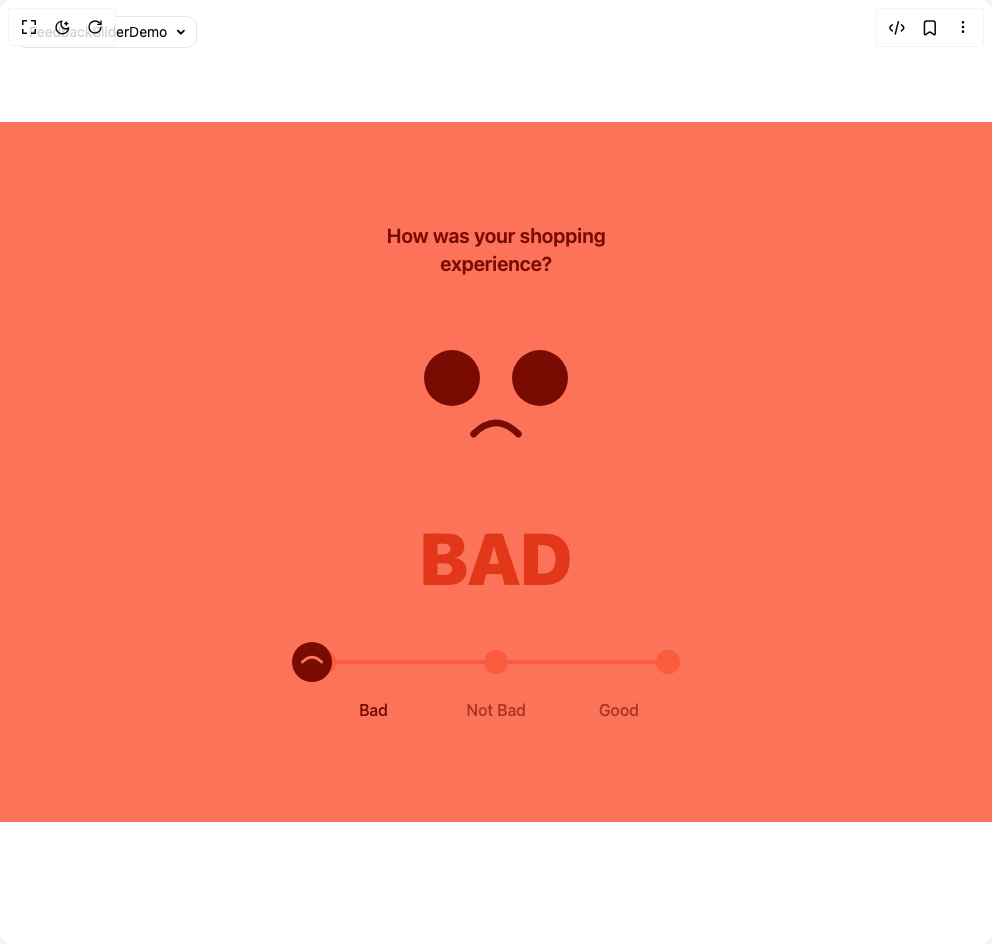

# Build Feedback Slider in BuilderStudio

> Build this component in our Agentic IDE: [BuilderStudio](https://builderstudio.dev).
>
> Join the BuilderStudio community on [Discord](https://discord.gg/QdWeSGCqfe) and [Reddit](https://reddit.com/r/builderstudio).



## Component

- Author group: `ln-dev7`
- Component: `feedback-slider`
- Variant: `default`
- Rendered HTML snapshot: [`rendered.html`](rendered.html)

## BuilderStudio prompt

You are implementing a React component based on a component reference.

## Component identity

- Author: ln-dev7
- Component slug: feedback-slider
- Demo slug: default
- Title: feedback-slider
- Description: 

## Goal

Recreate this component in a React + TypeScript + Tailwind CSS project. Preserve the visual layout, spacing, colors, border radius, shadows, interaction behavior, animation behavior, responsive behavior, and dark mode behavior shown in the rendered demo.

## Implementation requirements

- Use React and TypeScript.
- Use Tailwind CSS classes whenever possible.
- Keep the component self-contained unless the source files require helper components.
- If the source uses CSS variables, custom CSS, animations, or keyframes, include them.
- If the source uses external packages, list and use the required packages.
- Preserve accessibility attributes, button semantics, links, keyboard behavior, and ARIA attributes when visible in the source.
- Do not replace the component with a simplified placeholder.
- Return complete production-ready code.

## Dependencies

No reference metadata available.

## Rendered DOM snapshot

This is the rendered demo HTML extracted from the live preview. Use it to verify structure, class names, visible content, and layout.

```html
<div id="root"><div class="fixed top-4 left-4 z-10"><select class="appearance-none h-8 max-w-[200px] text-sm leading-tight rounded-lg pl-3 pr-7 py-0 border bg-background focus:outline-none focus:ring-0"><option value="named_DemoOne_FeedbackSliderDemo">FeedbackSliderDemo</option></select><div class="absolute top-1/2 transform -translate-y-1/2 right-2 pointer-events-none"><svg class="w-4 h-4 fill-current" viewBox="0 0 20 20"><path d="M5.516 7.548c.436-.446 1.043-.48 1.576 0L10 10.405l2.908-2.857c.533-.48 1.14-.446 1.576 0 .436.445.408 1.197 0 1.615l-3.734 3.705c-.533.534-1.39.534-1.923 0l-3.734-3.705c-.408-.418-.436-1.17 0-1.615z"></path></svg></div></div><div class="w-screen min-h-screen flex justify-center items-center"><div class="w-full h-[700px] flex items-center justify-center overflow-hidden"><div class="relative flex h-screen w-full items-center justify-center overflow-hidden h-full w-full" style="background-color: rgb(252, 115, 89);"><div class="flex h-full w-[400px] flex-col items-center justify-center p-4"><h3 class="mb-10 w-72 text-center text-xl font-semibold" style="color: rgb(121, 11, 2);">How was your shopping experience?</h3><div class="flex h-[176px] flex-col items-center justify-center"><div class="flex items-center justify-center gap-8"><div style="width: 56px; height: 56px; border-radius: 100%; background-color: rgb(121, 11, 2);"></div><div style="width: 56px; height: 56px; border-radius: 100%; background-color: rgb(121, 11, 2);"></div></div><div class="flex h-14 w-14 items-center justify-center" style="transform: rotate(180deg);"><svg width="100%" height="100%" viewBox="0 0 100 60" fill="none" xmlns="http://www.w3.org/2000/svg" style="stroke: rgb(121, 11, 2);"><path d="M10 30 Q50 70 90 30" stroke-width="12" stroke-linecap="round"></path></svg></div></div><div class="flex w-full items-center justify-start overflow-hidden pb-14 pt-7"><div class="flex w-full shrink-0" style="transform: none;"><div class="flex w-full shrink-0 items-center justify-center"><h1 class="text-7xl font-black" style="color: rgb(227, 55, 25);">BAD</h1></div><div class="flex w-full shrink-0 items-center justify-center"><h1 class="text-7xl font-black" style="color: rgb(179, 119, 22);">NOT BAD</h1></div><div class="flex w-full shrink-0 items-center justify-center"><h1 class="text-7xl font-black" style="color: rgb(110, 144, 29);">GOOD</h1></div></div></div><div class="w-full"><div class="relative flex w-full items-center justify-between"><button class="z-[2] h-6 w-6 rounded-full" style="background-color: rgb(252, 91, 62);"></button><button class="z-[2] h-6 w-6 rounded-full" style="background-color: rgb(252, 91, 62);"></button><button class="z-[2] h-6 w-6 rounded-full" style="background-color: rgb(252, 91, 62);"></button><div class="absolute top-1/2 h-1 w-full -translate-y-1/2" style="background-color: rgb(252, 91, 62);"></div><div class="absolute z-[3] flex h-10 w-10 -translate-x-1/2 items-center justify-center rounded-full p-2" style="left: 0%; background-color: rgb(121, 11, 2); transform: rotate(180deg);"><svg width="100%" height="100%" viewBox="0 0 100 60" fill="none" xmlns="http://www.w3.org/2000/svg" style="stroke: rgb(252, 115, 89);"><path d="M10 30 Q50 70 90 30" stroke-width="12" stroke-linecap="round"></path></svg></div></div><div class="flex w-full items-center justify-between pt-6"><span class="w-full text-center font-medium" style="color: rgb(121, 11, 2); opacity: 1;">Bad</span><span class="w-full text-center font-medium" style="color: rgb(121, 11, 2); opacity: 0.6;">Not Bad</span><span class="w-full text-center font-medium" style="color: rgb(121, 11, 2); opacity: 0.6;">Good</span></div></div></div></div></div></div></div>
```

## Reference source files

No reference source files were available.
