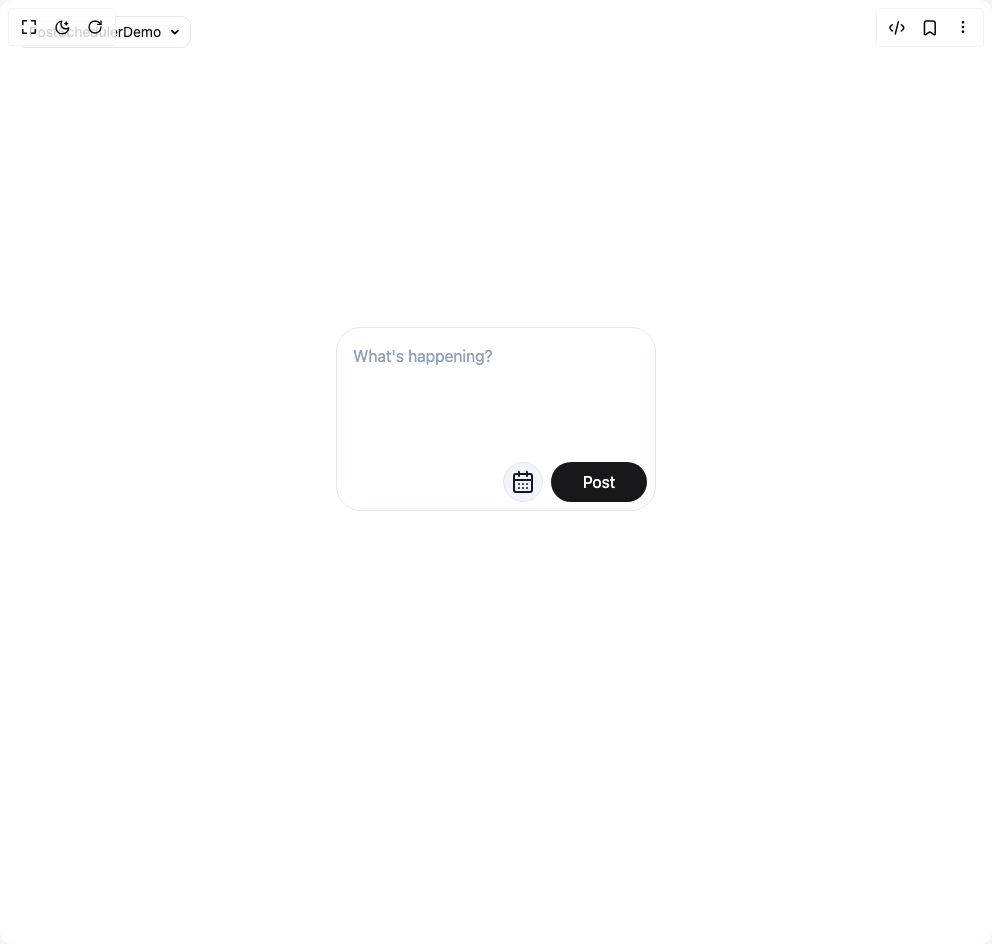

# Build Post Scheduler in BuilderStudio

> Build this component in our Agentic IDE: [BuilderStudio](https://builderstudio.dev).
>
> Join the BuilderStudio community on [Discord](https://discord.gg/QdWeSGCqfe) and [Reddit](https://reddit.com/r/builderstudio).



## Component

- Author group: `ln-dev7`
- Component: `post-scheduler`
- Variant: `default`
- Rendered HTML snapshot: [`rendered.html`](rendered.html)

## BuilderStudio prompt

You are implementing a React component based on a component reference.

## Component identity

- Author: ln-dev7
- Component slug: post-scheduler
- Demo slug: default
- Title: post-scheduler
- Description: 

## Goal

Recreate this component in a React + TypeScript + Tailwind CSS project. Preserve the visual layout, spacing, colors, border radius, shadows, interaction behavior, animation behavior, responsive behavior, and dark mode behavior shown in the rendered demo.

## Implementation requirements

- Use React and TypeScript.
- Use Tailwind CSS classes whenever possible.
- Keep the component self-contained unless the source files require helper components.
- If the source uses CSS variables, custom CSS, animations, or keyframes, include them.
- If the source uses external packages, list and use the required packages.
- Preserve accessibility attributes, button semantics, links, keyboard behavior, and ARIA attributes when visible in the source.
- Do not replace the component with a simplified placeholder.
- Return complete production-ready code.

## Dependencies

No reference metadata available.

## Rendered DOM snapshot

This is the rendered demo HTML extracted from the live preview. Use it to verify structure, class names, visible content, and layout.

```html
<div id="root"><div class="fixed top-4 left-4 z-10"><select class="appearance-none h-8 max-w-[200px] text-sm leading-tight rounded-lg pl-3 pr-7 py-0 border bg-background focus:outline-none focus:ring-0"><option value="named_DemoOne_PostSchedulerDemo">PostSchedulerDemo</option></select><div class="absolute top-1/2 transform -translate-y-1/2 right-2 pointer-events-none"><svg class="w-4 h-4 fill-current" viewBox="0 0 20 20"><path d="M5.516 7.548c.436-.446 1.043-.48 1.576 0L10 10.405l2.908-2.857c.533-.48 1.14-.446 1.576 0 .436.445.408 1.197 0 1.615l-3.734 3.705c-.533.534-1.39.534-1.923 0l-3.734-3.705c-.408-.418-.436-1.17 0-1.615z"></path></svg></div></div><div class="w-screen min-h-screen flex justify-center items-center"><div class="flex h-[450px] w-full items-start justify-center bg-background p-10 pt-20"><div class="relative undefined"><div class="relative z-10 w-80 border border-slate-200 bg-white text-slate-900 dark:border-slate-200 dark:bg-white dark:text-slate-900" style="border-radius: 25px;"><div class="p-2"><textarea placeholder="What's happening?" class="w-full resize-none bg-white p-2 outline-none placeholder:text-slate-400 dark:bg-white dark:placeholder:text-slate-400"></textarea></div><div class="relative pt-10"><div class="relative flex items-center justify-end gap-2 p-2"><button class="flex size-10 items-center justify-center border border-slate-200 bg-slate-100 transition-opacity duration-300 dark:border-slate-200 dark:bg-slate-100" style="border-radius: 25px; opacity: 1;"><svg xmlns="http://www.w3.org/2000/svg" width="24" height="24" viewBox="0 0 24 24" fill="none" stroke="currentColor" stroke-width="2" stroke-linecap="round" stroke-linejoin="round" class="lucide lucide-calendar-days" aria-hidden="true"><path d="M8 2v4"></path><path d="M16 2v4"></path><rect width="18" height="18" x="3" y="4" rx="2"></rect><path d="M3 10h18"></path><path d="M8 14h.01"></path><path d="M12 14h.01"></path><path d="M16 14h.01"></path><path d="M8 18h.01"></path><path d="M12 18h.01"></path><path d="M16 18h.01"></path></svg></button><button class="bg-zinc-900 py-2 px-8 text-white dark:bg-zinc-900" style="border-radius: 25px; opacity: 1;">Post</button></div></div></div></div></div></div></div>
```

## Reference source files

No reference source files were available.
