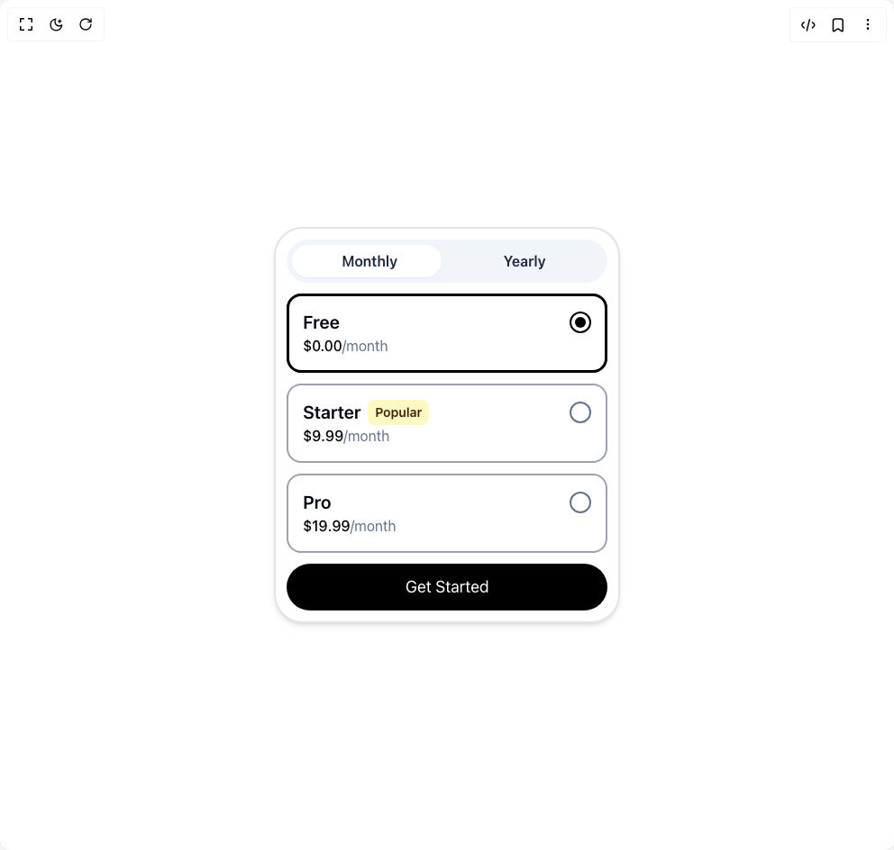

# Build Pricing Interaction in BuilderStudio

> Build this component in our Agentic IDE: [BuilderStudio](https://builderstudio.dev).
>
> Join the BuilderStudio community on [Discord](https://discord.gg/QdWeSGCqfe) and [Reddit](https://reddit.com/r/builderstudio).



## Component

- Author group: `ln-dev7`
- Component: `pricing-interaction`
- Variant: `default`
- Rendered HTML snapshot: [`rendered.html`](rendered.html)

## BuilderStudio prompt

You are implementing a React component based on a component reference.

## Component identity

- Author: ln-dev7
- Component slug: pricing-interaction
- Demo slug: default
- Title: pricing-interaction
- Description: 

## Goal

Recreate this component in a React + TypeScript + Tailwind CSS project. Preserve the visual layout, spacing, colors, border radius, shadows, interaction behavior, animation behavior, responsive behavior, and dark mode behavior shown in the rendered demo.

## Implementation requirements

- Use React and TypeScript.
- Use Tailwind CSS classes whenever possible.
- Keep the component self-contained unless the source files require helper components.
- If the source uses CSS variables, custom CSS, animations, or keyframes, include them.
- If the source uses external packages, list and use the required packages.
- Preserve accessibility attributes, button semantics, links, keyboard behavior, and ARIA attributes when visible in the source.
- Do not replace the component with a simplified placeholder.
- Return complete production-ready code.

## Dependencies

No reference metadata available.

## Rendered DOM snapshot

This is the rendered demo HTML extracted from the live preview. Use it to verify structure, class names, visible content, and layout.

```html
<div id="root"><div class="relative flex items-center justify-center h-screen w-full m-auto p-16 bg-background text-foreground"><div class="absolute lab-bg inset-0 size-full"><div class="absolute inset-0 bg-[radial-gradient(#00000021_1px,transparent_1px)] dark:bg-[radial-gradient(#ffffff22_1px,transparent_1px)]"></div></div><div class="flex w-full justify-center relative"><div class="border-2 rounded-[32px] p-3 shadow-md max-w-sm w-full flex flex-col items-center gap-3 bg-white"><div class="rounded-full relative w-full bg-slate-100 p-1.5 flex items-center"><button class="font-semibold rounded-full w-full p-1.5 text-slate-800 z-20">Monthly</button><button class="font-semibold rounded-full w-full p-1.5 text-slate-800 z-20">Yearly</button><div class="p-1.5 flex items-cnter justify-center absolute inset-0 w-1/2 z-10" style="transform: translateX(0%); transition: transform 0.3s;"><div class="bg-white shadow-sm rounded-full w-full h-full"></div></div></div><div class="w-full relative flex flex-col items-center justify-center gap-3"><div class="w-full flex justify-between cursor-pointer border-2 border-gray-400 p-4 rounded-2xl"><div class="flex flex-col items-start"><p class="font-semibold text-xl text-gray-950">Free</p><p class="text-slate-500 text-md"><span class="text-black font-medium">$0.00</span>/month</p></div><div class="border-2 border-slate-500 size-6 rounded-full mt-0.5 p-1 flex items-center justify-center" style="border-color: rgb(0, 0, 0); transition: border-color 0.3s;"><div class="size-3 bg-black rounded-full" style="opacity: 1; transition: opacity 0.3s;"></div></div></div><div class="w-full flex justify-between cursor-pointer border-2 border-gray-400 p-4 rounded-2xl"><div class="flex flex-col items-start"><p class="font-semibold text-xl flex items-center gap-2 text-gray-950">Starter <span class="py-1 px-2 block rounded-lg bg-yellow-100 text-yellow-950 text-sm">Popular</span></p><p class="text-slate-500 text-md flex"><span class="text-black font-medium flex items-center">$ <number-flow-react class="text-black font-medium"></number-flow-react></span>/month</p></div><div class="border-2 border-slate-500 size-6 rounded-full mt-0.5 p-1 flex items-center justify-center" style="border-color: rgb(100, 116, 139); transition: border-color 0.3s;"><div class="size-3 bg-black rounded-full" style="opacity: 0; transition: opacity 0.3s;"></div></div></div><div class="w-full flex justify-between cursor-pointer border-2 border-gray-400 p-4 rounded-2xl"><div class="flex flex-col items-start"><p class="font-semibold text-xl text-gray-950">Pro</p><p class="text-slate-500 text-md flex"><span class="text-black font-medium flex items-center">$ <number-flow-react class="text-black font-medium"></number-flow-react></span>/month</p></div><div class="border-2 border-slate-500 size-6 rounded-full mt-0.5 p-1 flex items-center justify-center" style="border-color: rgb(100, 116, 139); transition: border-color 0.3s;"><div class="size-3 bg-black rounded-full" style="opacity: 0; transition: opacity 0.3s;"></div></div></div><div class="w-full h-[88px] absolute top-0 border-[3px] border-black rounded-2xl" style="transform: translateY(0px); transition: transform 0.3s;"></div></div><button class="rounded-full bg-black text-lg text-white w-full p-3 active:scale-95 transition-transform duration-300">Get Started</button></div></div></div></div>
```

## Reference source files

No reference source files were available.
