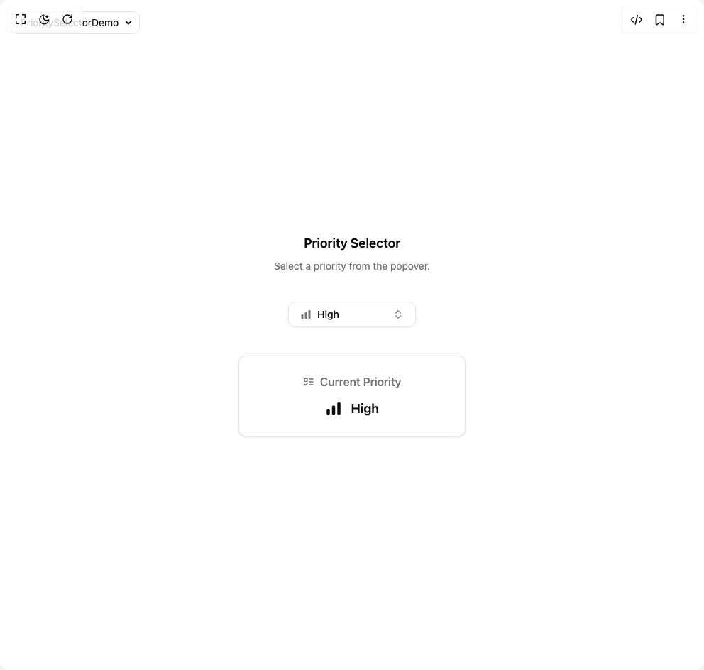

# Build Priority Selector in BuilderStudio

> Build this component in our Agentic IDE: [BuilderStudio](https://builderstudio.dev).
>
> Join the BuilderStudio community on [Discord](https://discord.gg/QdWeSGCqfe) and [Reddit](https://reddit.com/r/builderstudio).



## Component

- Author group: `ln-dev7`
- Component: `priority-selector`
- Variant: `default`
- Rendered HTML snapshot: [`rendered.html`](rendered.html)

## BuilderStudio prompt

You are implementing a React component based on a component reference.

## Component identity

- Author: ln-dev7
- Component slug: priority-selector
- Demo slug: default
- Title: priority-selector
- Description: 

## Goal

Recreate this component in a React + TypeScript + Tailwind CSS project. Preserve the visual layout, spacing, colors, border radius, shadows, interaction behavior, animation behavior, responsive behavior, and dark mode behavior shown in the rendered demo.

## Implementation requirements

- Use React and TypeScript.
- Use Tailwind CSS classes whenever possible.
- Keep the component self-contained unless the source files require helper components.
- If the source uses CSS variables, custom CSS, animations, or keyframes, include them.
- If the source uses external packages, list and use the required packages.
- Preserve accessibility attributes, button semantics, links, keyboard behavior, and ARIA attributes when visible in the source.
- Do not replace the component with a simplified placeholder.
- Return complete production-ready code.

## Dependencies

No reference metadata available.

## Rendered DOM snapshot

This is the rendered demo HTML extracted from the live preview. Use it to verify structure, class names, visible content, and layout.

```html
<div id="root"><div class="fixed top-4 left-4 z-10"><select class="appearance-none h-8 max-w-[200px] text-sm leading-tight rounded-lg pl-3 pr-7 py-0 border bg-background focus:outline-none focus:ring-0"><option value="named_DemoOne_PrioritySelectorDemo">PrioritySelectorDemo</option></select><div class="absolute top-1/2 transform -translate-y-1/2 right-2 pointer-events-none"><svg class="w-4 h-4 fill-current" viewBox="0 0 20 20"><path d="M5.516 7.548c.436-.446 1.043-.48 1.576 0L10 10.405l2.908-2.857c.533-.48 1.14-.446 1.576 0 .436.445.408 1.197 0 1.615l-3.734 3.705c-.533.534-1.39.534-1.923 0l-3.734-3.705c-.408-.418-.436-1.17 0-1.615z"></path></svg></div></div><div class="w-screen min-h-screen flex justify-center items-center"><div class="flex w-full flex-col items-center justify-center gap-10 p-4"><div class="flex flex-col items-center gap-2 text-center"><h2 class="text-lg font-semibold">Priority Selector</h2><p class="text-sm text-muted-foreground">Select a priority from the popover.</p></div><div class=""><button class="inline-flex items-center whitespace-nowrap rounded-lg text-sm font-medium transition-colors outline-offset-2 focus-visible:outline-2 focus-visible:outline-ring/70 disabled:pointer-events-none disabled:opacity-50 [&amp;_svg]:pointer-events-none [&amp;_svg]:shrink-0 border border-input bg-background shadow-sm shadow-black/5 hover:bg-accent hover:text-accent-foreground h-9 px-4 py-2 w-[180px] justify-between" role="combobox" aria-expanded="false" type="button" aria-haspopup="dialog" aria-controls="radix-«r0»" data-state="closed"><div class="flex items-center gap-2"><svg width="16" height="16" viewBox="0 0 16 16" fill="currentColor" class="size-4 text-muted-foreground" aria-label="High Priority" role="img" focusable="false" xmlns="http://www.w3.org/2000/svg"><rect x="1.5" y="8" width="3" height="6" rx="1"></rect><rect x="6.5" y="5" width="3" height="9" rx="1"></rect><rect x="11.5" y="2" width="3" height="12" rx="1"></rect></svg><span>High</span></div><svg xmlns="http://www.w3.org/2000/svg" width="24" height="24" viewBox="0 0 24 24" fill="none" stroke="currentColor" stroke-width="2" stroke-linecap="round" stroke-linejoin="round" class="lucide lucide-chevrons-up-down ml-2 size-4 shrink-0 opacity-50" aria-hidden="true"><path d="m7 15 5 5 5-5"></path><path d="m7 9 5-5 5 5"></path></svg></button></div><div class="flex w-full max-w-xs flex-col items-center gap-3 rounded-lg border bg-background p-6 shadow-sm"><h3 class="flex items-center text-base font-medium text-muted-foreground"><svg xmlns="http://www.w3.org/2000/svg" width="24" height="24" viewBox="0 0 24 24" fill="none" stroke="currentColor" stroke-width="2" stroke-linecap="round" stroke-linejoin="round" class="lucide lucide-list-todo mr-2 size-4" aria-hidden="true"><rect x="3" y="5" width="6" height="6" rx="1"></rect><path d="m3 17 2 2 4-4"></path><path d="M13 6h8"></path><path d="M13 12h8"></path><path d="M13 18h8"></path></svg>Current Priority</h3><div class="flex items-center gap-3 text-lg font-semibold"><svg width="16" height="16" viewBox="0 0 16 16" fill="currentColor" class="size-6 text-foreground" aria-label="High Priority" role="img" focusable="false" xmlns="http://www.w3.org/2000/svg"><rect x="1.5" y="8" width="3" height="6" rx="1"></rect><rect x="6.5" y="5" width="3" height="9" rx="1"></rect><rect x="11.5" y="2" width="3" height="12" rx="1"></rect></svg><span>High</span></div></div></div></div></div>
```

## Reference source files

No reference source files were available.
