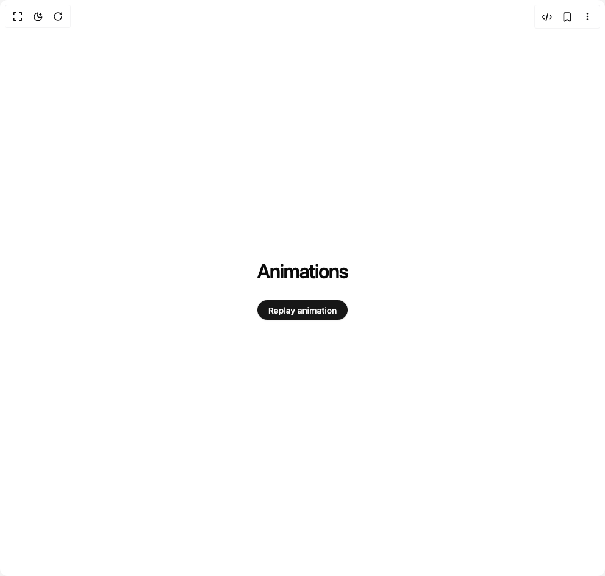

# Build Text Reveal Animation in BuilderStudio

> Build this component in our Agentic IDE: [BuilderStudio](https://builderstudio.dev).
>
> Join the BuilderStudio community on [Discord](https://discord.gg/QdWeSGCqfe) and [Reddit](https://reddit.com/r/builderstudio).



## Component

- Author group: `m.kumailalirajpoot`
- Component: `text-reveal-animation`
- Variant: `default`
- Rendered HTML snapshot: [`rendered.html`](rendered.html)

## BuilderStudio prompt

You are implementing a React component based on a component reference.

## Component identity

- Author: m.kumailalirajpoot
- Component slug: text-reveal-animation
- Demo slug: default
- Title: text-reveal-animation
- Description: 

## Goal

Recreate this component in a React + TypeScript + Tailwind CSS project. Preserve the visual layout, spacing, colors, border radius, shadows, interaction behavior, animation behavior, responsive behavior, and dark mode behavior shown in the rendered demo.

## Implementation requirements

- Use React and TypeScript.
- Use Tailwind CSS classes whenever possible.
- Keep the component self-contained unless the source files require helper components.
- If the source uses CSS variables, custom CSS, animations, or keyframes, include them.
- If the source uses external packages, list and use the required packages.
- Preserve accessibility attributes, button semantics, links, keyboard behavior, and ARIA attributes when visible in the source.
- Do not replace the component with a simplified placeholder.
- Return complete production-ready code.

## Dependencies

No reference metadata available.

## Rendered DOM snapshot

This is the rendered demo HTML extracted from the live preview. Use it to verify structure, class names, visible content, and layout.

```html
<div id="root"><div class="w-screen min-h-screen flex justify-center items-center"><div class="w-screen min-h-screen flex justify-center items-center"><div><div><h1 class="h1"><span style="--index: 0;">A</span><span style="--index: 1;">n</span><span style="--index: 2;">i</span><span style="--index: 3;">m</span><span style="--index: 4;">a</span><span style="--index: 5;">t</span><span style="--index: 6;">i</span><span style="--index: 7;">o</span><span style="--index: 8;">n</span><span style="--index: 9;">s</span></h1></div><button class="button">Replay animation</button><style>
.h1 {
  font-size: 32px;
  font-weight: 600;
  letter-spacing: -0.05em;
  animation: reveal 0.5s ease;
  overflow:hidden;
}
.h1 span {
  display: inline-block;
  opacity:0;
  color: var(--foreground);
  animation: reveal 0.5s ease-in-out forwards;
  animation-delay: calc(0.02s * var(--index))
}
.button {
  width: 100%;
  margin-top: 24px;
  position: relative;
  height: 32px;
  font-size: 14px;
  padding-inline: 12px;
  font-weight: 500;
  border-radius: 9999px;
  color: var(--primary-foreground);
  background-color: var(--primary);
  box-shadow:
    0 0 0 1px rgba(0, 0, 0, 0.08),
    0px 2px 2px rgba(0, 0, 0, 0.04);
}


@keyframes reveal {
  0% {
    transform: translateY(100%);
    opacity: 0;
  }100% {
    transform: translateY(0%);
    opacity: 1;
  }
}

</style></div></div></div></div>
```

## Reference source files

No reference source files were available.
