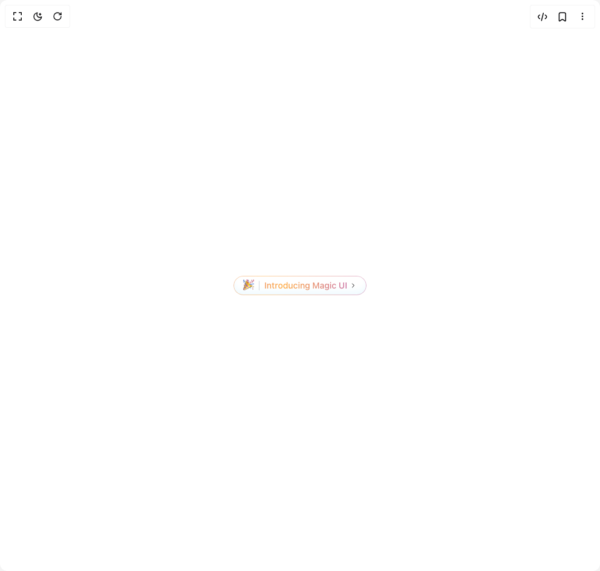
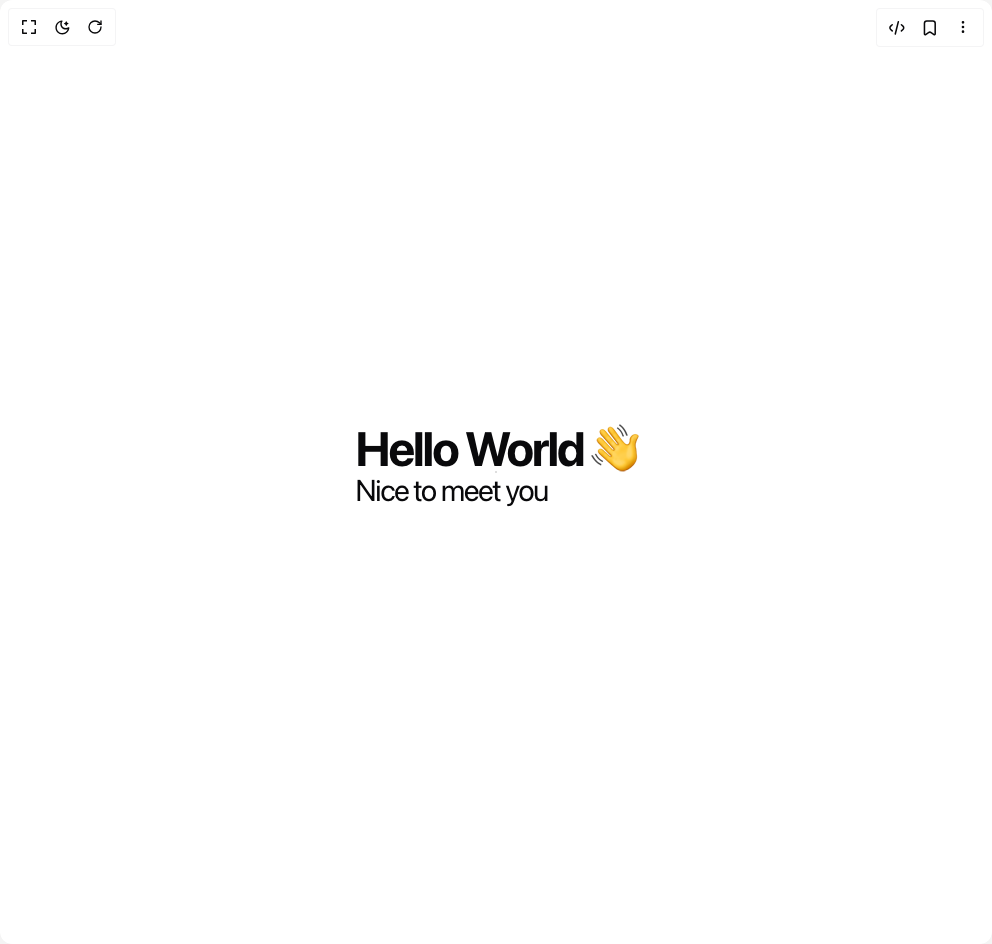
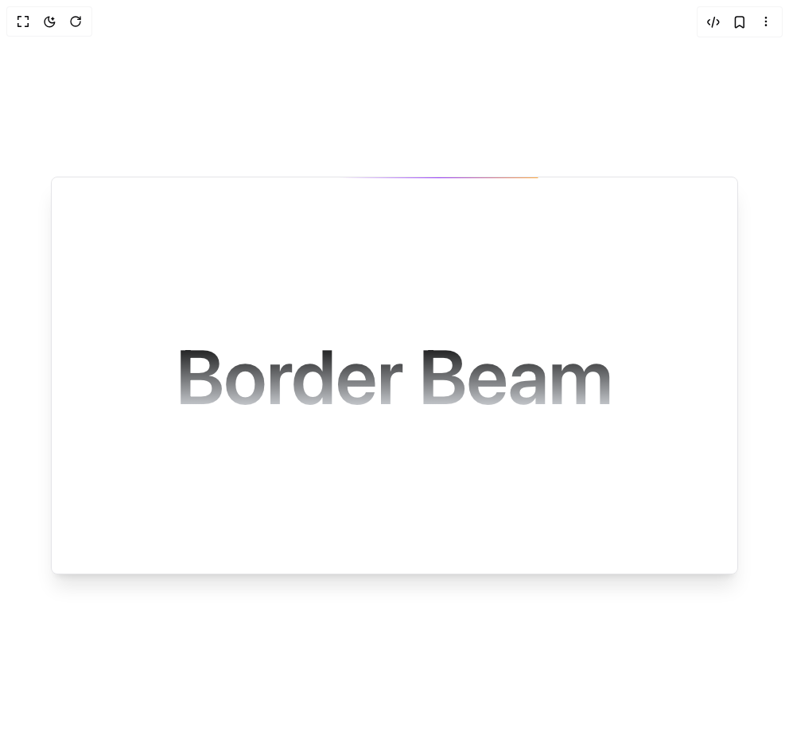
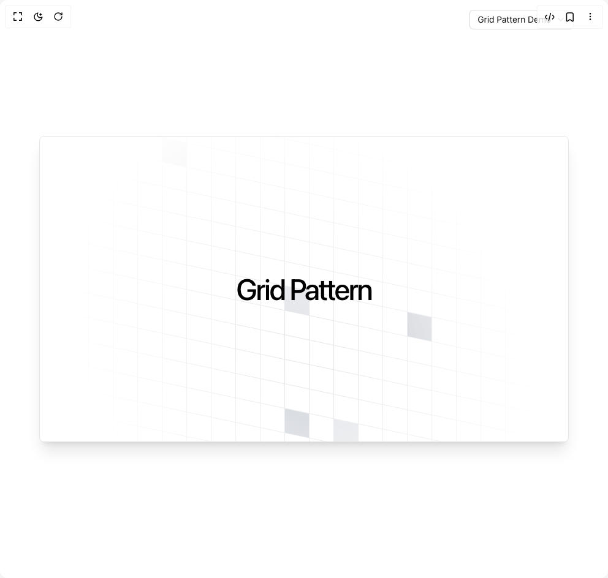
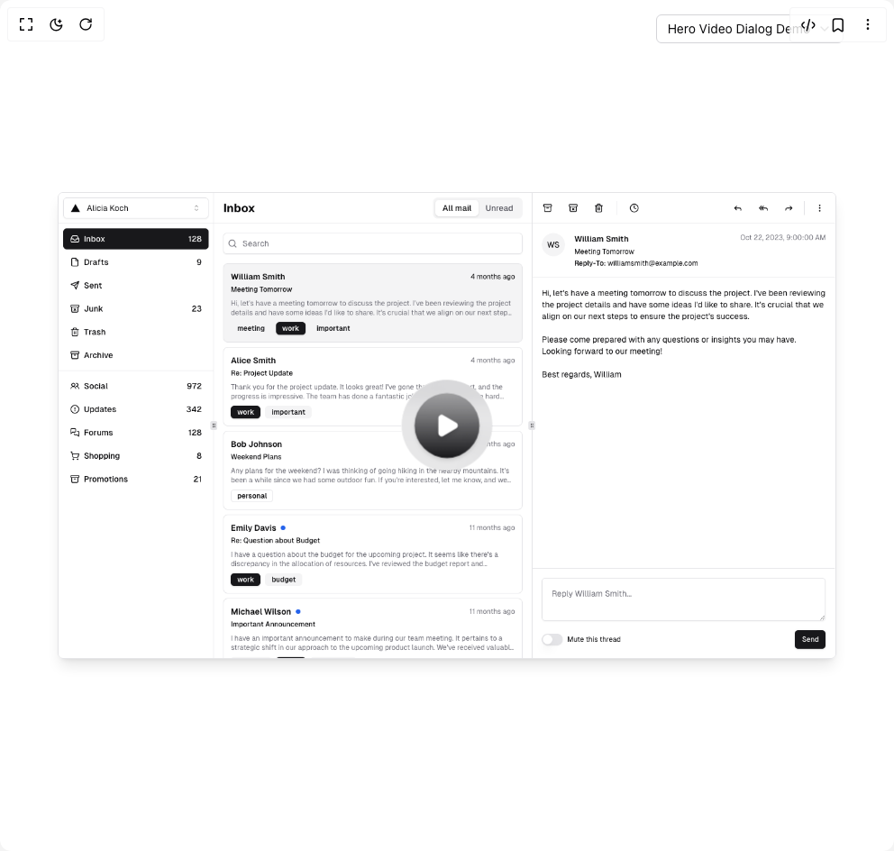
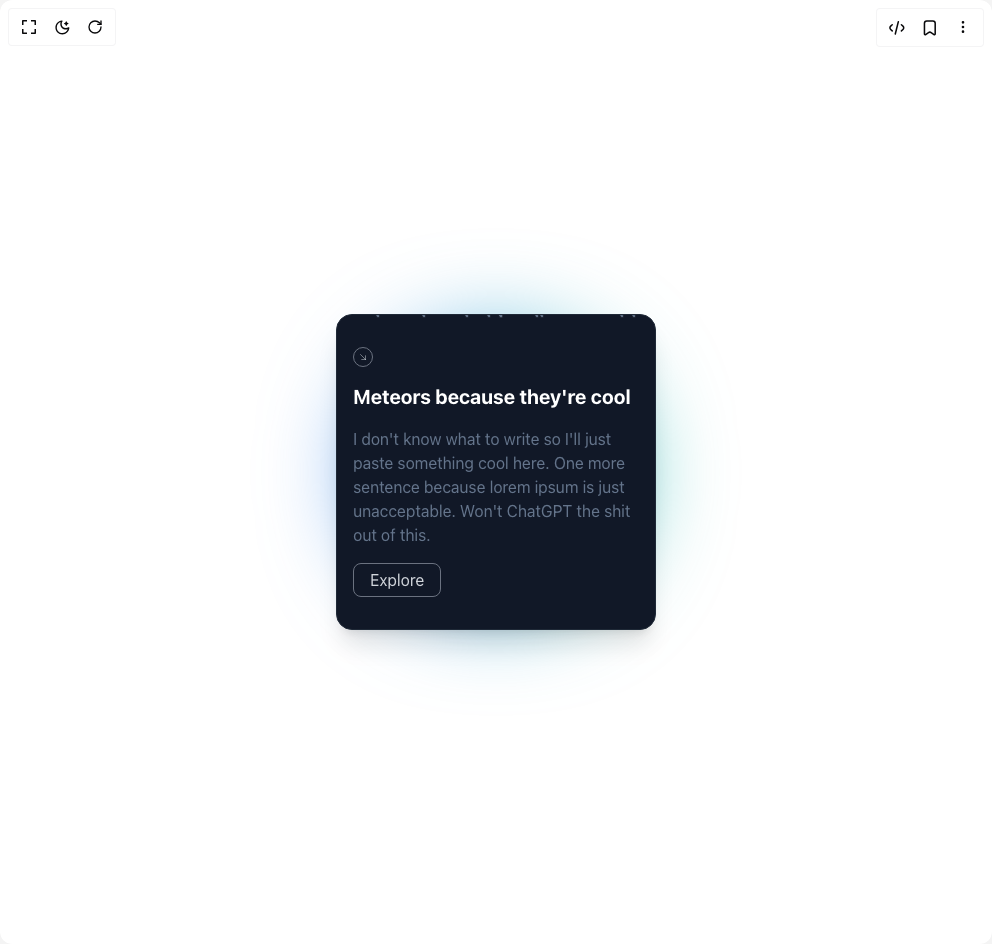
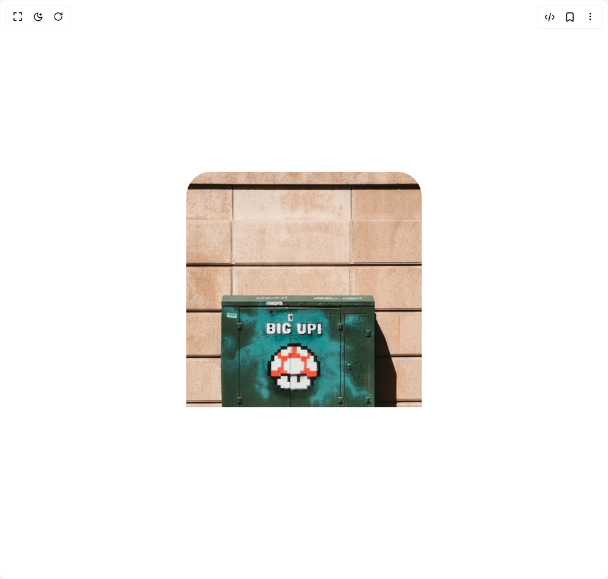
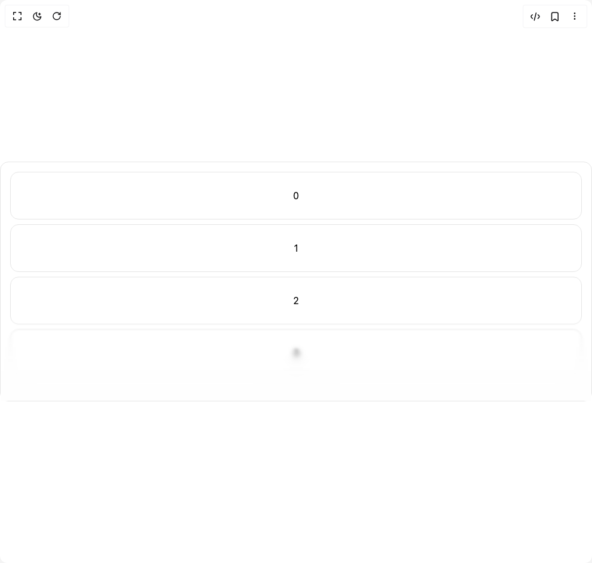
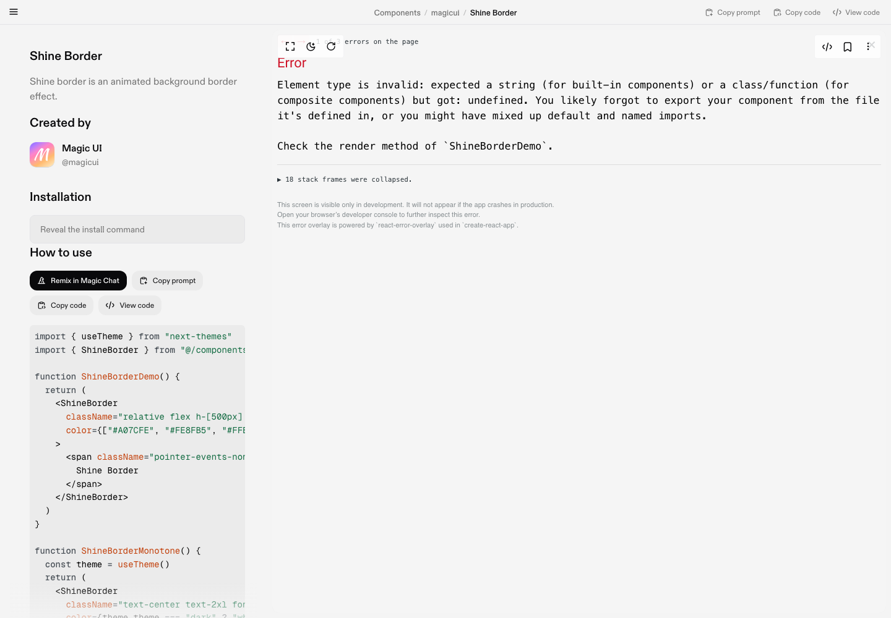
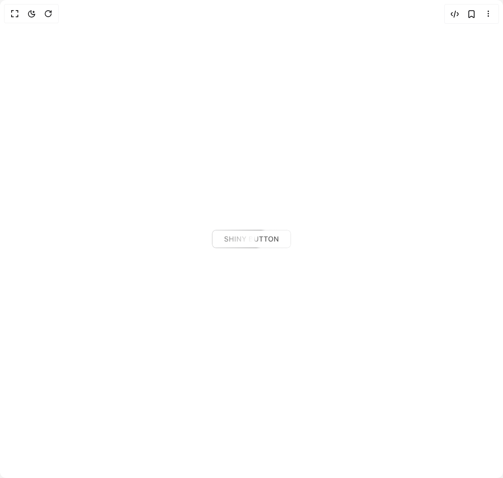

# Magicui Components

16 components are available in this author group.

> Build any component in [BuilderStudio](https://builderstudio.dev), then share improvements with the community on [Discord](https://discord.gg/QdWeSGCqfe) or [Reddit](https://reddit.com/r/builderstudio).

| Preview | Component | Variant |
| --- | --- | --- |
|  | [Animated Gradient Text](animated-gradient-text/default/README.md) | `default` |
|  | [Animated Shiny Text](animated-shiny-text/default/README.md) | `default` |
|  | [Blur Fade](blur-fade/default/README.md) | `default` |
|  | [Border Beam](border-beam/default/README.md) | `default` |
|  | [Comic Text](comic-text/default/README.md) | `default` |
|  | [Grid Pattern](grid-pattern/default/README.md) | `default` |
|  | [Hero Video Dialog](hero-video-dialog/default/README.md) | `default` |
|  | [Meteors](meteors/default/README.md) | `default` |
|  | [Pixel Image](pixel-image/default/README.md) | `default` |
|  | [Pointer](pointer/default/README.md) | `default` |
|  | [Progressive Blur](progressive-blur/default/README.md) | `default` |
|  | [Shine Border](shine-border/default/README.md) | `default` |
|  | [Shiny Button](shiny-button/default/README.md) | `default` |
|  | [Smooth Cursor](smooth-cursor/default/README.md) | `default` |
|  | [Sparkles Text](sparkles-text/default/README.md) | `default` |
|  | [Text Reveal](text-reveal/default/README.md) | `default` |
