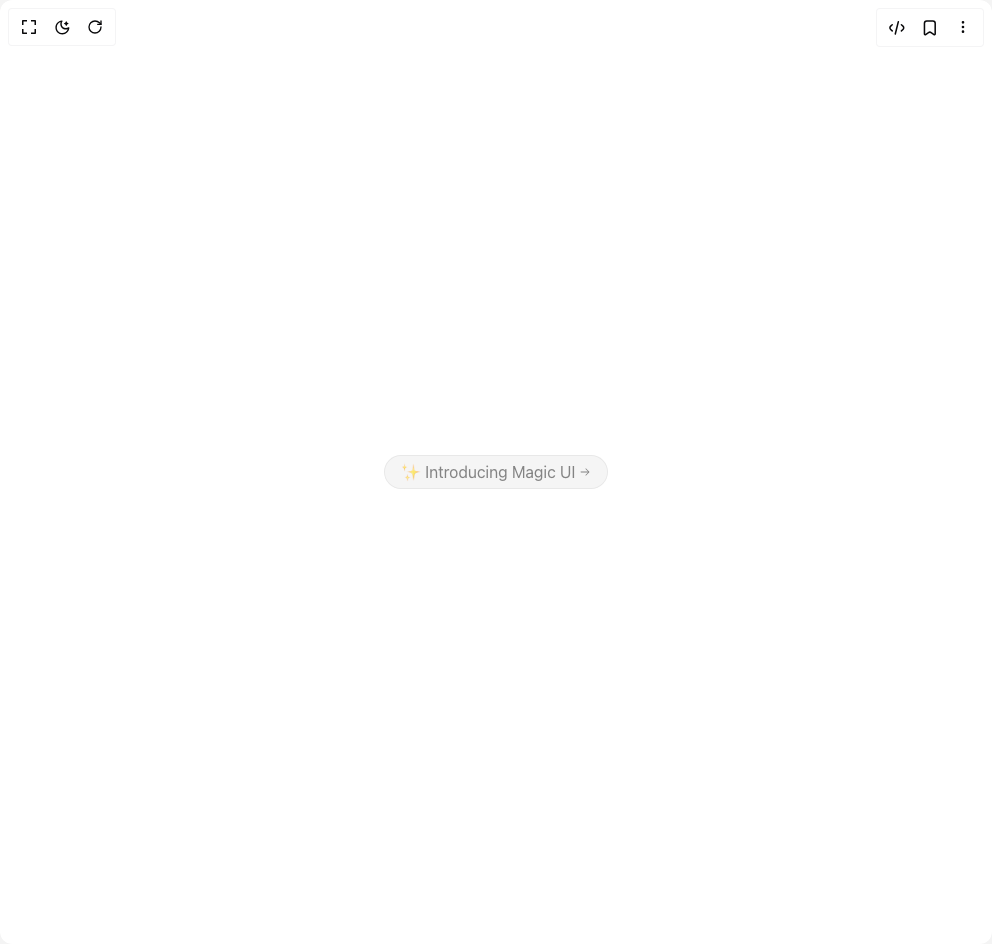

# Build Animated Shiny Text in BuilderStudio

> Build this component in our Agentic IDE: [BuilderStudio](https://builderstudio.dev).
>
> Join the BuilderStudio community on [Discord](https://discord.gg/QdWeSGCqfe) and [Reddit](https://reddit.com/r/builderstudio).



## Component

- Author group: `magicui`
- Component: `animated-shiny-text`
- Variant: `default`
- Rendered HTML snapshot: [`rendered.html`](rendered.html)

## BuilderStudio prompt

You are implementing a React component based on a component reference.

## Component identity

- Author: magicui
- Component slug: animated-shiny-text
- Demo slug: default
- Title: animated-shiny-text
- Description: 

## Goal

Recreate this component in a React + TypeScript + Tailwind CSS project. Preserve the visual layout, spacing, colors, border radius, shadows, interaction behavior, animation behavior, responsive behavior, and dark mode behavior shown in the rendered demo.

## Implementation requirements

- Use React and TypeScript.
- Use Tailwind CSS classes whenever possible.
- Keep the component self-contained unless the source files require helper components.
- If the source uses CSS variables, custom CSS, animations, or keyframes, include them.
- If the source uses external packages, list and use the required packages.
- Preserve accessibility attributes, button semantics, links, keyboard behavior, and ARIA attributes when visible in the source.
- Do not replace the component with a simplified placeholder.
- Return complete production-ready code.

## Dependencies

No reference metadata available.

## Rendered DOM snapshot

This is the rendered demo HTML extracted from the live preview. Use it to verify structure, class names, visible content, and layout.

```html
<div id="root"><div class="relative flex items-center justify-center h-screen w-full m-auto p-16 bg-background text-foreground"><div class="absolute lab-bg inset-0 size-full"><div class="absolute inset-0 bg-[radial-gradient(#00000021_1px,transparent_1px)] dark:bg-[radial-gradient(#ffffff22_1px,transparent_1px)]"></div></div><div class="flex w-full justify-center relative"><div class="z-10 flex min-h-64 items-center justify-center"><div class="group rounded-full border border-black/5 bg-neutral-100 text-base text-white transition-all ease-in hover:cursor-pointer hover:bg-neutral-200 dark:border-white/5 dark:bg-neutral-900 dark:hover:bg-neutral-800"><p class="mx-auto max-w-md text-neutral-600/70 dark:text-neutral-400/70 animate-shiny-text bg-clip-text bg-no-repeat [background-position:0_0] [background-size:var(--shiny-width)_100%] [transition:background-position_1s_cubic-bezier(.6,.6,0,1)_infinite] bg-gradient-to-r from-transparent via-black/80 via-50% to-transparent dark:via-white/80 inline-flex items-center justify-center px-4 py-1 transition ease-out hover:text-neutral-600 hover:duration-300 hover:dark:text-neutral-400" style="--shiny-width: 100px;"><span>✨ Introducing Magic UI</span><svg width="15" height="15" viewBox="0 0 15 15" fill="none" xmlns="http://www.w3.org/2000/svg" class="ml-1 size-3 transition-transform duration-300 ease-in-out group-hover:translate-x-0.5"><path d="M8.14645 3.14645C8.34171 2.95118 8.65829 2.95118 8.85355 3.14645L12.8536 7.14645C13.0488 7.34171 13.0488 7.65829 12.8536 7.85355L8.85355 11.8536C8.65829 12.0488 8.34171 12.0488 8.14645 11.8536C7.95118 11.6583 7.95118 11.3417 8.14645 11.1464L11.2929 8H2.5C2.22386 8 2 7.77614 2 7.5C2 7.22386 2.22386 7 2.5 7H11.2929L8.14645 3.85355C7.95118 3.65829 7.95118 3.34171 8.14645 3.14645Z" fill="currentColor" fill-rule="evenodd" clip-rule="evenodd"></path></svg></p></div></div></div></div></div>
```

## Reference source files

No reference source files were available.
