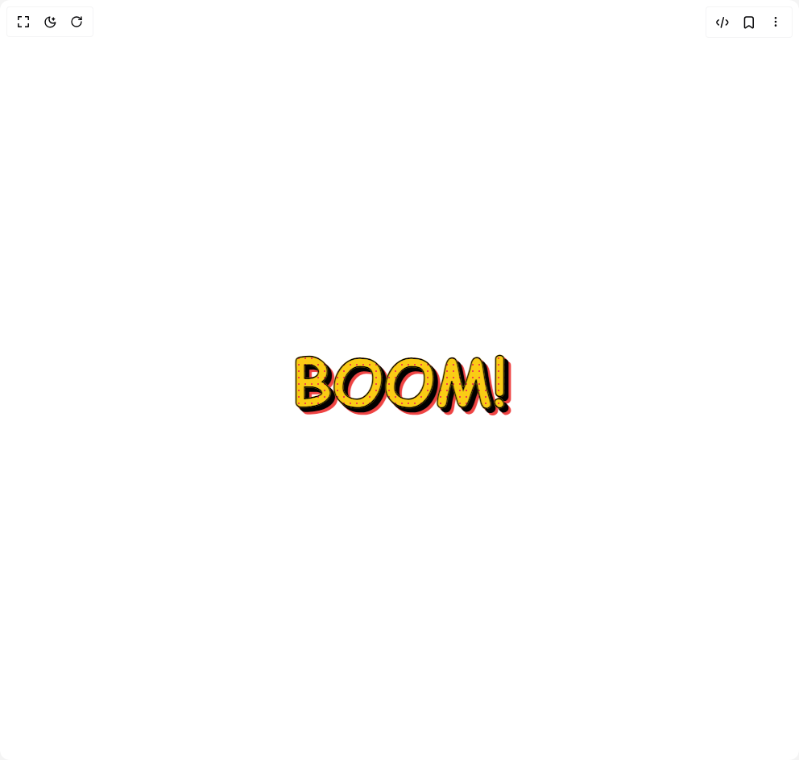

# Build Comic Text in BuilderStudio

> Build this component in our Agentic IDE: [BuilderStudio](https://builderstudio.dev).
>
> Join the BuilderStudio community on [Discord](https://discord.gg/QdWeSGCqfe) and [Reddit](https://reddit.com/r/builderstudio).



## Component

- Author group: `magicui`
- Component: `comic-text`
- Variant: `default`
- Rendered HTML snapshot: [`rendered.html`](rendered.html)

## BuilderStudio prompt

You are implementing a React component based on a component reference.

## Component identity

- Author: magicui
- Component slug: comic-text
- Demo slug: default
- Title: comic-text
- Description: 

## Goal

Recreate this component in a React + TypeScript + Tailwind CSS project. Preserve the visual layout, spacing, colors, border radius, shadows, interaction behavior, animation behavior, responsive behavior, and dark mode behavior shown in the rendered demo.

## Implementation requirements

- Use React and TypeScript.
- Use Tailwind CSS classes whenever possible.
- Keep the component self-contained unless the source files require helper components.
- If the source uses CSS variables, custom CSS, animations, or keyframes, include them.
- If the source uses external packages, list and use the required packages.
- Preserve accessibility attributes, button semantics, links, keyboard behavior, and ARIA attributes when visible in the source.
- Do not replace the component with a simplified placeholder.
- Return complete production-ready code.

## Dependencies

No reference metadata available.

## Rendered DOM snapshot

This is the rendered demo HTML extracted from the live preview. Use it to verify structure, class names, visible content, and layout.

```html
<div id="root"><div class="w-screen min-h-screen flex justify-center items-center"><div class="w-screen min-h-screen flex justify-center items-center"><div class="space-y-8 text-center"><div class="select-none text-center" style="font-size: 5rem; font-family: Bangers, &quot;Comic Sans MS&quot;, Impact, sans-serif; font-weight: 900; -webkit-text-stroke: 1.75px rgb(0, 0, 0); transform: none; text-transform: uppercase; filter: drop-shadow(rgb(0, 0, 0) 5px 5px 0px) drop-shadow(rgb(239, 68, 68) 3px 3px 0px); background-color: rgb(250, 204, 21); background-image: radial-gradient(circle at 1px 1px, rgb(239, 68, 68) 1px, transparent 0px); background-size: 8px 8px; background-clip: text; -webkit-text-fill-color: transparent; opacity: 1;">BOOM!</div></div></div></div></div>
```

## Reference source files

No reference source files were available.
