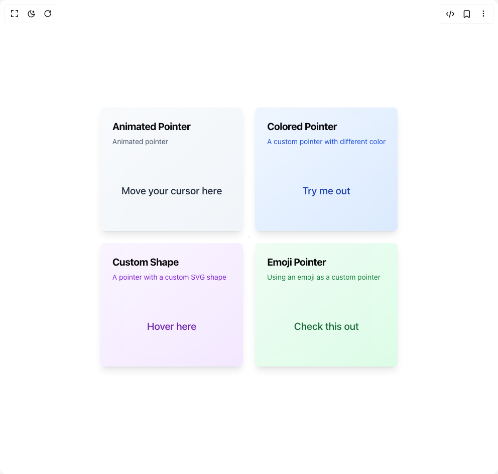

# Build Pointer in BuilderStudio

> Build this component in our Agentic IDE: [BuilderStudio](https://builderstudio.dev).
>
> Join the BuilderStudio community on [Discord](https://discord.gg/QdWeSGCqfe) and [Reddit](https://reddit.com/r/builderstudio).



## Component

- Author group: `magicui`
- Component: `pointer`
- Variant: `default`
- Rendered HTML snapshot: [`rendered.html`](rendered.html)

## BuilderStudio prompt

You are implementing a React component based on a component reference.

## Component identity

- Author: magicui
- Component slug: pointer
- Demo slug: default
- Title: pointer
- Description: 

## Goal

Recreate this component in a React + TypeScript + Tailwind CSS project. Preserve the visual layout, spacing, colors, border radius, shadows, interaction behavior, animation behavior, responsive behavior, and dark mode behavior shown in the rendered demo.

## Implementation requirements

- Use React and TypeScript.
- Use Tailwind CSS classes whenever possible.
- Keep the component self-contained unless the source files require helper components.
- If the source uses CSS variables, custom CSS, animations, or keyframes, include them.
- If the source uses external packages, list and use the required packages.
- Preserve accessibility attributes, button semantics, links, keyboard behavior, and ARIA attributes when visible in the source.
- Do not replace the component with a simplified placeholder.
- Return complete production-ready code.

## Dependencies

No reference metadata available.

## Rendered DOM snapshot

This is the rendered demo HTML extracted from the live preview. Use it to verify structure, class names, visible content, and layout.

```html
<div id="root"><div class="relative flex items-center justify-center h-screen w-full m-auto p-16 bg-background text-foreground"><div class="absolute lab-bg inset-0 size-full"><div class="absolute inset-0 bg-[radial-gradient(#00000021_1px,transparent_1px)] dark:bg-[radial-gradient(#ffffff22_1px,transparent_1px)]"></div></div><div class="flex w-full justify-center relative"><div class="grid grid-cols-1 gap-6 md:grid-cols-2 md:grid-rows-2"><div class="rounded-lg border text-card-foreground col-span-1 row-span-1 overflow-hidden border-none bg-gradient-to-br from-slate-50 to-slate-100 shadow-lg transition-all hover:shadow-xl dark:from-slate-900 dark:to-slate-800" style="cursor: none;"><div class="flex flex-col space-y-1.5 p-6 relative pb-2"><h3 class="tracking-tight text-xl font-bold">Animated Pointer</h3><p class="text-sm text-slate-600 dark:text-slate-400">Animated pointer</p></div><div class="relative flex h-40 items-center justify-center p-6"><span class="pointer-events-none text-center text-xl font-medium text-slate-800 dark:text-slate-200">Move your cursor here</span></div><div></div></div><div class="rounded-lg border text-card-foreground col-span-1 row-span-1 overflow-hidden border-none bg-gradient-to-br from-blue-50 to-blue-100 shadow-lg transition-all hover:shadow-xl dark:from-blue-900 dark:to-blue-800" style="cursor: none;"><div class="flex flex-col space-y-1.5 p-6 relative pb-2"><h3 class="tracking-tight text-xl font-bold">Colored Pointer</h3><p class="text-sm text-blue-700 dark:text-blue-300">A custom pointer with different color</p></div><div class="relative flex h-40 items-center justify-center p-6"><span class="pointer-events-none text-center text-xl font-medium text-blue-800 dark:text-blue-200">Try me out</span></div><div></div></div><div class="rounded-lg border text-card-foreground col-span-1 row-span-1 overflow-hidden border-none bg-gradient-to-br from-purple-50 to-purple-100 shadow-lg transition-all hover:shadow-xl dark:from-purple-900 dark:to-purple-800" style="cursor: none;"><div class="flex flex-col space-y-1.5 p-6 relative pb-2"><h3 class="tracking-tight text-xl font-bold">Custom Shape</h3><p class="text-sm text-purple-700 dark:text-purple-300">A pointer with a custom SVG shape</p></div><div class="relative flex h-40 items-center justify-center p-6"><span class="pointer-events-none text-center text-xl font-medium text-purple-800 dark:text-purple-200">Hover here</span></div><div></div></div><div class="rounded-lg border text-card-foreground col-span-1 row-span-1 overflow-hidden border-none bg-gradient-to-br from-green-50 to-green-100 shadow-lg transition-all hover:shadow-xl dark:from-green-900 dark:to-green-800" style="cursor: none;"><div class="flex flex-col space-y-1.5 p-6 relative pb-2"><h3 class="tracking-tight text-xl font-bold">Emoji Pointer</h3><p class="text-sm text-green-700 dark:text-green-300">Using an emoji as a custom pointer</p></div><div class="relative flex h-40 items-center justify-center p-6"><span class="pointer-events-none text-center text-xl font-medium text-green-800 dark:text-green-200">Check this out</span></div><div></div></div></div></div></div></div>
```

## Reference source files

No reference source files were available.
