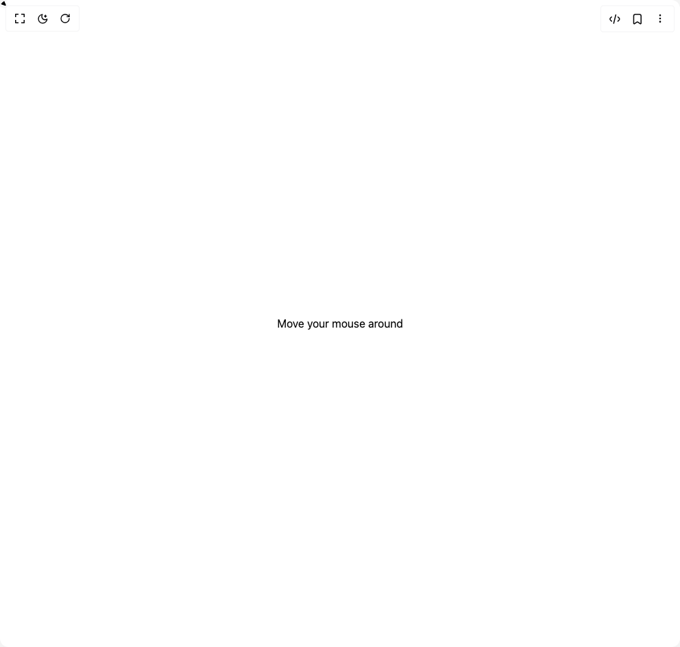

# Build Smooth Cursor in BuilderStudio

> Build this component in our Agentic IDE: [BuilderStudio](https://builderstudio.dev).
>
> Join the BuilderStudio community on [Discord](https://discord.gg/QdWeSGCqfe) and [Reddit](https://reddit.com/r/builderstudio).



## Component

- Author group: `magicui`
- Component: `smooth-cursor`
- Variant: `default`
- Rendered HTML snapshot: [`rendered.html`](rendered.html)

## BuilderStudio prompt

You are implementing a React component based on a component reference.

## Component identity

- Author: magicui
- Component slug: smooth-cursor
- Demo slug: default
- Title: smooth-cursor
- Description: 

## Goal

Recreate this component in a React + TypeScript + Tailwind CSS project. Preserve the visual layout, spacing, colors, border radius, shadows, interaction behavior, animation behavior, responsive behavior, and dark mode behavior shown in the rendered demo.

## Implementation requirements

- Use React and TypeScript.
- Use Tailwind CSS classes whenever possible.
- Keep the component self-contained unless the source files require helper components.
- If the source uses CSS variables, custom CSS, animations, or keyframes, include them.
- If the source uses external packages, list and use the required packages.
- Preserve accessibility attributes, button semantics, links, keyboard behavior, and ARIA attributes when visible in the source.
- Do not replace the component with a simplified placeholder.
- Return complete production-ready code.

## Dependencies

No reference metadata available.

## Rendered DOM snapshot

This is the rendered demo HTML extracted from the live preview. Use it to verify structure, class names, visible content, and layout.

```html
<div id="root"><div class="w-screen min-h-screen flex justify-center items-center"><div class="w-screen min-h-screen flex justify-center items-center"><span class="hidden md:block">Move your mouse around</span><span class="block md:hidden">Tap anywhere to see the cursor</span><div style="position: fixed; z-index: 100; pointer-events: none; will-change: transform; left: 0px; top: 0px; transform: translateX(-50%) translateY(-50%);"><svg xmlns="http://www.w3.org/2000/svg" width="50" height="54" viewBox="0 0 50 54" fill="none" style="scale: 0.5;"><g filter="url(#filter0_d_91_7928)"><path d="M42.6817 41.1495L27.5103 6.79925C26.7269 5.02557 24.2082 5.02558 23.3927 6.79925L7.59814 41.1495C6.75833 42.9759 8.52712 44.8902 10.4125 44.1954L24.3757 39.0496C24.8829 38.8627 25.4385 38.8627 25.9422 39.0496L39.8121 44.1954C41.6849 44.8902 43.4884 42.9759 42.6817 41.1495Z" fill="black"></path><path d="M43.7146 40.6933L28.5431 6.34306C27.3556 3.65428 23.5772 3.69516 22.3668 6.32755L6.57226 40.6778C5.3134 43.4156 7.97238 46.298 10.803 45.2549L24.7662 40.109C25.0221 40.0147 25.2999 40.0156 25.5494 40.1082L39.4193 45.254C42.2261 46.2953 44.9254 43.4347 43.7146 40.6933Z" stroke="white" stroke-width="2.25825"></path></g><defs><filter id="filter0_d_91_7928" x="0.602397" y="0.952444" width="49.0584" height="52.428" filterUnits="userSpaceOnUse" color-interpolation-filters="sRGB"><feFlood flood-opacity="0" result="BackgroundImageFix"></feFlood><feColorMatrix in="SourceAlpha" type="matrix" values="0 0 0 0 0 0 0 0 0 0 0 0 0 0 0 0 0 0 127 0" result="hardAlpha"></feColorMatrix><feOffset dy="2.25825"></feOffset><feGaussianBlur stdDeviation="2.25825"></feGaussianBlur><feComposite in2="hardAlpha" operator="out"></feComposite><feColorMatrix type="matrix" values="0 0 0 0 0 0 0 0 0 0 0 0 0 0 0 0 0 0 0.08 0"></feColorMatrix><feBlend mode="normal" in2="BackgroundImageFix" result="effect1_dropShadow_91_7928"></feBlend><feBlend mode="normal" in="SourceGraphic" in2="effect1_dropShadow_91_7928" result="shape"></feBlend></filter></defs></svg></div></div></div></div>
```

## Reference source files

No reference source files were available.
