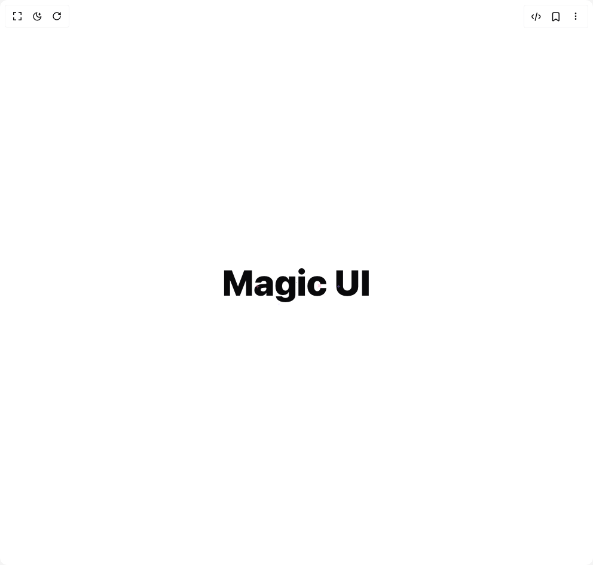

# Build Sparkles Text in BuilderStudio

> Build this component in our Agentic IDE: [BuilderStudio](https://builderstudio.dev).
>
> Join the BuilderStudio community on [Discord](https://discord.gg/QdWeSGCqfe) and [Reddit](https://reddit.com/r/builderstudio).



## Component

- Author group: `magicui`
- Component: `sparkles-text`
- Variant: `default`
- Rendered HTML snapshot: [`rendered.html`](rendered.html)

## BuilderStudio prompt

You are implementing a React component based on a component reference.

## Component identity

- Author: magicui
- Component slug: sparkles-text
- Demo slug: default
- Title: sparkles-text
- Description: 

## Goal

Recreate this component in a React + TypeScript + Tailwind CSS project. Preserve the visual layout, spacing, colors, border radius, shadows, interaction behavior, animation behavior, responsive behavior, and dark mode behavior shown in the rendered demo.

## Implementation requirements

- Use React and TypeScript.
- Use Tailwind CSS classes whenever possible.
- Keep the component self-contained unless the source files require helper components.
- If the source uses CSS variables, custom CSS, animations, or keyframes, include them.
- If the source uses external packages, list and use the required packages.
- Preserve accessibility attributes, button semantics, links, keyboard behavior, and ARIA attributes when visible in the source.
- Do not replace the component with a simplified placeholder.
- Return complete production-ready code.

## Dependencies

No reference metadata available.

## Rendered DOM snapshot

This is the rendered demo HTML extracted from the live preview. Use it to verify structure, class names, visible content, and layout.

```html
<div id="root"><div class="relative flex items-center justify-center h-screen w-full m-auto p-16 bg-background text-foreground"><div class="absolute lab-bg inset-0 size-full"><div class="absolute inset-0 bg-[radial-gradient(#00000021_1px,transparent_1px)] dark:bg-[radial-gradient(#ffffff22_1px,transparent_1px)]"></div></div><div class="flex w-full justify-center relative"><div class="text-6xl font-bold" style="--sparkles-first-color: #9E7AFF; --sparkles-second-color: #FE8BBB;"><span class="relative inline-block"><svg class="pointer-events-none absolute z-20" width="21" height="21" viewBox="0 0 21 21" style="opacity: 0.524527; left: 61.1387%; top: 41.5734%; transform: scale(0.621731) rotate(134.264deg);"><path d="M9.82531 0.843845C10.0553 0.215178 10.9446 0.215178 11.1746 0.843845L11.8618 2.72026C12.4006 4.19229 12.3916 6.39157 13.5 7.5C14.6084 8.60843 16.8077 8.59935 18.2797 9.13822L20.1561 9.82534C20.7858 10.0553 20.7858 10.9447 20.1561 11.1747L18.2797 11.8618C16.8077 12.4007 14.6084 12.3916 13.5 13.5C12.3916 14.6084 12.4006 16.8077 11.8618 18.2798L11.1746 20.1562C10.9446 20.7858 10.0553 20.7858 9.82531 20.1562L9.13819 18.2798C8.59932 16.8077 8.60843 14.6084 7.5 13.5C6.39157 12.3916 4.19225 12.4007 2.72023 11.8618L0.843814 11.1747C0.215148 10.9447 0.215148 10.0553 0.843814 9.82534L2.72023 9.13822C4.19225 8.59935 6.39157 8.60843 7.5 7.5C8.60843 6.39157 8.59932 4.19229 9.13819 2.72026L9.82531 0.843845Z" fill="#FE8BBB"></path></svg><svg class="pointer-events-none absolute z-20" width="21" height="21" viewBox="0 0 21 21" style="opacity: 0.106307; left: 44.5389%; top: 28.0191%; transform: scale(0.094424) rotate(146.811deg);"><path d="M9.82531 0.843845C10.0553 0.215178 10.9446 0.215178 11.1746 0.843845L11.8618 2.72026C12.4006 4.19229 12.3916 6.39157 13.5 7.5C14.6084 8.60843 16.8077 8.59935 18.2797 9.13822L20.1561 9.82534C20.7858 10.0553 20.7858 10.9447 20.1561 11.1747L18.2797 11.8618C16.8077 12.4007 14.6084 12.3916 13.5 13.5C12.3916 14.6084 12.4006 16.8077 11.8618 18.2798L11.1746 20.1562C10.9446 20.7858 10.0553 20.7858 9.82531 20.1562L9.13819 18.2798C8.59932 16.8077 8.60843 14.6084 7.5 13.5C6.39157 12.3916 4.19225 12.4007 2.72023 11.8618L0.843814 11.1747C0.215148 10.9447 0.215148 10.0553 0.843814 9.82534L2.72023 9.13822C4.19225 8.59935 6.39157 8.60843 7.5 7.5C8.60843 6.39157 8.59932 4.19229 9.13819 2.72026L9.82531 0.843845Z" fill="#9E7AFF"></path></svg><svg class="pointer-events-none absolute z-20" width="21" height="21" viewBox="0 0 21 21" style="opacity: 0.493042; left: 59.7538%; top: 49.9506%; transform: scale(0.159335) rotate(135.209deg);"><path d="M9.82531 0.843845C10.0553 0.215178 10.9446 0.215178 11.1746 0.843845L11.8618 2.72026C12.4006 4.19229 12.3916 6.39157 13.5 7.5C14.6084 8.60843 16.8077 8.59935 18.2797 9.13822L20.1561 9.82534C20.7858 10.0553 20.7858 10.9447 20.1561 11.1747L18.2797 11.8618C16.8077 12.4007 14.6084 12.3916 13.5 13.5C12.3916 14.6084 12.4006 16.8077 11.8618 18.2798L11.1746 20.1562C10.9446 20.7858 10.0553 20.7858 9.82531 20.1562L9.13819 18.2798C8.59932 16.8077 8.60843 14.6084 7.5 13.5C6.39157 12.3916 4.19225 12.4007 2.72023 11.8618L0.843814 11.1747C0.215148 10.9447 0.215148 10.0553 0.843814 9.82534L2.72023 9.13822C4.19225 8.59935 6.39157 8.60843 7.5 7.5C8.60843 6.39157 8.59932 4.19229 9.13819 2.72026L9.82531 0.843845Z" fill="#FE8BBB"></path></svg><svg class="pointer-events-none absolute z-20" width="21" height="21" viewBox="0 0 21 21" style="opacity: 0.210547; left: 74.2353%; top: 43.9759%; transform: scale(0.15303) rotate(84.4746deg);"><path d="M9.82531 0.843845C10.0553 0.215178 10.9446 0.215178 11.1746 0.843845L11.8618 2.72026C12.4006 4.19229 12.3916 6.39157 13.5 7.5C14.6084 8.60843 16.8077 8.59935 18.2797 9.13822L20.1561 9.82534C20.7858 10.0553 20.7858 10.9447 20.1561 11.1747L18.2797 11.8618C16.8077 12.4007 14.6084 12.3916 13.5 13.5C12.3916 14.6084 12.4006 16.8077 11.8618 18.2798L11.1746 20.1562C10.9446 20.7858 10.0553 20.7858 9.82531 20.1562L9.13819 18.2798C8.59932 16.8077 8.60843 14.6084 7.5 13.5C6.39157 12.3916 4.19225 12.4007 2.72023 11.8618L0.843814 11.1747C0.215148 10.9447 0.215148 10.0553 0.843814 9.82534L2.72023 9.13822C4.19225 8.59935 6.39157 8.60843 7.5 7.5C8.60843 6.39157 8.59932 4.19229 9.13819 2.72026L9.82531 0.843845Z" fill="#9E7AFF"></path></svg><svg class="pointer-events-none absolute z-20" width="21" height="21" viewBox="0 0 21 21" style="opacity: 0.101621; left: 3.84986%; top: 95.3914%; transform: scale(0.10371) rotate(146.951deg);"><path d="M9.82531 0.843845C10.0553 0.215178 10.9446 0.215178 11.1746 0.843845L11.8618 2.72026C12.4006 4.19229 12.3916 6.39157 13.5 7.5C14.6084 8.60843 16.8077 8.59935 18.2797 9.13822L20.1561 9.82534C20.7858 10.0553 20.7858 10.9447 20.1561 11.1747L18.2797 11.8618C16.8077 12.4007 14.6084 12.3916 13.5 13.5C12.3916 14.6084 12.4006 16.8077 11.8618 18.2798L11.1746 20.1562C10.9446 20.7858 10.0553 20.7858 9.82531 20.1562L9.13819 18.2798C8.59932 16.8077 8.60843 14.6084 7.5 13.5C6.39157 12.3916 4.19225 12.4007 2.72023 11.8618L0.843814 11.1747C0.215148 10.9447 0.215148 10.0553 0.843814 9.82534L2.72023 9.13822C4.19225 8.59935 6.39157 8.60843 7.5 7.5C8.60843 6.39157 8.59932 4.19229 9.13819 2.72026L9.82531 0.843845Z" fill="#FE8BBB"></path></svg><svg class="pointer-events-none absolute z-20" width="21" height="21" viewBox="0 0 21 21" style="opacity: 0.16039; left: 19.5653%; top: 43.0628%; transform: scale(0.16609) rotate(82.2175deg);"><path d="M9.82531 0.843845C10.0553 0.215178 10.9446 0.215178 11.1746 0.843845L11.8618 2.72026C12.4006 4.19229 12.3916 6.39157 13.5 7.5C14.6084 8.60843 16.8077 8.59935 18.2797 9.13822L20.1561 9.82534C20.7858 10.0553 20.7858 10.9447 20.1561 11.1747L18.2797 11.8618C16.8077 12.4007 14.6084 12.3916 13.5 13.5C12.3916 14.6084 12.4006 16.8077 11.8618 18.2798L11.1746 20.1562C10.9446 20.7858 10.0553 20.7858 9.82531 20.1562L9.13819 18.2798C8.59932 16.8077 8.60843 14.6084 7.5 13.5C6.39157 12.3916 4.19225 12.4007 2.72023 11.8618L0.843814 11.1747C0.215148 10.9447 0.215148 10.0553 0.843814 9.82534L2.72023 9.13822C4.19225 8.59935 6.39157 8.60843 7.5 7.5C8.60843 6.39157 8.59932 4.19229 9.13819 2.72026L9.82531 0.843845Z" fill="#FE8BBB"></path></svg><svg class="pointer-events-none absolute z-20" width="21" height="21" viewBox="0 0 21 21" style="opacity: 0.296987; left: 33.7917%; top: 93.7308%; transform: scale(0.295692) rotate(141.09deg);"><path d="M9.82531 0.843845C10.0553 0.215178 10.9446 0.215178 11.1746 0.843845L11.8618 2.72026C12.4006 4.19229 12.3916 6.39157 13.5 7.5C14.6084 8.60843 16.8077 8.59935 18.2797 9.13822L20.1561 9.82534C20.7858 10.0553 20.7858 10.9447 20.1561 11.1747L18.2797 11.8618C16.8077 12.4007 14.6084 12.3916 13.5 13.5C12.3916 14.6084 12.4006 16.8077 11.8618 18.2798L11.1746 20.1562C10.9446 20.7858 10.0553 20.7858 9.82531 20.1562L9.13819 18.2798C8.59932 16.8077 8.60843 14.6084 7.5 13.5C6.39157 12.3916 4.19225 12.4007 2.72023 11.8618L0.843814 11.1747C0.215148 10.9447 0.215148 10.0553 0.843814 9.82534L2.72023 9.13822C4.19225 8.59935 6.39157 8.60843 7.5 7.5C8.60843 6.39157 8.59932 4.19229 9.13819 2.72026L9.82531 0.843845Z" fill="#9E7AFF"></path></svg><svg class="pointer-events-none absolute z-20" width="21" height="21" viewBox="0 0 21 21" style="opacity: 0.219145; left: 64.3792%; top: 68.5575%; transform: scale(0.240439) rotate(143.426deg);"><path d="M9.82531 0.843845C10.0553 0.215178 10.9446 0.215178 11.1746 0.843845L11.8618 2.72026C12.4006 4.19229 12.3916 6.39157 13.5 7.5C14.6084 8.60843 16.8077 8.59935 18.2797 9.13822L20.1561 9.82534C20.7858 10.0553 20.7858 10.9447 20.1561 11.1747L18.2797 11.8618C16.8077 12.4007 14.6084 12.3916 13.5 13.5C12.3916 14.6084 12.4006 16.8077 11.8618 18.2798L11.1746 20.1562C10.9446 20.7858 10.0553 20.7858 9.82531 20.1562L9.13819 18.2798C8.59932 16.8077 8.60843 14.6084 7.5 13.5C6.39157 12.3916 4.19225 12.4007 2.72023 11.8618L0.843814 11.1747C0.215148 10.9447 0.215148 10.0553 0.843814 9.82534L2.72023 9.13822C4.19225 8.59935 6.39157 8.60843 7.5 7.5C8.60843 6.39157 8.59932 4.19229 9.13819 2.72026L9.82531 0.843845Z" fill="#FE8BBB"></path></svg><svg class="pointer-events-none absolute z-20" width="21" height="21" viewBox="0 0 21 21" style="opacity: 0.221002; left: 15.7876%; top: 2.45002%; transform: scale(0.0824962) rotate(143.37deg);"><path d="M9.82531 0.843845C10.0553 0.215178 10.9446 0.215178 11.1746 0.843845L11.8618 2.72026C12.4006 4.19229 12.3916 6.39157 13.5 7.5C14.6084 8.60843 16.8077 8.59935 18.2797 9.13822L20.1561 9.82534C20.7858 10.0553 20.7858 10.9447 20.1561 11.1747L18.2797 11.8618C16.8077 12.4007 14.6084 12.3916 13.5 13.5C12.3916 14.6084 12.4006 16.8077 11.8618 18.2798L11.1746 20.1562C10.9446 20.7858 10.0553 20.7858 9.82531 20.1562L9.13819 18.2798C8.59932 16.8077 8.60843 14.6084 7.5 13.5C6.39157 12.3916 4.19225 12.4007 2.72023 11.8618L0.843814 11.1747C0.215148 10.9447 0.215148 10.0553 0.843814 9.82534L2.72023 9.13822C4.19225 8.59935 6.39157 8.60843 7.5 7.5C8.60843 6.39157 8.59932 4.19229 9.13819 2.72026L9.82531 0.843845Z" fill="#9E7AFF"></path></svg><svg class="pointer-events-none absolute z-20" width="21" height="21" viewBox="0 0 21 21" style="opacity: 0.000328313; left: 47.0169%; top: 73.7794%; transform: scale(0.000113899) rotate(149.99deg);"><path d="M9.82531 0.843845C10.0553 0.215178 10.9446 0.215178 11.1746 0.843845L11.8618 2.72026C12.4006 4.19229 12.3916 6.39157 13.5 7.5C14.6084 8.60843 16.8077 8.59935 18.2797 9.13822L20.1561 9.82534C20.7858 10.0553 20.7858 10.9447 20.1561 11.1747L18.2797 11.8618C16.8077 12.4007 14.6084 12.3916 13.5 13.5C12.3916 14.6084 12.4006 16.8077 11.8618 18.2798L11.1746 20.1562C10.9446 20.7858 10.0553 20.7858 9.82531 20.1562L9.13819 18.2798C8.59932 16.8077 8.60843 14.6084 7.5 13.5C6.39157 12.3916 4.19225 12.4007 2.72023 11.8618L0.843814 11.1747C0.215148 10.9447 0.215148 10.0553 0.843814 9.82534L2.72023 9.13822C4.19225 8.59935 6.39157 8.60843 7.5 7.5C8.60843 6.39157 8.59932 4.19229 9.13819 2.72026L9.82531 0.843845Z" fill="#FE8BBB"></path></svg><strong>Magic UI</strong></span></div></div></div></div>
```

## Reference source files

No reference source files were available.
