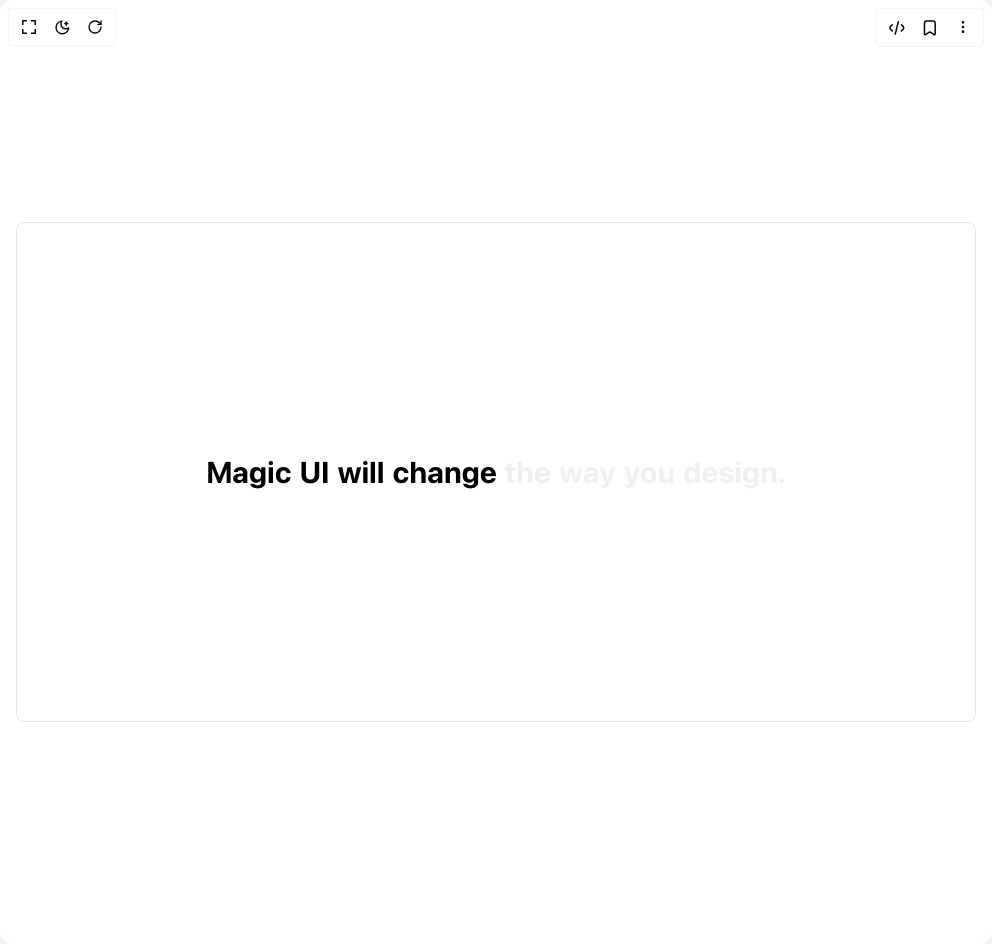

# Build Text Reveal in BuilderStudio

> Build this component in our Agentic IDE: [BuilderStudio](https://builderstudio.dev).
>
> Join the BuilderStudio community on [Discord](https://discord.gg/QdWeSGCqfe) and [Reddit](https://reddit.com/r/builderstudio).



## Component

- Author group: `magicui`
- Component: `text-reveal`
- Variant: `default`
- Rendered HTML snapshot: [`rendered.html`](rendered.html)

## BuilderStudio prompt

You are implementing a React component based on a component reference.

## Component identity

- Author: magicui
- Component slug: text-reveal
- Demo slug: default
- Title: text-reveal
- Description: 

## Goal

Recreate this component in a React + TypeScript + Tailwind CSS project. Preserve the visual layout, spacing, colors, border radius, shadows, interaction behavior, animation behavior, responsive behavior, and dark mode behavior shown in the rendered demo.

## Implementation requirements

- Use React and TypeScript.
- Use Tailwind CSS classes whenever possible.
- Keep the component self-contained unless the source files require helper components.
- If the source uses CSS variables, custom CSS, animations, or keyframes, include them.
- If the source uses external packages, list and use the required packages.
- Preserve accessibility attributes, button semantics, links, keyboard behavior, and ARIA attributes when visible in the source.
- Do not replace the component with a simplified placeholder.
- Return complete production-ready code.

## Dependencies

No reference metadata available.

## Rendered DOM snapshot

This is the rendered demo HTML extracted from the live preview. Use it to verify structure, class names, visible content, and layout.

```html
<div id="root"><div class="relative flex items-center justify-center h-screen w-full m-auto p-16 bg-background text-foreground"><div class="absolute lab-bg inset-0 size-full"><div class="absolute inset-0 bg-[radial-gradient(#00000021_1px,transparent_1px)] dark:bg-[radial-gradient(#ffffff22_1px,transparent_1px)]"></div></div><div class="flex w-full justify-center relative"><div class="min-h-[200vh] w-full relative"><div class="fixed inset-0 flex items-center justify-center pointer-events-none"><div class="w-full max-w-5xl mx-auto p-4"><div class="rounded-lg w-full h-[500px] border border-neutral-200 dark:border-neutral-800 bg-white/50 dark:bg-black/50 backdrop-blur-sm flex items-center justify-center pointer-events-auto"><div class="relative z-0 h-[200vh]"><div class="sticky top-0 mx-auto flex h-[50%] max-w-4xl items-center bg-transparent px-[1rem] py-[5rem]"><p class="flex flex-wrap p-5 text-2xl font-bold text-black/20 dark:text-white/20 md:p-8 md:text-3xl lg:p-10 lg:text-4xl xl:text-5xl"><span class="xl:lg-3 relative mx-1 lg:mx-2.5"><span class="absolute opacity-30">Magic</span><span class="text-black dark:text-white" style="opacity: 1;">Magic</span></span><span class="xl:lg-3 relative mx-1 lg:mx-2.5"><span class="absolute opacity-30">UI</span><span class="text-black dark:text-white" style="opacity: 1;">UI</span></span><span class="xl:lg-3 relative mx-1 lg:mx-2.5"><span class="absolute opacity-30">will</span><span class="text-black dark:text-white" style="opacity: 1;">will</span></span><span class="xl:lg-3 relative mx-1 lg:mx-2.5"><span class="absolute opacity-30">change</span><span class="text-black dark:text-white" style="opacity: 1;">change</span></span><span class="xl:lg-3 relative mx-1 lg:mx-2.5"><span class="absolute opacity-30">the</span><span class="text-black dark:text-white" style="opacity: 0.00847458;">the</span></span><span class="xl:lg-3 relative mx-1 lg:mx-2.5"><span class="absolute opacity-30">way</span><span class="text-black dark:text-white" style="opacity: 0;">way</span></span><span class="xl:lg-3 relative mx-1 lg:mx-2.5"><span class="absolute opacity-30">you</span><span class="text-black dark:text-white" style="opacity: 0;">you</span></span><span class="xl:lg-3 relative mx-1 lg:mx-2.5"><span class="absolute opacity-30">design.</span><span class="text-black dark:text-white" style="opacity: 0;">design.</span></span></p></div></div></div></div></div><div class="h-[200vh]" aria-hidden="true"></div></div></div></div></div>
```

## Reference source files

No reference source files were available.
