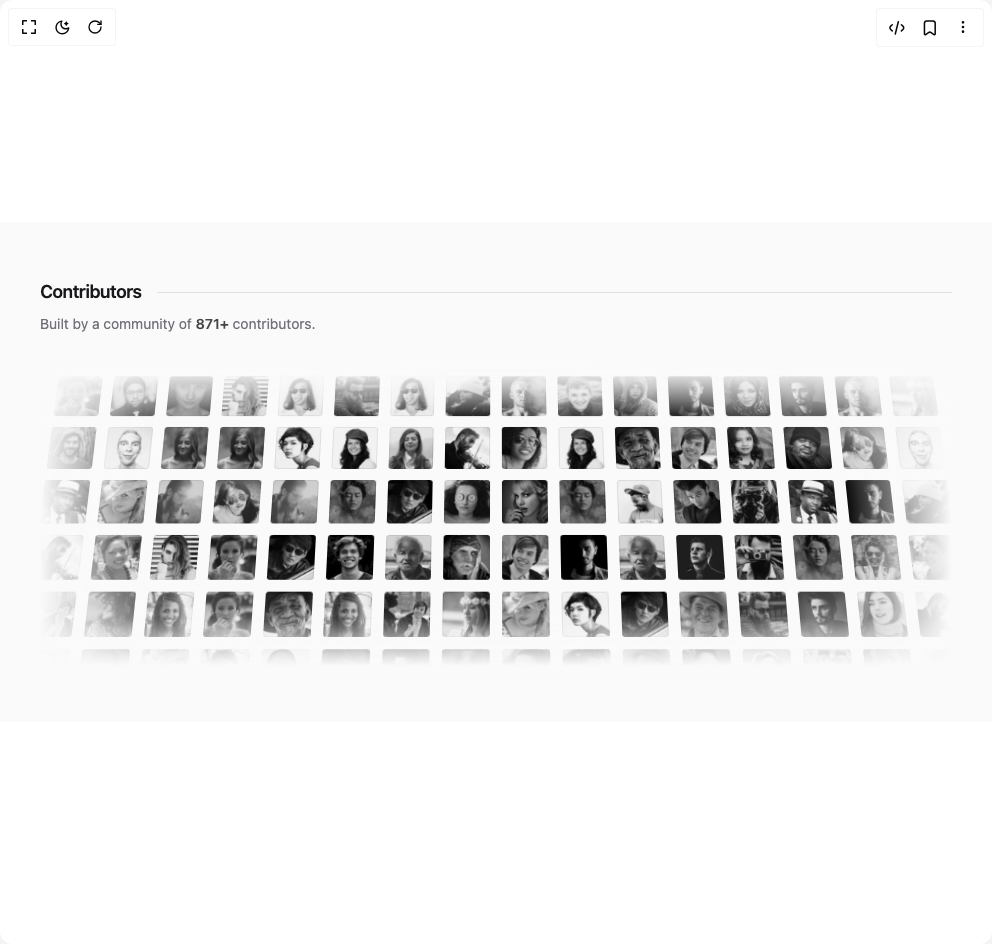
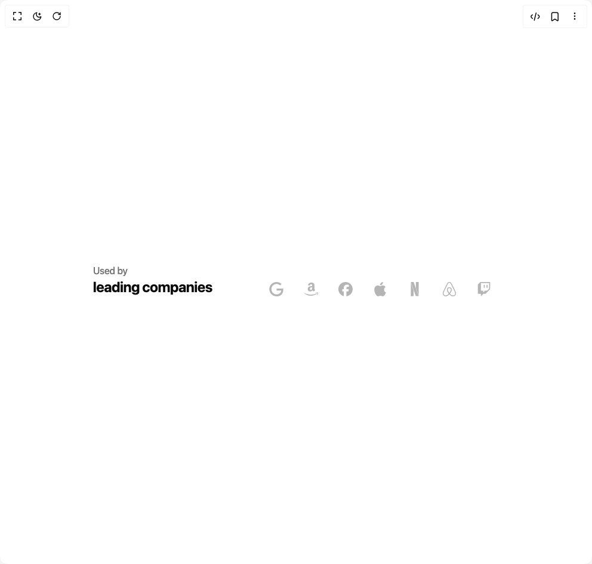
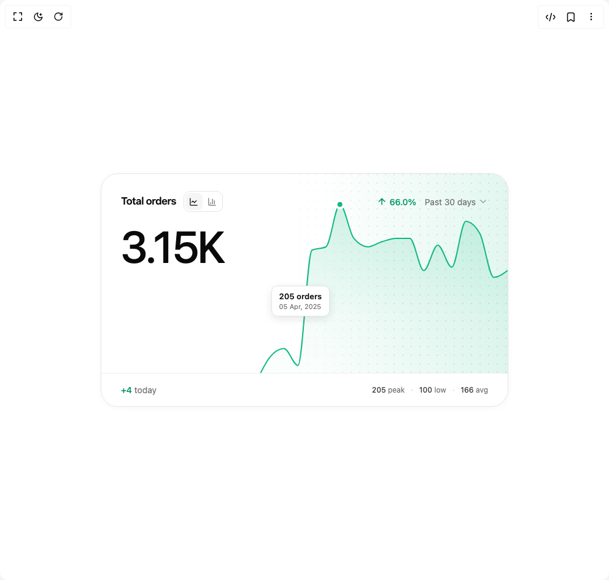

# Makviesainte Components

5 components are available in this author group.

> Build any component in [BuilderStudio](https://builderstudio.dev), then share improvements with the community on [Discord](https://discord.gg/QdWeSGCqfe) or [Reddit](https://reddit.com/r/builderstudio).

| Preview | Component | Variant |
| --- | --- | --- |
|  | [Contributors Section](contributors-section/default/README.md) | `default` |
|  | [Country Accordion](country-accordion/default/README.md) | `default` |
|  | [Hover Brand Logo](hover-brand-logo/default/README.md) | `default` |
|  | [Progress Metric Card](progress-metric-card/default/README.md) | `default` |
|  | [Team Showcase](team-showcase/default/README.md) | `default` |
