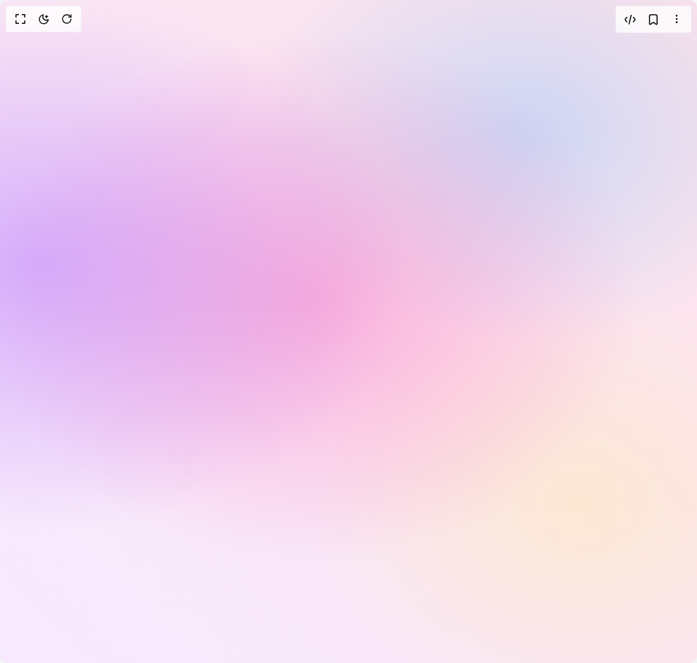

# Build Background Gradient Glow in BuilderStudio

> Build this component in our Agentic IDE: [BuilderStudio](https://builderstudio.dev).
>
> Join the BuilderStudio community on [Discord](https://discord.gg/QdWeSGCqfe) and [Reddit](https://reddit.com/r/builderstudio).



## Component

- Author group: `meghtrix`
- Component: `background-gradient-glow`
- Variant: `aurora-soft-harmony`
- Rendered HTML snapshot: [`rendered.html`](rendered.html)

## BuilderStudio prompt

You are implementing a React component based on a component reference.

## Component identity

- Author: meghtrix
- Component slug: background-gradient-glow
- Demo slug: aurora-soft-harmony
- Title: background-gradient-glow
- Description: 

## Goal

Recreate this component in a React + TypeScript + Tailwind CSS project. Preserve the visual layout, spacing, colors, border radius, shadows, interaction behavior, animation behavior, responsive behavior, and dark mode behavior shown in the rendered demo.

## Implementation requirements

- Use React and TypeScript.
- Use Tailwind CSS classes whenever possible.
- Keep the component self-contained unless the source files require helper components.
- If the source uses CSS variables, custom CSS, animations, or keyframes, include them.
- If the source uses external packages, list and use the required packages.
- Preserve accessibility attributes, button semantics, links, keyboard behavior, and ARIA attributes when visible in the source.
- Do not replace the component with a simplified placeholder.
- Return complete production-ready code.

## Dependencies

No reference metadata available.

## Rendered DOM snapshot

This is the rendered demo HTML extracted from the live preview. Use it to verify structure, class names, visible content, and layout.

```html
<div id="root"><div class="w-screen min-h-screen flex justify-center items-center"><div class="w-screen min-h-screen flex justify-center items-center"><div class="min-h-screen w-full relative"><div class="absolute inset-0 z-0" style="background: radial-gradient(80% 60% at 5% 40%, rgba(175, 109, 255, 0.48), transparent 67%), radial-gradient(70% 60% at 45% 45%, rgba(255, 100, 180, 0.41), transparent 67%), radial-gradient(62% 52% at 83% 76%, rgba(255, 235, 170, 0.44), transparent 63%), radial-gradient(60% 48% at 75% 20%, rgba(120, 190, 255, 0.36), transparent 66%), linear-gradient(45deg, rgb(247, 234, 255) 0%, rgb(253, 226, 234) 100%);"></div></div></div></div></div>
```

## Reference source files

No reference source files were available.
