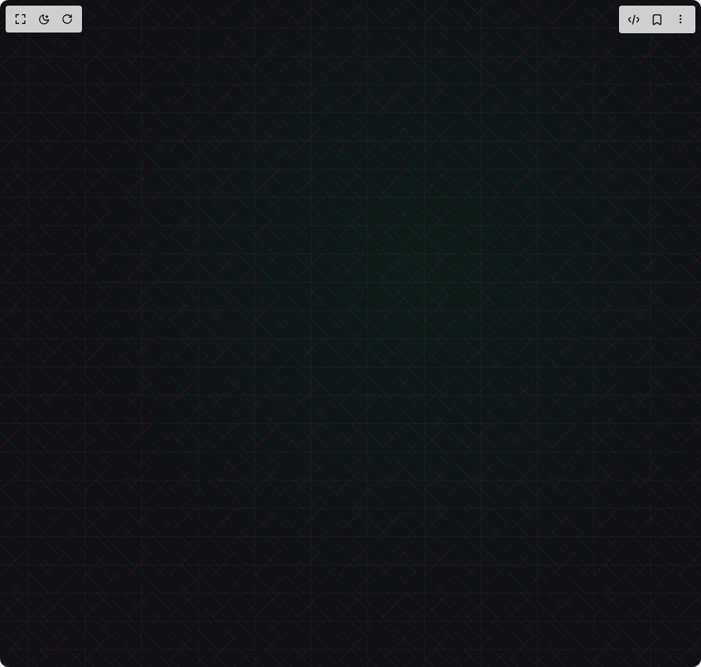

# Build Grid Background in BuilderStudio

> Build this component in our Agentic IDE: [BuilderStudio](https://builderstudio.dev).
>
> Join the BuilderStudio community on [Discord](https://discord.gg/QdWeSGCqfe) and [Reddit](https://reddit.com/r/builderstudio).



## Component

- Author group: `meghtrix`
- Component: `grid-background`
- Variant: `complex-multiplier`
- Rendered HTML snapshot: [`rendered.html`](rendered.html)

## BuilderStudio prompt

You are implementing a React component based on a component reference.

## Component identity

- Author: meghtrix
- Component slug: grid-background
- Demo slug: complex-multiplier
- Title: grid-background
- Description: 

## Goal

Recreate this component in a React + TypeScript + Tailwind CSS project. Preserve the visual layout, spacing, colors, border radius, shadows, interaction behavior, animation behavior, responsive behavior, and dark mode behavior shown in the rendered demo.

## Implementation requirements

- Use React and TypeScript.
- Use Tailwind CSS classes whenever possible.
- Keep the component self-contained unless the source files require helper components.
- If the source uses CSS variables, custom CSS, animations, or keyframes, include them.
- If the source uses external packages, list and use the required packages.
- Preserve accessibility attributes, button semantics, links, keyboard behavior, and ARIA attributes when visible in the source.
- Do not replace the component with a simplified placeholder.
- Return complete production-ready code.

## Dependencies

No reference metadata available.

## Rendered DOM snapshot

This is the rendered demo HTML extracted from the live preview. Use it to verify structure, class names, visible content, and layout.

```html
<div id="root"><div class="w-screen min-h-screen flex justify-center items-center"><div class="w-screen min-h-screen flex justify-center items-center"><div class="min-h-screen w-full bg-[#101014] relative text-white"><div class="absolute inset-0 z-0 pointer-events-none" style="background-image: repeating-linear-gradient(0deg, rgba(255, 255, 255, 0.04) 0px, rgba(255, 255, 255, 0.04) 1px, transparent 1px, transparent 40px), repeating-linear-gradient(45deg, rgba(0, 255, 128, 0.09) 0px, rgba(0, 255, 128, 0.09) 1px, transparent 1px, transparent 20px), repeating-linear-gradient(-45deg, rgba(255, 0, 128, 0.1) 0px, rgba(255, 0, 128, 0.1) 1px, transparent 1px, transparent 30px), repeating-linear-gradient(90deg, rgba(255, 255, 255, 0.03) 0px, rgba(255, 255, 255, 0.03) 1px, transparent 1px, transparent 80px), radial-gradient(circle at 60% 40%, rgba(0, 255, 128, 0.05) 0px, transparent 60%); background-size: 80px 80px, 40px 40px, 60px 60px, 80px 80px, 100% 100%; background-position: 0px 0px, 0px 0px, 0px 0px, 40px 40px, center center;"></div></div></div></div></div>
```

## Reference source files

No reference source files were available.
