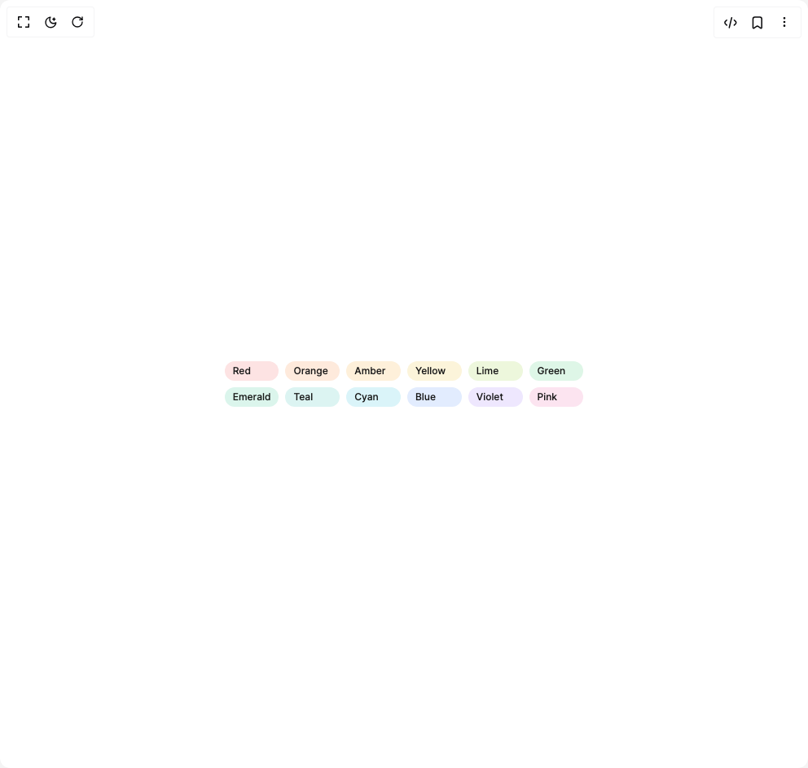

# Build Badge Fluid Functionalism in BuilderStudio

> Build this component in our Agentic IDE: [BuilderStudio](https://builderstudio.dev).
>
> Join the BuilderStudio community on [Discord](https://discord.gg/QdWeSGCqfe) and [Reddit](https://reddit.com/r/builderstudio).



## Component

- Author group: `micka_design`
- Component: `badge-fluid-functionalism`
- Variant: `colors`
- Rendered HTML snapshot: [`rendered.html`](rendered.html)

## BuilderStudio prompt

You are implementing a React component based on a component reference.

## Component identity

- Author: micka_design
- Component slug: badge-fluid-functionalism
- Demo slug: colors
- Title: badge-fluid-functionalism
- Description: 

## Goal

Recreate this component in a React + TypeScript + Tailwind CSS project. Preserve the visual layout, spacing, colors, border radius, shadows, interaction behavior, animation behavior, responsive behavior, and dark mode behavior shown in the rendered demo.

## Implementation requirements

- Use React and TypeScript.
- Use Tailwind CSS classes whenever possible.
- Keep the component self-contained unless the source files require helper components.
- If the source uses CSS variables, custom CSS, animations, or keyframes, include them.
- If the source uses external packages, list and use the required packages.
- Preserve accessibility attributes, button semantics, links, keyboard behavior, and ARIA attributes when visible in the source.
- Do not replace the component with a simplified placeholder.
- Return complete production-ready code.

## Dependencies

No reference metadata available.

## Rendered DOM snapshot

This is the rendered demo HTML extracted from the live preview. Use it to verify structure, class names, visible content, and layout.

```html
<div id="root"><div class="flex min-h-screen w-full items-center justify-center overflow-hidden bg-background p-8"><div class="grid max-w-xl grid-cols-3 gap-2 sm:grid-cols-6"><span class="inline-flex items-center font-medium whitespace-nowrap h-6 px-2.5 text-[12px] gap-1.5 rounded-[20px]" style="color: hsl(var(--foreground)); background-color: color-mix(in srgb, #ef4444 15%, hsl(var(--background)));">Red</span><span class="inline-flex items-center font-medium whitespace-nowrap h-6 px-2.5 text-[12px] gap-1.5 rounded-[20px]" style="color: hsl(var(--foreground)); background-color: color-mix(in srgb, #f97316 15%, hsl(var(--background)));">Orange</span><span class="inline-flex items-center font-medium whitespace-nowrap h-6 px-2.5 text-[12px] gap-1.5 rounded-[20px]" style="color: hsl(var(--foreground)); background-color: color-mix(in srgb, #f59e0b 15%, hsl(var(--background)));">Amber</span><span class="inline-flex items-center font-medium whitespace-nowrap h-6 px-2.5 text-[12px] gap-1.5 rounded-[20px]" style="color: hsl(var(--foreground)); background-color: color-mix(in srgb, #eab308 15%, hsl(var(--background)));">Yellow</span><span class="inline-flex items-center font-medium whitespace-nowrap h-6 px-2.5 text-[12px] gap-1.5 rounded-[20px]" style="color: hsl(var(--foreground)); background-color: color-mix(in srgb, #84cc16 15%, hsl(var(--background)));">Lime</span><span class="inline-flex items-center font-medium whitespace-nowrap h-6 px-2.5 text-[12px] gap-1.5 rounded-[20px]" style="color: hsl(var(--foreground)); background-color: color-mix(in srgb, #22c55e 15%, hsl(var(--background)));">Green</span><span class="inline-flex items-center font-medium whitespace-nowrap h-6 px-2.5 text-[12px] gap-1.5 rounded-[20px]" style="color: hsl(var(--foreground)); background-color: color-mix(in srgb, #10b981 15%, hsl(var(--background)));">Emerald</span><span class="inline-flex items-center font-medium whitespace-nowrap h-6 px-2.5 text-[12px] gap-1.5 rounded-[20px]" style="color: hsl(var(--foreground)); background-color: color-mix(in srgb, #14b8a6 15%, hsl(var(--background)));">Teal</span><span class="inline-flex items-center font-medium whitespace-nowrap h-6 px-2.5 text-[12px] gap-1.5 rounded-[20px]" style="color: hsl(var(--foreground)); background-color: color-mix(in srgb, #06b6d4 15%, hsl(var(--background)));">Cyan</span><span class="inline-flex items-center font-medium whitespace-nowrap h-6 px-2.5 text-[12px] gap-1.5 rounded-[20px]" style="color: hsl(var(--foreground)); background-color: color-mix(in srgb, #3b82f6 15%, hsl(var(--background)));">Blue</span><span class="inline-flex items-center font-medium whitespace-nowrap h-6 px-2.5 text-[12px] gap-1.5 rounded-[20px]" style="color: hsl(var(--foreground)); background-color: color-mix(in srgb, #8b5cf6 15%, hsl(var(--background)));">Violet</span><span class="inline-flex items-center font-medium whitespace-nowrap h-6 px-2.5 text-[12px] gap-1.5 rounded-[20px]" style="color: hsl(var(--foreground)); background-color: color-mix(in srgb, #ec4899 15%, hsl(var(--background)));">Pink</span></div></div></div>
```

## Reference source files

No reference source files were available.
