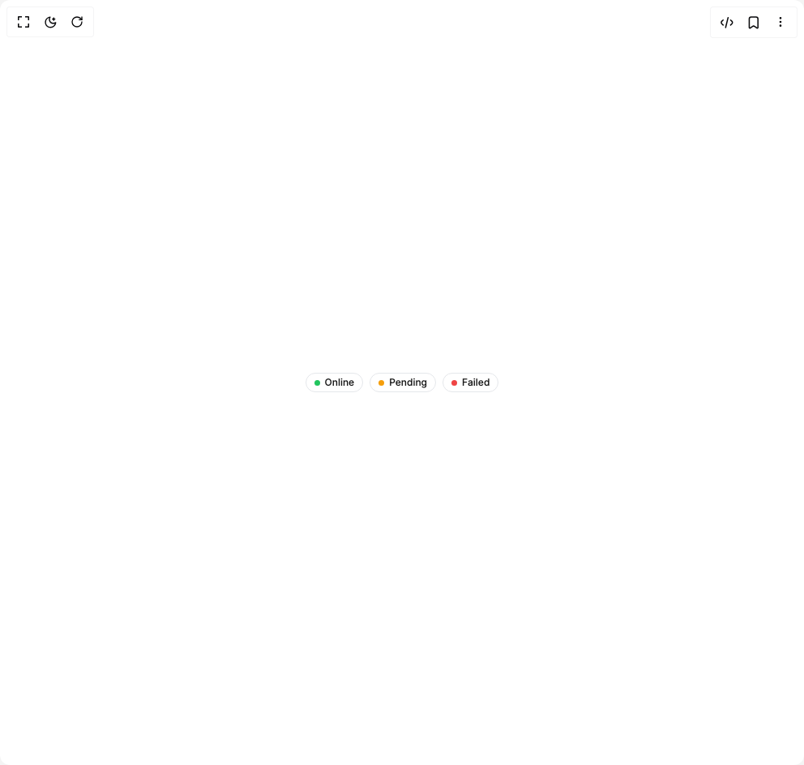

# Build Badge Fluid Functionalism in BuilderStudio

> Build this component in our Agentic IDE: [BuilderStudio](https://builderstudio.dev).
>
> Join the BuilderStudio community on [Discord](https://discord.gg/QdWeSGCqfe) and [Reddit](https://reddit.com/r/builderstudio).



## Component

- Author group: `micka_design`
- Component: `badge-fluid-functionalism`
- Variant: `dot`
- Rendered HTML snapshot: [`rendered.html`](rendered.html)

## BuilderStudio prompt

You are implementing a React component based on a component reference.

## Component identity

- Author: micka_design
- Component slug: badge-fluid-functionalism
- Demo slug: dot
- Title: badge-fluid-functionalism
- Description: 

## Goal

Recreate this component in a React + TypeScript + Tailwind CSS project. Preserve the visual layout, spacing, colors, border radius, shadows, interaction behavior, animation behavior, responsive behavior, and dark mode behavior shown in the rendered demo.

## Implementation requirements

- Use React and TypeScript.
- Use Tailwind CSS classes whenever possible.
- Keep the component self-contained unless the source files require helper components.
- If the source uses CSS variables, custom CSS, animations, or keyframes, include them.
- If the source uses external packages, list and use the required packages.
- Preserve accessibility attributes, button semantics, links, keyboard behavior, and ARIA attributes when visible in the source.
- Do not replace the component with a simplified placeholder.
- Return complete production-ready code.

## Dependencies

No reference metadata available.

## Rendered DOM snapshot

This is the rendered demo HTML extracted from the live preview. Use it to verify structure, class names, visible content, and layout.

```html
<div id="root"><div class="flex min-h-screen w-full items-center justify-center overflow-hidden bg-background p-8"><div class="flex items-center gap-2"><span class="inline-flex items-center font-medium whitespace-nowrap border border-border text-foreground h-6 px-2.5 text-[12px] gap-1.5 rounded-[20px]"><span class="shrink-0 rounded-full" style="width: 7px; height: 7px; background-color: rgb(34, 197, 94);"></span>Online</span><span class="inline-flex items-center font-medium whitespace-nowrap border border-border text-foreground h-6 px-2.5 text-[12px] gap-1.5 rounded-[20px]"><span class="shrink-0 rounded-full" style="width: 7px; height: 7px; background-color: rgb(245, 158, 11);"></span>Pending</span><span class="inline-flex items-center font-medium whitespace-nowrap border border-border text-foreground h-6 px-2.5 text-[12px] gap-1.5 rounded-[20px]"><span class="shrink-0 rounded-full" style="width: 7px; height: 7px; background-color: rgb(239, 68, 68);"></span>Failed</span></div></div></div>
```

## Reference source files

No reference source files were available.
