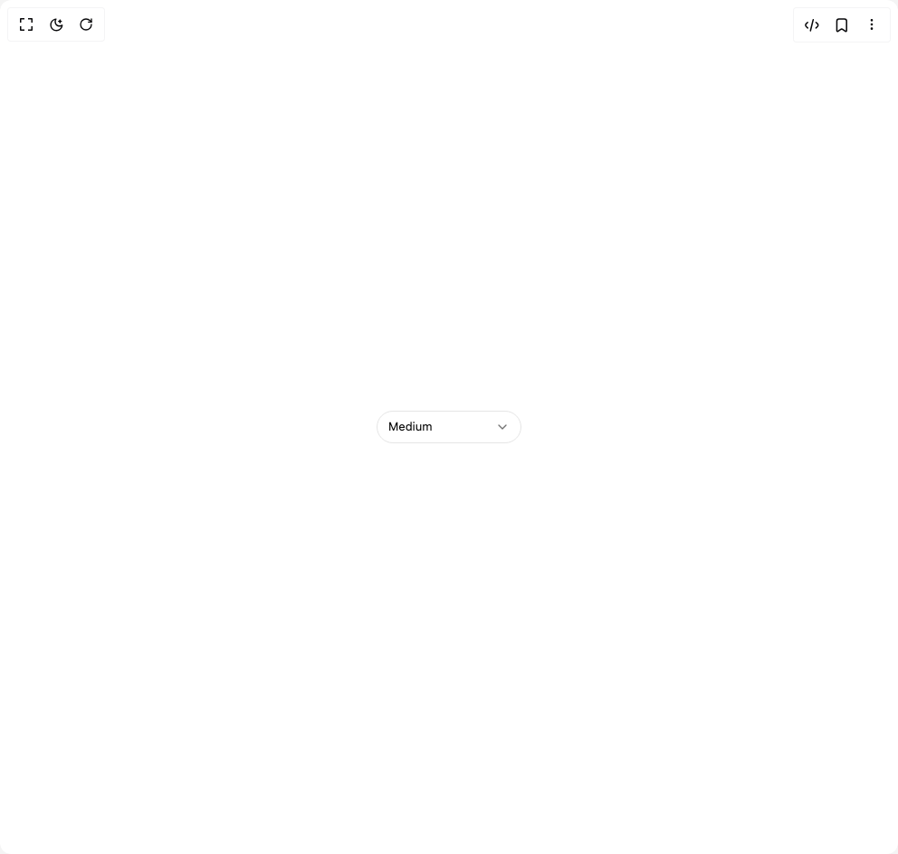

# Build Select in BuilderStudio

> Build this component in our Agentic IDE: [BuilderStudio](https://builderstudio.dev).
>
> Join the BuilderStudio community on [Discord](https://discord.gg/QdWeSGCqfe) and [Reddit](https://reddit.com/r/builderstudio).



## Component

- Author group: `micka_design`
- Component: `select`
- Variant: `default`
- Rendered HTML snapshot: [`rendered.html`](rendered.html)

## BuilderStudio prompt

You are implementing a React component based on a component reference.

## Component identity

- Author: micka_design
- Component slug: select
- Demo slug: default
- Title: select
- Description: 

## Goal

Recreate this component in a React + TypeScript + Tailwind CSS project. Preserve the visual layout, spacing, colors, border radius, shadows, interaction behavior, animation behavior, responsive behavior, and dark mode behavior shown in the rendered demo.

## Implementation requirements

- Use React and TypeScript.
- Use Tailwind CSS classes whenever possible.
- Keep the component self-contained unless the source files require helper components.
- If the source uses CSS variables, custom CSS, animations, or keyframes, include them.
- If the source uses external packages, list and use the required packages.
- Preserve accessibility attributes, button semantics, links, keyboard behavior, and ARIA attributes when visible in the source.
- Do not replace the component with a simplified placeholder.
- Return complete production-ready code.

## Dependencies

No reference metadata available.

## Rendered DOM snapshot

This is the rendered demo HTML extracted from the live preview. Use it to verify structure, class names, visible content, and layout.

```html
<div id="root"><div class="w-screen min-h-screen flex justify-center items-center"><div class="w-screen min-h-screen flex justify-center items-center"><div class="flex items-center justify-center min-h-screen bg-background"><div class="flex flex-col gap-1"><button type="button" role="combobox" aria-expanded="false" aria-haspopup="listbox" class="group inline-flex items-center justify-between gap-2 outline-none cursor-pointer text-[13px] h-9 px-3 min-w-[160px] transition-all duration-80 disabled:opacity-50 disabled:pointer-events-none focus-visible:ring-1 focus-visible:ring-[#6B97FF] border border-border bg-transparent text-foreground hover:bg-muted rounded-[20px]"><span class="flex items-center gap-2 min-w-0 flex-1"><span class="min-w-0 flex-1 text-left truncate">Medium</span></span><svg width="16" height="16" viewBox="0 0 24 24" fill="none" stroke="currentColor" stroke-width="2" stroke-linecap="round" stroke-linejoin="round" class="shrink-0 text-muted-foreground transition-colors duration-80 group-hover:text-foreground"><path d="M6 9l6 6 6-6"></path></svg></button></div><div hidden="" aria-hidden="true"><div data-proximity-index="0" data-value="small" role="option" aria-selected="false" aria-label="Small" tabindex="0" class="relative z-10 flex items-center gap-2 rounded-[20px] px-2 py-2 text-[13px] cursor-pointer outline-none select-none transition-[color] duration-80 text-muted-foreground"><span class="flex-1 min-w-0 truncate">Small</span></div><div data-proximity-index="1" data-value="medium" role="option" aria-selected="true" aria-label="Medium" tabindex="0" class="relative z-10 flex items-center gap-2 rounded-[20px] px-2 py-2 text-[13px] cursor-pointer outline-none select-none transition-[color] duration-80 text-foreground"><span class="flex-1 min-w-0 truncate">Medium</span><svg width="16" height="16" viewBox="0 0 24 24" fill="none" stroke="currentColor" stroke-width="2" stroke-linecap="round" stroke-linejoin="round" class="shrink-0 text-foreground" style="opacity: 1;"><path d="M4 12L9 17L20 6" pathLength="1" stroke-dashoffset="0px" stroke-dasharray="1px 1px"></path></svg></div><div data-proximity-index="2" data-value="large" role="option" aria-selected="false" aria-label="Large" tabindex="-1" class="relative z-10 flex items-center gap-2 rounded-[20px] px-2 py-2 text-[13px] cursor-pointer outline-none select-none transition-[color] duration-80 text-muted-foreground"><span class="flex-1 min-w-0 truncate">Large</span></div><div data-proximity-index="3" data-value="xl" role="option" aria-selected="false" aria-label="Extra Large" tabindex="-1" class="relative z-10 flex items-center gap-2 rounded-[20px] px-2 py-2 text-[13px] cursor-pointer outline-none select-none transition-[color] duration-80 text-muted-foreground"><span class="flex-1 min-w-0 truncate">Extra Large</span></div></div></div></div></div></div>
```

## Reference source files

No reference source files were available.
