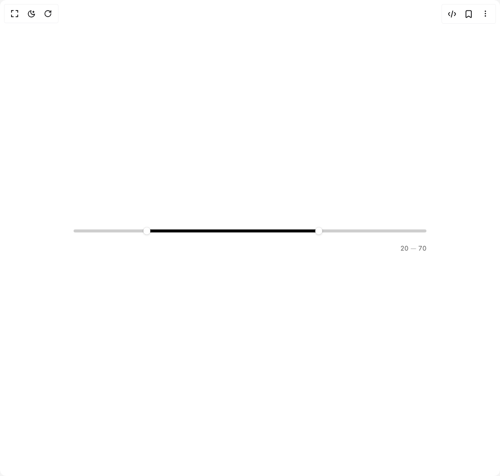

# Build Slider in BuilderStudio

> Build this component in our Agentic IDE: [BuilderStudio](https://builderstudio.dev).
>
> Join the BuilderStudio community on [Discord](https://discord.gg/QdWeSGCqfe) and [Reddit](https://reddit.com/r/builderstudio).



## Component

- Author group: `micka_design`
- Component: `slider`
- Variant: `range`
- Rendered HTML snapshot: [`rendered.html`](rendered.html)

## BuilderStudio prompt

You are implementing a React component based on a component reference.

## Component identity

- Author: micka_design
- Component slug: slider
- Demo slug: range
- Title: slider
- Description: 

## Goal

Recreate this component in a React + TypeScript + Tailwind CSS project. Preserve the visual layout, spacing, colors, border radius, shadows, interaction behavior, animation behavior, responsive behavior, and dark mode behavior shown in the rendered demo.

## Implementation requirements

- Use React and TypeScript.
- Use Tailwind CSS classes whenever possible.
- Keep the component self-contained unless the source files require helper components.
- If the source uses CSS variables, custom CSS, animations, or keyframes, include them.
- If the source uses external packages, list and use the required packages.
- Preserve accessibility attributes, button semantics, links, keyboard behavior, and ARIA attributes when visible in the source.
- Do not replace the component with a simplified placeholder.
- Return complete production-ready code.

## Dependencies

No reference metadata available.

## Rendered DOM snapshot

This is the rendered demo HTML extracted from the live preview. Use it to verify structure, class names, visible content, and layout.

```html
<div id="root"><div class="w-screen min-h-screen flex justify-center items-center"><div class="w-screen min-h-screen flex justify-center items-center"><div class="flex items-center justify-center min-h-screen bg-background"><div style="width: 700px; max-width: 90vw;"><div class="flex flex-col gap-2 w-full select-none touch-none overflow-visible"><div class="relative flex-1 overflow-visible" style="height: 18px; padding-top: 0px;"><span dir="ltr" data-orientation="horizontal" aria-disabled="false" class="absolute inset-0 opacity-0 pointer-events-none" style="height: 18px; --radix-slider-thumb-transform: translateX(-50%);"><span data-orientation="horizontal" class="w-full h-full"><span data-orientation="horizontal" style="left: 20%; right: 30%;"></span></span><span style="transform: var(--radix-slider-thumb-transform); position: absolute; left: calc(20% + 5.4px);"><span role="slider" aria-valuemin="0" aria-valuemax="100" aria-orientation="horizontal" data-orientation="horizontal" tabindex="0" class="block outline-none" data-radix-collection-item="" aria-label="Minimum" aria-valuenow="20" style="width: 18px; height: 18px;"></span></span><span style="transform: var(--radix-slider-thumb-transform); position: absolute; left: calc(70% - 3.6px);"><span role="slider" aria-valuemin="0" aria-valuemax="100" aria-orientation="horizontal" data-orientation="horizontal" tabindex="0" class="block outline-none" data-radix-collection-item="" aria-label="Maximum" aria-valuenow="70" style="width: 18px; height: 18px;"></span></span></span><div class="relative w-full cursor-pointer py-2" style="height: 34px;"><div class="absolute cursor-pointer" style="inset: 0px -8px;"></div><div class="absolute left-0 right-0 rounded-[20px]" style="background-color: color-mix(in srgb, var(--foreground) 20%, var(--background)); height: 6px; top: 14px; transition: height 80ms, top 80ms;"><div class="absolute h-full rounded-[20px]" style="background-color: var(--foreground); left: 145.4px; width: 341px;"></div><div class="absolute h-full pointer-events-none rounded-[20px]" style="background-color: color-mix(in srgb, var(--foreground) 20%, transparent); left: 0px; width: 0px; opacity: 0;"></div><div class="absolute h-full pointer-events-none z-[2] rounded-[20px]" style="background-color: color-mix(in srgb, var(--background) 25%, transparent); left: 0px; width: 0px; opacity: 0;"></div></div><span class="flex items-center justify-center pointer-events-none" style="width: 18px; height: 18px; margin-top: -9px; position: absolute; top: 50%; left: 0px; z-index: 10; transform: translateX(136.4px);"><span class="block rounded-full" style="background-color: white; box-shadow: rgba(0, 0, 0, 0.15) 0px 1px 4px, rgba(0, 0, 0, 0.06) 0px 0px 0px 1px; width: 14px; height: 14px;"></span><span class="absolute rounded-full border border-[#6B97FF] pointer-events-none" style="opacity: 0; width: 22px; height: 22px;"></span></span><span class="flex items-center justify-center pointer-events-none" style="width: 18px; height: 18px; margin-top: -9px; position: absolute; top: 50%; left: 0px; z-index: 10; transform: translateX(477.4px);"><span class="block rounded-full" style="background-color: white; box-shadow: rgba(0, 0, 0, 0.15) 0px 1px 4px, rgba(0, 0, 0, 0.06) 0px 0px 0px 1px; width: 14px; height: 14px;"></span><span class="absolute rounded-full border border-[#6B97FF] pointer-events-none" style="opacity: 0; width: 22px; height: 22px;"></span></span></div></div><span class="shrink-0 text-[13px] text-muted-foreground text-right transition-[font-variation-settings] duration-100 tabular-nums" style="font-variation-settings: &quot;wght&quot; 400; min-width: 10ch;"><span class="cursor-text select-none">20</span><span class="mx-1 text-muted-foreground/50">—</span><span class="cursor-text select-none">70</span></span></div></div></div></div></div></div>
```

## Reference source files

No reference source files were available.
