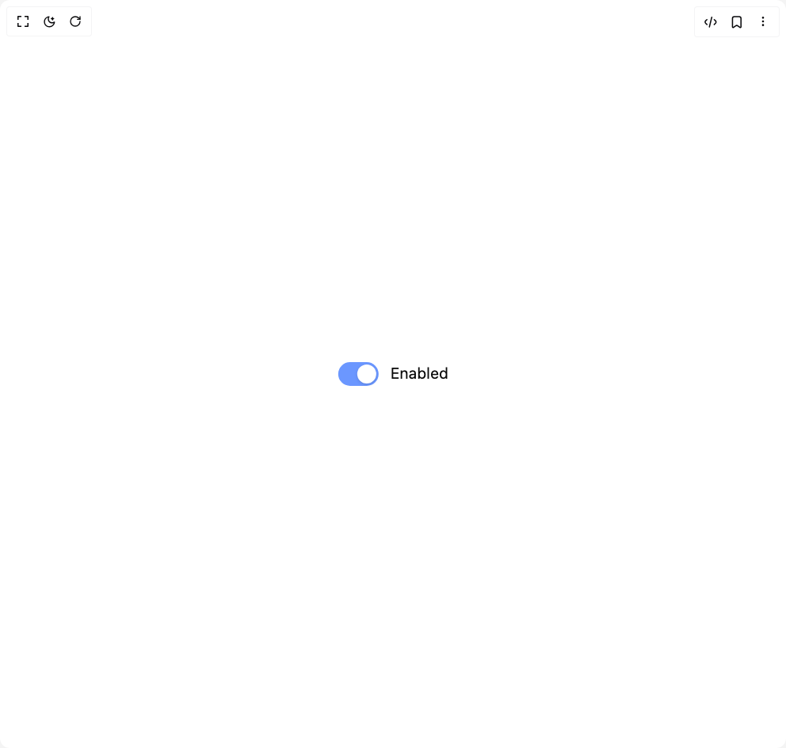

# Build Switch in BuilderStudio

> Build this component in our Agentic IDE: [BuilderStudio](https://builderstudio.dev).
>
> Join the BuilderStudio community on [Discord](https://discord.gg/QdWeSGCqfe) and [Reddit](https://reddit.com/r/builderstudio).



## Component

- Author group: `micka_design`
- Component: `switch`
- Variant: `checked`
- Rendered HTML snapshot: [`rendered.html`](rendered.html)

## BuilderStudio prompt

You are implementing a React component based on a component reference.

## Component identity

- Author: micka_design
- Component slug: switch
- Demo slug: checked
- Title: switch
- Description: 

## Goal

Recreate this component in a React + TypeScript + Tailwind CSS project. Preserve the visual layout, spacing, colors, border radius, shadows, interaction behavior, animation behavior, responsive behavior, and dark mode behavior shown in the rendered demo.

## Implementation requirements

- Use React and TypeScript.
- Use Tailwind CSS classes whenever possible.
- Keep the component self-contained unless the source files require helper components.
- If the source uses CSS variables, custom CSS, animations, or keyframes, include them.
- If the source uses external packages, list and use the required packages.
- Preserve accessibility attributes, button semantics, links, keyboard behavior, and ARIA attributes when visible in the source.
- Do not replace the component with a simplified placeholder.
- Return complete production-ready code.

## Dependencies

No reference metadata available.

## Rendered DOM snapshot

This is the rendered demo HTML extracted from the live preview. Use it to verify structure, class names, visible content, and layout.

```html
<div id="root"><div class="w-screen min-h-screen flex justify-center items-center"><div class="w-screen min-h-screen flex justify-center items-center"><div class="flex items-center justify-center min-h-screen bg-background"><div class="transform scale-150"><div class="relative z-10 flex items-center gap-2.5 px-3 py-2 cursor-pointer select-none touch-none"><button type="button" role="switch" aria-checked="true" data-state="checked" value="on" tabindex="0" class="relative shrink-0 rounded-full outline-none cursor-pointer transition-colors duration-80 focus-visible:ring-1 focus-visible:ring-[#6B97FF] focus-visible:ring-offset-2 focus-visible:ring-offset-background" style="width: 34px; height: 20px; background-color: rgb(107, 151, 255);"><span class="absolute top-0 left-0 block rounded-full bg-white shadow-sm" data-state="checked" style="width: 16px; height: 16px; transform: translateX(16px) translateY(2px);"></span></button><span class="text-[13px] transition-[color] duration-80 text-foreground">Enabled</span></div></div></div></div></div></div>
```

## Reference source files

No reference source files were available.
