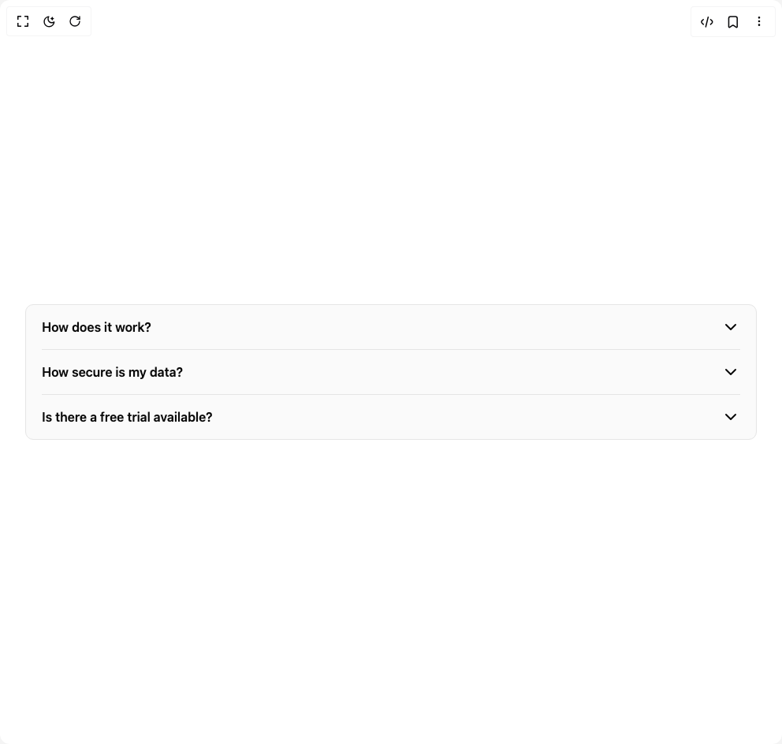

# Build Accordion in BuilderStudio

> Build this component in our Agentic IDE: [BuilderStudio](https://builderstudio.dev).
>
> Join the BuilderStudio community on [Discord](https://discord.gg/QdWeSGCqfe) and [Reddit](https://reddit.com/r/builderstudio).



## Component

- Author group: `molecule-ui`
- Component: `accordion`
- Variant: `default`
- Rendered HTML snapshot: [`rendered.html`](rendered.html)

## BuilderStudio prompt

You are implementing a React component based on a component reference.

## Component identity

- Author: molecule-ui
- Component slug: accordion
- Demo slug: default
- Title: accordion
- Description: 

## Goal

Recreate this component in a React + TypeScript + Tailwind CSS project. Preserve the visual layout, spacing, colors, border radius, shadows, interaction behavior, animation behavior, responsive behavior, and dark mode behavior shown in the rendered demo.

## Implementation requirements

- Use React and TypeScript.
- Use Tailwind CSS classes whenever possible.
- Keep the component self-contained unless the source files require helper components.
- If the source uses CSS variables, custom CSS, animations, or keyframes, include them.
- If the source uses external packages, list and use the required packages.
- Preserve accessibility attributes, button semantics, links, keyboard behavior, and ARIA attributes when visible in the source.
- Do not replace the component with a simplified placeholder.
- Return complete production-ready code.

## Dependencies

No reference metadata available.

## Rendered DOM snapshot

This is the rendered demo HTML extracted from the live preview. Use it to verify structure, class names, visible content, and layout.

```html
<div id="root"><div class="w-screen min-h-screen flex justify-center items-center"><div class="w-screen min-h-screen flex justify-center items-center"><div data-slot="accordion" class="bg-primary-foreground rounded-lg border px-5 w-full m-8" data-orientation="vertical"><div data-state="closed" data-orientation="vertical" data-slot="accordion-item" class="relative border-b last:border-b-0"><h3 data-orientation="vertical" data-state="closed" class="flex"><button type="button" aria-controls="radix-«r1»" aria-expanded="false" data-state="closed" data-orientation="vertical" id="radix-«r0»" data-slot="accordion-header" class="group active:text-foreground/50 focus-visible:bg-muted flex flex-1 items-start justify-between gap-4 py-4 font-semibold disabled:opacity-50" data-radix-collection-item="">How does it work?<svg xmlns="http://www.w3.org/2000/svg" width="24" height="24" viewBox="0 0 24 24" fill="none" stroke="currentColor" stroke-width="2" stroke-linecap="round" stroke-linejoin="round" class="lucide lucide-chevron-down size-6 duration-300 group-data-[state=open]:rotate-180" aria-hidden="true"><path d="m6 9 6 6 6-6"></path></svg></button></h3><div data-state="closed" id="radix-«r1»" role="region" aria-labelledby="radix-«r0»" data-orientation="vertical" data-slot="accordion-content" class="overflow-hidden" style="--radix-accordion-content-height: var(--radix-collapsible-content-height); --radix-accordion-content-width: var(--radix-collapsible-content-width); transition-duration: 0s; animation-name: none; --radix-collapsible-content-width: 886px;"><div style="height: 0px; opacity: 0; filter: blur(4px);"><div class="text-muted-foreground pb-4">It works by analyzing your requirements, leveraging advanced AI algorithms to understand context, and executing tasks based on your instructions. It can integrate with your workflow, learn from feedback, and continuously improve its performance.</div></div></div></div><div data-state="closed" data-orientation="vertical" data-slot="accordion-item" class="relative border-b last:border-b-0"><h3 data-orientation="vertical" data-state="closed" class="flex"><button type="button" aria-controls="radix-«r3»" aria-expanded="false" data-state="closed" data-orientation="vertical" id="radix-«r2»" data-slot="accordion-header" class="group active:text-foreground/50 focus-visible:bg-muted flex flex-1 items-start justify-between gap-4 py-4 font-semibold disabled:opacity-50" data-radix-collection-item="">How secure is my data?<svg xmlns="http://www.w3.org/2000/svg" width="24" height="24" viewBox="0 0 24 24" fill="none" stroke="currentColor" stroke-width="2" stroke-linecap="round" stroke-linejoin="round" class="lucide lucide-chevron-down size-6 duration-300 group-data-[state=open]:rotate-180" aria-hidden="true"><path d="m6 9 6 6 6-6"></path></svg></button></h3><div data-state="closed" id="radix-«r3»" role="region" aria-labelledby="radix-«r2»" data-orientation="vertical" data-slot="accordion-content" class="overflow-hidden" style="--radix-accordion-content-height: var(--radix-collapsible-content-height); --radix-accordion-content-width: var(--radix-collapsible-content-width); transition-duration: 0s; animation-name: none; --radix-collapsible-content-width: 886px;"><div style="height: 0px; opacity: 0; filter: blur(4px);"><div class="text-muted-foreground pb-4">We implement enterprise-grade security measures including end-to-end encryption, secure data centers, and regular security audits. Your data is protected according to industry best practices and compliance standards.</div></div></div></div><div data-state="closed" data-orientation="vertical" data-slot="accordion-item" class="relative border-b last:border-b-0"><h3 data-orientation="vertical" data-state="closed" class="flex"><button type="button" aria-controls="radix-«r5»" aria-expanded="false" data-state="closed" data-orientation="vertical" id="radix-«r4»" data-slot="accordion-header" class="group active:text-foreground/50 focus-visible:bg-muted flex flex-1 items-start justify-between gap-4 py-4 font-semibold disabled:opacity-50" data-radix-collection-item="">Is there a free trial available?<svg xmlns="http://www.w3.org/2000/svg" width="24" height="24" viewBox="0 0 24 24" fill="none" stroke="currentColor" stroke-width="2" stroke-linecap="round" stroke-linejoin="round" class="lucide lucide-chevron-down size-6 duration-300 group-data-[state=open]:rotate-180" aria-hidden="true"><path d="m6 9 6 6 6-6"></path></svg></button></h3><div data-state="closed" id="radix-«r5»" role="region" aria-labelledby="radix-«r4»" data-orientation="vertical" data-slot="accordion-content" class="overflow-hidden" style="--radix-accordion-content-height: var(--radix-collapsible-content-height); --radix-accordion-content-width: var(--radix-collapsible-content-width); transition-duration: 0s; animation-name: none; --radix-collapsible-content-width: 886px;"><div style="height: 0px; opacity: 0; filter: blur(4px);"><div class="text-muted-foreground pb-4">Yes, we offer a 14-day free trial that gives you full access to all features. No credit card is required to start your trial, and you can upgrade or cancel at any time.</div></div></div></div></div></div></div></div>
```

## Reference source files

No reference source files were available.
