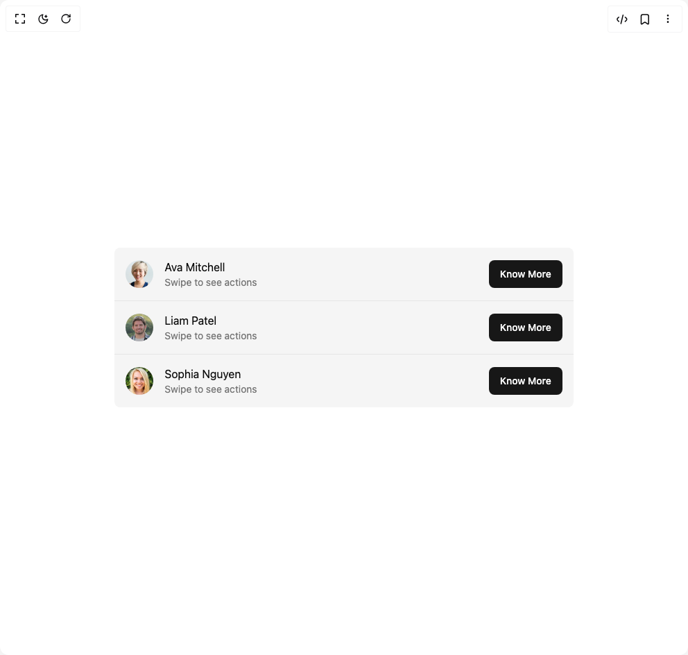

# Build Swipe Row 1 in BuilderStudio

> Build this component in our Agentic IDE: [BuilderStudio](https://builderstudio.dev).
>
> Join the BuilderStudio community on [Discord](https://discord.gg/QdWeSGCqfe) and [Reddit](https://reddit.com/r/builderstudio).



## Component

- Author group: `molecule-ui`
- Component: `swipe-row-1`
- Variant: `default`
- Rendered HTML snapshot: [`rendered.html`](rendered.html)

## BuilderStudio prompt

You are implementing a React component based on a component reference.

## Component identity

- Author: molecule-ui
- Component slug: swipe-row-1
- Demo slug: default
- Title: swipe-row-1
- Description: 

## Goal

Recreate this component in a React + TypeScript + Tailwind CSS project. Preserve the visual layout, spacing, colors, border radius, shadows, interaction behavior, animation behavior, responsive behavior, and dark mode behavior shown in the rendered demo.

## Implementation requirements

- Use React and TypeScript.
- Use Tailwind CSS classes whenever possible.
- Keep the component self-contained unless the source files require helper components.
- If the source uses CSS variables, custom CSS, animations, or keyframes, include them.
- If the source uses external packages, list and use the required packages.
- Preserve accessibility attributes, button semantics, links, keyboard behavior, and ARIA attributes when visible in the source.
- Do not replace the component with a simplified placeholder.
- Return complete production-ready code.

## Dependencies

No reference metadata available.

## Rendered DOM snapshot

This is the rendered demo HTML extracted from the live preview. Use it to verify structure, class names, visible content, and layout.

```html
<div id="root"><div class="w-screen min-h-screen flex justify-center items-center"><div class="w-screen min-h-screen flex justify-center items-center"><div class="mx-8 w-full md:w-2/3 rounded-md overflow-hidden divide-y divide-input bg-muted "><div role="group" aria-roledescription="swipe-row-list-item" aria-label="swipe-row-item" class="relative overflow-hidden w-full"><div role="region" aria-label="left-actions" class="absolute left-0 top-0 h-full flex items-center" style="opacity: 0; transform: none;"><button class="h-full px-6 bg-blue-500 text-white flex items-center justify-center transition-colors"><svg xmlns="http://www.w3.org/2000/svg" width="20" height="20" viewBox="0 0 24 24" fill="none" stroke="currentColor" stroke-width="2" stroke-linecap="round" stroke-linejoin="round" class="lucide lucide-heart" aria-hidden="true"><path d="M19 14c1.49-1.46 3-3.21 3-5.5A5.5 5.5 0 0 0 16.5 3c-1.76 0-3 .5-4.5 2-1.5-1.5-2.74-2-4.5-2A5.5 5.5 0 0 0 2 8.5c0 2.3 1.5 4.05 3 5.5l7 7Z"></path></svg></button> </div><div aria-label="swipe-row-item-content" tabindex="0" class="relative p-4 cursor-grab active:cursor-grabbing select-none" draggable="false" style="user-select: none; touch-action: pan-y; transform: none;"><div class="flex items-center gap-4"><div><span class="relative flex h-10 w-10 shrink-0 overflow-hidden rounded-full"></span></div><div class="mr-auto"><h3>Ava Mitchell</h3><p class="text-sm text-muted-foreground">Swipe to see actions</p></div><div><button class="inline-flex items-center justify-center whitespace-nowrap rounded-md text-sm font-medium ring-offset-background transition-colors focus-visible:outline-none focus-visible:ring-2 focus-visible:ring-ring focus-visible:ring-offset-2 disabled:pointer-events-none disabled:opacity-50 bg-primary text-primary-foreground hover:bg-primary/90 h-10 px-4 py-2"><a href="https://moleculeui.design" target="_blank">Know More</a></button></div></div></div><div role="region" aria-label="right-actions" class="absolute right-0 top-0 h-full flex items-center" style="opacity: 0; transform: none;"><button class="h-full px-6 bg-red-500 text-white flex items-center justify-center transition-colors"><svg xmlns="http://www.w3.org/2000/svg" width="20" height="20" viewBox="0 0 24 24" fill="none" stroke="currentColor" stroke-width="2" stroke-linecap="round" stroke-linejoin="round" class="lucide lucide-trash" aria-hidden="true"><path d="M3 6h18"></path><path d="M19 6v14c0 1-1 2-2 2H7c-1 0-2-1-2-2V6"></path><path d="M8 6V4c0-1 1-2 2-2h4c1 0 2 1 2 2v2"></path></svg></button></div></div><div role="group" aria-roledescription="swipe-row-list-item" aria-label="swipe-row-item" class="relative overflow-hidden w-full"><div role="region" aria-label="left-actions" class="absolute left-0 top-0 h-full flex items-center" style="opacity: 0; transform: none;"><button class="h-full px-6 bg-blue-500 text-white flex items-center justify-center transition-colors"><svg xmlns="http://www.w3.org/2000/svg" width="20" height="20" viewBox="0 0 24 24" fill="none" stroke="currentColor" stroke-width="2" stroke-linecap="round" stroke-linejoin="round" class="lucide lucide-heart" aria-hidden="true"><path d="M19 14c1.49-1.46 3-3.21 3-5.5A5.5 5.5 0 0 0 16.5 3c-1.76 0-3 .5-4.5 2-1.5-1.5-2.74-2-4.5-2A5.5 5.5 0 0 0 2 8.5c0 2.3 1.5 4.05 3 5.5l7 7Z"></path></svg></button> </div><div aria-label="swipe-row-item-content" tabindex="0" class="relative p-4 cursor-grab active:cursor-grabbing select-none" draggable="false" style="user-select: none; touch-action: pan-y; transform: none;"><div class="flex items-center gap-4"><div><span class="relative flex h-10 w-10 shrink-0 overflow-hidden rounded-full"></span></div><div class="mr-auto"><h3>Liam Patel</h3><p class="text-sm text-muted-foreground">Swipe to see actions</p></div><div><button class="inline-flex items-center justify-center whitespace-nowrap rounded-md text-sm font-medium ring-offset-background transition-colors focus-visible:outline-none focus-visible:ring-2 focus-visible:ring-ring focus-visible:ring-offset-2 disabled:pointer-events-none disabled:opacity-50 bg-primary text-primary-foreground hover:bg-primary/90 h-10 px-4 py-2"><a href="https://moleculeui.design" target="_blank">Know More</a></button></div></div></div><div role="region" aria-label="right-actions" class="absolute right-0 top-0 h-full flex items-center" style="opacity: 0; transform: none;"><button class="h-full px-6 bg-red-500 text-white flex items-center justify-center transition-colors"><svg xmlns="http://www.w3.org/2000/svg" width="20" height="20" viewBox="0 0 24 24" fill="none" stroke="currentColor" stroke-width="2" stroke-linecap="round" stroke-linejoin="round" class="lucide lucide-trash" aria-hidden="true"><path d="M3 6h18"></path><path d="M19 6v14c0 1-1 2-2 2H7c-1 0-2-1-2-2V6"></path><path d="M8 6V4c0-1 1-2 2-2h4c1 0 2 1 2 2v2"></path></svg></button></div></div><div role="group" aria-roledescription="swipe-row-list-item" aria-label="swipe-row-item" class="relative overflow-hidden w-full"><div role="region" aria-label="left-actions" class="absolute left-0 top-0 h-full flex items-center" style="opacity: 0; transform: none;"><button class="h-full px-6 bg-blue-500 text-white flex items-center justify-center transition-colors"><svg xmlns="http://www.w3.org/2000/svg" width="20" height="20" viewBox="0 0 24 24" fill="none" stroke="currentColor" stroke-width="2" stroke-linecap="round" stroke-linejoin="round" class="lucide lucide-heart" aria-hidden="true"><path d="M19 14c1.49-1.46 3-3.21 3-5.5A5.5 5.5 0 0 0 16.5 3c-1.76 0-3 .5-4.5 2-1.5-1.5-2.74-2-4.5-2A5.5 5.5 0 0 0 2 8.5c0 2.3 1.5 4.05 3 5.5l7 7Z"></path></svg></button> </div><div aria-label="swipe-row-item-content" tabindex="0" class="relative p-4 cursor-grab active:cursor-grabbing select-none" draggable="false" style="user-select: none; touch-action: pan-y; transform: none;"><div class="flex items-center gap-4"><div><span class="relative flex h-10 w-10 shrink-0 overflow-hidden rounded-full"></span></div><div class="mr-auto"><h3>Sophia Nguyen</h3><p class="text-sm text-muted-foreground">Swipe to see actions</p></div><div><button class="inline-flex items-center justify-center whitespace-nowrap rounded-md text-sm font-medium ring-offset-background transition-colors focus-visible:outline-none focus-visible:ring-2 focus-visible:ring-ring focus-visible:ring-offset-2 disabled:pointer-events-none disabled:opacity-50 bg-primary text-primary-foreground hover:bg-primary/90 h-10 px-4 py-2"><a href="https://moleculeui.design" target="_blank">Know More</a></button></div></div></div><div role="region" aria-label="right-actions" class="absolute right-0 top-0 h-full flex items-center" style="opacity: 0; transform: none;"><button class="h-full px-6 bg-red-500 text-white flex items-center justify-center transition-colors"><svg xmlns="http://www.w3.org/2000/svg" width="20" height="20" viewBox="0 0 24 24" fill="none" stroke="currentColor" stroke-width="2" stroke-linecap="round" stroke-linejoin="round" class="lucide lucide-trash" aria-hidden="true"><path d="M3 6h18"></path><path d="M19 6v14c0 1-1 2-2 2H7c-1 0-2-1-2-2V6"></path><path d="M8 6V4c0-1 1-2 2-2h4c1 0 2 1 2 2v2"></path></svg></button></div></div></div></div></div></div>
```

## Reference source files

No reference source files were available.
