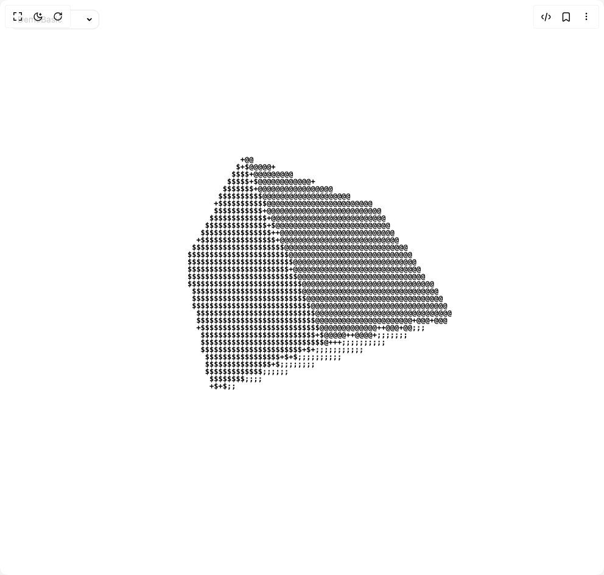
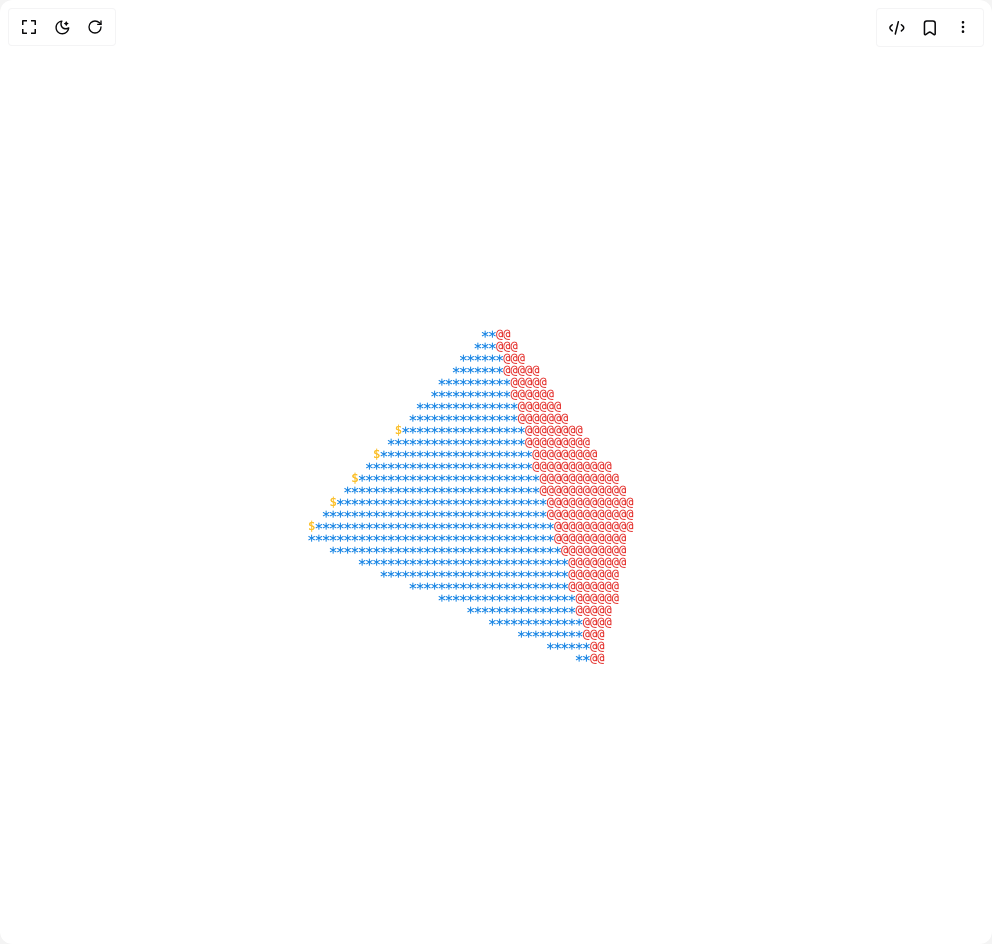
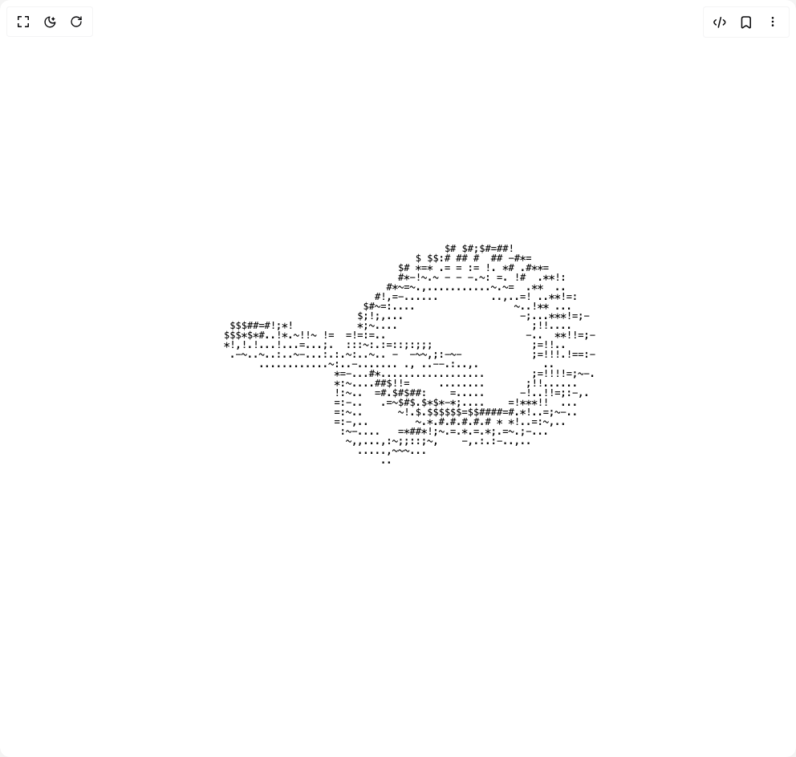

# Montekkundan Components

3 components are available in this author group.

> Build any component in [BuilderStudio](https://builderstudio.dev), then share improvements with the community on [Discord](https://discord.gg/QdWeSGCqfe) or [Reddit](https://reddit.com/r/builderstudio).

| Preview | Component | Variant |
| --- | --- | --- |
|  | [Ascii Cube](ascii-cube/default/README.md) | `default` |
|  | [Ascii Pyramid](ascii-pyramid/default/README.md) | `default` |
|  | [Knot Animation](knot-animation/default/README.md) | `default` |
