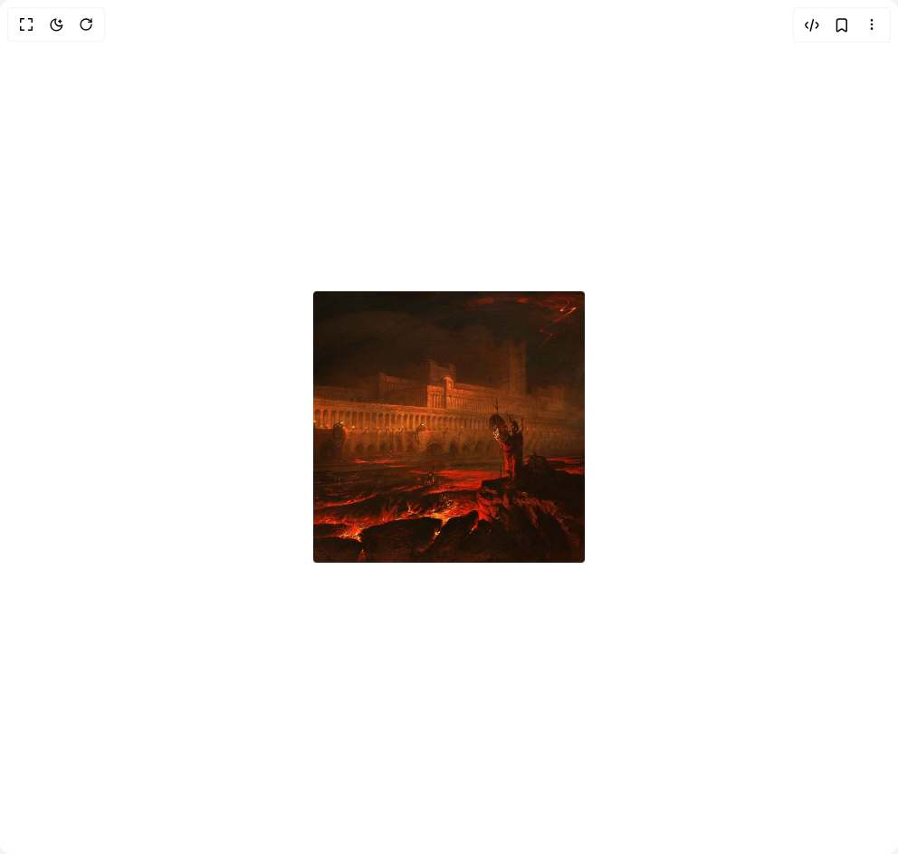

# Build Progressive Blur in BuilderStudio

> Build this component in our Agentic IDE: [BuilderStudio](https://builderstudio.dev).
>
> Join the BuilderStudio community on [Discord](https://discord.gg/QdWeSGCqfe) and [Reddit](https://reddit.com/r/builderstudio).



## Component

- Author group: `motion-primitives`
- Component: `progressive-blur`
- Variant: `with-hover`
- Rendered HTML snapshot: [`rendered.html`](rendered.html)

## BuilderStudio prompt

You are implementing a React component based on a component reference.

## Component identity

- Author: motion-primitives
- Component slug: progressive-blur
- Demo slug: with-hover
- Title: progressive-blur
- Description: 

## Goal

Recreate this component in a React + TypeScript + Tailwind CSS project. Preserve the visual layout, spacing, colors, border radius, shadows, interaction behavior, animation behavior, responsive behavior, and dark mode behavior shown in the rendered demo.

## Implementation requirements

- Use React and TypeScript.
- Use Tailwind CSS classes whenever possible.
- Keep the component self-contained unless the source files require helper components.
- If the source uses CSS variables, custom CSS, animations, or keyframes, include them.
- If the source uses external packages, list and use the required packages.
- Preserve accessibility attributes, button semantics, links, keyboard behavior, and ARIA attributes when visible in the source.
- Do not replace the component with a simplified placeholder.
- Return complete production-ready code.

## Dependencies

No reference metadata available.

## Rendered DOM snapshot

This is the rendered demo HTML extracted from the live preview. Use it to verify structure, class names, visible content, and layout.

```html
<div id="root"><div class="relative flex items-center justify-center h-screen w-full m-auto p-16 bg-background text-foreground"><div class="absolute lab-bg inset-0 size-full"><div class="absolute inset-0 bg-[radial-gradient(#00000021_1px,transparent_1px)] dark:bg-[radial-gradient(#ffffff22_1px,transparent_1px)]"></div></div><div class="flex w-full justify-center relative"><div class="relative my-4 aspect-square h-[300px] overflow-hidden rounded-[4px]"><div class="pointer-events-none absolute bottom-0 left-0 h-[75%] w-full"><div class="pointer-events-none absolute inset-0 rounded-[inherit]" style="mask-image: linear-gradient(rgba(255, 255, 255, 0) 0%, rgb(255, 255, 255) 11.1111%, rgb(255, 255, 255) 22.2222%, rgba(255, 255, 255, 0) 33.3333%); backdrop-filter: blur(0px); opacity: 0;"></div><div class="pointer-events-none absolute inset-0 rounded-[inherit]" style="mask-image: linear-gradient(rgba(255, 255, 255, 0) 11.1111%, rgb(255, 255, 255) 22.2222%, rgb(255, 255, 255) 33.3333%, rgba(255, 255, 255, 0) 44.4444%); backdrop-filter: blur(0.5px); opacity: 0;"></div><div class="pointer-events-none absolute inset-0 rounded-[inherit]" style="mask-image: linear-gradient(rgba(255, 255, 255, 0) 22.2222%, rgb(255, 255, 255) 33.3333%, rgb(255, 255, 255) 44.4444%, rgba(255, 255, 255, 0) 55.5556%); backdrop-filter: blur(1px); opacity: 0;"></div><div class="pointer-events-none absolute inset-0 rounded-[inherit]" style="mask-image: linear-gradient(rgba(255, 255, 255, 0) 33.3333%, rgb(255, 255, 255) 44.4444%, rgb(255, 255, 255) 55.5556%, rgba(255, 255, 255, 0) 66.6667%); backdrop-filter: blur(1.5px); opacity: 0;"></div><div class="pointer-events-none absolute inset-0 rounded-[inherit]" style="mask-image: linear-gradient(rgba(255, 255, 255, 0) 44.4444%, rgb(255, 255, 255) 55.5556%, rgb(255, 255, 255) 66.6667%, rgba(255, 255, 255, 0) 77.7778%); backdrop-filter: blur(2px); opacity: 0;"></div><div class="pointer-events-none absolute inset-0 rounded-[inherit]" style="mask-image: linear-gradient(rgba(255, 255, 255, 0) 55.5556%, rgb(255, 255, 255) 66.6667%, rgb(255, 255, 255) 77.7778%, rgba(255, 255, 255, 0) 88.8889%); backdrop-filter: blur(2.5px); opacity: 0;"></div><div class="pointer-events-none absolute inset-0 rounded-[inherit]" style="mask-image: linear-gradient(rgba(255, 255, 255, 0) 66.6667%, rgb(255, 255, 255) 77.7778%, rgb(255, 255, 255) 88.8889%, rgba(255, 255, 255, 0) 100%); backdrop-filter: blur(3px); opacity: 0;"></div><div class="pointer-events-none absolute inset-0 rounded-[inherit]" style="mask-image: linear-gradient(rgba(255, 255, 255, 0) 77.7778%, rgb(255, 255, 255) 88.8889%, rgb(255, 255, 255) 100%, rgba(255, 255, 255, 0) 111.111%); backdrop-filter: blur(3.5px); opacity: 0;"></div></div><div class="absolute bottom-0 left-0" style="opacity: 0;"><div class="flex flex-col items-start gap-0 px-5 py-4"><p class="text-base font-medium text-white">John Martin</p><span class="text-base text-zinc-300">Pandemonium</span></div></div></div></div></div></div>
```

## Reference source files

No reference source files were available.
