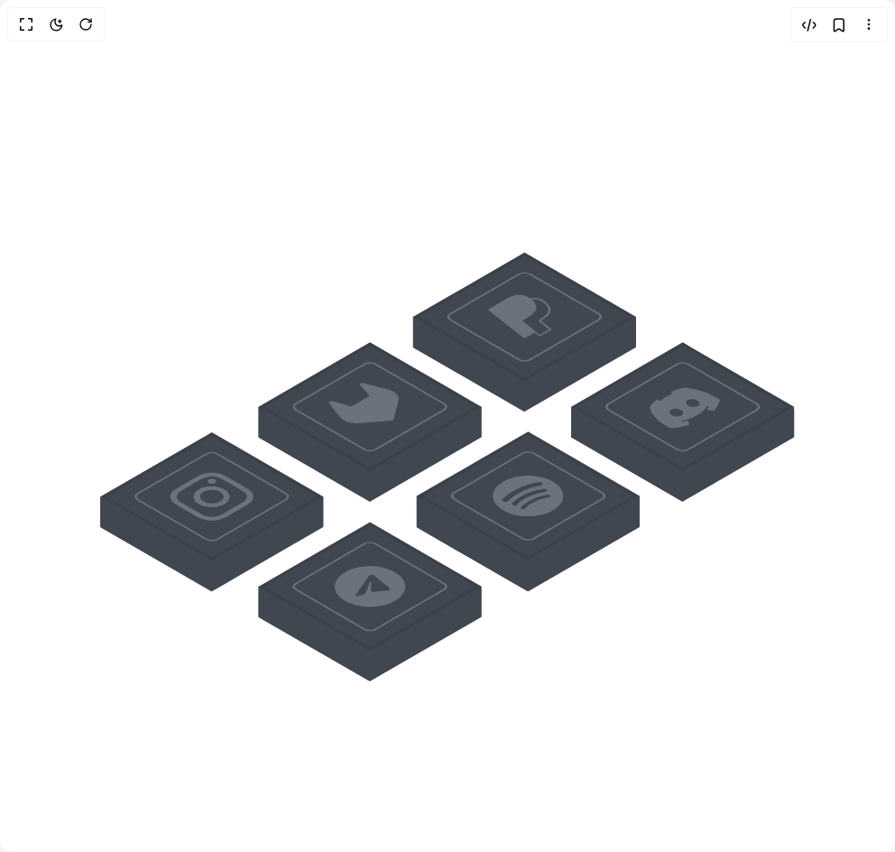

# Build Boxy App Icons in BuilderStudio

> Build this component in our Agentic IDE: [BuilderStudio](https://builderstudio.dev).
>
> Join the BuilderStudio community on [Discord](https://discord.gg/QdWeSGCqfe) and [Reddit](https://reddit.com/r/builderstudio).



## Component

- Author group: `muhammad-binsalman`
- Component: `boxy-app-icons`
- Variant: `default`
- Rendered HTML snapshot: [`rendered.html`](rendered.html)

## BuilderStudio prompt

You are implementing a React component based on a component reference.

## Component identity

- Author: muhammad-binsalman
- Component slug: boxy-app-icons
- Demo slug: default
- Title: boxy-app-icons
- Description: 

## Goal

Recreate this component in a React + TypeScript + Tailwind CSS project. Preserve the visual layout, spacing, colors, border radius, shadows, interaction behavior, animation behavior, responsive behavior, and dark mode behavior shown in the rendered demo.

## Implementation requirements

- Use React and TypeScript.
- Use Tailwind CSS classes whenever possible.
- Keep the component self-contained unless the source files require helper components.
- If the source uses CSS variables, custom CSS, animations, or keyframes, include them.
- If the source uses external packages, list and use the required packages.
- Preserve accessibility attributes, button semantics, links, keyboard behavior, and ARIA attributes when visible in the source.
- Do not replace the component with a simplified placeholder.
- Return complete production-ready code.

## Dependencies

No reference metadata available.

## Rendered DOM snapshot

This is the rendered demo HTML extracted from the live preview. Use it to verify structure, class names, visible content, and layout.

```html
<div id="root"><div class="w-screen min-h-screen flex justify-center items-center"><div class="w-screen min-h-screen flex justify-center items-center"><svg xmlns="http://www.w3.org/2000/svg" fill="none" viewBox="0 0 249 144" class="scale-[1]"><defs><linearGradient id="instagram_gradient" gradientUnits="objectBoundingBox" x1="0" y1="0" x2="0" y2="1"><stop offset="0%" stop-color="#bc1888"></stop><stop offset="25%" stop-color="#cc2366"></stop><stop offset="50%" stop-color="#dc2743"></stop><stop offset="75%" stop-color="#e6683c"></stop><stop offset="100%" stop-color="#f09433"></stop></linearGradient><linearGradient id="gitlab_gradient" gradientUnits="objectBoundingBox" x1="0.5" y1="1" x2="0.5" y2="0"><stop offset="0%" stop-color="#e24329"></stop><stop offset="50%" stop-color="#fc6d26"></stop><stop offset="100%" stop-color="#fca326"></stop></linearGradient><linearGradient id="paint0_linear_67_353" x1="0.0366998" y1="-0.0366699" x2="21.354" y2="42.7472" gradientUnits="userSpaceOnUse"><stop stop-color="#414750"></stop><stop offset="1" stop-color="#414750"></stop></linearGradient><linearGradient id="paint1_linear_67_353" x1="0.0366998" y1="-0.0366699" x2="21.354" y2="42.7472" gradientUnits="userSpaceOnUse"><stop stop-color="#414750"></stop><stop offset="1" stop-color="#414750"></stop></linearGradient><linearGradient id="paint2_linear_67_353" x1="0.0366998" y1="-0.0366699" x2="21.354" y2="42.7472" gradientUnits="userSpaceOnUse"><stop stop-color="#414750"></stop><stop offset="1" stop-color="#414750"></stop></linearGradient><linearGradient id="paint3_linear_67_353" x1="0.0366998" y1="-0.0366699" x2="21.354" y2="42.7472" gradientUnits="userSpaceOnUse"><stop stop-color="#414750"></stop><stop offset="1" stop-color="#414750"></stop></linearGradient><linearGradient id="paint4_linear_67_353" x1="0.0366998" y1="-0.0366699" x2="21.354" y2="42.7472" gradientUnits="userSpaceOnUse"><stop stop-color="#414750"></stop><stop offset="1" stop-color="#414750"></stop></linearGradient><linearGradient id="paint5_linear_67_353" x1="0.0366998" y1="-0.0366699" x2="21.354" y2="42.7472" gradientUnits="userSpaceOnUse"><stop stop-color="#414750"></stop><stop offset="1" stop-color="#414750"></stop></linearGradient><clipPath id="clip0_67_353"><rect transform="matrix(0.866025 -0.5 0.866025 0.5 87 34.054)" fill="white" width="68.1077" height="67.9856"></rect></clipPath><clipPath id="clip1_67_353"><rect transform="matrix(0.866025 -0.5 0.866025 0.5 132.074 41.6909)" fill="white" width="16" height="16"></rect></clipPath><clipPath id="clip2_67_353"><rect transform="matrix(0.866025 -0.5 0.866025 0.5 44 59.054)" fill="white" width="68.1077" height="67.9856"></rect></clipPath><clipPath id="clip3_67_353"><rect transform="matrix(0.866025 -0.5 0.866025 0.5 89.074 66.6909)" fill="white" width="16" height="16"></rect></clipPath><clipPath id="clip4_67_353"><rect transform="matrix(0.866025 -0.5 0.866025 0.5 0 84.054)" fill="white" width="68.1077" height="67.9856"></rect></clipPath><clipPath id="clip5_67_353"><rect transform="matrix(0.866025 -0.5 0.866025 0.5 45.0741 91.6909)" fill="white" width="16" height="16"></rect></clipPath><clipPath id="clip6_67_353"><rect transform="matrix(0.866025 -0.5 0.866025 0.5 131 59.054)" fill="white" width="68.1077" height="67.9856"></rect></clipPath><clipPath id="clip7_67_353"><rect transform="matrix(0.866025 -0.5 0.866025 0.5 176.074 66.6909)" fill="white" width="16" height="16"></rect></clipPath><clipPath id="clip8_67_353"><rect transform="matrix(0.866025 -0.5 0.866025 0.5 88 84.054)" fill="white" width="68.1077" height="67.9856"></rect></clipPath><clipPath id="clip9_67_353"><rect transform="matrix(0.866025 -0.5 0.866025 0.5 133.074 91.5005)" fill="white" width="16" height="16"></rect></clipPath><clipPath id="clip10_67_353"><rect transform="matrix(0.866025 -0.5 0.866025 0.5 44 109.054)" fill="white" width="68.1077" height="67.9856"></rect></clipPath><clipPath id="clip11_67_353"><rect transform="matrix(0.866025 -0.5 0.866025 0.5 89.074 116.691)" fill="white" width="16" height="16"></rect></clipPath></defs><g clip-path="url(#clip0_67_353)" class="group transition-transform duration-300 ease-in-out hover:-translate-y-5 hover:cursor-pointer"><g><rect fill="#3F454E" transform="matrix(0.866025 0.5 0 1 114.925 41.6956)" width="35.7957" height="38.6628"></rect><rect fill="#3F454E" transform="matrix(-0.866025 0.5 0 1 176.925 41.6956)" width="35.7957" height="38.6628"></rect><path fill="#414750" class="group-hover:fill-[#009cde]" d="M115.445 41.6366C115.158 41.471 114.925 41.6053 114.925 41.9366V71.6956L145.925 89.5934L176.925 71.6956V41.8582C176.925 41.6373 176.77 41.5478 176.579 41.6582L145.925 59.3561V59.2345L115.445 41.6366Z" clip-rule="evenodd" fill-rule="evenodd"></path><rect fill="url(#paint0_linear_67_353)" transform="matrix(0.866025 -0.5 0.866025 0.5 115.042 42.1313)" width="34.8156" height="34.7864" x="0.866025"></rect><rect stroke="#3C4149" transform="matrix(0.866025 -0.5 0.866025 0.5 115.042 42.1313)" width="34.8156" height="34.7864" x="0.866025"></rect><rect stroke="#6B727C" stroke-width="0.5" transform="matrix(0.866025 -0.5 0.866025 0.5 123.472 41.9074)" rx="1.75" width="25.5" height="25.5" x="0.433013" class="group-hover:stroke-[#009cde]"></rect><g clip-path="url(#clip1_67_353)"><path fill="#6B727C" class="group-hover:fill-[#009cde]" d="M147.466 36.5173C146.642 35.9218 145.799 35.6478 144.67 35.6053C143.319 35.5548 141.871 36.0348 140.41 36.8778L136.174 39.3238C136.03 39.4071 135.942 39.5174 135.926 39.6348C135.91 39.7521 135.967 39.869 136.086 39.9643L145.51 47.4428C145.553 47.4776 145.609 47.5065 145.674 47.5275C145.739 47.5485 145.811 47.5611 145.886 47.5645C145.96 47.5679 146.034 47.5619 146.104 47.547C146.174 47.5321 146.237 47.5087 146.29 47.4783L148.677 46.1003L149.61 46.8413C149.676 46.8932 149.76 46.9363 149.857 46.9676C149.954 46.999 150.061 47.0178 150.172 47.0228C150.283 47.0279 150.394 47.019 150.498 46.9968C150.603 46.9746 150.697 46.9397 150.776 46.8943L152.981 45.6213C153.352 45.4068 153.399 45.0698 153.094 44.8248L153.003 44.7473L150.784 42.9858L150.668 42.8888L150.662 42.8848C150.602 42.8369 150.572 42.778 150.581 42.7188C150.589 42.6596 150.633 42.6041 150.707 42.5623L151.036 42.3723C152.132 41.7393 152.914 41.0318 153.144 40.2448C153.241 39.9205 153.237 39.5875 153.134 39.2458C152.976 38.6876 152.585 38.16 151.995 37.7083C151.126 36.9643 150.067 36.4653 148.77 36.4163C148.375 36.404 147.979 36.4328 147.601 36.5013L147.466 36.5173ZM145.379 42.8293C145.42 42.7539 145.492 42.6854 145.588 42.6293L146.832 41.9113C149.274 40.5013 150.195 38.8258 147.885 36.8473L147.874 36.8378C148.169 36.7911 148.454 36.7728 148.728 36.7828C149.74 36.8213 150.645 37.2108 151.464 37.9128C152.439 38.7473 152.712 39.4993 152.513 40.1813C152.312 40.8673 151.624 41.5098 150.584 42.1103L150.255 42.3003C150.074 42.4038 149.963 42.5412 149.943 42.6876C149.922 42.8341 149.993 42.9799 150.143 43.0988L150.259 43.1958L152.478 44.9573L152.57 45.0343L152.573 45.0368C152.633 45.0847 152.662 45.1435 152.654 45.2026C152.646 45.2617 152.601 45.3171 152.528 45.3588L150.323 46.6318C150.31 46.6395 150.294 46.6455 150.276 46.6493C150.258 46.6531 150.239 46.6546 150.221 46.6537C150.202 46.6529 150.184 46.6497 150.167 46.6443C150.151 46.639 150.136 46.6316 150.125 46.6228L149.162 45.8588L145.379 42.8293Z"></path></g></g></g><g clip-path="url(#clip2_67_353)" class="group transition-transform duration-300 ease-in-out hover:-translate-y-5 hover:cursor-pointer"><g><rect fill="#3F454E" transform="matrix(0.866025 0.5 0 1 71.9253 66.6956)" width="35.7957" height="38.6628"></rect><rect fill="#3F454E" transform="matrix(-0.866025 0.5 0 1 133.925 66.6956)" width="35.7957" height="38.6628"></rect><path fill="#414750" class="group-hover:fill-[url(#gitlab_gradient)]" d="M133.579 66.6557C133.77 66.5453 133.925 66.6348 133.925 66.8557V96.6954L102.925 114.593L71.9253 96.6954V66.875C71.9253 66.6541 72.0804 66.5645 72.2717 66.675L102.925 84.3729V84.3536L133.579 66.6557Z" clip-rule="evenodd" fill-rule="evenodd"></path><rect fill="url(#paint1_linear_67_353)" transform="matrix(0.866025 -0.5 0.866025 0.5 72.0419 67.1313)" width="34.8156" height="34.7864" x="0.866025"></rect><rect stroke="#3C4149" transform="matrix(0.866025 -0.5 0.866025 0.5 72.0419 67.1313)" width="34.8156" height="34.7864" x="0.866025"></rect><rect stroke="#6B727C" stroke-width="0.5" transform="matrix(0.866025 -0.5 0.866025 0.5 80.4718 66.9074)" rx="1.75" width="25.5" height="25.5" x="0.433013" class="group-hover:stroke-[url(#gitlab_gradient)]"></rect><g clip-path="url(#clip3_67_353)"><path fill="#6B727C" class="group-hover:fill-[url(#gitlab_gradient)]" d="M107.983 61.8739L107.914 61.8559L101.105 60.1029C100.97 60.0698 100.821 60.062 100.678 60.0805C100.535 60.0991 100.406 60.1431 100.309 60.2064C100.212 60.2695 100.15 60.3478 100.131 60.4314C100.117 60.5158 100.147 60.6006 100.218 60.6749L102.841 63.6594L97.6841 66.6369L92.5139 65.1219C92.386 65.0795 92.2382 65.0614 92.0916 65.0703C91.9449 65.0792 91.8069 65.1146 91.6971 65.1715C91.5873 65.2283 91.5114 65.3037 91.4802 65.3869C91.4489 65.4701 91.464 65.5569 91.5232 65.6349L94.5551 69.5664L94.5854 69.6059C95.0237 70.1721 95.7689 70.6406 96.7086 70.9409C97.6484 71.2413 98.7318 71.3571 99.7954 71.2709L99.8067 71.2704L99.8361 71.2674L104.862 70.8509L107.358 70.6519L108.877 70.5294C109.056 70.5157 109.222 70.4684 109.349 70.3948C109.477 70.3212 109.559 70.2255 109.582 70.1224L109.795 69.2449L110.139 67.8039L110.865 64.8849L110.867 64.8769C111.013 64.2636 110.812 63.6394 110.292 63.0978C109.772 62.5562 108.963 62.1265 107.985 61.8729L107.983 61.8739Z"></path></g></g></g><g clip-path="url(#clip4_67_353)" class="group transition-transform duration-300 ease-in-out hover:-translate-y-5 hover:cursor-pointer"><g><rect fill="#3F454E" transform="matrix(0.866025 0.5 0 1 27.9253 91.6956)" width="35.7957" height="38.6628"></rect><rect fill="#3F454E" transform="matrix(-0.866025 0.5 0 1 89.9253 91.6956)" width="35.7957" height="38.6628"></rect><path fill="#414750" class="group-hover:fill-[url(#instagram_gradient)]" d="M89.5789 91.6584C89.7702 91.5479 89.9253 91.6375 89.9253 91.8584V121.696L58.9253 139.593L27.9253 121.695V91.8835C27.9253 91.6626 28.0804 91.5731 28.2717 91.6835L58.9253 109.381V109.356L89.5789 91.6584Z" clip-rule="evenodd" fill-rule="evenodd"></path><rect fill="url(#paint2_linear_67_353)" transform="matrix(0.866025 -0.5 0.866025 0.5 28.0419 92.1313)" width="34.8156" height="34.7864" x="0.866025"></rect><rect stroke="#3C4149" transform="matrix(0.866025 -0.5 0.866025 0.5 28.0419 92.1313)" width="34.8156" height="34.7864" x="0.866025"></rect><rect stroke="#6B727C" stroke-width="0.5" transform="matrix(0.866025 -0.5 0.866025 0.5 36.4718 91.9074)" rx="1.75" width="25.5" height="25.5" x="0.433013" class="group-hover:stroke-[url(#instagram_gradient)]"></rect><g clip-path="url(#clip5_67_353)"><path fill="#6B727C" class="group-hover:fill-[url(#instagram_gradient)]" d="M52.0023 87.6909C50.1221 88.7764 49.8943 88.9179 49.1885 89.3634C48.4845 89.8099 48.0973 90.1674 47.828 90.5209C47.5389 90.8882 47.3929 91.2875 47.4002 91.6909C47.3929 92.0943 47.5389 92.4937 47.828 92.8609C48.0965 93.2139 48.4836 93.5724 49.1859 94.0169C49.8935 94.4634 50.1204 94.6044 52.0031 95.6914C53.8841 96.7774 54.1283 96.9084 54.9 97.3159C55.6725 97.7219 56.2917 97.9454 56.904 98.1009C57.537 98.2614 58.1597 98.3479 58.9305 98.3479C59.7004 98.3484 60.3239 98.2624 60.9561 98.1014C61.5692 97.9454 62.1884 97.7229 62.9601 97.3164C63.7326 96.9084 63.9768 96.7774 65.8587 95.6909C67.7405 94.6044 67.9666 94.4639 68.6732 94.0179C69.3756 93.5724 69.7644 93.2139 70.0338 92.8604C70.3225 92.4933 70.4682 92.0941 70.4607 91.6909C70.4607 91.2459 70.3109 90.8864 70.0329 90.5209C69.7627 90.1679 69.3765 89.8099 68.6732 89.3639C67.9674 88.9184 67.7405 88.7774 65.8587 87.6909C63.9768 86.6044 63.7326 86.4734 62.9601 86.0654C62.1884 85.6599 61.5675 85.4364 60.957 85.2809C60.3209 85.114 59.6291 85.0297 58.9305 85.0339C58.2318 85.0297 57.54 85.114 56.904 85.2809C56.2908 85.4369 55.6699 85.6604 54.8991 86.0664C54.1266 86.4744 53.8833 86.6049 52.0005 87.6919L52.0023 87.6909ZM52.6301 88.7704L53.2519 88.4114C55.1018 87.3434 55.3269 87.2204 56.0908 86.8184C56.7966 86.4459 57.2772 86.2994 57.6158 86.2129C58.0644 86.0989 58.4463 86.0524 58.9313 86.0524C59.4163 86.0524 59.7965 86.0989 60.2459 86.2134C60.5846 86.2989 61.0643 86.4459 61.7702 86.8184C62.534 87.2204 62.76 87.3429 64.609 88.4104C66.4579 89.4779 66.671 89.6089 67.3673 90.0499C68.0125 90.4574 68.2653 90.7344 68.4152 90.9299C68.6037 91.168 68.6984 91.4272 68.6923 91.6889C68.6923 91.9689 68.6118 92.1884 68.4134 92.4479C68.2662 92.6429 68.0116 92.9199 67.3664 93.3284C66.6693 93.7689 66.4579 93.8999 64.6081 94.9679C62.7583 96.0359 62.5305 96.1584 61.7676 96.5609C61.0609 96.9329 60.582 97.0794 60.2425 97.1654C59.8303 97.2746 59.3813 97.3296 58.9279 97.3264C58.474 97.3301 58.0243 97.2754 57.6115 97.1664C57.2737 97.0804 56.7931 96.9339 56.0873 96.5614C55.3243 96.1589 55.0983 96.0364 53.2476 94.9679C51.3969 93.8994 51.1865 93.7699 50.4893 93.3294C49.845 92.9214 49.5904 92.6444 49.4414 92.4484C49.244 92.1894 49.1634 91.9689 49.1634 91.6889C49.1634 91.4089 49.244 91.1894 49.4423 90.9299C49.5912 90.7339 49.845 90.4574 50.4893 90.0494C51.099 89.6634 51.338 89.5154 52.6284 88.7694L52.6301 88.7704ZM58.0999 86.9404C57.9908 87.0035 57.9042 87.0783 57.8451 87.1606C57.786 87.243 57.7556 87.3313 57.7556 87.4204C57.7556 87.5096 57.786 87.5978 57.8451 87.6802C57.9042 87.7626 57.9908 87.8374 58.0999 87.9004C58.2091 87.9635 58.3387 88.0135 58.4814 88.0476C58.624 88.0817 58.7769 88.0992 58.9313 88.0992C59.0857 88.0992 59.2386 88.0817 59.3813 88.0476C59.5239 88.0135 59.6535 87.9635 59.7627 87.9004C59.9832 87.7731 60.1071 87.6005 60.1071 87.4204C60.1071 87.2404 59.9832 87.0677 59.7627 86.9404C59.5422 86.8131 59.2432 86.7416 58.9313 86.7416C58.6195 86.7416 58.3204 86.8131 58.0999 86.9404ZM55.3737 89.6364C54.8944 89.9046 54.5123 90.2252 54.2497 90.5795C53.9871 90.9338 53.8491 91.3147 53.8439 91.7001C53.8387 92.0854 53.9663 92.4675 54.2194 92.8241C54.4724 93.1807 54.8458 93.5047 55.3177 93.7772C55.7897 94.0497 56.3509 94.2653 56.9685 94.4114C57.5862 94.5575 58.248 94.6311 58.9155 94.6281C59.583 94.6251 60.2427 94.5455 60.8564 94.3939C61.47 94.2422 62.0253 94.0216 62.4898 93.7449C63.4093 93.1972 63.9189 92.4628 63.9086 91.7001C63.8983 90.9373 63.3689 90.2076 62.4347 89.6682C61.5006 89.1289 60.2366 88.8233 58.9155 88.8173C57.5944 88.8114 56.3223 89.1056 55.3737 89.6364ZM56.6216 90.3569C56.9249 90.1818 57.285 90.0429 57.6813 89.9481C58.0776 89.8533 58.5024 89.8046 58.9313 89.8046C59.3603 89.8046 59.785 89.8533 60.1813 89.9481C60.5776 90.0429 60.9377 90.1818 61.241 90.3569C61.5443 90.532 61.7849 90.7399 61.9491 90.9687C62.1132 91.1975 62.1977 91.4428 62.1977 91.6904C62.1977 91.9381 62.1132 92.1833 61.9491 92.4121C61.7849 92.6409 61.5443 92.8488 61.241 93.0239C60.6284 93.3776 59.7976 93.5763 58.9313 93.5763C58.065 93.5763 57.2342 93.3776 56.6216 93.0239C56.0091 92.6703 55.6649 92.1906 55.6649 91.6904C55.6649 91.1903 56.0091 90.7106 56.6216 90.3569Z"></path></g></g></g><g clip-path="url(#clip6_67_353)" class="group transition-transform duration-300 ease-in-out hover:-translate-y-5 hover:cursor-pointer"><g><rect fill="#3F454E" transform="matrix(0.866025 0.5 0 1 158.925 66.6956)" width="35.7957" height="38.6628"></rect><rect fill="#3F454E" transform="matrix(-0.866025 0.5 0 1 220.925 66.6956)" width="35.7957" height="38.6628"></rect><path fill="#414750" class="group-hover:fill-[#26a5e4]" d="M159.272 66.6889C159.08 66.5785 158.925 66.668 158.925 66.8889V96.6955L189.925 114.593L220.925 96.6956V67.7044C220.925 66.9865 220.421 66.6955 219.799 67.0544L189.925 84.3023V84.3868L159.272 66.6889Z" clip-rule="evenodd" fill-rule="evenodd"></path><rect fill="url(#paint3_linear_67_353)" transform="matrix(0.866025 -0.5 0.866025 0.5 159.042 67.1313)" width="34.8156" height="34.7864" x="0.866025"></rect><rect stroke="#3C4149" transform="matrix(0.866025 -0.5 0.866025 0.5 159.042 67.1313)" width="34.8156" height="34.7864" x="0.866025"></rect><rect stroke="#6B727C" stroke-width="0.5" transform="matrix(0.866025 -0.5 0.866025 0.5 167.472 66.9074)" rx="1.75" width="25.5" height="25.5" x="0.433013" class="group-hover:stroke-[#26a5e4]"></rect><g clip-path="url(#clip7_67_353)"><path fill="#6B727C" class="group-hover:fill-[#26a5e4]" d="M190.322 61.3719C189.011 61.6524 187.768 62.0299 186.626 62.4949C186.615 62.4992 186.608 62.5051 186.603 62.512C186.599 62.5189 186.599 62.5264 186.602 62.5334C186.697 62.7289 186.845 62.9704 186.972 63.1529C185.763 63.6672 184.695 64.2838 183.804 64.9819C183.452 64.8998 183.092 64.8295 182.726 64.7714C182.714 64.7694 182.701 64.7697 182.689 64.7721C182.677 64.7745 182.667 64.779 182.659 64.7849C181.853 65.4444 181.199 66.1619 180.714 66.9189C180.709 66.925 180.708 66.932 180.712 66.9384C181.599 69.5249 183.725 71.3209 186.551 72.6739C186.566 72.6803 186.582 72.6829 186.601 72.6819C188.422 72.5251 190.183 72.1912 191.811 71.6944C191.822 71.691 191.831 71.6855 191.837 71.6787C191.843 71.672 191.845 71.6643 191.843 71.6569C191.746 71.2926 191.599 70.9348 191.4 70.5834C191.396 70.5762 191.388 70.5699 191.377 70.5655C191.366 70.561 191.354 70.5588 191.34 70.5589L191.315 70.5624C190.798 70.6947 190.265 70.8039 189.719 70.8889C189.704 70.8914 189.688 70.8903 189.674 70.886C189.66 70.8818 189.65 70.8746 189.645 70.8659L189.641 70.8489C189.66 70.7749 189.675 70.7011 189.687 70.6274C189.688 70.6211 189.692 70.615 189.699 70.6099C189.706 70.6048 189.715 70.6008 189.725 70.5984C193.029 69.8869 195.484 68.4694 196.689 66.5779C196.693 66.5717 196.7 66.5662 196.709 66.5621C196.718 66.558 196.729 66.5555 196.741 66.5549C196.868 66.5479 196.996 66.5391 197.125 66.5284C197.135 66.5273 197.145 66.5277 197.155 66.5297C197.165 66.5316 197.174 66.5349 197.181 66.5394C197.188 66.5438 197.193 66.5493 197.195 66.5551C197.198 66.561 197.198 66.5671 197.195 66.5729C197.052 66.889 196.862 67.1973 196.627 67.4944C196.624 67.4991 196.622 67.5043 196.622 67.5094C196.622 67.5146 196.624 67.5197 196.627 67.5244C196.631 67.529 196.636 67.533 196.643 67.5363C196.649 67.5396 196.657 67.542 196.666 67.5434C197.276 67.6559 197.899 67.7404 198.524 67.7994C198.537 67.8007 198.55 67.7996 198.562 67.7963C198.573 67.793 198.583 67.7876 198.589 67.7809C199.454 66.8412 200.034 65.8231 200.305 64.7704C200.306 64.7653 200.306 64.7601 200.303 64.755C200.301 64.75 200.297 64.7454 200.291 64.7414C197.591 62.8489 194.222 61.7964 190.356 61.3714C190.35 61.37 190.345 61.3692 190.339 61.3693C190.333 61.3694 190.327 61.3703 190.322 61.3719ZM189.55 69.1244C188.867 69.5189 187.678 69.4814 186.909 69.0374C186.14 68.5934 186.064 67.9124 186.757 67.5119C187.456 67.1084 188.645 67.1519 189.4 67.5994C190.169 68.0434 190.244 68.7239 189.55 69.1244ZM194.154 66.4664C193.472 66.8604 192.282 66.8234 191.513 66.3794C190.744 65.9354 190.667 65.2544 191.361 64.8539C192.06 64.4504 193.25 64.4934 194.003 64.9414C194.772 65.3854 194.853 66.0629 194.154 66.4664Z"></path></g></g></g><g clip-path="url(#clip8_67_353)" class="group transition-transform duration-300 ease-in-out hover:-translate-y-5 hover:cursor-pointer"><g><rect fill="#3F454E" transform="matrix(0.866025 0.5 0 1 115.925 91.5051)" width="35.7957" height="38.6628"></rect><rect fill="#3F454E" transform="matrix(-0.866025 0.5 0 1 177.925 91.5051)" width="35.7957" height="38.6628"></rect><path fill="#414750" class="group-hover:fill-[#1db954]" d="M116.272 91.4909C116.08 91.3805 115.925 91.47 115.925 91.6909V121.505L146.925 139.403V139.403L177.925 121.505V91.6441C177.925 91.4785 177.809 91.4113 177.665 91.4941L146.925 109.242V109.189L116.272 91.4909Z" clip-rule="evenodd" fill-rule="evenodd"></path><rect fill="url(#paint4_linear_67_353)" transform="matrix(0.866025 -0.5 0.866025 0.5 116.042 91.9408)" width="34.8156" height="34.7864" x="0.866025"></rect><rect stroke="#3C4149" transform="matrix(0.866025 -0.5 0.866025 0.5 116.042 91.9408)" width="34.8156" height="34.7864" x="0.866025"></rect><rect stroke="#6B727C" stroke-width="0.5" transform="matrix(0.866025 -0.5 0.866025 0.5 124.472 91.717)" rx="1.75" width="25.5" height="25.5" x="0.433013" class="group-hover:stroke-[#1db954]"></rect><g clip-path="url(#clip9_67_353)"><path fill="#6B727C" class="group-hover:fill-[#1db954]" d="M140.002 87.5005C138.165 88.5614 137.132 90.0002 137.132 91.5005C137.132 93.0008 138.165 94.4396 140.002 95.5005C141.84 96.5614 144.332 97.1573 146.93 97.1573C149.529 97.1573 152.021 96.5614 153.859 95.5005C155.696 94.4396 156.728 93.0008 156.728 91.5005C156.728 90.0002 155.696 88.5614 153.859 87.5005C152.021 86.4396 149.529 85.8436 146.93 85.8436C144.332 85.8436 141.84 86.4396 140.002 87.5005ZM153.172 91.435C153.209 91.5259 153.183 91.6218 153.098 91.7015C153.014 91.7813 152.878 91.8384 152.721 91.8605C150.1 92.2265 147.828 93.2785 145.967 94.9895C145.881 95.0687 145.744 95.1249 145.586 95.1457C145.428 95.1666 145.262 95.1503 145.125 95.1005C144.988 95.0507 144.89 94.9715 144.854 94.8802C144.818 94.789 144.846 94.6932 144.933 94.614C146.969 92.742 149.492 91.5845 152.434 91.175C152.592 91.1532 152.758 91.1683 152.896 91.217C153.034 91.2657 153.133 91.3441 153.172 91.435ZM152.134 89.8565C152.181 89.9703 152.147 90.0902 152.041 90.1898C151.935 90.2895 151.765 90.3608 151.568 90.388C148.562 90.8025 145.392 92.25 143.857 93.908C143.755 94.0038 143.593 94.0735 143.405 94.1029C143.217 94.1322 143.016 94.119 142.844 94.0659C142.672 94.0129 142.542 93.9239 142.48 93.8173C142.418 93.7106 142.428 93.5943 142.509 93.492C144.262 91.599 147.76 90.0065 151.212 89.5305C151.409 89.5032 151.617 89.5222 151.79 89.5833C151.963 89.6445 152.086 89.7427 152.134 89.8565ZM150.242 88.6805C146.683 89.2035 142.877 91.26 141.391 92.8645C141.277 92.9882 141.082 93.0806 140.849 93.1213C140.617 93.162 140.365 93.1477 140.151 93.0815C139.937 93.0153 139.777 92.9027 139.706 92.7684C139.636 92.6342 139.661 92.4892 139.775 92.3655C141.48 90.5245 145.691 88.258 149.788 87.6545C150.024 87.6197 150.274 87.6405 150.483 87.7121C150.692 87.7838 150.844 87.9004 150.904 88.0365C150.964 88.1725 150.928 88.3168 150.804 88.4376C150.68 88.5584 150.478 88.6457 150.242 88.6805Z"></path></g></g></g><g clip-path="url(#clip10_67_353)" class="group transition-transform duration-300 ease-in-out hover:-translate-y-5 hover:cursor-pointer"><g><rect fill="#40464F" transform="matrix(0.866025 0.5 0 1 71.9253 116.696)" width="35.7957" height="38.6628"></rect><rect fill="#40464F" transform="matrix(-0.866025 0.5 0 1 133.925 116.696)" width="35.7957" height="38.6628"></rect><path fill="#414750" class="group-hover:fill-[#5865f2]" d="M133.579 116.628C133.77 116.517 133.925 116.607 133.925 116.828V146.695L102.925 164.593V164.594L71.9253 146.696V116.786C71.9253 116.62 72.0416 116.553 72.1851 116.636L102.925 134.384V134.326L133.579 116.628Z" clip-rule="evenodd" fill-rule="evenodd"></path><rect fill="url(#paint5_linear_67_353)" transform="matrix(0.866025 -0.5 0.866025 0.5 72.0419 117.131)" width="34.8156" height="34.7864" x="0.866025"></rect><rect stroke="#3C4149" transform="matrix(0.866025 -0.5 0.866025 0.5 72.0419 117.131)" width="34.8156" height="34.7864" x="0.866025"></rect><rect stroke="#6B727C" stroke-width="0.5" transform="matrix(0.866025 -0.5 0.866025 0.5 80.4718 116.907)" rx="1.75" width="25.5" height="25.5" x="0.433013" class="group-hover:stroke-[#5865f2]"></rect><g clip-path="url(#clip11_67_353)"><path fill="#6B727C" class="group-hover:fill-[#5865f2]" d="M109.859 112.691C111.696 113.752 112.728 115.191 112.728 116.691C112.728 118.191 111.696 119.63 109.859 120.691C108.021 121.752 105.529 122.348 102.93 122.348C100.332 122.348 97.8397 121.752 96.0022 120.691C94.1648 119.63 93.1325 118.191 93.1325 116.691C93.1325 115.191 94.1648 113.752 96.0022 112.691C97.8397 111.63 100.332 111.034 102.93 111.034C105.529 111.034 108.021 111.63 109.859 112.691ZM101.366 115.5C100.972 116.052 100.205 117.164 99.0654 118.838C98.8679 119.102 98.8237 119.275 98.9329 119.357C99.1173 119.493 99.4646 119.389 99.9375 119.247L100.137 119.187C100.605 119.049 101.216 118.852 101.468 118.712C101.699 118.586 101.857 118.388 101.942 118.118C102.556 116.293 102.886 115.359 102.933 115.316C102.966 115.285 103.014 115.243 103.091 115.241C103.167 115.239 103.231 115.28 103.245 115.293C103.331 115.373 103.257 116.527 103.22 117.125C103.208 117.311 103.2 117.443 103.201 117.472C103.202 117.534 103.201 117.597 103.199 117.659C103.187 118.032 103.178 118.311 104.154 118.195C104.624 118.14 105.005 118.097 105.385 118.056C105.799 118.011 106.212 117.965 106.74 117.902C106.874 117.886 107.006 117.873 107.136 117.861C107.627 117.813 108.069 117.77 108.358 117.569C108.526 117.452 108.544 117.242 108.121 116.886C107.124 116.045 104.917 114.25 103.926 113.557C103.841 113.501 103.746 113.45 103.641 113.406C103.56 113.369 103.458 113.351 103.355 113.355C103.222 113.369 103.1 113.407 103.006 113.463C102.75 113.616 102.489 113.928 101.366 115.5Z"></path></g></g></g></svg></div></div></div>
```

## Reference source files

No reference source files were available.
