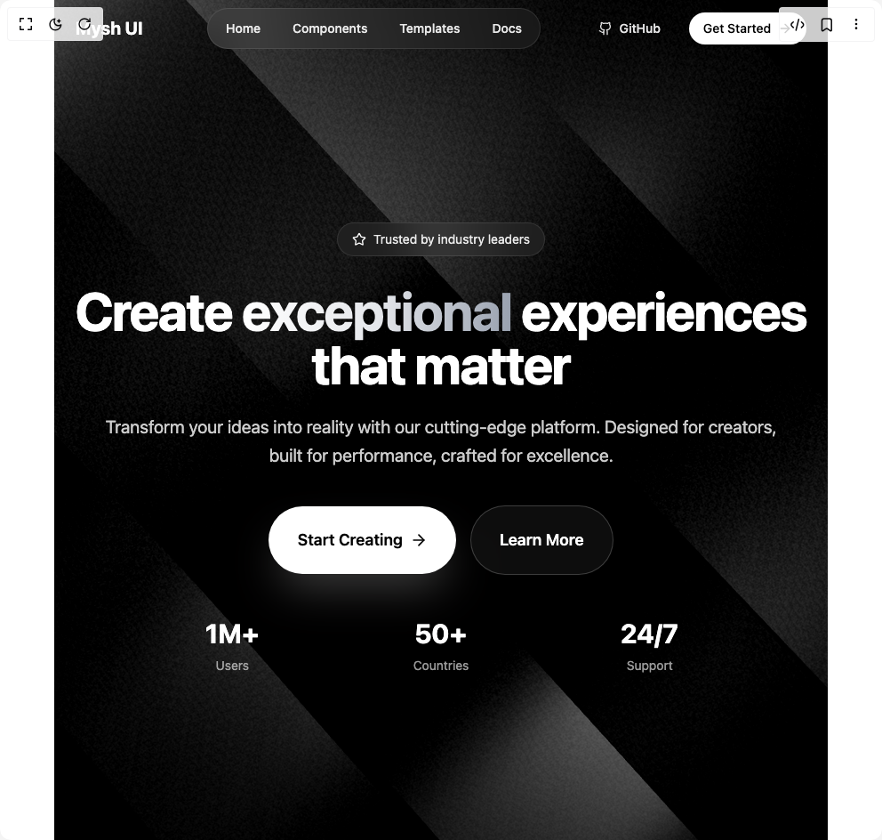

# Build Ethereal Beams Hero in BuilderStudio

> Build this component in our Agentic IDE: [BuilderStudio](https://builderstudio.dev).
>
> Join the BuilderStudio community on [Discord](https://discord.gg/QdWeSGCqfe) and [Reddit](https://reddit.com/r/builderstudio).



## Component

- Author group: `muhammad-binsalman`
- Component: `ethereal-beams-hero`
- Variant: `default`
- Rendered HTML snapshot: [`rendered.html`](rendered.html)

## BuilderStudio prompt

You are implementing a React component based on a component reference.

## Component identity

- Author: muhammad-binsalman
- Component slug: ethereal-beams-hero
- Demo slug: default
- Title: ethereal-beams-hero
- Description: 

## Goal

Recreate this component in a React + TypeScript + Tailwind CSS project. Preserve the visual layout, spacing, colors, border radius, shadows, interaction behavior, animation behavior, responsive behavior, and dark mode behavior shown in the rendered demo.

## Implementation requirements

- Use React and TypeScript.
- Use Tailwind CSS classes whenever possible.
- Keep the component self-contained unless the source files require helper components.
- If the source uses CSS variables, custom CSS, animations, or keyframes, include them.
- If the source uses external packages, list and use the required packages.
- Preserve accessibility attributes, button semantics, links, keyboard behavior, and ARIA attributes when visible in the source.
- Do not replace the component with a simplified placeholder.
- Return complete production-ready code.

## Dependencies

No reference metadata available.

## Rendered DOM snapshot

This is the rendered demo HTML extracted from the live preview. Use it to verify structure, class names, visible content, and layout.

```html
<div id="root"><div class="w-screen min-h-screen flex justify-center items-center"><div class="w-screen min-h-screen flex justify-center items-center"><main><div class="relative min-h-screen w-full overflow-hidden bg-black"><div class="absolute inset-0 z-0"><div class="w-full h-full relative" style="position: relative; width: 100%; height: 100%; overflow: hidden; pointer-events: auto;"><div style="width: 100%; height: 100%;"><canvas data-engine="three.js r178" width="870" height="944" style="display: block; width: 870.406px; height: 944px;"></canvas></div></div></div><nav class="relative z-20 w-full"><div class="mx-auto max-w-7xl px-6 lg:px-8"><div class="flex h-16 items-center justify-between"><div class="flex items-center"><span class="text-xl font-bold text-white">Mysh UI</span></div><div class="hidden md:flex items-center space-x-1 rounded-full bg-white/5 backdrop-blur-xl border border-white/10 p-1 -mr-6"><a href="#" class="rounded-full px-4 py-2 text-sm font-medium text-white/90 transition-all hover:bg-white/10 hover:text-white">Home</a><a href="#" class="rounded-full px-4 py-2 text-sm font-medium text-white/90 transition-all hover:bg-white/10 hover:text-white">Components</a><a href="#" class="rounded-full px-4 py-2 text-sm font-medium text-white/90 transition-all hover:bg-white/10 hover:text-white">Templates</a><a href="#" class="rounded-full px-4 py-2 text-sm font-medium text-white/90 transition-all hover:bg-white/10 hover:text-white">Docs</a></div><div class="flex items-center space-x-4"><button class="group relative overflow-hidden rounded-full inline-flex items-center justify-center font-medium transition-all focus-visible:outline-none focus-visible:ring-2 focus-visible:ring-white/20 disabled:pointer-events-none disabled:opacity-50 text-white/90 hover:text-white hover:bg-white/10 h-9 px-4 py-2 text-sm hidden sm:flex"><span class="relative z-10 flex items-center"><svg xmlns="http://www.w3.org/2000/svg" width="24" height="24" viewBox="0 0 24 24" fill="none" stroke="currentColor" stroke-width="2" stroke-linecap="round" stroke-linejoin="round" class="lucide lucide-github mr-2 h-4 w-4" aria-hidden="true"><path d="M15 22v-4a4.8 4.8 0 0 0-1-3.5c3 0 6-2 6-5.5.08-1.25-.27-2.48-1-3.5.28-1.15.28-2.35 0-3.5 0 0-1 0-3 1.5-2.64-.5-5.36-.5-8 0C6 2 5 2 5 2c-.3 1.15-.3 2.35 0 3.5A5.403 5.403 0 0 0 4 9c0 3.5 3 5.5 6 5.5-.39.49-.68 1.05-.85 1.65-.17.6-.22 1.23-.15 1.85v4"></path><path d="M9 18c-4.51 2-5-2-7-2"></path></svg>GitHub</span><div class="absolute inset-0 -top-2 -bottom-2 bg-gradient-to-r from-transparent via-white/20 to-transparent skew-x-12 -translate-x-full group-hover:translate-x-full transition-transform duration-1000 ease-out"></div></button><button class="group relative overflow-hidden rounded-full inline-flex items-center justify-center font-medium transition-all focus-visible:outline-none focus-visible:ring-2 focus-visible:ring-white/20 disabled:pointer-events-none disabled:opacity-50 bg-white text-black hover:bg-gray-100 h-9 px-4 py-2 text-sm "><span class="relative z-10 flex items-center">Get Started<svg xmlns="http://www.w3.org/2000/svg" width="24" height="24" viewBox="0 0 24 24" fill="none" stroke="currentColor" stroke-width="2" stroke-linecap="round" stroke-linejoin="round" class="lucide lucide-arrow-right ml-2 h-4 w-4" aria-hidden="true"><path d="M5 12h14"></path><path d="m12 5 7 7-7 7"></path></svg></span><div class="absolute inset-0 -top-2 -bottom-2 bg-gradient-to-r from-transparent via-white/20 to-transparent skew-x-12 -translate-x-full group-hover:translate-x-full transition-transform duration-1000 ease-out"></div></button></div></div></div></nav><div class="relative z-10 flex min-h-[calc(100vh-4rem)] items-center"><div class="mx-auto max-w-7xl px-6 lg:px-8"><div class="mx-auto max-w-4xl text-center"><div class="mb-8 inline-flex items-center rounded-full bg-white/5 backdrop-blur-xl border border-white/10 px-4 py-2 text-sm text-white/90"><svg xmlns="http://www.w3.org/2000/svg" width="24" height="24" viewBox="0 0 24 24" fill="none" stroke="currentColor" stroke-width="2" stroke-linecap="round" stroke-linejoin="round" class="lucide lucide-star mr-2 h-4 w-4 text-white" aria-hidden="true"><path d="M11.525 2.295a.53.53 0 0 1 .95 0l2.31 4.679a2.123 2.123 0 0 0 1.595 1.16l5.166.756a.53.53 0 0 1 .294.904l-3.736 3.638a2.123 2.123 0 0 0-.611 1.878l.882 5.14a.53.53 0 0 1-.771.56l-4.618-2.428a2.122 2.122 0 0 0-1.973 0L6.396 21.01a.53.53 0 0 1-.77-.56l.881-5.139a2.122 2.122 0 0 0-.611-1.879L2.16 9.795a.53.53 0 0 1 .294-.906l5.165-.755a2.122 2.122 0 0 0 1.597-1.16z"></path></svg>Trusted by industry leaders</div><h1 class="mb-6 text-4xl font-bold tracking-tight text-white sm:text-6xl lg:text-7xl">Create <span class="bg-gradient-to-r from-white via-gray-200 to-gray-400 bg-clip-text text-transparent">exceptional</span> experiences<br>that matter</h1><p class="mb-10 text-lg leading-8 text-white/80 sm:text-xl lg:text-2xl max-w-3xl mx-auto">Transform your ideas into reality with our cutting-edge platform. Designed for creators, built for performance, crafted for excellence.</p><div class="flex flex-col sm:flex-row items-center justify-center gap-4 mb-12"><button class="group relative overflow-hidden rounded-full inline-flex items-center justify-center font-medium transition-all focus-visible:outline-none focus-visible:ring-2 focus-visible:ring-white/20 disabled:pointer-events-none disabled:opacity-50 bg-white text-black hover:bg-gray-100 px-8 py-6 text-lg shadow-2xl shadow-white/25 font-semibold"><span class="relative z-10 flex items-center">Start Creating<svg xmlns="http://www.w3.org/2000/svg" width="24" height="24" viewBox="0 0 24 24" fill="none" stroke="currentColor" stroke-width="2" stroke-linecap="round" stroke-linejoin="round" class="lucide lucide-arrow-right ml-2 h-5 w-5" aria-hidden="true"><path d="M5 12h14"></path><path d="m12 5 7 7-7 7"></path></svg></span><div class="absolute inset-0 -top-2 -bottom-2 bg-gradient-to-r from-transparent via-white/20 to-transparent skew-x-12 -translate-x-full group-hover:translate-x-full transition-transform duration-1000 ease-out"></div></button><button class="group relative overflow-hidden rounded-full inline-flex items-center justify-center font-medium transition-all focus-visible:outline-none focus-visible:ring-2 focus-visible:ring-white/20 disabled:pointer-events-none disabled:opacity-50 border border-white/20 bg-white/5 backdrop-blur-xl text-white hover:bg-white/10 hover:border-white/30 px-8 py-6 text-lg font-semibold bg-transparent"><span class="relative z-10 flex items-center">Learn More</span><div class="absolute inset-0 -top-2 -bottom-2 bg-gradient-to-r from-transparent via-white/20 to-transparent skew-x-12 -translate-x-full group-hover:translate-x-full transition-transform duration-1000 ease-out"></div></button></div><div class="grid grid-cols-1 sm:grid-cols-3 gap-8 max-w-2xl mx-auto"><div class="text-center"><div class="text-3xl font-bold text-white mb-2">1M+</div><div class="text-white/60 text-sm">Users</div></div><div class="text-center"><div class="text-3xl font-bold text-white mb-2">50+</div><div class="text-white/60 text-sm">Countries</div></div><div class="text-center"><div class="text-3xl font-bold text-white mb-2">24/7</div><div class="text-white/60 text-sm">Support</div></div></div></div></div></div><div class="absolute inset-0 z-0 bg-gradient-to-t from-black/50 via-transparent to-black/30"></div></div></main></div></div></div>
```

## Reference source files

No reference source files were available.
