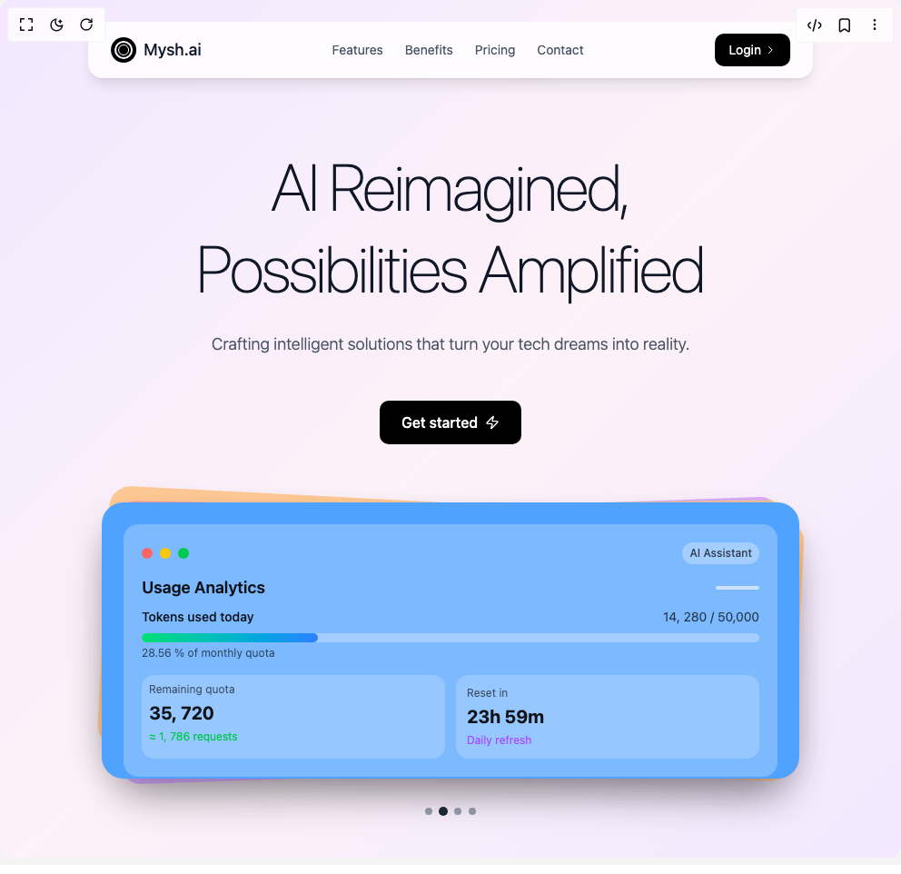

# Build Flux Card Hero in BuilderStudio

> Build this component in our Agentic IDE: [BuilderStudio](https://builderstudio.dev).
>
> Join the BuilderStudio community on [Discord](https://discord.gg/QdWeSGCqfe) and [Reddit](https://reddit.com/r/builderstudio).



## Component

- Author group: `muhammad-binsalman`
- Component: `flux-card-hero`
- Variant: `default`
- Rendered HTML snapshot: [`rendered.html`](rendered.html)

## BuilderStudio prompt

You are implementing a React component based on a component reference.

## Component identity

- Author: muhammad-binsalman
- Component slug: flux-card-hero
- Demo slug: default
- Title: flux-card-hero
- Description: 

## Goal

Recreate this component in a React + TypeScript + Tailwind CSS project. Preserve the visual layout, spacing, colors, border radius, shadows, interaction behavior, animation behavior, responsive behavior, and dark mode behavior shown in the rendered demo.

## Implementation requirements

- Use React and TypeScript.
- Use Tailwind CSS classes whenever possible.
- Keep the component self-contained unless the source files require helper components.
- If the source uses CSS variables, custom CSS, animations, or keyframes, include them.
- If the source uses external packages, list and use the required packages.
- Preserve accessibility attributes, button semantics, links, keyboard behavior, and ARIA attributes when visible in the source.
- Do not replace the component with a simplified placeholder.
- Return complete production-ready code.

## Dependencies

No reference metadata available.

## Rendered DOM snapshot

This is the rendered demo HTML extracted from the live preview. Use it to verify structure, class names, visible content, and layout.

```html
<div id="root"><div class="w-screen min-h-screen flex justify-center items-center"><div class="w-screen min-h-screen flex justify-center items-center"><div class="min-h-screen bg-gradient-to-br from-purple-100 via-pink-50 w-full overflow-hidden max-w-screen to-purple-100 relative"><div class="absolute top-6 left-1/2 transform -translate-x-1/2 z-50"><nav class="bg-white/80 backdrop-blur-md rounded-2xl px-6 py-3 shadow-lg border border-white/20"><div class="flex items-center space-x-36"><div class="flex items-center space-x-2"><div class="w-7 h-7 bg-black rounded-full flex items-center justify-center"><div class="w-5 h-5 border-2 border-white rounded-full relative"><div class="absolute inset-0.5 border border-white rounded-full"> </div></div></div><span class="text-lg font-medium text-gray-900"> Mysh.ai </span></div><div class="hidden md:flex items-center space-x-6"><a href="#features" class="text-sm text-gray-600 hover:text-gray-900 transition-colors"> Features </a><a href="#benefits" class="text-sm text-gray-600 hover:text-gray-900 transition-colors"> Benefits </a><a href="#pricing" class="text-sm text-gray-600 hover:text-gray-900 transition-colors"> Pricing </a><a href="#contact" class="text-sm text-gray-600 hover:text-gray-900 transition-colors"> Contact </a></div><button class="bg-black text-white px-4 py-2 rounded-lg hover:bg-gray-800 transition-all duration-200 transform hover:scale-105 flex items-center space-x-1 text-sm"><span>Login </span><svg class="w-3 h-3" fill="none" stroke="currentColor" viewBox="0 0 24 24"><path stroke-linecap="round" stroke-linejoin="round" stroke-width="2" d="M9 5l7 7-7 7"></path></svg></button></div></nav></div><div class="flex flex-col items-center justify-center px-6 pt-40 pb-16 max-w-7xl mx-auto"><div class="text-center mb-12"><h1 class="text-6xl md:text-7xl xl:text-8xl font-thin text-gray-900 leading-tight mb-6 tracking-tight">AI Reimagined, <br>Possibilities Amplified</h1><p class="text-lg font-light text-gray-600 max-w-2xl mx-auto leading-relaxed">Crafting intelligent solutions that turn your tech dreams into reality.</p></div><button class="bg-black text-white px-6 py-3 rounded-lg hover:bg-gray-800 transition-all duration-300 transform hover:scale-110 hover:shadow-xl mb-16 flex items-center space-x-2 text-base font-medium group"><span>Get started </span><svg xmlns="http://www.w3.org/2000/svg" width="24" height="24" viewBox="0 0 24 24" fill="none" stroke="currentColor" stroke-width="2" stroke-linecap="round" stroke-linejoin="round" class="lucide lucide-zap w-4 h-4 group-hover:translate-x-1 transition-transform duration-300" aria-hidden="true"><path d="M4 14a1 1 0 0 1-.78-1.63l9.9-10.2a.5.5 0 0 1 .86.46l-1.92 6.02A1 1 0 0 0 13 10h7a1 1 0 0 1 .78 1.63l-9.9 10.2a.5.5 0 0 1-.86-.46l1.92-6.02A1 1 0 0 0 11 14z"></path></svg></button><div class="relative w-full max-w-3xl mx-auto"><div class="absolute inset-0 transform rotate-3 scale-95 transition-all duration-1000 ease-in-out"><div class="w-full h-72 bg-orange-300 rounded-3xl shadow-2xl opacity-50 transition-all duration-1000 scale-105 opacity-70"> </div></div><div class="absolute inset-0 transform -rotate-2 scale-96 transition-all duration-1000 ease-in-out delay-300"><div class="w-full h-76 bg-purple-400 rounded-3xl shadow-2xl opacity-60 transition-all duration-1000 "> </div></div><div class="absolute inset-0 transform rotate-1 scale-97 transition-all duration-1000 ease-in-out delay-500"><div class="w-full h-72 bg-pink-400 rounded-3xl shadow-2xl opacity-50 transition-all duration-1000 "> </div></div><div class="absolute inset-0 transform -rotate-1 scale-98 transition-all duration-1000 ease-in-out delay-700"><div class="w-full h-72 bg-yellow-300 rounded-3xl shadow-2xl opacity-40 transition-all duration-1000 "> </div></div><div class="relative z-10 w-full h-76 bg-blue-400 rounded-3xl shadow-2xl p-6 flex flex-col transition-all duration-1000 ease-in-out transform hover:scale-[1.02]"><div class="bg-white/25 backdrop-blur-sm rounded-2xl p-5 flex-1 transition-all duration-500"><div class="flex items-center justify-between mb-3"><div class="flex items-center space-x-2"><div class="w-3 h-3 bg-red-400 rounded-full transition-all duration-300 hover:scale-110"> </div><div class="w-3 h-3 bg-yellow-400 rounded-full transition-all duration-300 hover:scale-110"> </div><div class="w-3 h-3 bg-green-500 rounded-full transition-all duration-300 hover:scale-110"> </div></div><span class="text-xs text-black/70 font-medium bg-white/30 px-2 py-1 rounded-full"> AI Assistant </span></div><div class="space-y-4"><div class="flex items-center justify-between mb-2"><h3 class="text-lg font-semibold text-black/90"> Usage Analytics </h3><div class="w-12 h-1 bg-white/60 rounded-full"> </div></div><div class="space-y-4"><div><div class="flex justify-between mb-2"><span class="text-sm font-medium text-black/90"> Tokens used today </span><span class="text-sm text-black/70"> 14, 280 / 50,000 </span></div><div class="w-full bg-white/30 rounded-full h-2.5"><div class="bg-gradient-to-r from-green-400 to-blue-500 h-2.5 rounded-full" style="width: 28.56%;"> </div></div><div class="mt-1 text-xs text-black/60"> 28.56 % of monthly quota </div></div><div class="grid grid-cols-2 gap-3"><div class="bg-white/20 rounded-xl p-2"><div class="text-xs text-black/60 mb-1"> Remaining quota </div><div class="text-xl font-bold text-black/90"> 35, 720 </div><div class="text-xs text-green-500 mt-1">≈ 1, 786 requests </div></div><div class="bg-white/20 rounded-xl p-3"><div class="text-xs text-black/60 mb-1"> Reset in </div><div class="text-xl font-bold text-black/90"> 23h 59m </div><div class="text-xs text-purple-500 mt-1"> Daily refresh </div></div></div></div></div></div></div></div><div class="flex space-x-2 mt-8"><button class="w-2 h-2 rounded-full transition-all duration-300 bg-gray-400 hover:bg-gray-600"></button><button class="w-2 h-2 rounded-full transition-all duration-300 bg-gray-800 scale-125"></button><button class="w-2 h-2 rounded-full transition-all duration-300 bg-gray-400 hover:bg-gray-600"></button><button class="w-2 h-2 rounded-full transition-all duration-300 bg-gray-400 hover:bg-gray-600"></button></div></div></div></div></div></div>
```

## Reference source files

No reference source files were available.
