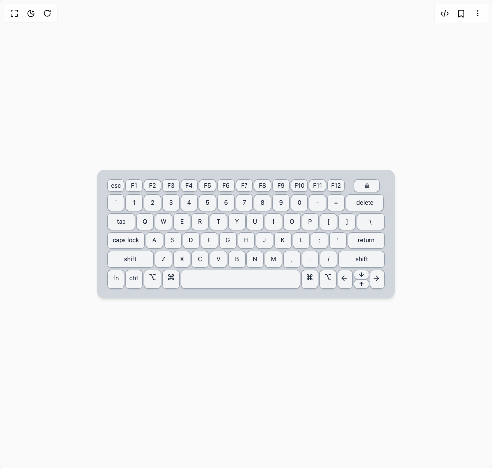

# Build Magic Keyboard Component in BuilderStudio

> Build this component in our Agentic IDE: [BuilderStudio](https://builderstudio.dev).
>
> Join the BuilderStudio community on [Discord](https://discord.gg/QdWeSGCqfe) and [Reddit](https://reddit.com/r/builderstudio).



## Component

- Author group: `muhammad-binsalman`
- Component: `magic-keyboard-component`
- Variant: `default`
- Rendered HTML snapshot: [`rendered.html`](rendered.html)

## BuilderStudio prompt

You are implementing a React component based on a component reference.

## Component identity

- Author: muhammad-binsalman
- Component slug: magic-keyboard-component
- Demo slug: default
- Title: magic-keyboard-component
- Description: 

## Goal

Recreate this component in a React + TypeScript + Tailwind CSS project. Preserve the visual layout, spacing, colors, border radius, shadows, interaction behavior, animation behavior, responsive behavior, and dark mode behavior shown in the rendered demo.

## Implementation requirements

- Use React and TypeScript.
- Use Tailwind CSS classes whenever possible.
- Keep the component self-contained unless the source files require helper components.
- If the source uses CSS variables, custom CSS, animations, or keyframes, include them.
- If the source uses external packages, list and use the required packages.
- Preserve accessibility attributes, button semantics, links, keyboard behavior, and ARIA attributes when visible in the source.
- Do not replace the component with a simplified placeholder.
- Return complete production-ready code.

## Dependencies

No reference metadata available.

## Rendered DOM snapshot

This is the rendered demo HTML extracted from the live preview. Use it to verify structure, class names, visible content, and layout.

```html
<div id="root"><div class="w-screen min-h-screen flex justify-center items-center"><div class="w-screen min-h-screen flex justify-center items-center"><main class="bg-neutral-50 w-full h-screen flex items-center justify-center"><div class="flex flex-col gap-1 p-5 rounded-xl bg-gray-300 shadow-md w-[600px] select-none"><div class="flex gap-0.5"><div class="bg-gray-100 border border-gray-400 rounded-md shadow-sm min-w-[35px] text-center py-1 px-1 text-xs text-gray-800 cursor-pointer transition duration-200 ease-in-out hover:bg-gray-200 hover:-translate-y-0.5 active:translate-y-0.5 max-h-[25px]">esc</div><div class="bg-gray-100 border border-gray-400 rounded-md shadow-sm min-w-[35px] text-center py-1 px-1 text-xs text-gray-800 cursor-pointer transition duration-200 ease-in-out hover:bg-gray-200 hover:-translate-y-0.5 active:translate-y-0.5 max-h-[25px]">F1</div><div class="bg-gray-100 border border-gray-400 rounded-md shadow-sm min-w-[35px] text-center py-1 px-1 text-xs text-gray-800 cursor-pointer transition duration-200 ease-in-out hover:bg-gray-200 hover:-translate-y-0.5 active:translate-y-0.5 max-h-[25px]">F2</div><div class="bg-gray-100 border border-gray-400 rounded-md shadow-sm min-w-[35px] text-center py-1 px-1 text-xs text-gray-800 cursor-pointer transition duration-200 ease-in-out hover:bg-gray-200 hover:-translate-y-0.5 active:translate-y-0.5 max-h-[25px]">F3</div><div class="bg-gray-100 border border-gray-400 rounded-md shadow-sm min-w-[35px] text-center py-1 px-1 text-xs text-gray-800 cursor-pointer transition duration-200 ease-in-out hover:bg-gray-200 hover:-translate-y-0.5 active:translate-y-0.5 max-h-[25px]">F4</div><div class="bg-gray-100 border border-gray-400 rounded-md shadow-sm min-w-[35px] text-center py-1 px-1 text-xs text-gray-800 cursor-pointer transition duration-200 ease-in-out hover:bg-gray-200 hover:-translate-y-0.5 active:translate-y-0.5 max-h-[25px]">F5</div><div class="bg-gray-100 border border-gray-400 rounded-md shadow-sm min-w-[35px] text-center py-1 px-1 text-xs text-gray-800 cursor-pointer transition duration-200 ease-in-out hover:bg-gray-200 hover:-translate-y-0.5 active:translate-y-0.5 max-h-[25px]">F6</div><div class="bg-gray-100 border border-gray-400 rounded-md shadow-sm min-w-[35px] text-center py-1 px-1 text-xs text-gray-800 cursor-pointer transition duration-200 ease-in-out hover:bg-gray-200 hover:-translate-y-0.5 active:translate-y-0.5 max-h-[25px]">F7</div><div class="bg-gray-100 border border-gray-400 rounded-md shadow-sm min-w-[35px] text-center py-1 px-1 text-xs text-gray-800 cursor-pointer transition duration-200 ease-in-out hover:bg-gray-200 hover:-translate-y-0.5 active:translate-y-0.5 max-h-[25px]">F8</div><div class="bg-gray-100 border border-gray-400 rounded-md shadow-sm min-w-[35px] text-center py-1 px-1 text-xs text-gray-800 cursor-pointer transition duration-200 ease-in-out hover:bg-gray-200 hover:-translate-y-0.5 active:translate-y-0.5 max-h-[25px]">F9</div><div class="bg-gray-100 border border-gray-400 rounded-md shadow-sm min-w-[35px] text-center py-1 px-1 text-xs text-gray-800 cursor-pointer transition duration-200 ease-in-out hover:bg-gray-200 hover:-translate-y-0.5 active:translate-y-0.5 max-h-[25px]">F10</div><div class="bg-gray-100 border border-gray-400 rounded-md shadow-sm min-w-[35px] text-center py-1 px-1 text-xs text-gray-800 cursor-pointer transition duration-200 ease-in-out hover:bg-gray-200 hover:-translate-y-0.5 active:translate-y-0.5 max-h-[25px]">F11</div><div class="bg-gray-100 border border-gray-400 rounded-md shadow-sm min-w-[35px] text-center py-1 px-1 text-xs text-gray-800 cursor-pointer transition duration-200 ease-in-out hover:bg-gray-200 hover:-translate-y-0.5 active:translate-y-0.5 max-h-[25px]">F12</div><div class="bg-gray-100 border border-gray-400 rounded-md shadow-sm min-w-[35px] text-center py-1 px-5 text-xs text-gray-800 cursor-pointer transition duration-200 ease-in-out hover:bg-gray-200 hover:-translate-y-0.5 active:translate-y-0.5 ml-4">⏏</div></div><div class="flex gap-0.5"><div class="bg-gray-100 border border-gray-400 rounded-md shadow-sm min-w-[35px] text-center py-2 px-1 text-xs text-gray-800 cursor-pointer transition duration-200 ease-in-out hover:bg-gray-200 hover:-translate-y-0.5 active:translate-y-0.5">`</div><div class="bg-gray-100 border border-gray-400 rounded-md shadow-sm min-w-[35px] text-center py-2 px-1 text-xs text-gray-800 cursor-pointer transition duration-200 ease-in-out hover:bg-gray-200 hover:-translate-y-0.5 active:translate-y-0.5">1</div><div class="bg-gray-100 border border-gray-400 rounded-md shadow-sm min-w-[35px] text-center py-2 px-1 text-xs text-gray-800 cursor-pointer transition duration-200 ease-in-out hover:bg-gray-200 hover:-translate-y-0.5 active:translate-y-0.5">2</div><div class="bg-gray-100 border border-gray-400 rounded-md shadow-sm min-w-[35px] text-center py-2 px-1 text-xs text-gray-800 cursor-pointer transition duration-200 ease-in-out hover:bg-gray-200 hover:-translate-y-0.5 active:translate-y-0.5">3</div><div class="bg-gray-100 border border-gray-400 rounded-md shadow-sm min-w-[35px] text-center py-2 px-1 text-xs text-gray-800 cursor-pointer transition duration-200 ease-in-out hover:bg-gray-200 hover:-translate-y-0.5 active:translate-y-0.5">4</div><div class="bg-gray-100 border border-gray-400 rounded-md shadow-sm min-w-[35px] text-center py-2 px-1 text-xs text-gray-800 cursor-pointer transition duration-200 ease-in-out hover:bg-gray-200 hover:-translate-y-0.5 active:translate-y-0.5">5</div><div class="bg-gray-100 border border-gray-400 rounded-md shadow-sm min-w-[35px] text-center py-2 px-1 text-xs text-gray-800 cursor-pointer transition duration-200 ease-in-out hover:bg-gray-200 hover:-translate-y-0.5 active:translate-y-0.5">6</div><div class="bg-gray-100 border border-gray-400 rounded-md shadow-sm min-w-[35px] text-center py-2 px-1 text-xs text-gray-800 cursor-pointer transition duration-200 ease-in-out hover:bg-gray-200 hover:-translate-y-0.5 active:translate-y-0.5">7</div><div class="bg-gray-100 border border-gray-400 rounded-md shadow-sm min-w-[35px] text-center py-2 px-1 text-xs text-gray-800 cursor-pointer transition duration-200 ease-in-out hover:bg-gray-200 hover:-translate-y-0.5 active:translate-y-0.5">8</div><div class="bg-gray-100 border border-gray-400 rounded-md shadow-sm min-w-[35px] text-center py-2 px-1 text-xs text-gray-800 cursor-pointer transition duration-200 ease-in-out hover:bg-gray-200 hover:-translate-y-0.5 active:translate-y-0.5">9</div><div class="bg-gray-100 border border-gray-400 rounded-md shadow-sm min-w-[35px] text-center py-2 px-1 text-xs text-gray-800 cursor-pointer transition duration-200 ease-in-out hover:bg-gray-200 hover:-translate-y-0.5 active:translate-y-0.5">0</div><div class="bg-gray-100 border border-gray-400 rounded-md shadow-sm min-w-[35px] text-center py-2 px-1 text-xs text-gray-800 cursor-pointer transition duration-200 ease-in-out hover:bg-gray-200 hover:-translate-y-0.5 active:translate-y-0.5">-</div><div class="bg-gray-100 border border-gray-400 rounded-md shadow-sm min-w-[35px] text-center py-2 px-1 text-xs text-gray-800 cursor-pointer transition duration-200 ease-in-out hover:bg-gray-200 hover:-translate-y-0.5 active:translate-y-0.5">=</div><div class="bg-gray-100 border border-gray-400 rounded-md shadow-sm min-w-[35px] text-center py-2 px-5 text-xs text-gray-800 cursor-pointer transition duration-200 ease-in-out hover:bg-gray-200 hover:-translate-y-0.5 active:translate-y-0.5">delete</div></div><div class="flex gap-0.5"><div class="bg-gray-100 border border-gray-400 rounded-md shadow-sm min-w-[35px] text-center py-2 px-1 text-xs text-gray-800 cursor-pointer transition duration-200 ease-in-out hover:bg-gray-200 hover:-translate-y-0.5 active:translate-y-0.5 flex-[2]">tab</div><div class="bg-gray-100 border border-gray-400 rounded-md shadow-sm min-w-[35px] text-center py-2 px-1 text-xs text-gray-800 cursor-pointer transition duration-200 ease-in-out hover:bg-gray-200 hover:-translate-y-0.5 active:translate-y-0.5">Q</div><div class="bg-gray-100 border border-gray-400 rounded-md shadow-sm min-w-[35px] text-center py-2 px-1 text-xs text-gray-800 cursor-pointer transition duration-200 ease-in-out hover:bg-gray-200 hover:-translate-y-0.5 active:translate-y-0.5">W</div><div class="bg-gray-100 border border-gray-400 rounded-md shadow-sm min-w-[35px] text-center py-2 px-1 text-xs text-gray-800 cursor-pointer transition duration-200 ease-in-out hover:bg-gray-200 hover:-translate-y-0.5 active:translate-y-0.5">E</div><div class="bg-gray-100 border border-gray-400 rounded-md shadow-sm min-w-[35px] text-center py-2 px-1 text-xs text-gray-800 cursor-pointer transition duration-200 ease-in-out hover:bg-gray-200 hover:-translate-y-0.5 active:translate-y-0.5">R</div><div class="bg-gray-100 border border-gray-400 rounded-md shadow-sm min-w-[35px] text-center py-2 px-1 text-xs text-gray-800 cursor-pointer transition duration-200 ease-in-out hover:bg-gray-200 hover:-translate-y-0.5 active:translate-y-0.5">T</div><div class="bg-gray-100 border border-gray-400 rounded-md shadow-sm min-w-[35px] text-center py-2 px-1 text-xs text-gray-800 cursor-pointer transition duration-200 ease-in-out hover:bg-gray-200 hover:-translate-y-0.5 active:translate-y-0.5">Y</div><div class="bg-gray-100 border border-gray-400 rounded-md shadow-sm min-w-[35px] text-center py-2 px-1 text-xs text-gray-800 cursor-pointer transition duration-200 ease-in-out hover:bg-gray-200 hover:-translate-y-0.5 active:translate-y-0.5">U</div><div class="bg-gray-100 border border-gray-400 rounded-md shadow-sm min-w-[35px] text-center py-2 px-1 text-xs text-gray-800 cursor-pointer transition duration-200 ease-in-out hover:bg-gray-200 hover:-translate-y-0.5 active:translate-y-0.5">I</div><div class="bg-gray-100 border border-gray-400 rounded-md shadow-sm min-w-[35px] text-center py-2 px-1 text-xs text-gray-800 cursor-pointer transition duration-200 ease-in-out hover:bg-gray-200 hover:-translate-y-0.5 active:translate-y-0.5">O</div><div class="bg-gray-100 border border-gray-400 rounded-md shadow-sm min-w-[35px] text-center py-2 px-1 text-xs text-gray-800 cursor-pointer transition duration-200 ease-in-out hover:bg-gray-200 hover:-translate-y-0.5 active:translate-y-0.5">P</div><div class="bg-gray-100 border border-gray-400 rounded-md shadow-sm min-w-[35px] text-center py-2 px-1 text-xs text-gray-800 cursor-pointer transition duration-200 ease-in-out hover:bg-gray-200 hover:-translate-y-0.5 active:translate-y-0.5">[</div><div class="bg-gray-100 border border-gray-400 rounded-md shadow-sm min-w-[35px] text-center py-2 px-1 text-xs text-gray-800 cursor-pointer transition duration-200 ease-in-out hover:bg-gray-200 hover:-translate-y-0.5 active:translate-y-0.5">]</div><div class="bg-gray-100 border border-gray-400 rounded-md shadow-sm min-w-[35px] text-center py-2 px-1 text-xs text-gray-800 cursor-pointer transition duration-200 ease-in-out hover:bg-gray-200 hover:-translate-y-0.5 active:translate-y-0.5 flex-[2]">\</div></div><div class="flex gap-0.5"><div class="bg-gray-100 border border-gray-400 rounded-md shadow-sm min-w-[35px] text-center py-2 px-1 text-xs text-gray-800 cursor-pointer transition duration-200 ease-in-out hover:bg-gray-200 hover:-translate-y-0.5 active:translate-y-0.5 flex-[2]">caps lock</div><div class="bg-gray-100 border border-gray-400 rounded-md shadow-sm min-w-[35px] text-center py-2 px-1 text-xs text-gray-800 cursor-pointer transition duration-200 ease-in-out hover:bg-gray-200 hover:-translate-y-0.5 active:translate-y-0.5">A</div><div class="bg-gray-100 border border-gray-400 rounded-md shadow-sm min-w-[35px] text-center py-2 px-1 text-xs text-gray-800 cursor-pointer transition duration-200 ease-in-out hover:bg-gray-200 hover:-translate-y-0.5 active:translate-y-0.5">S</div><div class="bg-gray-100 border border-gray-400 rounded-md shadow-sm min-w-[35px] text-center py-2 px-1 text-xs text-gray-800 cursor-pointer transition duration-200 ease-in-out hover:bg-gray-200 hover:-translate-y-0.5 active:translate-y-0.5">D</div><div class="bg-gray-100 border border-gray-400 rounded-md shadow-sm min-w-[35px] text-center py-2 px-1 text-xs text-gray-800 cursor-pointer transition duration-200 ease-in-out hover:bg-gray-200 hover:-translate-y-0.5 active:translate-y-0.5">F</div><div class="bg-gray-100 border border-gray-400 rounded-md shadow-sm min-w-[35px] text-center py-2 px-1 text-xs text-gray-800 cursor-pointer transition duration-200 ease-in-out hover:bg-gray-200 hover:-translate-y-0.5 active:translate-y-0.5">G</div><div class="bg-gray-100 border border-gray-400 rounded-md shadow-sm min-w-[35px] text-center py-2 px-1 text-xs text-gray-800 cursor-pointer transition duration-200 ease-in-out hover:bg-gray-200 hover:-translate-y-0.5 active:translate-y-0.5">H</div><div class="bg-gray-100 border border-gray-400 rounded-md shadow-sm min-w-[35px] text-center py-2 px-1 text-xs text-gray-800 cursor-pointer transition duration-200 ease-in-out hover:bg-gray-200 hover:-translate-y-0.5 active:translate-y-0.5">J</div><div class="bg-gray-100 border border-gray-400 rounded-md shadow-sm min-w-[35px] text-center py-2 px-1 text-xs text-gray-800 cursor-pointer transition duration-200 ease-in-out hover:bg-gray-200 hover:-translate-y-0.5 active:translate-y-0.5">K</div><div class="bg-gray-100 border border-gray-400 rounded-md shadow-sm min-w-[35px] text-center py-2 px-1 text-xs text-gray-800 cursor-pointer transition duration-200 ease-in-out hover:bg-gray-200 hover:-translate-y-0.5 active:translate-y-0.5">L</div><div class="bg-gray-100 border border-gray-400 rounded-md shadow-sm min-w-[35px] text-center py-2 px-1 text-xs text-gray-800 cursor-pointer transition duration-200 ease-in-out hover:bg-gray-200 hover:-translate-y-0.5 active:translate-y-0.5">;</div><div class="bg-gray-100 border border-gray-400 rounded-md shadow-sm min-w-[35px] text-center py-2 px-1 text-xs text-gray-800 cursor-pointer transition duration-200 ease-in-out hover:bg-gray-200 hover:-translate-y-0.5 active:translate-y-0.5">'</div><div class="bg-gray-100 border border-gray-400 rounded-md shadow-sm min-w-[35px] text-center py-2 px-1 text-xs text-gray-800 cursor-pointer transition duration-200 ease-in-out hover:bg-gray-200 hover:-translate-y-0.5 active:translate-y-0.5 flex-[2]">return</div></div><div class="flex gap-0.5"><div class="bg-gray-100 border border-gray-400 rounded-md shadow-sm min-w-[35px] text-center py-2 px-1 text-xs text-gray-800 cursor-pointer transition duration-200 ease-in-out hover:bg-gray-200 hover:-translate-y-0.5 active:translate-y-0.5 flex-[3]">shift</div><div class="bg-gray-100 border border-gray-400 rounded-md shadow-sm min-w-[35px] text-center py-2 px-1 text-xs text-gray-800 cursor-pointer transition duration-200 ease-in-out hover:bg-gray-200 hover:-translate-y-0.5 active:translate-y-0.5">Z</div><div class="bg-gray-100 border border-gray-400 rounded-md shadow-sm min-w-[35px] text-center py-2 px-1 text-xs text-gray-800 cursor-pointer transition duration-200 ease-in-out hover:bg-gray-200 hover:-translate-y-0.5 active:translate-y-0.5">X</div><div class="bg-gray-100 border border-gray-400 rounded-md shadow-sm min-w-[35px] text-center py-2 px-1 text-xs text-gray-800 cursor-pointer transition duration-200 ease-in-out hover:bg-gray-200 hover:-translate-y-0.5 active:translate-y-0.5">C</div><div class="bg-gray-100 border border-gray-400 rounded-md shadow-sm min-w-[35px] text-center py-2 px-1 text-xs text-gray-800 cursor-pointer transition duration-200 ease-in-out hover:bg-gray-200 hover:-translate-y-0.5 active:translate-y-0.5">V</div><div class="bg-gray-100 border border-gray-400 rounded-md shadow-sm min-w-[35px] text-center py-2 px-1 text-xs text-gray-800 cursor-pointer transition duration-200 ease-in-out hover:bg-gray-200 hover:-translate-y-0.5 active:translate-y-0.5">B</div><div class="bg-gray-100 border border-gray-400 rounded-md shadow-sm min-w-[35px] text-center py-2 px-1 text-xs text-gray-800 cursor-pointer transition duration-200 ease-in-out hover:bg-gray-200 hover:-translate-y-0.5 active:translate-y-0.5">N</div><div class="bg-gray-100 border border-gray-400 rounded-md shadow-sm min-w-[35px] text-center py-2 px-1 text-xs text-gray-800 cursor-pointer transition duration-200 ease-in-out hover:bg-gray-200 hover:-translate-y-0.5 active:translate-y-0.5">M</div><div class="bg-gray-100 border border-gray-400 rounded-md shadow-sm min-w-[35px] text-center py-2 px-1 text-xs text-gray-800 cursor-pointer transition duration-200 ease-in-out hover:bg-gray-200 hover:-translate-y-0.5 active:translate-y-0.5">,</div><div class="bg-gray-100 border border-gray-400 rounded-md shadow-sm min-w-[35px] text-center py-2 px-1 text-xs text-gray-800 cursor-pointer transition duration-200 ease-in-out hover:bg-gray-200 hover:-translate-y-0.5 active:translate-y-0.5">.</div><div class="bg-gray-100 border border-gray-400 rounded-md shadow-sm min-w-[35px] text-center py-2 px-1 text-xs text-gray-800 cursor-pointer transition duration-200 ease-in-out hover:bg-gray-200 hover:-translate-y-0.5 active:translate-y-0.5">/</div><div class="bg-gray-100 border border-gray-400 rounded-md shadow-sm min-w-[35px] text-center py-2 px-1 text-xs text-gray-800 cursor-pointer transition duration-200 ease-in-out hover:bg-gray-200 hover:-translate-y-0.5 active:translate-y-0.5 flex-[3]">shift</div></div><div class="flex gap-0.5"><div class="bg-gray-100 border border-gray-400 rounded-md shadow-sm min-w-[35px] text-center py-2 px-1 text-xs text-gray-800 cursor-pointer transition duration-200 ease-in-out hover:bg-gray-200 hover:-translate-y-0.5 active:translate-y-0.5">fn</div><div class="bg-gray-100 border border-gray-400 rounded-md shadow-sm min-w-[35px] text-center py-2 px-1 text-xs text-gray-800 cursor-pointer transition duration-200 ease-in-out hover:bg-gray-200 hover:-translate-y-0.5 active:translate-y-0.5">ctrl</div><div class="bg-gray-100 border border-gray-400 rounded-md shadow-sm min-w-[35px] text-center p-0.5 text-base text-gray-800 cursor-pointer transition duration-200 ease-in-out hover:bg-gray-200 hover:-translate-y-0.5 active:translate-y-0.5">⌥</div><div class="bg-gray-100 border border-gray-400 rounded-md shadow-sm min-w-[35px] text-center p-0.5 text-base text-gray-800 cursor-pointer transition duration-200 ease-in-out hover:bg-gray-200 hover:-translate-y-0.5 active:translate-y-0.5">⌘</div><div class="bg-gray-100 border border-gray-400 rounded-md shadow-sm min-w-[175px] text-center py-2 px-1 text-xs text-gray-800 cursor-pointer transition duration-200 ease-in-out hover:bg-gray-200 hover:-translate-y-0.5 active:translate-y-0.5 flex-[5]"></div><div class="bg-gray-100 border border-gray-400 rounded-md shadow-sm min-w-[35px] text-center p-0.5 text-base text-gray-800 cursor-pointer transition duration-200 ease-in-out hover:bg-gray-200 hover:-translate-y-0.5 active:translate-y-0.5">⌘</div><div class="bg-gray-100 border border-gray-400 rounded-md shadow-sm min-w-[35px] text-center p-0.5 text-base text-gray-800 cursor-pointer transition duration-200 ease-in-out hover:bg-gray-200 hover:-translate-y-0.5 active:translate-y-0.5">⌥</div><div class="bg-gray-100 border border-gray-400 rounded-md shadow-sm min-w-[30px] text-center py-2 px-1 text-xs text-gray-800 cursor-pointer transition duration-200 ease-in-out hover:bg-gray-200 hover:-translate-y-0.5 active:translate-y-0.5"><svg xmlns="http://www.w3.org/2000/svg" width="16" height="16" viewBox="0 0 24 24" fill="none" stroke="currentColor" stroke-width="2" stroke-linecap="round" stroke-linejoin="round" class="lucide lucide-arrow-left" aria-hidden="true"><path d="m12 19-7-7 7-7"></path><path d="M19 12H5"></path></svg></div><div><div class="bg-gray-100 border border-gray-400 rounded-md shadow-sm min-w-[30px] text-center py-0.5 px-2 text-xs text-gray-800 cursor-pointer transition duration-200 ease-in-out hover:bg-gray-200 hover:-translate-y-0.5 active:translate-y-0.5"><svg xmlns="http://www.w3.org/2000/svg" width="13" height="13" viewBox="0 0 24 24" fill="none" stroke="currentColor" stroke-width="2" stroke-linecap="round" stroke-linejoin="round" class="lucide lucide-arrow-down" aria-hidden="true"><path d="M12 5v14"></path><path d="m19 12-7 7-7-7"></path></svg></div><div class="bg-gray-100 border border-gray-400 rounded-md shadow-sm min-w-[30px] text-center py-0.5 px-2 text-xs text-gray-800 cursor-pointer transition duration-200 ease-in-out hover:bg-gray-200 hover:-translate-y-0.5 active:translate-y-0.5"><svg xmlns="http://www.w3.org/2000/svg" width="13" height="13" viewBox="0 0 24 24" fill="none" stroke="currentColor" stroke-width="2" stroke-linecap="round" stroke-linejoin="round" class="lucide lucide-arrow-up" aria-hidden="true"><path d="m5 12 7-7 7 7"></path><path d="M12 19V5"></path></svg></div></div><div class="bg-gray-100 border border-gray-400 rounded-md shadow-sm min-w-[30px] text-center py-2 px-1 text-xs text-gray-800 cursor-pointer transition duration-200 ease-in-out hover:bg-gray-200 hover:-translate-y-0.5 active:translate-y-0.5"><svg xmlns="http://www.w3.org/2000/svg" width="16" height="16" viewBox="0 0 24 24" fill="none" stroke="currentColor" stroke-width="2" stroke-linecap="round" stroke-linejoin="round" class="lucide lucide-arrow-right" aria-hidden="true"><path d="M5 12h14"></path><path d="m12 5 7 7-7 7"></path></svg></div></div></div></main></div></div></div>
```

## Reference source files

No reference source files were available.
