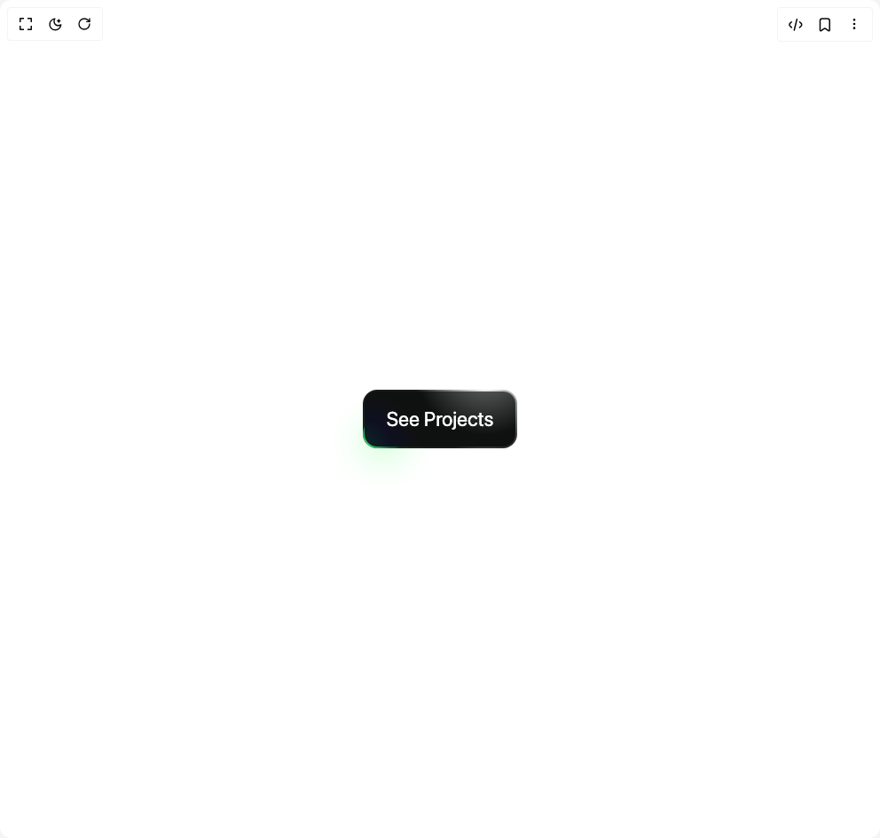

# Build Shiny Borders Button in BuilderStudio

> Build this component in our Agentic IDE: [BuilderStudio](https://builderstudio.dev).
>
> Join the BuilderStudio community on [Discord](https://discord.gg/QdWeSGCqfe) and [Reddit](https://reddit.com/r/builderstudio).



## Component

- Author group: `muhammad-binsalman`
- Component: `shiny-borders-button`
- Variant: `default`
- Rendered HTML snapshot: [`rendered.html`](rendered.html)

## BuilderStudio prompt

You are implementing a React component based on a component reference.

## Component identity

- Author: muhammad-binsalman
- Component slug: shiny-borders-button
- Demo slug: default
- Title: shiny-borders-button
- Description: 

## Goal

Recreate this component in a React + TypeScript + Tailwind CSS project. Preserve the visual layout, spacing, colors, border radius, shadows, interaction behavior, animation behavior, responsive behavior, and dark mode behavior shown in the rendered demo.

## Implementation requirements

- Use React and TypeScript.
- Use Tailwind CSS classes whenever possible.
- Keep the component self-contained unless the source files require helper components.
- If the source uses CSS variables, custom CSS, animations, or keyframes, include them.
- If the source uses external packages, list and use the required packages.
- Preserve accessibility attributes, button semantics, links, keyboard behavior, and ARIA attributes when visible in the source.
- Do not replace the component with a simplified placeholder.
- Return complete production-ready code.

## Dependencies

No reference metadata available.

## Rendered DOM snapshot

This is the rendered demo HTML extracted from the live preview. Use it to verify structure, class names, visible content, and layout.

```html
<div id="root"><div class="w-screen min-h-screen flex justify-center items-center"><div class="w-screen min-h-screen flex justify-center items-center"><div class="flex items-center justify-center min-h-screen dark:bg-black bg-white w-full"><button class="group relative p-[2px] rounded-[16px] text-[1.4rem] border-none cursor-pointer bg-[radial-gradient(circle_80px_at_80%_-10%,_#ffffff,_#181b1b)] transition-all"><div class="absolute top-0 right-0 w-[65%] h-[60%] rounded-[120px] shadow-[0_0_20px_#ffffff38] group-hover:shadow-[0_0_40px_#ffffff60] transition-all duration-300 ease-out -z-10"></div><div class="absolute bottom-0 left-0 w-[50px] h-[50%] rounded-[17px] transition-all duration-300 ease-out 
        bg-[radial-gradient(circle_60px_at_0%_100%,_#3fff75,_#00ff8050,_transparent)] 
        shadow-[-2px_9px_40px_#00ff2d40] 
        group-hover:w-[90px] group-hover:shadow-[-4px_1px_45px_#00ff2d60]"></div><div class="relative px-[25px] py-[14px] group-hover:scale-110 rounded-[14px] text-white bg-[radial-gradient(circle_80px_at_80%_-50%,_#777777,_#0f1111)] z-10 transition-all duration-300">See Projects<div class="absolute inset-0 rounded-[14px] bg-[radial-gradient(circle_60px_at_0%_100%,_#00e1ff1a,_#0000ff11,_transparent)] z-[-1]"></div></div></button></div></div></div></div>
```

## Reference source files

No reference source files were available.
