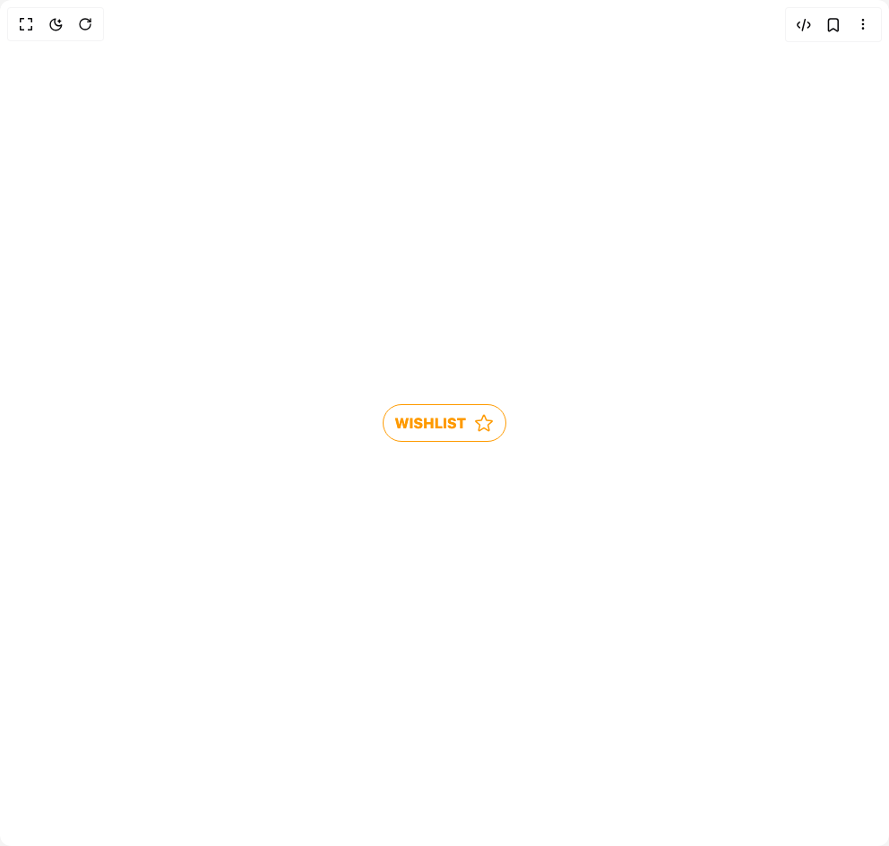

# Build Star Button in BuilderStudio

> Build this component in our Agentic IDE: [BuilderStudio](https://builderstudio.dev).
>
> Join the BuilderStudio community on [Discord](https://discord.gg/QdWeSGCqfe) and [Reddit](https://reddit.com/r/builderstudio).



## Component

- Author group: `muhammad-binsalman`
- Component: `star-button`
- Variant: `default`
- Rendered HTML snapshot: [`rendered.html`](rendered.html)

## BuilderStudio prompt

You are implementing a React component based on a component reference.

## Component identity

- Author: muhammad-binsalman
- Component slug: star-button
- Demo slug: default
- Title: star-button
- Description: 

## Goal

Recreate this component in a React + TypeScript + Tailwind CSS project. Preserve the visual layout, spacing, colors, border radius, shadows, interaction behavior, animation behavior, responsive behavior, and dark mode behavior shown in the rendered demo.

## Implementation requirements

- Use React and TypeScript.
- Use Tailwind CSS classes whenever possible.
- Keep the component self-contained unless the source files require helper components.
- If the source uses CSS variables, custom CSS, animations, or keyframes, include them.
- If the source uses external packages, list and use the required packages.
- Preserve accessibility attributes, button semantics, links, keyboard behavior, and ARIA attributes when visible in the source.
- Do not replace the component with a simplified placeholder.
- Return complete production-ready code.

## Dependencies

No reference metadata available.

## Rendered DOM snapshot

This is the rendered demo HTML extracted from the live preview. Use it to verify structure, class names, visible content, and layout.

```html
<div id="root"><div class="w-screen min-h-screen flex justify-center items-center"><div class="w-screen min-h-screen flex justify-center items-center"><label class=""><input class="peer hidden" type="checkbox"><div class="group flex w-fit cursor-pointer items-center gap-2 overflow-hidden rounded-full border border-amber-500 fill-none p-2 px-3 font-extrabold text-amber-500 transition-all peer-checked:fill-amber-500 peer-checked:hover:text-white active:scale-90"><div class="z-10 transition group-hover:translate-x-4">WISHLIST</div><svg xmlns="http://www.w3.org/2000/svg" viewBox="0 0 24 24" stroke-width="1.5" stroke="currentColor" class="size-6 transition duration-500 group-hover:scale-[1500%] group-hover:-translate-x-10"><path d="M11.48 3.499a.562.562 0 0 1 1.04 0l2.125 5.111a.563.563 0 0 0 .475.345l5.518.442c.499.04.701.663.321.988l-4.204 3.602a.563.563 0 0 0-.182.557l1.285 5.385a.562.562 0 0 1-.84.61l-4.725-2.885a.562.562 0 0 0-.586 0L6.982 20.54a.562.562 0 0 1-.84-.61l1.285-5.386a.562.562 0 0 0-.182-.557l-4.204-3.602a.562.562 0 0 1 .321-.988l5.518-.442a.563.563 0 0 0 .475-.345L11.48 3.5Z" stroke-linejoin="round" stroke-linecap="round"></path></svg></div></label></div></div></div>
```

## Reference source files

No reference source files were available.
