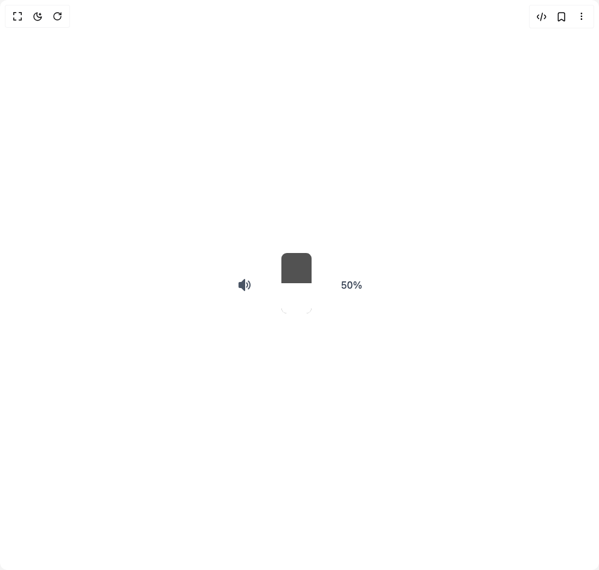

# Build Vertical Volume Slider With Mute Toggle in BuilderStudio

> Build this component in our Agentic IDE: [BuilderStudio](https://builderstudio.dev).
>
> Join the BuilderStudio community on [Discord](https://discord.gg/QdWeSGCqfe) and [Reddit](https://reddit.com/r/builderstudio).



## Component

- Author group: `muhammad-binsalman`
- Component: `vertical-volume-slider-with-mute-toggle`
- Variant: `default`
- Rendered HTML snapshot: [`rendered.html`](rendered.html)

## BuilderStudio prompt

You are implementing a React component based on a component reference.

## Component identity

- Author: muhammad-binsalman
- Component slug: vertical-volume-slider-with-mute-toggle
- Demo slug: default
- Title: vertical-volume-slider-with-mute-toggle
- Description: 

## Goal

Recreate this component in a React + TypeScript + Tailwind CSS project. Preserve the visual layout, spacing, colors, border radius, shadows, interaction behavior, animation behavior, responsive behavior, and dark mode behavior shown in the rendered demo.

## Implementation requirements

- Use React and TypeScript.
- Use Tailwind CSS classes whenever possible.
- Keep the component self-contained unless the source files require helper components.
- If the source uses CSS variables, custom CSS, animations, or keyframes, include them.
- If the source uses external packages, list and use the required packages.
- Preserve accessibility attributes, button semantics, links, keyboard behavior, and ARIA attributes when visible in the source.
- Do not replace the component with a simplified placeholder.
- Return complete production-ready code.

## Dependencies

No reference metadata available.

## Rendered DOM snapshot

This is the rendered demo HTML extracted from the live preview. Use it to verify structure, class names, visible content, and layout.

```html
<div id="root"><div class="w-screen min-h-screen flex justify-center items-center"><div class="w-screen min-h-screen flex justify-center items-center"><div class="flex items-center justify-center min-h-screen"><div class="flex items-center gap-6"><svg class="w-6 h-6 text-gray-600 cursor-pointer hover:text-gray-800 transition-colors" xmlns="http://www.w3.org/2000/svg" viewBox="0 0 24 24" fill="currentColor"><path d="M18.36 19.36a1 1 0 0 1-.705-1.71C19.167 16.148 20 14.142 20 12s-.833-4.148-2.345-5.65a1 1 0 1 1 1.41-1.419C20.958 6.812 22 9.322 22 12s-1.042 5.188-2.935 7.069a.997.997 0 0 1-.705.291z"></path><path d="M15.53 16.53a.999.999 0 0 1-.703-1.711C15.572 14.082 16 13.054 16 12s-.428-2.082-1.173-2.819a1 1 0 1 1 1.406-1.422A6 6 0 0 1 18 12a6 6 0 0 1-1.767 4.241.996.996 0 0 1-.703.289zM12 22a1 1 0 0 1-.707-.293L6.586 17H4c-1.103 0-2-.897-2-2V9c0-1.103.897-2 2-2h2.586l4.707-4.707A.998.998 0 0 1 13 3v18a1 1 0 0 1-1 1z"></path></svg><div class="relative"><input min="0" max="100" class="cursor-pointer" type="range" value="50" style="transform: rotate(270deg); width: 100px; height: 50px; background: rgb(82, 82, 82); border-radius: 9px; appearance: none; overflow: hidden; transition: height 0.1s;"><style>
            input[type="range"]::-webkit-slider-thumb {
              -webkit-appearance: none;
              width: 0;
              height: 0;
              box-shadow: -200px 0 0 200px #fff;
            }
            
            input[type="range"]::-moz-range-thumb {
              width: 0;
              height: 0;
              border-radius: 0;
              border: none;
              box-shadow: -200px 0 0 200px #fff;
            }
          </style></div><div class="text-gray-700 font-medium">50%</div></div></div></div></div></div>
```

## Reference source files

No reference source files were available.
