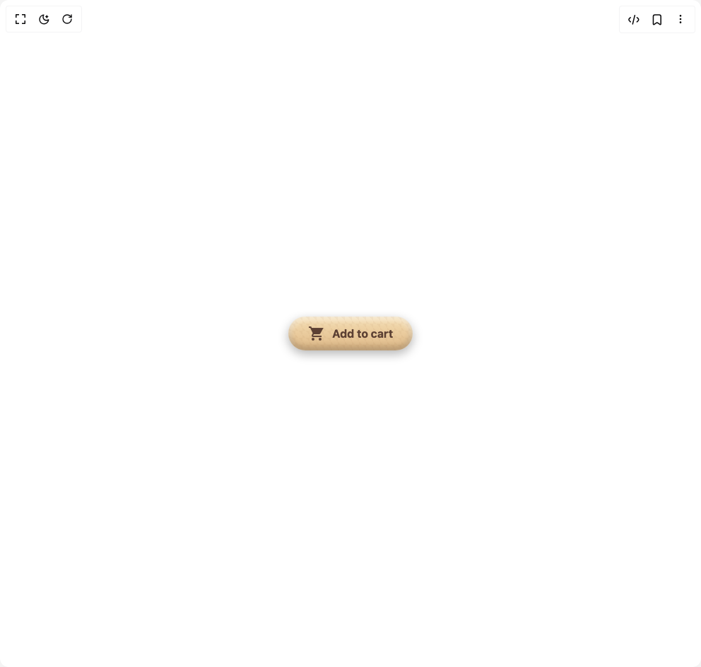

# Build Wooden Cart Button in BuilderStudio

> Build this component in our Agentic IDE: [BuilderStudio](https://builderstudio.dev).
>
> Join the BuilderStudio community on [Discord](https://discord.gg/QdWeSGCqfe) and [Reddit](https://reddit.com/r/builderstudio).



## Component

- Author group: `muhammad-binsalman`
- Component: `wooden-cart-button`
- Variant: `default`
- Rendered HTML snapshot: [`rendered.html`](rendered.html)

## BuilderStudio prompt

You are implementing a React component based on a component reference.

## Component identity

- Author: muhammad-binsalman
- Component slug: wooden-cart-button
- Demo slug: default
- Title: wooden-cart-button
- Description: 

## Goal

Recreate this component in a React + TypeScript + Tailwind CSS project. Preserve the visual layout, spacing, colors, border radius, shadows, interaction behavior, animation behavior, responsive behavior, and dark mode behavior shown in the rendered demo.

## Implementation requirements

- Use React and TypeScript.
- Use Tailwind CSS classes whenever possible.
- Keep the component self-contained unless the source files require helper components.
- If the source uses CSS variables, custom CSS, animations, or keyframes, include them.
- If the source uses external packages, list and use the required packages.
- Preserve accessibility attributes, button semantics, links, keyboard behavior, and ARIA attributes when visible in the source.
- Do not replace the component with a simplified placeholder.
- Return complete production-ready code.

## Dependencies

No reference metadata available.

## Rendered DOM snapshot

This is the rendered demo HTML extracted from the live preview. Use it to verify structure, class names, visible content, and layout.

```html
<div id="root"><div class="w-screen min-h-screen flex justify-center items-center"><div class="w-screen min-h-screen flex justify-center items-center"><button class="
        relative inline-flex items-center px-7 py-3 border-none
        bg-gradient-to-b from-[#f5deb3] to-[#deb887] rounded-full
        shadow-[inset_0_5px_10px_rgba(255,255,255,0.5),inset_0_-5px_10px_rgba(0,0,0,0.2),0_5px_15px_rgba(0,0,0,0.3)]
        cursor-pointer transition-all duration-400 ease-[cubic-bezier(0.175,0.885,0.32,1.275)]
        transform perspective-500 rotate-x-5
        before:content-[''] before:absolute before:inset-0
        before:bg-[linear-gradient(45deg,rgba(139,90,43,0.1)_25%,transparent_25%,transparent_75%,rgba(139,90,43,0.1)_75%)]
        before:bg-[length:10px_10px] before:opacity-50 before:rounded-full
        before:transition-all before:duration-400 before:ease-in
        before:-translate-z-1
        hover:transform hover:perspective-500 hover:rotate-x-0 hover:-translate-y-[3px]
        hover:shadow-[inset_0_6px_12px_rgba(255,255,255,0.6),inset_0_-6px_12px_rgba(0,0,0,0.25),0_8px_20px_rgba(0,0,0,0.35)]
        hover:bg-gradient-to-b hover:from-[#f5e0c0] hover:to-[#e0c49c]
        active:transform active:perspective-500 active:rotate-x-2 active:translate-y-2
        active:shadow-[inset_0_3px_6px_rgba(255,255,255,0.3),inset_0_-3px_6px_rgba(0,0,0,0.15),0_2px_8px_rgba(0,0,0,0.2)]
        active:bg-gradient-to-b active:from-[#e0c49c] active:to-[#c19a6b]"><svg viewBox="0 0 24 24" class="
          w-6 h-6 mr-2.5 fill-[#5c4033]
          transition-all duration-400 ease-[cubic-bezier(0.175,0.885,0.32,1.275)]
          transform translate-z-10
          group-hover:transform group-hover:translate-z-15 group-hover:scale-110 group-hover:rotate-5
          group-hover:drop-shadow-[0_2px_2px_rgba(0,0,0,0.3)]
          group-active:transform group-active:translate-z-5 group-active:scale-90 group-active:-rotate-5
          group-active:drop-shadow-[0_1px_1px_rgba(0,0,0,0.2)]"><path d="M7 18c-1.1 0-1.99.9-1.99 2S5.9 22 7 22s2-.9 2-2-.9-2-2-2zM1 2v2h2l3.6 7.59-1.35 2.45c-.16.28-.25.61-.25.96 0 1.1.9 2 2 2h12v-2H7.42c-.14 0-.25-.11-.25-.25l.03-.12.9-1.63h7.45c.75 0 1.41-.41 1.75-1.03l3.58-6.49A.996.996 0 0 0 21.42 4H5.21l-.94-2H1zm16 16c-1.1 0-1.99.9-1.99 2s.89 2 1.99 2 2-.9 2-2-.9-2-2-2z"></path></svg><span class="
          relative z-10 text-[#5c4033] font-arial font-bold text-base
          transition-all duration-400 ease-[cubic-bezier(0.175,0.885,0.32,1.275)]
          transform translate-z-10
          group-hover:transform group-hover:translate-z-15 group-hover:translate-x-1
          group-hover:drop-shadow-[0_2px_4px_rgba(0,0,0,0.3)]
          group-active:transform group-active:translate-z-5 group-active:translate-y-px
          group-active:drop-shadow-[0_1px_2px_rgba(0,0,0,0.2)]">Add to cart</span></button></div></div></div>
```

## Reference source files

No reference source files were available.
